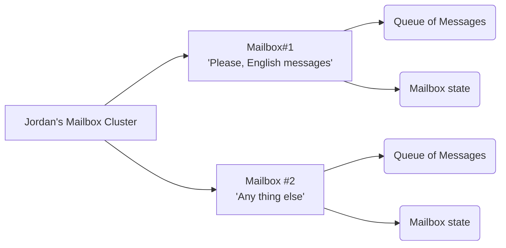

??? quote "Juvix imports"

    ```juvix
    module anomian;
    import arch.node.types.basics open public;
    import arch.node.types.identities open;
    import arch.node.types.messages open hiding {EngineMsg};
    ```

As in the Little Typer book, we explore some aspects of the Anoma model through
a dialogue that presents the notions considered in the specification. There are
two participants in this dialogue: the student, *Jordan*, and Anomian, the modeller.
When Anomian speaks, it is in the form of a quote. Otherwise, Jordan speaks.

> Me, Anomian.

Again, the goal of this exercise is to understand what the Anoma system
is about and *a model* of it. As a resource of information, we present a few
Juvix code snippets that will help us understand the model, but these are not
particularly essential. You can read only the quotes to get the main idea. The Jordan
interactions are to confirm, ask questions, and recap the concepts.

## Chapter 1: The core players

> At the core of the Anoma model, we find **engines**.

So, what do you mean by an engine?

<div class="grid" markdown>

> Think of an engine as a *dynamic entity* that can do stuff, much like
> us, and that has an **engine-status** that could be *running* or *dead*.

```juvix
type EngineStatus := Running | Dead | Suspended;
```

</div>

Dynamic entity? What is *dynamic* about it?

> You and I are not the same person we were yesterday because some events
> happened to us. For engines, these events are **engine-messages** and only through
> these messages, their **state** may change. That's what makes them dynamic.
> However, notice that this change of internal state is optional. We call those
> engines that never change their state *static*.

Huh, so, an engine has a state, and that state can change by reading
messages that are sent to it. Easy.

> It's like when we receive a letter from the tax office. Once we read
> the letter and understand it, we know that we have to pay taxes and eventually
> do so. That letter may change us, some money may be gone.

But wait, who really sends those messages actually?

> Any engine, including the same engine which receives the message.
> For example, an engine could remind itself to do something by sending a message
> to itself.

I see, and the messages can be in different languages, right? I mean I read
English but not French. How are engines able to communicate with each other? Do
the all speak the same language?

> Each engine has its own **message interface**, that's the *language* they speak.
> This message interface defines the format and content of the messages it can
> comprehend, process, and generate.

```juvix
syntax alias English := String;
syntax alias French := String;
syntax alias Spanish := String;
```

<div class="grid" markdown>

> If me, Anomian, speak English and French, my message interface would
> look like this.

```juvix
type AnomianMsg : Type :=
  | AnomianMsgEnglish@{msg : English}
  | AnomianMsgFrench@{msg : French}
  ;
```

</div>

<div class="grid" markdown>

Hey, in my case, I speak English and Spanish. My message interface is the following.

```juvix
type JordanMsgInterface : Type :=
  | JordanMsgEnglish@{msg : English}
  | JordanMsgSpanish@{msg : Spanish}
  ;
```

</div>

<div class="grid" markdown>

Got it. Here is a message for you, Anomian.

```juvix
helloAnomian : AnomianMsg :=
  AnomianMsgEnglish@{msg := "Hello!"};
```

</div>

> It is important to remember two key points. First, for effective
> communication, an engine must have a well-defined message interface.
> Second, if the message interface lacks any message constructors, the engine
> cannot perform any actions. Therefore, we assume that every engine has at least
> one message constructor in its message interface.

## Chapter 2: Communication patterns

> Now that we understand engines and their message interfaces, let's talk about
> how they communicate with each other or better said, what patterns of communication
> are there.

I can send a message to you, Anomian, either to expect a response or simply to
inform you that I'm alive. What else can I do?

<div class="grid" markdown>
> There are many patterns indeed, but we will focus on the most common ones.
> The type `Msg` is the message interface of the engine.

```juvix
syntax alias Timeout := Nat;

type CommunicationPattern Msg :=
  | FireAndForget@{msg : Msg}
  | RequestResponse@{msg : Msg; timeout : Timeout}
  | PubSub@{topic : TopicID; msg : Msg}
  ;
```

</div>

> We can consider three patterns of communication. The pattern `FireAndForget`
> allows us to communicate asynchronously. One can send a message and not expect
> any response like notifications on your phone. However, if you need a response
> or result and can wait for it, we can use the `RequestResponse` pattern. That
> is the pattern for synchronous communication. And finally, the
> `PublishSubscribe` pattern (pub/sub for short) that allows us to communicate
> asynchronously and without a response, broadcasting messages to multiple
> engines.

<div class="grid" markdown>

> We can consider three purposes for a message.  The first one is to request a
> response, the second one is to respond to a request, and the third one is to
> notify about something. We can represent these three cases with the `MsgPurpose`
> type.

```juvix
type EngineMsgKind :=
  | Request
  | Response
  | Notify;
```

</div>


## Chapter 3: Engine configurations

Anomian, you mentioned that engines have an internal state, a message interface,
and specific communication patterns. Are there any other characteristics that
define an engine like us? For instance, humans have attributes such as name,
age, and parents. Do engines have similar attributes?

<div class="grid" markdown>

> Engines possess certain attributes. These attributes are stored in what we call
> their **engine-configuration**, of type `EngineCfg`. This configuration is *immutable*
> through the life of the engine. The configuration of an engine includes its **parent**
> that **spawns** it, its **name**, a virtual location where the engine runs named
> `node`, and some specific information denoted by `cfg` of a given type `C`.

```juvix
type EngineCfg (C : Type) :=
  mkEngineCfg@{
    parent : Option EngineID;
    name : EngineName;
    node : NodeID;
    cfg : C;
  };
```

</div>

> As we say the configuration is immutable by design. This means that once an
> engine is created, attributes such as the name of the engine cannot be
> changed. If you want to change the name of an engine, you have to create a new
> engine with the new name.

But one thing, engines have a parent, do they always know who their parent
is? I don't know who is my father, actually.

```juvix
axiom localhost : NodeID;
```

<div class="grid" markdown>

> Engines might not always know who their parent is. This missing information is
> stored in the engine's configuration with the `parent` field set to `none`.
> If the parent is known, the `parent` field is set to `some creatorID`, where
> `creatorID` is the engine-identifier of the parent engine.

```juvix
simpleConfig : EngineCfg Unit :=
  mkEngineCfg@{
    parent := none;
    name := "Anomian";
    node := localhost;
    cfg := unit; -- no specific configuration
  };
```

</div>

So, we have one way to identify engines: by their name and their node if we know
where it runs.

<div class="grid" markdown>

> We have not defined what a node is yet, formally. But we can think of it as a
> virtual place where the engine lives and operates. This place could be known,
> in which case, we can refer to it as a **local engine**. Otherwise, the engine
> is an **external engine**.

--8<-- "./arch/node/types/identities.juvix.md:EngineID"

</div>


<div class="grid" markdown>

> With **engine identifiers** (of type `EngineID`), we can define *engine
> messages*. These messages serve as events for engines, sent to them by some
> other engine. An **engine-message** includes a *sender*, a *target*, an optional
> *mailbox identifier*, and the *message content*. The mailbox identifier is used
> to identify the mailbox of the target engine, the virtual place where the
> message is delivered. Additionally, the message includes a *kind* that indicates
> whether the message is a command, an event, or a response. We already defined
> the kind of the message in the previous chapter as `EngineMsgKind`.

```juvix
type EngineMsg M :=
  mkEngineMsg@{
    sender : EngineID;
    target : EngineID;
    mailbox : Option MailboxID;
    kind : EngineMsgKind;
    msg : M;
  };
```

</div>

## Chapter 4: Mailboxes for anyone

Messages are sent to the engine's mailbox.

<div class="grid" markdown>

> Engines have a sophisticated mailbox system, which is actually a cluster of
> mailboxes. Each mailbox is a queue of messages and can also contain additional
> data if needed. The following diagram illustrates this concept. Each mailbox
> is intended to serve a specific purpose. For simplicity, we refer to the entire
> cluster as a mailbox.

--8<-- "./arch/node/types/messages.juvix.md:MailboxCluster"

</div>

<figure markdown>



<figcaption>
A mailbox cluster with two mailboxes and their state.
</figcaption>

</figure>

> Before going any further, let us assume that the engine communication process
> involves at least one *mailman* that delivers messages to the engines. When a
> message is sent to an engine, the mailman takes the message and puts it in the
> engine's mailbox. We can presume all messages are delivered, *eventually*.

## Chapter 5: Context of execution

Nothing of what we have seen so far is actually useful. I mean, how do engines do
real stuff?

So far, we've only discussed that engines have certain attributes: an
identifier, a message interface, and a configuration that includes details like
a parent, a name, and a virtual location where the engine *runs*. But how do they
actually run?

<div class="grid" markdown>

> To understand how an engine runs, we need to acknowledge that engines operate
> within an **context of execution** referred to as their **engine-environment**.
> This environment, defined by the `EngineEnv` type, includes the engine's
> internal state, its mailbox, and an address book of known engines it can
> interact with, including itself.

```juvix
AddressBook : Type := Set EngineName;
axiom MailboxCluster : Type -> Type -> Type;

type EngineEnv (S Msg : Type) :=
  mkEngineEnv@{
    state : S;
    mailbox : MailboxCluster S Msg;
    acq : AddressBook;
  };
```

</div>

> Note that engine environments do not encompass the engine's configuration,
> although they could. Instead, engine configurations are accessible separately
> from the engine environments. This separation promotes modularity.


## Chapter 6: What engines can do

<div class="grid" markdown>

How do engines actually compute? With their engine-environment in place, I
imagine that engines run some sort of function that uses the engine-environment
and a message from the mailbox. Something like the following type `Handler`, where
`S` is the state of the engine and `M` is the message interface, and the return
type is `ReturnSomething`, which can be whatever we want.

```juvix
module EngineBehaviourAttempt;
axiom ReturnSomething : Type;

Handler (M S : Type) : Type :=
  M -> EngineEnv S M -> ReturnSomething;
end;
```

</div>

> The computational aspect of an engine is what we refer to as its **behaviour**,
> and it is correct to think of it as a function that takes in a message and the
> engine's environment. However, the return type of this function cannot be
anything, what an engine can produce is part of the model of engines, and it's
fixed.

What exactly can an engine do if it's not just the same message passing we already know?

<div class="grid" markdown>

> We decompose the engine's behaviour into a set of **effects**. These effects
> are the valid actions that the engine can perform. We can represent these
> effects with the `Effect` type.

```juvix
axiom TimeTrigger : Type;

type Effect S E M :=
  | SendMsg@{msg : EngineMsg M}
  | UpdateState@{state : S}
  | SpawnEngine@{engine : E}
  | Chain@{effects : List (Effect S E M)}
  | Schedule@{
      trigger : TimeTrigger;
      action : Effect S E M
    };
```

</div>

Based on the type for possible effects, the only new aspect for me about engines is
that they can schedule actions to happen at a *later time*. We already knew that
engines have a parent, which makes sense by using the `SpawnEngine` effect.
The rest remains the same as before.

> Our actions are determined by certain conditions, some inherent from the
> environment. We only take action if the conditions are met. For engines, these
> conditions are called **guards**.

I got it. This mirrors our situation perfectly. Taking the tax office
example: when I receive a notice to pay taxes, I first assess whether I have the
funds available. If I do, I take action to pay; otherwise, I might postpone the
payment.

<div class="grid" markdown> 

> The essence of a **guard** is a predicate, a pre-condition, that must hold
> true for the engine to take action. Guards are evaluated based on incoming
> messages, the engine's environment, and the engine's configuration. Since
> guards involves computation, engine's preserve these computations as part of
> the return type of the guard. Thus, if the underlying condition is not
> satisfied, the guard returns nothing. We can represent this with the type
> `Guard`.

```juvix
Guard (S M C R : Type) : Type :=  
  M -> EngineEnv S M -> EngineCfg C -> Option R;

isSatisfied {S M C R} 
  (guard : Guard S M C R) 
  (msg : M) 
  (env : EngineEnv S M) 
  (cfg : EngineCfg C) : Bool :=
  case guard msg env cfg of {
    | none := false
    | some _ := true
  }
```
</div>

Wait! I see an issue. What if the engine has several guards, and they are all satisfied?

<div class="grid" markdown>
> If several guards are satisfied, engine provide an strategy defined as its
> construction how to act. The model conceives the following options: choose the
> first guard that is satisfied, choose the last guard that is satisfied, choose
> one of them, and choose all of them. And recall, If no guard conditions are met,
> the engine decides not to act.

```juvix
type GuardStrategy := 
  | FirstGuard
  | LastGuard
  | OneGuard
  | AllGuards;
```

</div>

<div class="grid" markdown>

> Take in mind that guards are fundamentally speaking, predicates. If the guards
> give green light, the engine will act, by means of **actions**.

```juvix
type GuardEval S M C R := mkGuardEval@{
  guards : List (Guard S M C R);
  strategy : GuardStrategy;
};
```

</div>

Ah, I see! So the guards act as the rules the engine follows, and the actions
are the procedures executed when those rules are satisfied, and with the
possible outcomes of the guards.

<div class="grid" markdown>

> We can now define the engine's behaviour as a function that takes in a guard
> evaluation and returns an effect.

```juvix
EngineBehaviour (S E M C R : Type) : Type :=
  GuardEval S M C R -> Effect S E M;
```

</div>

<div class="grid" markdown>

> With the concept of an engine now complete, it is appropriate to define the
> type `Engine`. An engine is characterised by its configuration, environment,
> and behaviour. Recall that `S` is the state of the engine, `E` is the environment,
> `M` is the message interface, `C` is the configuration, and `R` is the return
> type for guards.


```juvix
type Engine (S E M C R : Type) :=
  mkEngine@{
    status : EngineStatus;
    cfg : EngineCfg C;
    state : EngineEnv S M;
    behavior : EngineBehaviour S E M C R;
  };
```

</div>
