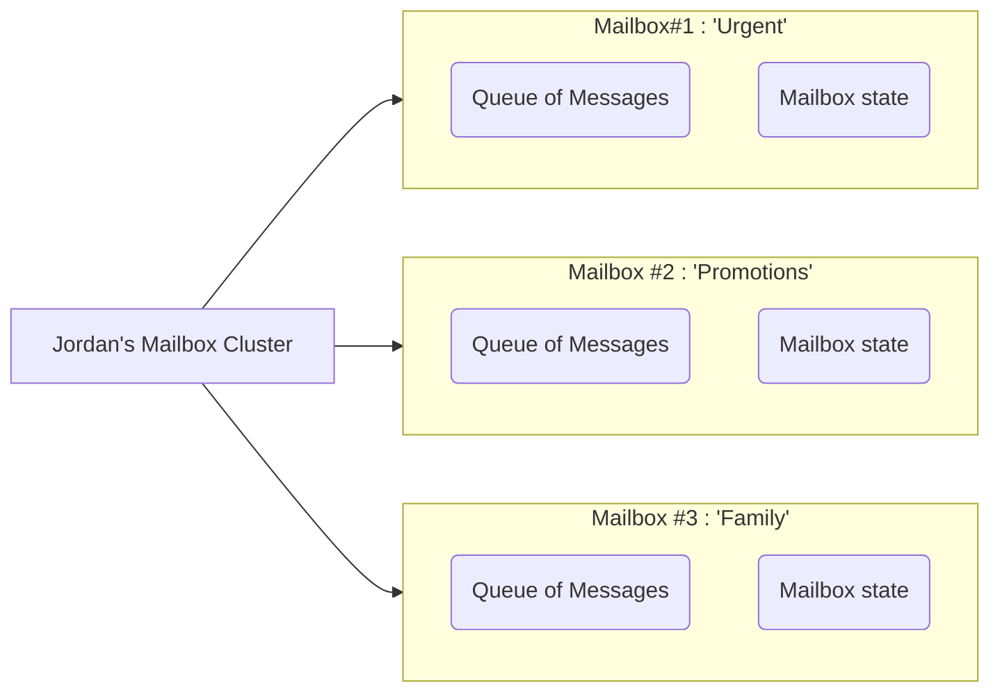

## Preface

As in the [Little Typer](https://ieeexplore.ieee.org/servlet/opac?bknumber=8681597) book, we explore some aspects of the Anoma model through
a dialogue that presents the notions considered in the specification. There are
two participants in this dialogue: the student, *Jordan*, and *Anomian*, the modeller.
When Anomian speaks, it is in the form of a quote. Otherwise, Jordan speaks.

> Hi, I am Anomian.

The goal of this dialogue is to illustrate what the Anoma system
_is_ about and how to *model* it. For the sake of concreteness, we present a few
[Juvix code snippets](https://docs.juvix.org/0.6.9/tutorials/essential.html)
that are intended to clarify the model and help resolve potnetial ambiguities. Most of the
data types are [enumerations and inductive types](https://docs.juvix.org/0.6.9/tutorials/essential.html#enumerations-and-inductive-types).
The quotes alone should convey the main idea. The Jordan interjections are to confirm, ask questions,
and reiterate the concepts.

Last, but not least, we have not only code snippets,
but we fully embrace [literate programming](https://www-cs-faculty.stanford.edu/~knuth/lp.html).
This comes at the inconvenience of some lines of boiler plate here,
but it can safely be skipped on a first reading.

??? quote "Juvix imports"

    ```juvix
    module anomian;
    import arch.node.types.basics open public;
    import arch.node.types.identities open;
    import arch.node.types.messages
      open hiding {EngineMsg; mkEngineMsg; Mailbox};
    ```

## Chapter 1: The core players of the game

> At the core of the Anoma model, we find **engines**. They do most of the heavy lifiting.

So, what do you mean by an _engine_?

<div class="grid" markdown>

> Think of an engine as a *dynamic entity* that can do stuff, much like
> us, and that has an **engine-status** that could be *running*, *dead*, or
> *suspended*.

```juvix
type EngineStatus := Running | Dead | Suspended;
```

</div>

Dynamic entity? What is *dynamic* about it?

> You and I are not the same person we were yesterday because some events
> happened to us. For engines, a typical event is the reception of an **engine-message** and as a reaction to
> message reception, their **state** may change. This ability to change their state is what makes them dynamic.
> However, notice that this change of internal state is optional. We call those
> engines that never change their state **static**.

Huh, so, an engine has its own state, and that state can change by reacting to
messages that are sent to it. Easy.

> It's like when we receive a letter from the tax office. Once we read
> the letter and understand it, we know that we have to pay taxes and eventually
> do so. That letter may "change" us, some money may be gone.

But wait, who really sends those messages actually?

> Any engine, including the same engine which receives the message.
> For example, an engine could remind itself to do something by sending a message
> to itself.

I see, and the messages can be in different languages, right? I read English
but not French. How are engines able to communicate with each other? Do
they all speak the same language?

> Each engine has its own **message interface**, indicating the *language(s)* they speak.
> This message interface defines the format and content of the messages it can
> comprehend and process.

<div class="grid" markdown>

> For example, let's say the engines in our model only speak English, French, and
> Spanish.

```juvix
syntax alias EnglishPayload := String;
syntax alias FrenchPayload := String;
syntax alias SpanishPayload := String;
```

</div>

<div class="grid" markdown>

> If I, Anomian, speak English and French, my message interface would
> look like this.

```juvix
type AnomianMsgInterface : Type :=
  | AnomianMsgEnglish@{msg : EnglishPayload}
  | AnomianMsgFrench@{msg : FrenchPayload}
  ;
```

</div>

<div class="grid" markdown>

Hey, in my case, I speak English and Spanish. My message interface is the following.

```juvix
type JordanMsgInterface : Type :=
  | JordanMsgEnglish@{msg : EnglishPayload}
  | JordanMsgSpanish@{msg : SpanishPayload}
  ;
```

</div>

<div class="grid" markdown>

Got it. Here is a message you can understand, Anomian.

```juvix
helloAnomian : AnomianMsgInterface :=
  AnomianMsgEnglish@{msg := "Hello!"};
```


</div>

!!! info "Message Interface"

    - Each engine has a message interface.

    - By construction, it is safe to assume that every engine has at least one
      message constructor[^1] in its message interface.

> The model defines all the message interfaces defined by engines.

```juvix
type MsgInterface :=
  | MsgAnomian AnomianMsgInterface
  | MsgJordan JordanMsgInterface
  ;
```

> To see the full list of message interfaces in the current model, check out the
> sum type `Msg` in [[Anoma Message]].


## Chapter 2: Communication patterns

> Now that we understand engines and their message interfaces, let's talk about
> how they communicate with each other or better said, what patterns of communication
> are there.

I can send a message to you, Anomian, either to expect a response or simply to
inform you that I'm alive. What else can I do?

<div class="grid" markdown>

> There are many patterns indeed, but let us start with the most common ones.
> The type `M` is the message interface of the engine.

```juvix
syntax alias Timeout := Nat;

type CommunicationPattern :=
  | FireAndForget
  | RequestResponse@{timeout : Option Timeout}
  | PubSub
  ;
```

</div>

> We can consider three patterns of communication. The pattern `FireAndForget`
> allows us to communicate asynchronously. One can send a message and not expect
> any response like notifications on your phone. However, if you need a response
> or result and can wait for it, we can use the `RequestResponse` pattern. That
> is the pattern that every synchronous communication uses implicitly. And finally, the
> `PubSub` pattern (pub/sub for short) that allows us to communicate
> asynchronously and without a response, broadcasting messages to multiple
> engines.

<!--ᚦ «Do we now plan to have a synchronous pattern?» -->

<div class="grid" markdown>

> We can consider three purposes for a message:
>
> - The first one is to request a response.
> - The second one is to respond to a request.
> - The third one is to notify about something.
>
> We can represent these three cases with the `EngineMsgKind` type.


```juvix
type EngineMsgKind :=
  | Request
  | Response
  | Notify;
```

</div>


!!! info "Summary of communication patterns"

    We can have several communication patterns.
    <!--ᚦ «Here I would like ideally compare to session types, choreographies, protocols etc.» -->

## Chapter 3: Engine configurations

Anomian, you mentioned that engines have an internal state, a message interface,
and specific communication patterns. Are there any other characteristics that
define an engine? And what about us, are we also engines? For instance, humans have attributes such as name,
age, and parents. Do engines have similar attributes?

<div class="grid" markdown>

> Engines possess certain attributes. These attributes are stored in what we call
> their **engine-configuration**, of type `EngineCfg`. This configuration is *immutable*
> through the lifetime of the engine. The configuration of an engine includes its **parent**
> that **spawns** it, its **name**, a virtual location where the engine runs named
> `node`, and some configuration parameters denoted by `cfg` of an engine-specific type that instantiates the type parameter `C`.

```juvix
type EngineCfg (C : Type) :=
  mkEngineCfg@{
    parent : Option EngineID;
    name : EngineName;
    node : NodeID;
    cfg : C;
  };
```

</div>

> As we say the engine configuration is immutable by design. This means that once an
> engine is created, attributes such as the name of the engine cannot be
> changed. If you want to change the name of an engine, you have to create a new
> engine with the new name.

Tell me one thing about the parents of engines. Do they always know who their parent
is? I don't know who is my father, actually.

```juvix
axiom localhost : NodeID;
```

<div class="grid" markdown>

> Engines might not always know who their parent is.[^2] The absence of this information is
> stored in the engine's configuration with the `parent` field set to `none`.
> If the parent is known, the `parent` field is set to `some creatorID`, where
> `creatorID` is the engine-identifier of the parent engine.

```juvix
simpleConfig : EngineCfg Unit :=
  mkEngineCfg@{
    parent := none;
    name := "Anomian";
    node := localhost;
    cfg := unit; -- no specific configuration
  };
```

</div>

So, we have one way to identify engines: by their name and their node if we know
where it runs.

<div class="grid" markdown>

> Roughly, a node is a
> virtual place where the engine lives and operates. This place could be known
> to be in the same neighbourhood, in which case, we can refer to it as a
> **local engine**. Otherwise, the engine is an **external engine**.
> _However, note that we have not yet **defined** what a node is!_

--8<-- "./arch/node/types/identities.juvix.md:EngineID"

</div>

Okay, I guess that we can nevertheless start thinking about identifiers already.


```juvix
JordanID : EngineID := mkPair (some localhost) "Jordan9121";
AnomianID : EngineID := mkPair (some localhost) "Anomian184";
```

> With **engine identifiers** (of type `EngineID`), we can define *engine
> messages*. These messages serve as events for engines, sent to them by some
> other engine.

<div class="grid" markdown>

> An **engine-message** consists of a *sender*, a *target*, an optional
> *mailbox identifier*, the *communication pattern*, what kind of message it is,
> and the message itself.
>
> The mailbox identifier is used to identify the mailbox of the target engine,
> the virtual place where the message is delivered. Recall that the *kind*
> indicates whether the message is a command, a response, or an event, and the
> *pattern* indicates the expected behaviour pattern for how the recipient should react.

<!--ᚦ «Do we really want to restrict ourselves to command event response, in general?» -->

```juvix
type EngineMsg M :=
  mkEngineMsg@{
    sender : EngineID;
    target : EngineID;
    mailbox : Option MailboxID;
    pattern : CommunicationPattern;
    kind : EngineMsgKind;
    msg : M;
  };
```

</div>

<div class="grid" markdown>

Hah! so let me craft a message for you, Anomian.

```juvix
jordanToAnomian : EngineMsg MsgInterface :=
  mkEngineMsg@{
    sender := JordanID;
    target := AnomianID;
    mailbox := some 1;
    pattern := RequestResponse@{timeout := none};
    kind := Request;
    msg := MsgAnomian (AnomianMsgEnglish@{msg := "What is the meaning of life?"});
  };
```

</div>

<div class="grid" markdown>

> A reply engine-message is `anomianToJordan`.
>
> Notice that the type parameter `MsgInterface` for `EngineMsg` is the same
> as the one used in the request message, and not an engine-specific message
> interface.

```juvix
anomianToJordan : EngineMsg MsgInterface :=
  mkEngineMsg@{
    sender := AnomianID;
    target := JordanID;
    mailbox := some 1;
    pattern := RequestResponse@{timeout := none};
    kind := Response;
    msg := MsgJordan (JordanMsgEnglish@{msg := "The meaning of life is 42."});
  };
```

</div>
!!! info "The social context of an engine"

    Each engine is known in its neighbourhood and may have connections abroad.
    It still communicates via messages though and stays fixed in the place.

But how can I send it? Do I have to go to the post office?

## Chapter 4: Mailboxes for anyone

Messages are sent to the engine's mailbox.

<div class="grid" markdown>

> What is a mailbox? A **mailbox** consists of a queue of messages and can also
> contain additional data if needed. The data could be the state of the mailbox,
> think of it as having extra information about the mailbox like the number of
> messages in it.

```juvix
type Mailbox S M := mkMailbox@{
  messages : List (EngineMsg M);
  mailboxState : Option S;
};
```

</div>

<div class="grid" markdown>

> However, engines not only have a single mailbox, but a cluster of mailboxes.
> That is, there is *at least one* mailbox per engine, but there can be more.
> The type `MailboxCluster` for the cluster of mailboxes is really a mapping of
> mailbox identifiers to the actual mailboxes.

```juvix
MailboxCluster (S M : Type) : Type := Map MailboxID (Mailbox S M);
```

</div>

Why bother with the mailbox cluster? One mailbox is enough, right?

> While a single mailbox would suffice for basic functionality, multiple
> mailboxes provide valuable message organisation capabilities.
<!--ᚦ
        «mailboxes may lead to "threads" within engines,
        very much like passive objects in the active objects approach (cf. SALSA)»
-->

That sounds like how my email works. It is a cluster of mailboxes, and
in principle, I have one big mailbox, but truly I can see it as having multiple
mailboxes, one for each folder, such as promotions, important, family, etc.

<div class="grid" markdown>

> Yes, the folder anology is great. The following diagram illustrates a mailbox cluster.
> Each mailbox[^3] is intended to serve a specific purpose. For simplicity, we refer
> to the entire cluster as the engine's mailbox if there is no confusion. In the
> type `MailboxCluster`, we have a map of mailbox IDs to mailboxes.

<figure markdown>



</figure>

</div>

You have not answered yet how mail is actually sent.

> Well, imagine for a second that the communication process
> is magically handled by one *mailelf* that delivers messages to the engines. When a
> message is sent to an engine, the mailelf takes the message from the sender and puts it in the
> engine's mailbox. In other words, for the moment, it suffices to assume that all messages are delivered *eventually*.

!!! info "Mailboxes for eventual message delivery"

    So, yes, the main purpose of mailboxes is where the elf delivers the messages.


## Chapter 5: Context of execution

This is quite a fancy setup for sending messages, but how do engines "actually" get things done?!

I mean, we've discussed that engines have certain attributes: an
identifier, a message interface, and a configuration that includes details like
a parent, a name, and a virtual location where the engine *runs*. So, maybe a better question: how do engines actually run?

<div class="grid" markdown>

> To understand how an engine runs, we need to acknowledge that engines operate
> within a **context of execution** referred to as their **engine-environment**.
> This environment, defined by the `EngineEnv` type, includes the engine's
> internal state, its mailboxes, and an address book of known engines it can
> interact with, including itself.

```juvix
AddressBook : Type := Set EngineName;

type EngineEnv (S Msg : Type) :=
  mkEngineEnv@{
    state : S;
    mailbox : MailboxCluster S Msg;
    acq : AddressBook;
  };
```

</div>

> Note that engine environments do not encompass the engine's configuration,
> although they could. Instead, engine configurations are accessible separately
> from the engine environments. This separation promotes modularity.

!!! info "Local data of engines and the execution context"

    Each engine has its own local data, some of which is fixed,
    and some of which is dynamic. All this data together forms the
    _execution context_.

## Chapter 6: What engines can do

<div class="grid" markdown>

So, refining the question: how do engines actually compute? With their engine-environment in place, I
imagine that engines run some sort of function that uses the engine-environment
and a message from the mailbox. Something like the following type `Handler`, where
`S` is the state of the engine and `M` is the message interface, and the return
type is `ReturnSomething`, which can be whatever we want.

```juvix
module EngineBehaviourAttempt; -- btw, this is a submodule
axiom ReturnSomething : Type;

Handler (M S : Type) : Type :=
  M -> EngineEnv S M -> ReturnSomething;
```

</div>

> The computational aspect of an engine is what we refer to as its **behaviour**,
> and it is correct to think of it as a function that takes in a message and the
> engine's environment. However, the return type of this function cannot be
anything: the type what an engine can produce is part of the model of engines, and it is
fixed for each engine.

What exactly can an engine do if it's not just the same message passing we already know?

<div class="grid" markdown>

> We decompose the engine's range of possible reactions into a set of **effects**. These effects
> are the valid actions that the engine can perform. We can represent these
> effects with the `Effect` type.
>
> To recall, we use the following convention for engine-related types:
>
> - `S` is the type of its internal state,
> - `E` is the type of its environment,
> - `M` is the type of its message interface.

```juvix
axiom TimeTrigger : Type;

type Effect S E M :=
  | SendMsg@{msg : EngineMsg M}
  | UpdateState@{state : S}
  | SpawnEngine@{engine : E}
  | Chain@{effects : List (Effect S E M)}
  | Schedule@{
      trigger : TimeTrigger;
      action : Effect S E M
    };
```

</div>

Based on the type for possible effects,[^4] the only new aspect for me about engines is
that they record the need for actions to happen at a *later time*. We already have covered that
engines have a parent; the `SpawnEngine` effect is the other side of the same coin.
The rest remains the same as before.

> Our actions are restricted by certain pre-conditions, some inherent from the
> environment. We only take action if the conditions are met. For engines, these
> conditions are expressed as **guards**.[^5]

I got it. This mirrors our situation perfectly. Taking the tax office
example: when I receive a notice to pay taxes, I first assess whether I have the
funds available. If I do, I take action to pay; otherwise, I might postpone the
payment.

<div class="grid" markdown>

> The essence of a **guard** is a predicate, a pre-condition, that must hold
> true for the engine to take action.
>
> Guards are evaluated based on incoming messages, the engine's environment,
> and the engine's configuration. We can represent this with the type `Guard`.
> Since guards involve computation, engine's preserve these computations as part
> of the return type of the guard, that is `R` in the type `Guard`. Thus, if the
> underlying condition is not satisfied, the guard returns nothing. The type parameter `C`
> will be instantiated with the type for values in the engine's configuration.

```juvix
Guard (S M C R : Type) : Type :=
  EngineMsg M -> EngineEnv S M -> EngineCfg C -> Option R;

isSatisfied {S M C R}
  (guard : Guard S M C R)
  (msg : EngineMsg M)
  (env : EngineEnv S M)
  (cfg : EngineCfg C) : Bool :=
  case guard msg env cfg of {
    | none := false
    | some _ := true
  }
```
</div>

Wait! I see an issue. What if the engine has several guards, and they are all satisfied?

<div class="grid" markdown>

> If several guards are satisfied, engines provide a strategy for how to act.
> The model has the following options.
>
> - Choose the first guard that is satisfied,
> - choose the last guard that is satisfied,
> - choose one of them (randomly/non-deterministically) if there are several satisfied guards,
> - choose all of them if all guards are satisfied.
>
> And recall, If no guard conditions are met, the engine decides not to act.

```juvix
type GuardStrategy :=
  | FirstGuard
  | LastGuard
  | OneGuard
  | AllGuards;
```

<!--ᚦ «Do we really want OneGuard? Is this maybe something else?» -->

</div>

<div class="grid" markdown>

> Keep in mind that guards are formally speaking, a predicate with additional information. If the guards
> give green light, the engine will act, by means of **actions**.

```juvix
type GuardEval S M C R := mkGuardEval@{
  guards : List (Guard S M C R);
  strategy : GuardStrategy;
};
```

</div>

Ah, I see! So the guards act as the rules the engine follows, and the actions
are the procedures executed when those rules are satisfied, and with the
possible outcomes of the guards.

<div class="grid" markdown>

> We can now define the engine's behaviour as a function that takes in a guard
> evaluation and returns an effect.

```juvix
EngineBehaviour (S E M C R : Type) : Type :=
  GuardEval S M C R -> Effect S E M;
```

</div>

<div class="grid" markdown>

> With the concept of an engine now complete, it is appropriate to define the
> type `Engine`. An engine is characterised by its configuration, environment,
> and behaviour. Recall that `S` is the state of the engine, `E` is the environment,
> `M` is the message interface, `C` is the configuration, and `R` is the return
> type for guards.


```juvix
type Engine (S E M C R : Type) :=
  mkEngine@{
    status : EngineStatus;
    cfg : EngineCfg C;
    state : EngineEnv S M;
    behavior : EngineBehaviour S E M C R;
  };
```

</div>

!!! info "What engines do"

    Engines react to incoming messages, taking into account their environment.
    How they react is governed by guards of which the engine has several,
    roughly one per relevant case. Cases may overlap, but often it is a unique case that
    performs the reaction.

## Chapter 7: We have engines, and now, what?

I think I am getting the hang of it. But what's next?

> Yes, I think we have we have made a good start.
> However, we have to fill in the blanks and put everything together in a single system.
> In the upcoming chapters,
> how the system looks like in more detail and how ensure the following properties:

- [x] Message delivery: All messages are eventually delivered
- [x] Engine isolation: Each engine maintains independent state
- [x] Type safety: All communication follows defined message interfaces
- [x] Configuration immutability: Engine configurations cannot be modified after
  creation

!!! todo

    - Trust level of the system
    - What cryptographic primitives are needed?
    - Something else?

> A quick glossary of the terms we have seen so far.

- **EngineStatus**: Represents the possible states an engine can be
   in—`Running`, `Dead`, or `Suspended`.

- **CommunicationPattern**: Enumerates the types of communication patterns
   available, such as `FireAndForget`, `RequestResponse` with an optional
   timeout, and `PubSub`.

- **EngineMsgKind**: Categorizes messages into `Request`, `Response`, or
   `Notify`.

- **EngineID**: A composite identifier for engines, consisting of a `nodeId`
  and a `name`.

- **MessageInterface**: Defines the interface for messages specific to
   different engines (`AnomianMsgInterface`, `JordanMsgInterface`) and
   aggregates them into a general `MsgInterface`.

- **EngineCfg**: An immutable configuration for an engine, including optional
   parent information, engine name, node ID, and a generic configuration type
   `c`.

- **Mailbox and MailboxCluster**: Structure for message queues (`Mailbox`) and
   a collection of mailboxes (`MailboxCluster`) indexed by `MailboxID`.

- **EngineEnv**: The execution context of an engine, comprising its state,
   mailbox cluster, and an address book of known engines.

- **Guard and GuardStrategy**: Mechanisms to evaluate whether certain
  conditions are met (`Guard`) and strategies to handle multiple satisfied
  guards (`GuardStrategy`).

- **Effect**: The possible outcomes or actions an engine can perform, such as
  sending messages, updating state, spawning new engines, chaining effects, or
  scheduling future actions.

- **EngineBehaviour**: A function defining how an engine responds to evaluated
  guards and decides on an effect.

- **Engine**: The core representation of an engine, combining its status,
  configuration, state, and behaviour.

- **EngineMsg**: Structure of messages exchanged between engines, including
  sender and target identifiers, mailbox, communication pattern, message kind,
  and the message content itself.


[^1]: The constructors are very much like _message tags_ in
      [the paper](https://simonjf.com/writing/pat.pdf)
      [@special-delivery-mailbox-types-2023].

[^2]: These engines roughly correspond to the _primeval_ actors of Clinger [@clinger1981].

[^3]: See [@special-delivery-mailbox-types-2023] for the paradigmatic example.

[^4]: Yes, we can do fancy monads for effects, but that's for a future version.

[^5]: This is in analogy to Dijkstra's [Guarded Command Language](https://en.wikipedia.org/wiki/Guarded_Command_Language).
