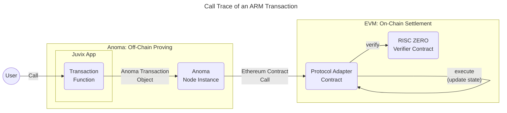
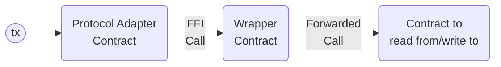

# EVM Protocol Adapter

The EVM protocol adapter is a smart contract written in Solidity that can be deployed to EVM compatible chains and rollups to connect them to the Anoma protocol.

The implementation can be found in [`anoma/evm-protocol-adapter` GH repo](https://github.com/anoma/evm-protocol-adapter).

## Supported Networks

For the upcoming product version v0.3, only the [Sepolia network](https://ethereum.org/en/developers/docs/networks/#sepolia) will be supported.

## Storage

The smart contract implements the following storage components:

- [[Commitment accumulator|Commitment Accumulator]]
- [[Nullifier set|Nullifier Set]]
- [[Stored data format#Data blob storage|Blob Storage]]

### Commitment Accumulator

The implementation uses a modified version of the [OpenZeppelin `MerkleTree` v.5.2.0](https://github.com/OpenZeppelin/openzeppelin-contracts/blob/v5.2.0/contracts/utils/structs/MerkleTree.sol) that populates the binary tree from left to right.
In addition to the leaves, the [modified implementation](https://github.com/anoma/evm-protocol-adapter/blob/main/src/state/CommitmentAccumulator.sol) stores also the intermediary node hashes.

Leaf indices are stored in a hash table

```solidity
 mapping(bytes32 commitment => uint256 index) internal _indices;
```

allowing for commitment existence and non-existence checks.

Historical Merkle tree roots are stored in an [OpenZeppelin `EnumerableSet` v5.2.0](https://github.com/OpenZeppelin/openzeppelin-contracts/blob/v5.2.0/contracts/utils/structs/EnumerableSet.sol).

Only the protocol adapter can call commitment accumulator interface functions.

### Nullifier Set

The implementation uses the [OpenZeppelin `EnumerableSet` v5.2.0](https://github.com/OpenZeppelin/openzeppelin-contracts/blob/v5.2.0/contracts/utils/structs/EnumerableSet.sol) to store nullifiers of consumed resources.

Only the protocol adapter can call nullifier set interface functions.

### Blob Storage

The [implementation](https://github.com/anoma/evm-protocol-adapter/blob/main/src/state/BlobStorage.sol) uses a simple hash table to store blobs content-addressed.

```solidity
mapping(bytes32 blobHash => bytes blob) internal _blobs;
```

In contrast to the specs, it supports only the following two deletion criteria:

```solidity
enum DeletionCriterion {
    Immediately,
    Never
}
```

Only the protocol adapter can call blob storage interface functions.

## Types & Computable Components

The RM-related type and computable component definitions in Solidity can be found in the [src/Types.sol file](https://github.com/anoma/evm-protocol-adapter/blob/main/src/Types.sol) and [src/libs/ComputableComponents.sol file](https://github.com/anoma/evm-protocol-adapter/blob/main/src/libs/ComputableComponents.sol), respectively.

For hashing, we use `sha256` of the [ABI-encoded](https://docs.soliditylang.org/en/latest/abi-spec.html#abi), unpacked data structures.

## Proving Systems

For [resource logic proof](#resource-logic-proofs) and [compliance proof](#compliance-proofs) generation, we use [RISC ZERO](https://risczero.com/)'s proving libraries.

For proof verification, we use the [RISC ZERO verifier contracts](https://dev.risczero.com/api/blockchain-integration/contracts/verifier#contract-addresses).

### Resource Logic Proofs

For the current prototype and the only supported example application [basic shielded Kudos ](https://research.anoma.net/t/basic-e2e-shielded-kudos-app/1237), we use a specific circuit resulting in the loss of function privacy. This will be improved in future iterations.

The associated types are defined in [`proving/Compliance.sol`](https://github.com/anoma/evm-protocol-adapter/blob/main/proving/Compliance.sol).

### Compliance Proofs

Compliance units have a fixed size and contain references to one consumed and one created resource. For transaction with $n_\text{consumed} \neq n_\text{created}$, we expect padding resources (ephemeral resources with quantity 0) to be used.

The associated types are defined in [`proving/Compliance.sol`](https://github.com/anoma/evm-protocol-adapter/blob/main/proving/Compliance.sol).

### Delta Proofs

The delta values are computed as 2D points (`uint256[2]`) on the `secp256k1` (K-256) curve and can be verified using ECDSA.

The curve implementation is taken from [Witnet's `eliptic-curve-solidity` library v0.2.1](https://github.com/witnet/elliptic-curve-solidity/tree/0.2.1). This includes

- [curve parameters](https://github.com/witnet/elliptic-curve-solidity/blob/0.2.1/examples/Secp256k1.sol)
- [curve addition](https://github.com/witnet/elliptic-curve-solidity/blob/3510760b0f20c1156aea795e68b30fe62ce7c20f/contracts/EllipticCurve.sol#L165) (`ecAdd`)
- [curve multiplication](https://github.com/witnet/elliptic-curve-solidity/blob/3510760b0f20c1156aea795e68b30fe62ce7c20f/contracts/EllipticCurve.sol#L239) (`ecMul`)

We use the zero delta public key derived from the private key `0`.

As the message digest, we use the transaction hash that we've defined as follows (see [`src/ProtocolAdapter.sol`](https://github.com/anoma/evm-protocol-adapter/blob/main/src/ProtocolAdapter.sol)):

```solidity
function _transactionHash(bytes32[] memory tags) internal pure returns (bytes32 txHash) {
    txHash = sha256(abi.encode(tags));
}
```

For key recovery from the message digest and signature, we use [OpenZeppelin's `ECDSA` library](https://github.com/OpenZeppelin/openzeppelin-contracts/blob/master/contracts/utils/cryptography/ECDSA.sol).


### Transaction Flow



<!--TODO Use sequence diagram instead-->

The protocol adapter contract receives an `Transaction` object

```solidity
struct Transaction {
    bytes32[] roots;
    Action[] actions;
    bytes deltaProof;
}
```

through an Ethereum contract call from an Anoma node instance. It then verifies and executes the call.

## EVM and ARM State Correspondence

We distinguish two types of state:

1. Internal ARM state being maintained inside the protocol adapter contract that is constituted by commitments, nullifiers, and blobs (see [Storage](#Storage)).
2. External EVM state existing in smart contracts being independent of the protocol adapter.

EVM state interoperability means that the protocol adapter contract can read from and write to external EVM state and create and consume corresponding resources in its internal state.



The correspondence to an external contract maintaining EVM state is established through a custom and permissionlessly deployed [wrapper contract](#wrapper-contract) and an associated, unique [wrapper resource](#wrapper-resource) that must be consumed and created with each call.


### Wrapper Contract

The wrapper contract

- is only callable by the protocol adapter
- references the external contract
- forwards arbitrary calls to external contracts to read and write their state

A minimal implementation is shown below:

```solidity
contract Wrapper is Ownable {
  address internal immutable _CONTRACT;

  function forwardCall(bytes calldata input) external onlyOwner returns (bytes memory output) {
      output = _CONTRACT.functionCall(input);
  }
  // ...
}
```

The required wrapper calldata is passed with the ARM transaction object that the protocol adapter executes and shown below:

```solidity
struct FFICall {
    Resource wrapperResource;
    address untrustedWrapperContract;
    bytes input;
    bytes output;
}
```

The output data is returned to the protocol adapter and compared with the `output` reference in the `FFICall` struct.

!!! note
    In the current, settlement-only protocol adapter design, the `output` data must already be known during proving time to be checked by resource logics and therefore is part of the `FFICall` struct.

<!--note end-->

Besides referencing the external contract, the wrapper contract also contains references to

- the resource logic function (`logicRef`) of the associated wrapper resource
- the resource label (`labelRef`) of the associated wrapper resource that must reference the wrapper contract address
- the resource kind of a [wrapping resource](#wrapping-resources) (`wrappingKind`) that carries information associated with the read from or write to the external contract

!!! note
    The mutual dependency between 
    - the wrapper resource label containing the wrapper contract address 
    - the wrapper contract referencing the wrapper resource label

    can be established by deterministic deployment or post-deployment initialization of the wrapper contract.

<!--note end-->

The wrapper contract base class can be found in [`src/WrapperBase.sol`](https://github.com/anoma/evm-protocol-adapter/blob/main/src/ProtocolAdapter.sol)

### Wrapper Resource

The wrapper resource is unique, associated with a single wrapper contract, and ensures creation and consumption of [wrapping resources](#wrapping-resources) in correspondence to the wrapper resource call. By default, they can be consumed by everyone (because their nullifier key commitment is derived from the
[[Identity Architecture|universal identity]]).

As described above, calls to the wrapper contract can only happen through the protocol adapter.
This allows the protocol adapter to enforce the presence of the `FFICall` data in the `appData` and inspection of the contained `bytes input` and `bytes output` calldata by the the corresponding wrapper resource logic.

Given this information, the wrapper resource logic can ensure creation or consumption of a corresponding [wrapping resource](#wrapping-resource) in the same action reflecting the external EVM state read or write that has been forwarded through the wrapper contract.
This enables applications, such as wrapping ERC20 tokens into resources.

!!! note
    If the wrapper resource is consumed in a transaction, subsequent transactions in the same block cannot consume it anymore.
This effectively limits the current design to a single wrapper contract call per block (if the commitment of the latest, unspent wrapper resource is not known to the subsequent transaction ahead of time). This will be improved in upcoming versions.

<!--note end-->

#### Initialization

In the current implementation, wrapper resources are expected to only be directly initialized through the protocol adapter smart contract that directly adds the commitment to the commitment accumulator.
To comply with this rule, the wrapper resource logics must return `false` on ephemeral consumption to prevent conventional initialization.
This cannot be enforced through the protocol adapter. However, violation of this rule can be detected by inspection and auditing of resource logics. Resource kinds violating this rule are deemed unsafe and not trustworthy.

!!! note
    Conventional initialization is possible, but not implemented for now to simplify wrapper resource logics and the wrapper deployment process. This can be changed at any time.

<!--note end-->

The initialization works as follows:

1. The external `createWrapperContractResource` function in the protocol adapter is called and receives the wrapper contract address as an input argument
2. The protocol adapter constructs a wrapper resource object with `logic`, `label`, and `value` information taken from the wrapper contract, quantity 1, and all other fields being to zero/false.
3. The protocol adapter computes the resource commitment
4. The protocol adapter adds the commitment to commitment accumulator.

Because all data is pre-determined by the wrapper contract or zeroed, only one wrapper resource can ever be created.
A transaction attempting to initialize a second wrapper resource would revert since the commitment exists already in the commitment accumulator.

### Wrapping Resources

Wrapping resources encapsulate EVM state and correspond to a specific [wrapper resource](#wrapper-resource) being referenced in their label.
Their initialization and finalization logic requires a created wrapper resource to be part of the same action.
