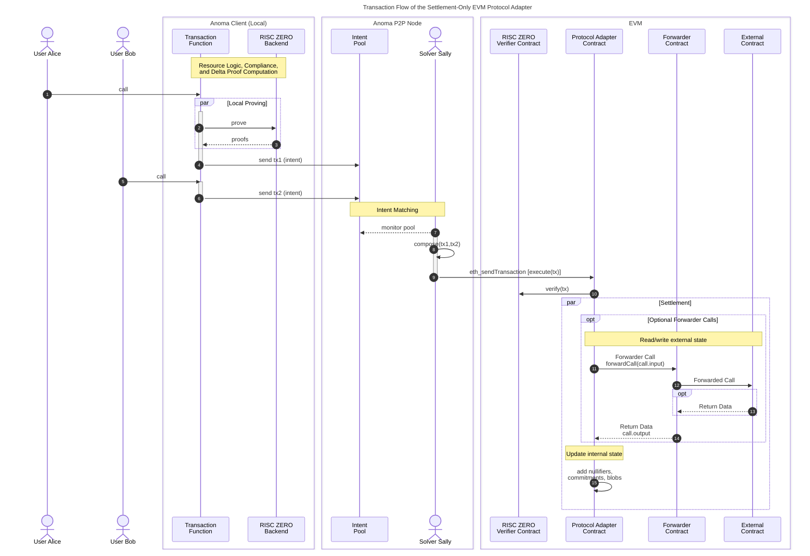

# Ethereum Virtual Machine Protocol Adapter

The Ethereum Virtual Machine (EVM) protocol adapter is a smart contract written in [Solidity](https://soliditylang.org/) that can be deployed to EVM compatible chains and rollups to connect them to the a Anoma protocol. In general, the aim of the protocol adapter is to allow Anoma applications to be run on existing EVM-compatible chains (similar to how drivers allow an operating system to be run on different pieces of physical hardware).

The current prototype is a **settlement-only** protocol adapter, i.e., it is only capable of processing fully-evaluated transaction functions and therefore does not implement the full [[Executor Engine|executor engine]] behavior.

The implementation can be found in the [`anoma/evm-protocol-adapter` GH repo](https://github.com/anoma/evm-protocol-adapter).

## Supported Networks

For the upcoming product version v0.3, only the [Sepolia network](https://ethereum.org/en/developers/docs/networks/#sepolia) will be supported.

## Storage

The protocol adapter contract inherits the following storage components

- [[Commitment accumulator|Commitment Accumulator]]
- [[Nullifier set|Nullifier Set]]
- [[Stored data format#Data blob storage|Blob Storage]]

Only the protocol adapter can call [non-view functions](https://docs.soliditylang.org/en/latest/contracts.html#view-functions) implemented by the storage components.

### Commitment Accumulator

The implementation uses a modified version of the [OpenZeppelin `MerkleTree` v.5.2.0](https://github.com/OpenZeppelin/openzeppelin-contracts/blob/v5.2.0/contracts/utils/structs/MerkleTree.sol) that populates the binary tree from left to right and stores leaf indices in a hash table

```solidity
 mapping(bytes32 commitment => uint256 index) internal _indices;
```

allowing for commitment existence checks.

In addition to the leaves, the [modified implementation](https://github.com/anoma/evm-protocol-adapter/blob/main/src/state/CommitmentAccumulator.sol) stores also the intermediary node hashes.

Historical Merkle tree roots are stored in an [OpenZeppelin `EnumerableSet` v5.2.0](https://github.com/OpenZeppelin/openzeppelin-contracts/blob/v5.2.0/contracts/utils/structs/EnumerableSet.sol) allowing for existence checks.

### Nullifier Set

The implementation uses an [OpenZeppelin `EnumerableSet` v5.2.0](https://github.com/OpenZeppelin/openzeppelin-contracts/blob/v5.2.0/contracts/utils/structs/EnumerableSet.sol) to store nullifiers of consumed resources and allow for existence checks.

### Blob Storage

The [implementation](https://github.com/anoma/evm-protocol-adapter/blob/main/src/state/BlobStorage.sol) uses a simple hash table to store blobs content-addressed.

```solidity
mapping(bytes32 blobHash => bytes blob) internal _blobs;
```

From the [[Stored data format#data-blob-storage|list of deletion criteria]], the current blob storage implementation supports the following two:

```solidity
enum DeletionCriterion {
    Immediately,
    Never
}
```

## Hash Function

For hashing, we compute the SHA-256 hash of the [strictly ABI-encoded](https://docs.soliditylang.org/en/latest/abi-spec.html#strict-encoding-mode) data. SHA-256 is available as a pre-compile in both the [EVM](https://www.evm.codes/precompiled) and [RISC ZERO zkVM](https://dev.risczero.com/api/zkvm/precompiles).

## Types & Computable Components

The RM-related type and computable component definitions in Solidity can be found in the [`src/Types.sol`](https://github.com/anoma/evm-protocol-adapter/blob/main/src/Types.sol) and [`src/libs/ComputableComponents.sol`](https://github.com/anoma/evm-protocol-adapter/blob/main/src/libs/ComputableComponents.sol) file, respectively.

## Proving Systems

For [resource logic proof](#resource-logic-proofs) and [compliance proof](#compliance-proofs) generation, we use [RISC ZERO](https://risczero.com/)'s proving libraries.

For proof verification, we use the [RISC ZERO verifier contracts](https://dev.risczero.com/api/blockchain-integration/contracts/verifier#contract-addresses).

### Resource Logic Proofs

For the current prototype and the only supported example application [basic shielded Kudos ](https://research.anoma.net/t/basic-e2e-shielded-kudos-app/1237), we use a specific circuit resulting in the loss of function privacy. This will be improved in future iterations.

The associated types are defined in [`proving/Compliance.sol`](https://github.com/anoma/evm-protocol-adapter/blob/main/src/proving/Compliance.sol).

### Compliance Proofs

Compliance units have a fixed size and contain references to one consumed and one created resource. For transaction with $n_\text{consumed} \neq n_\text{created}$, we expect padding resources (ephemeral resources with quantity 0) to be used.

The associated types are defined in [`proving/Compliance.sol`](https://github.com/anoma/evm-protocol-adapter/blob/main/src/proving/Compliance.sol).

### Delta Proofs

The delta values are computed as 2D points (`uint256[2]`) on the `secp256k1` (K-256) curve and can be verified using ECDSA.

The curve implementation is taken from [Witnet's `eliptic-curve-solidity` library v0.2.1](https://github.com/witnet/elliptic-curve-solidity/tree/0.2.1). This includes

- [curve parameters](https://github.com/witnet/elliptic-curve-solidity/blob/0.2.1/examples/Secp256k1.sol)
- [curve addition](https://github.com/witnet/elliptic-curve-solidity/blob/3510760b0f20c1156aea795e68b30fe62ce7c20f/contracts/EllipticCurve.sol#L165) (`ecAdd`)
- [curve multiplication](https://github.com/witnet/elliptic-curve-solidity/blob/3510760b0f20c1156aea795e68b30fe62ce7c20f/contracts/EllipticCurve.sol#L239) (`ecMul`)

We use the zero delta public key derived from the private key `0`.

As the message digest, we use the transaction hash that we've defined as follows (see [`src/ProtocolAdapter.sol`](https://github.com/anoma/evm-protocol-adapter/blob/main/src/ProtocolAdapter.sol)):

```solidity
function _transactionHash(bytes32[] memory tags) internal pure returns (bytes32 txHash) {
    txHash = sha256(abi.encode(tags));
}
```

For key recovery from the message digest and signature, we use [OpenZeppelin's `ECDSA` library](https://github.com/OpenZeppelin/openzeppelin-contracts/blob/master/contracts/utils/cryptography/ECDSA.sol).

## EVM and RM State Correspondence

Taking a protocol adapter contract-centric viewpoint, we distinguish between two types of EVM state:

1. Internal [[Resource Machine|resource machine (RM)]] state being maintained inside the protocol adapter contract that is constituted by commitments, nullifiers, and blobs (see [Storage](#storage)).
2. External state existing in smart contracts which are independent of the protocol adapter and its internal RM state.

To **interoperate with state in external contracts**, the protocol adapter contract can, during transaction execution, **make read and write calls** to them and **create and consume corresponding resources** in its internal state reflecting the external state reads and writes.

We achieve this by creating an indirection layer separating the protocol adapter from the
the external contract and resources that should be created and consumed in consequence. It consists of:
- A [forwarder contract](#forwarder-contract) that
    - conducts the actual state read or write calls into the target contract and returns eventual return data
    - is custom-built for the target contract to call and permissionlessly deployed by 3rd parties
- A [calldata carrier resource](#calldata-carrier-resource) (singleton) that
    - must be part of the action data structure containing the forwarder call instruction
    - carries the inputs and outputs of the forwarded call
    - expresses constraints over other resources that must be present and correspond to the external call

and allows the protocol adapter to ensure the correspondence.


This works as follows:

The protocol adapter accepts an optional `ForwarderCalldata` struct with the RM transaction object as part of the action object (see [`src/Types.sol`](https://github.com/anoma/evm-protocol-adapter/blob/main/src/Types.sol)):

```solidity
struct ForwarderCalldata {
    address untrustedForwarderContract;
    bytes input;
    bytes output;
}
```
The struct contains the address of the [forwarder contract](#forwarder-contract) and `bytes input` data required for the intended state read or write calls on the target contract. It also contains the `bytes output` data that must match the data returned from the call.

The protocol adapter ensures the `ForwarderCalldata` is part of the app data of the [singleton calldata carrier resources](#calldata-carrier-resource) that has a pre-determined kind being referenced in the forwarder contract.

!!! note
    In the current, settlement-only protocol adapter design, the `output` data must already be known during proving time to be checked by resource logics and therefore is part of the `ForwarderCalldata` struct.

The binding between the created calldata carrier resource and the called forwarder contract is ensured through the protocol adapter, which

1. is the exclusive caller of the forwarder contract,
2. ensures the presence of the created calldata carrier resource in correspondence to the call in the transaction,
3. ensures that the forwarder contract call input data, call output data, and address is available in the app data entry of the created calldata carrier resource under its commitment,
4. ensures that the kind of the created calldata carrier resource matches the kind being immutably referenced in the forwarder contract. This way, the calldata carrier resource logic and label are fully determined by the forwarder contract.

Because the calldata carrier resource is a singleton, we know that the consumption of the old carrier is guaranteed through the transaction balance property.

The created calldata carrier resource, in turn, can enforce creation or consumption of other [resources corresponding to external state](#resources-corresponding-to-external-state).

In the following we describe the components in more detail.

### Forwarder Contract

The forwarder contract

- is only callable by the protocol adapter
- has the address to the external contract it corresponds to
- forwards arbitrary calls to the external contract to read and write its state and changes the call context (i.e., [`msg.sender` and `msg.data`](https://docs.soliditylang.org/en/latest/units-and-global-variables.html#block-and-transaction-properties))
- returns the call return data to the protocol adapter

The resulting indirection has the purpose to keep custom logic such as

- callback logic (e.g., required by [ERC-721](https://eips.ethereum.org/EIPS/eip-721) or [ERC-1155](https://eips.ethereum.org/EIPS/eip-1155) tokens)
- escrow logic (e.g., required to wrap owned state into resources)
- event logic (e.g., required for EVM indexers)

separate and independent from the protocol adapter contract. This allows the forwarder contract to be custom-built and permissionlessly deployed by untrusted 3rd parties.

Besides referencing the external contract by its address, the forwarder contract must also reference the
the resource kind of the associated [calldata carrier resource](#calldata-carrier-resource) that the protocol adapter will require be created. This allows the forwarder contract to also to enforce its own contract address to be part of the carrier resource label, which ensures that the correspondence between the forwarder and carrier resource is unique.

!!! note
    The mutual dependency between
    - the calldata carrier resource label containing the forwarder contract address
    - the forwarder contract referencing the calldata carrier resource label

    can be established by deterministic deployment or post-deployment initialization of the forwarder contract.

## Implementation Details

A minimal implementation is shown below:

```solidity
contract ExampleForwarder is Ownable {
  bytes32 internal immutable _CALLDATA_CARRIER_RESOURCE_KIND;
  address internal immutable _CONTRACT;

    constructor(address protocolAdapter, bytes32 calldataCarrierLogicRef) Ownable(protocolAdapter) {
        _CALLDATA_CARRIER_RESOURCE_KIND = ComputableComponents.kind({
            logicRef: calldataCarrierLogicRef,
            labelRef: sha256(abi.encode(address(this)))
        });
    }

  function forwardCall(bytes calldata input) external onlyOwner returns (bytes memory output) {
      output = _CONTRACT.functionCall(input);
  }

  function calldataCarrierResourceKind() external view returns (bytes32 kind){
      kind = _CALLDATA_CARRIER_RESOURCE_KIND;
  }
}
```

The required calldata is passed with the RM transaction object as part of the `Action` struct (see [`src/Types.sol`](https://github.com/anoma/evm-protocol-adapter/blob/main/src/Types.sol)).

```solidity
struct ForwarderCalldata {
    address untrustedForwarderContract;
    bytes input;
    bytes output;
}
```

On transaction execution by the protocol adapter, the `ForwarderCalldata` struct is processed as follows:

```solidity
function _executeForwarderCall(ForwarderCalldata calldata call) internal {
    bytes memory output = IForwarder(call.untrustedForwarder).forwardCall(call.input);

    if (keccak256(output) != keccak256(call.output)) {
        revert ForwarderCallOutputMismatch({ expected: call.output, actual: output });
    }
}
```

The forwarder contract base class can be found in [`src/ForwarderBase.sol`](https://github.com/anoma/evm-protocol-adapter/blob/main/src/ForwarderBase.sol).

### Calldata Carrier Resource

A calldata carrier resource is a singleton (i.e., it has a unique kind ensuring that only a single instance with quantity 1 exists) being bound to an associated forwarder contract.
By default, calldata carrier resources can be consumed by everyone (because their nullifier key commitment is derived from the [[Identity Architecture#true-all|universal identity]]).

!!! note
    When the singleton calldata carrier resource is consumed in a transaction, subsequent transactions in the same block cannot consume it anymore. This effectively limits the current design to a single forwarder contract call per block (if the commitment of the latest, unspent calldata carrier resource is not known to the subsequent transaction ahead of time). This will be improved in upcoming protocol adapter versions.

The calldata carrier resource object is passed to the protocol adapter together with the `ForwarderCalldata` struct (see [`src/Types.sol`](https://github.com/anoma/evm-protocol-adapter/blob/main/src/Types.sol#L31)):


```solidity
struct ResourceForwarderCalldataPair {
    Resource carrier;
    ForwarderCalldata call;
}
```

This allows the protocol adapter to ensure that
1. the calldata carrier resource kind matches the one referenced in the forwarder contract and
2. a corresponding `action.appData` entry exists for the calldata carrier resource commitment tag that includes the `ForwarderCalldata`.

The latter allows calldata carrier to inspect the `bytes input` and `bytes output` in the `ForwarderCalldata`
and ensure the creation and consumption of [resources corresponding to the external state reads or writes](#resources-corresponding-to-external-state) in the same action.
Moreover, it can integrity check that its own label matches the `untrustedForwarderContract` address.

This enables applications, such as wrapping [ERC20](https://eips.ethereum.org/EIPS/eip-20) tokens into resources, which works by
1. transferring tokens from an owner into the forwarder contract via `transferFrom` and
2. initializing an owned resource with a corresponding quantity and the kind being specified in the forwarder contract.


### Resources Corresponding to External State

Resources can correspond to EVM state and correspond to a specific [calldata carrier resource](#calldata-carrier-resource) kind being referenced in their label. Their initialization and finalization logic requires a created calldata carrier resource to be part of the same action.

## Transaction Flow

The protocol adapter transaction flow is shown below:



1. A user Alice calls a transaction function of a Juvix application to produce an ARM transaction object (here expressing an intent) as well as the instances and witnesses for the various proof types (resource logic, compliance, and delta proofs).
2. The transaction function requests proofs from the RISC ZERO backend.
3. The backend returns the proofs for the transaction object.
4. The Anoma client sends the intent transaction object
   to the intent pool.
5. Another user Bob expresses his intent (see 1. to 3.).
6. See 4.
7. A solver Sally monitors the intent pool and sees the intent transactions by Alice and Bob and finds a match (using her algorithm).
8. Sally composes the the intent transactions and adds her own actions s.t. the transaction becomes balanced & valid. She converts the transaction object into the format required by the EVM protocol adapter.
9. Sally being connected to an Ethereum node makes an [`eth_sendTransaction`](https://ethereum.org/en/developers/docs/apis/json-rpc/#eth_sendtransaction) call into the protocol adapter's `execute(Transaction tx)` function, which she signs with the private key of her account.
10. The protocol adapter verifies the proofs from 3. by calling a RISC ZERO verifier contract deployed on the network.
11. The protocol adapter makes an optional forwarder contract call by using the `ForwarderCalldata.input` data.
12. The forwarder contract forwards the call to an external target contract to read from or write to its state.
13. Optional return data is passed back to the forwarder contract.
14. Return data (that can be empty) is passed to the protocol adapter contract allowing it to conduct integrity checks (by requiring the same data to be part of `action.appData`).
15. The protocol adapter updates its internal state by storing

    - nullifiers of consumed resources

    - commitments of created resources

    - blobs with deletion criteria `!= DeletionCriterion.Immediately`.
