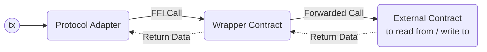
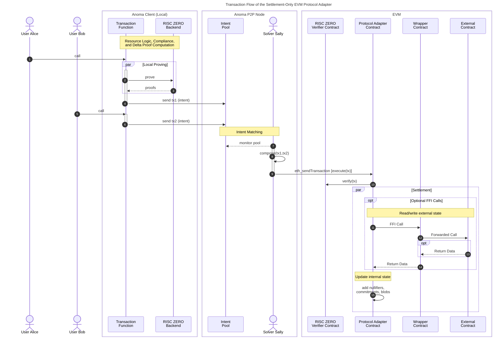

# Ethereum Virtual Machine Protocol Adapter

The Ethereum Virtual Machine (EVM) protocol adapter is a smart contract written in [Solidity](https://soliditylang.org/) that can be deployed to EVM compatible chains and rollups to connect them to the Anoma protocol.

The current prototype is **settlment-only** protocol adapter, i.e., it is only capable of processing fully-evaluated transaction functions and therefore does not implement the full [[Executor Engine|executor engine]] behavior.

The implementation can be found in the [`anoma/evm-protocol-adapter` GH repo](https://github.com/anoma/evm-protocol-adapter).

## Supported Networks

For the upcoming product version v0.3, only the [Sepolia network](https://ethereum.org/en/developers/docs/networks/#sepolia) will be supported.

## Storage

The protocol adapter contract implements the following storage components

- [[Commitment accumulator|Commitment Accumulator]]
- [[Nullifier set|Nullifier Set]]
- [[Stored data format#Data blob storage|Blob Storage]]

Only the protocol adapter can call [non-view functions](https://docs.soliditylang.org/en/latest/contracts.html#view-functions) implemented by the storage components.

### Commitment Accumulator

The implementation uses a modified version of the [OpenZeppelin `MerkleTree` v.5.2.0](https://github.com/OpenZeppelin/openzeppelin-contracts/blob/v5.2.0/contracts/utils/structs/MerkleTree.sol) that populates the binary tree from left to right and stores leaf indices in a hash table

```solidity
 mapping(bytes32 commitment => uint256 index) internal _indices;
```

allowing for commitment existence checks.

In addition to the leaves, the [modified implementation](https://github.com/anoma/evm-protocol-adapter/blob/main/src/state/CommitmentAccumulator.sol) stores also the intermediary node hashes.

Historical Merkle tree roots are stored in an [OpenZeppelin `EnumerableSet` v5.2.0](https://github.com/OpenZeppelin/openzeppelin-contracts/blob/v5.2.0/contracts/utils/structs/EnumerableSet.sol) allowing for existence checks.

### Nullifier Set

The implementation uses an [OpenZeppelin `EnumerableSet` v5.2.0](https://github.com/OpenZeppelin/openzeppelin-contracts/blob/v5.2.0/contracts/utils/structs/EnumerableSet.sol) to store nullifiers of consumed resources and allow for existence checks.

### Blob Storage

The [implementation](https://github.com/anoma/evm-protocol-adapter/blob/main/src/state/BlobStorage.sol) uses a simple hash table to store blobs content-addressed.

```solidity
mapping(bytes32 blobHash => bytes blob) internal _blobs;
```

From the [[Stored data format#data-blob-storage|list of deletion criteria]], the current blob storage implementation supports the following two:

```solidity
enum DeletionCriterion {
    Immediately,
    Never
}
```

## Hash Function

For hashing, we compute the SHA-256 hash of the [strictly ABI-encoded](https://docs.soliditylang.org/en/latest/abi-spec.html#strict-encoding-mode) data. SHA-256 is availble as a pre-compile in both the [EVM](https://www.evm.codes/precompiled) and [RISC ZERO zkVM](https://dev.risczero.com/api/zkvm/precompiles).

## Types & Computable Components

The RM-related type and computable component definitions in Solidity can be found in the [`src/Types.sol`](https://github.com/anoma/evm-protocol-adapter/blob/main/src/Types.sol) and [`src/libs/ComputableComponents.sol`](https://github.com/anoma/evm-protocol-adapter/blob/main/src/libs/ComputableComponents.sol) file, respectively.

## Proving Systems

For [resource logic proof](#resource-logic-proofs) and [compliance proof](#compliance-proofs) generation, we use [RISC ZERO](https://risczero.com/)'s proving libraries.

For proof verification, we use the [RISC ZERO verifier contracts](https://dev.risczero.com/api/blockchain-integration/contracts/verifier#contract-addresses).

### Resource Logic Proofs

For the current prototype and the only supported example application [basic shielded Kudos ](https://research.anoma.net/t/basic-e2e-shielded-kudos-app/1237), we use a specific circuit resulting in the loss of function privacy. This will be improved in future iterations.

The associated types are defined in [`proving/Compliance.sol`](https://github.com/anoma/evm-protocol-adapter/blob/main/src/proving/Compliance.sol).

### Compliance Proofs

Compliance units have a fixed size and contain references to one consumed and one created resource. For transaction with $n_\text{consumed} \neq n_\text{created}$, we expect padding resources (ephemeral resources with quantity 0) to be used.

The associated types are defined in [`proving/Compliance.sol`](https://github.com/anoma/evm-protocol-adapter/blob/main/src/proving/Compliance.sol).

### Delta Proofs

The delta values are computed as 2D points (`uint256[2]`) on the `secp256k1` (K-256) curve and can be verified using ECDSA.

The curve implementation is taken from [Witnet's `eliptic-curve-solidity` library v0.2.1](https://github.com/witnet/elliptic-curve-solidity/tree/0.2.1). This includes

- [curve parameters](https://github.com/witnet/elliptic-curve-solidity/blob/0.2.1/examples/Secp256k1.sol)
- [curve addition](https://github.com/witnet/elliptic-curve-solidity/blob/3510760b0f20c1156aea795e68b30fe62ce7c20f/contracts/EllipticCurve.sol#L165) (`ecAdd`)
- [curve multiplication](https://github.com/witnet/elliptic-curve-solidity/blob/3510760b0f20c1156aea795e68b30fe62ce7c20f/contracts/EllipticCurve.sol#L239) (`ecMul`)

We use the zero delta public key derived from the private key `0`.

As the message digest, we use the transaction hash that we've defined as follows (see [`src/ProtocolAdapter.sol`](https://github.com/anoma/evm-protocol-adapter/blob/main/src/ProtocolAdapter.sol)):

```solidity
function _transactionHash(bytes32[] memory tags) internal pure returns (bytes32 txHash) {
    txHash = sha256(abi.encode(tags));
}
```

For key recovery from the message digest and signature, we use [OpenZeppelin's `ECDSA` library](https://github.com/OpenZeppelin/openzeppelin-contracts/blob/master/contracts/utils/cryptography/ECDSA.sol).

## EVM and RM State Correspondence

We distinguish two types of state:

1. Internal [[Resource Machine|resource machine (RM)]] state being maintained inside the protocol adapter contract that is constituted by commitments, nullifiers, and blobs (see [Storage](#storage)).
2. External EVM state existing in smart contracts being independent of the protocol adapter and its internal RM state.

To **interoperate with the external EVM state**, the protocol adapter contract can read from and write to external EVM state and **make it available in corresponding resources** in its internal state.
The correspondence to an external contract maintaining EVM state is established through a custom and permissionlessly deployed [wrapper contract](#wrapper-contract) and an associated, unique [wrapper resource](#wrapper-resource) that must be consumed and created with each call.



### Wrapper Contract

The wrapper contract

- is only callable by the protocol adapter
- has the address to the external contract it corresponds to
- forwards arbitrary calls to the external contract to read and write its state
- returns the call return data to the protocol adapter

A minimal implementation is shown below:

```solidity
contract Wrapper is Ownable {
  address internal immutable _CONTRACT;

  function forwardCall(bytes calldata input) external onlyOwner returns (bytes memory output) {
      output = _CONTRACT.functionCall(input);
  }
  // ...
}
```

The required FFI calldata is passed with the RM transaction object as part of the [`Action` struct](https://github.com/anoma/evm-protocol-adapter/blob/main/src/Types.sol#L31).

```solidity
struct FFICall {
    address untrustedWrapperContract;
    bytes input;
    bytes output;
}
```

On transaction execution by the protocol adapter, the FFI call is processed as follows:

```solidity
function _executeFFICall(FFICall calldata ffiCall) internal {
    bytes memory output = UntrustedWrapper(ffiCall.untrustedWrapperContract).forwardCall(ffiCall.input);

    if (keccak256(output) != keccak256(ffiCall.output)) {
        revert FFICallOutputMismatch({ expected: ffiCall.output, actual: output });
    }
}
```

The output data is returned to the protocol adapter and compared with the `output` stored in the `FFICall` struct.

!!! note
    In the current, settlement-only protocol adapter design, the `output` data must already be known during proving time to be checked by resource logics and therefore is part of the `FFICall` struct.

Besides referencing the external contract by its address, the wrapper contract also contains references to

- the resource logic function (`logicRef`) of the associated [wrapper resource](#wrapper-resource)
- the resource label (`labelRef`) of the associated [wrapper resource](#wrapper-resource) that, in turn, must reference the wrapper contract address (see note below)
- the resource kind of a [wrapping resource](#wrapping-resources) (`wrappingKind`) that carries information associated with the read from or write to the external contract

!!! note
    The mutual dependency between
    - the wrapper resource label containing the wrapper contract address
    - the wrapper contract referencing the wrapper resource label

    can be established by deterministic deployment or post-deployment initialization of the wrapper contract.

The wrapper contract base class can be found in [`src/WrapperBase.sol`](https://github.com/anoma/evm-protocol-adapter/blob/main/src/WrapperBase.sol).

### Wrapper Resource

The wrapper resource is unique, associated with a single wrapper contract, and ensures creation and consumption of [wrapping resources](#wrapping-resources) in correspondence to the wrapper resource call. By default, they can be consumed by everyone (because their nullifier key commitment is derived from the
[[Identity Architecture|universal identity]]).

The wrapper resource object is passed to the protocol adapter together with the`FFICall` struct (see [`src/Types.sol`](https://github.com/anoma/evm-protocol-adapter/blob/main/src/Types.sol#L31)):


```solidity
struct WrapperResourceFFICallPair {
    Resource wrapperResource;
    FFICall ffiCall;
}
```

This allows the protocol adapter to verify that the wrapper resource kind matches the one referenced in the wrapper contract and that a corresponding `action.appData` entry exists for the wrapper resource commitment tag. The latter makes the inspection of the contained `bytes input` and `bytes output` calldata by the the corresponding wrapper resource logic possible.

Given this information, the wrapper resource logic can ensure creation or consumption of a corresponding [wrapping resource](#wrapping-resources) in the same action reflecting the external EVM state read or write that has been forwarded through the wrapper contract. This enables applications, such as wrapping ERC20 tokens into resources.

!!! note
    If the wrapper resource is consumed in a transaction, subsequent transactions in the same block cannot consume it anymore. This effectively limits the current design to a single wrapper contract call per block (if the commitment of the latest, unspent wrapper resource is not known to the subsequent transaction ahead of time). This will be improved in upcoming protocol adapter versions.

#### Initialization

In the current implementation, wrapper resources are expected to only be directly initialized through the protocol adapter smart contract that directly adds the commitment to the commitment accumulator. To comply with this rule, the wrapper resource logics must return `false` on ephemeral consumption to prevent conventional initialization.
This cannot be enforced through the protocol adapter. However, violation of this rule can be detected by inspection and auditing of resource logics. Resource kinds violating this rule are deemed unsafe and not trustworthy.

!!! note
    Conventional initialization is possible, but not implemented for now to simplify wrapper resource logics and the wrapper deployment process. This can be changed at any time.

The initialization works as follows:

1. The external `createWrapperContractResource` function in the protocol adapter is called and receives the wrapper contract address as an input argument
2. The protocol adapter constructs a wrapper resource object with `logic`, `label`, and `value` information taken from the wrapper contract, quantity 1, and all other fields being to zero/false.
3. The protocol adapter computes the resource commitment
4. The protocol adapter adds the commitment to commitment accumulator.

Because all data is pre-determined by the wrapper contract or zeroed, only one wrapper resource can ever be created.
A transaction attempting to initialize a second wrapper resource would revert since the commitment exists already in the commitment accumulator.

### Wrapping Resources

Wrapping resources encapsulate EVM state and correspond to a specific [wrapper resource](#wrapper-resource) being referenced in their label.
Their initialization and finalization logic requires a created wrapper resource to be part of the same action.

## Transaction Flow

The protocol adapter transaction flow is shown below:



1. A user Alice calls a transaction function of a Juvix application to produce an ARM transaction object (here expressing an intent) as well as the instances and witnesses for the various proof types (resource logic, compliance, and delta proofs).
2. The transaction function requests proofs from the RISC ZERO backend.
3. The backend returns the proofs for the transaction object.
4. The Anoma client sends the intent transaction object
   to the intent pool.
5. Another user Bob expresses his intent (see 1. to 4.).
6. See 4.
7. A solver Sally monitors the intent pool and sees the intent transactions by Alice and Bob and finds a match (using her algorithm).
8. Sally composes the the intent transactions and adds her own actions s.t. the transaction becomes balanced & valid. She converts the transaction object into the format required by the EVM protocol adapter.
9. Sally being connected to an Ethereum node makes an [`eth_sendTransaction`](https://ethereum.org/en/developers/docs/apis/json-rpc/#eth_sendtransaction) call into the protocol adapter's `execute(Transaction tx)` function, which she signs with the private key of her account.
10. The protocol adapter verifies the proofs from 3. by calling a RISC ZERO verifier contract deployed on the network.
11. The protocol adapter makes optional FFI calls to a wrapper contract.
12. The wrapper contract forwards the call to an external target smart contract to read from or write to its state.
13. Optional return data is passed back to the wrapper contract.
14. Return data (that can be empty) is passed to the protocol adapter contract that conducts integrity checks on them (requiring the same data to be part of `action.appData`).
15. The protocol adapter updates its internal state by storing

    - nullifiers of consumed resources

    - commitments of created resources
    
    - blobs with deletion criteria `!= DeletionCriterion.Immediately`.
