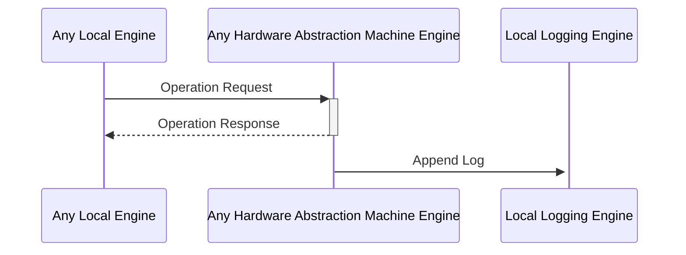

# Hardware Abstraction Machine

## Purpose

The *Hardware Abstraction Machine* provides a standardized interface for engines
to interact with the underlying hardware components of the physical machine Anoma nodes are running.
By decoupling engine software from specific hardware implementations,
the Hardware Abstract Machine abstracts away complexities and facilitate cross-platform compatibility, enhancing software
development and deployment.

## Background

Historically, developers that wanted to write a program had to know how each underlying hardware device communicated with
the rest of the system to ensure the software's compatibility. With a [hardware abstraction layer](https://en.wikipedia.org/wiki/Hardware_abstraction)
developers can just talk to the operating system what the hardware device should do,
which then generates hardware-specific instructions to the device.
Anoma's Hardware Abstraction Machine thus provides an interface for accessing hardware-related
resources such as CPU, memory, and storage.

## Scope

For V1, we assume that the Hardware Abstraction Machine provides other engines access to local storage, compute, time management, and logging functionalities
of the physical machine an Anoma node is running.

## Overview

The current Hardware Abstraction Machine is composed of the following five engines.

### [Local Storage Engine](./local_storage_engines/index.md#purpose)

--8<-- "./local_storage_engines/index.md:purpose"

### [Local Logging Engine](./local_logging_engine/index.md#purpose)

--8<-- "./local_logging_engine/index.md:purpose"

### [Local Wall Clock Engine](./local_wall_clock_engine/index.md#purpose)

--8<-- "./local_wall_clock_engine/index.md:purpose"

## Communication Diagram

<!-- --8<-- [start:messages] -->

<!-- --8<-- [end:messages] -->

An engine communicates with the Hardware Abstraction Machine by sending a request to one of its engines
to perform a specific operation.
The Hardware Abstraction Machine engine executes the operation by interacting with the underlying hardware
components and returns a response.
It also logs relevant events and communicates them to the [[Local Logging Engine#localloggingengine]].
