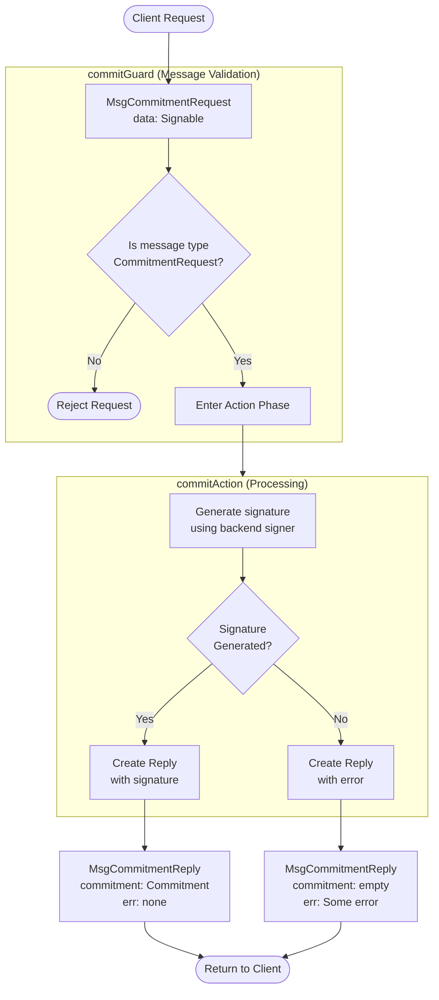

??? code "Juvix imports"

    ```juvix
    module arch.node.engines.commitment_behaviour;

    import prelude open;
    import arch.system.identity.identity open;
    import arch.node.engines.commitment_messages open;
    import arch.node.engines.commitment_config open;
    import arch.node.engines.commitment_environment open;
    import arch.node.types.basics open;
    import arch.node.types.identities open;
    import arch.node.types.messages open;
    import arch.node.types.engine open;
    import arch.node.types.anoma as Anoma open;
    ```

# Commitment Behaviour

## Overview

The behaviour of the Commitment Engine defines how it processes incoming
commitment requests and produces the corresponding commitments/signatures.

## Commitment Action Flowchart

### `commitAction` flowchart

<figure markdown>



<figcaption markdown="span">

`commitAction` flowchart

</figcaption>
</figure>

#### Explanation

1. **Initial Request**
   - A client sends a `MsgCommitmentRequest` containing data (`Signable`) that needs to be signed.
   - The data must be in a format that can be signed by the backend (e.g., a byte string, transaction data, etc.).

2. **Guard Phase** (`commitGuard`)
   - Validates that the incoming message is a proper commitment request.
   - Checks occur in the following order:
     - Verifies message type is `MsgCommitmentRequest`.
     - If validation fails, request is rejected without entering the action phase.
     - On success, passes control to `commitActionLabel`.

3. **Action Phase** (`commitAction`)
   - Processes valid commitment requests through these steps:
     - Extracts the data to be signed from the request.
     - Retrieves the signer from the engine's configuration.
     - Attempts to generate a signature using the backend signer.
     - Constructs an appropriate response message.

4. **Reply Generation**
   - **Successful Case**
     - Creates `MsgCommitmentReply` with:
       - `commitment`: The generated signature.
       - `err`: None.
   - **Error Case**
     - In all error cases, returns `MsgCommitmentReply` with:
       - `commitment`: Empty.
       - `err`: Some(error message).

5. **Reply Delivery**
   - Reply is sent back to the original requester.
   - Uses mailbox 0 (default mailbox for responses).

#### Important Notes:

- The commitment engine is stateless - each request is handled independently.

## Action arguments

### `CommitmentActionArgumentReplyTo ReplyTo`

```juvix
type ReplyTo := mkReplyTo@{
  whoAsked : Option EngineID;
  mailbox : Option MailboxID;
};
```

This action argument contains the address and mailbox ID of where the
response message should be sent.

`whoAsked`:
: is the address of the engine that sent the message.

`mailbox`:
: is the mailbox ID where the response message should be sent.

### `CommitmentActionArgument`

<!-- --8<-- [start:CommitmentActionArgument] -->
```juvix
type CommitmentActionArgument :=
  | CommitmentActionArgumentReplyTo ReplyTo
  ;
```
<!-- --8<-- [end:CommitmentActionArgument] -->

### `CommitmentActionArguments`

```juvix
CommitmentActionArguments : Type := List CommitmentActionArgument;
```

## Actions

??? code "Auxiliary Juvix code"


    ### `CommitmentAction`

    ```juvix
    CommitmentAction : Type :=
      Action
        CommitmentLocalCfg
        CommitmentLocalState
        CommitmentMailboxState
        CommitmentTimerHandle
        CommitmentActionArguments
        Anoma.Msg
        Anoma.Cfg
        Anoma.Env;
    ```


    ### `CommitmentActionInput`

    ```juvix
    CommitmentActionInput : Type :=
      ActionInput
        CommitmentLocalCfg
        CommitmentLocalState
        CommitmentMailboxState
        CommitmentTimerHandle
        CommitmentActionArguments
        Anoma.Msg;
    ```


    ### `CommitmentActionEffect`

    ```juvix
    CommitmentActionEffect : Type :=
      ActionEffect
        CommitmentLocalState
        CommitmentMailboxState
        CommitmentTimerHandle
        Anoma.Msg
        Anoma.Cfg
        Anoma.Env;
    ```

    ### `CommitmentActionExec`

    ```juvix
    CommitmentActionExec : Type :=
      ActionExec
        CommitmentLocalCfg
        CommitmentLocalState
        CommitmentMailboxState
        CommitmentTimerHandle
        CommitmentActionArguments
        Anoma.Msg
        Anoma.Cfg
        Anoma.Env;
    ```

#### `commitAction`

Generate a commitment (signature) for the given request.

State update
: The state remains unchanged.

Messages to be sent
: A `ReplyCommitment` message is sent back to the requester.

Engines to be spawned
: No engine is created by this action.

Timer updates
: No timers are set or cancelled.

<!-- --8<-- [start:commitAction] -->
```juvix
commitAction
  (input : CommitmentActionInput)
  : Option CommitmentActionEffect :=
  let
    env := ActionInput.env input;
    cfg := ActionInput.cfg input;
    tt := ActionInput.trigger input;
  in
    case getEngineMsgFromTimestampedTrigger tt of {
    | some emsg :=
      case emsg of {
      | EngineMsg.mk@{msg := Anoma.Msg.MsgCommitment (CommitmentMsg.Request request)} :=
        let
          signedData := Signer.sign
            (CommitmentLocalCfg.signer (EngineCfg.cfg cfg))
            (CommitmentLocalCfg.backend (EngineCfg.cfg cfg))
            (RequestCommitment.data request);
          responseMsg := ReplyCommitment.mkReplyCommitment@{
            commitment := signedData;
            err := none
          }
        in some ActionEffect.mk@{
          env := env;
          msgs := [
            EngineMsg.mk@{
              sender := getEngineIDFromEngineCfg cfg;
              target := EngineMsg.sender emsg;
              mailbox := some 0;
              msg := Anoma.Msg.MsgCommitment (CommitmentMsg.Reply responseMsg)
            }
          ];
          timers := [];
          engines := []
        }
      | _ := none
      }
    | _ := none
    }
```
<!-- --8<-- [end:commitAction] -->

## Action Labels

### `commitActionLabel`

```juvix
commitActionLabel : CommitmentActionExec := ActionExec.Seq [ commitAction ];
```

## Guards

??? code "Auxiliary Juvix code"


    ### `CommitmentGuard`

    <!-- --8<-- [start:CommitmentGuard] -->
    ```juvix
    CommitmentGuard : Type :=
      Guard
        CommitmentLocalCfg
        CommitmentLocalState
        CommitmentMailboxState
        CommitmentTimerHandle
        CommitmentActionArguments
        Anoma.Msg
        Anoma.Cfg
        Anoma.Env;
    ```
    <!-- --8<-- [end:CommitmentGuard] -->


    ### `CommitmentGuardOutput`

    <!-- --8<-- [start:CommitmentGuardOutput] -->
    ```juvix
    CommitmentGuardOutput : Type :=
      GuardOutput
        CommitmentLocalCfg
        CommitmentLocalState
        CommitmentMailboxState
        CommitmentTimerHandle
        CommitmentActionArguments
        Anoma.Msg
        Anoma.Cfg
        Anoma.Env;
    ```
    <!-- --8<-- [end:CommitmentGuardOutput] -->

    ### `CommitmentGuardEval`

    <!-- --8<-- [start:CommitmentGuardEval] -->
    ```juvix
    CommitmentGuardEval : Type :=
      GuardEval
        CommitmentLocalCfg
        CommitmentLocalState
        CommitmentMailboxState
        CommitmentTimerHandle
        CommitmentActionArguments
        Anoma.Msg
        Anoma.Cfg
        Anoma.Env;
    ```
    <!-- --8<-- [end:CommitmentGuardEval] -->

### `commitGuard`

Condition
: Message type is `MsgCommitmentRequest`.

<!-- --8<-- [start:commitGuard] -->
```juvix
commitGuard
  (tt : TimestampedTrigger CommitmentTimerHandle Anoma.Msg)
  (cfg : CommitmentCfg)
  (env : CommitmentEnv)
  : Option CommitmentGuardOutput :=
  case getEngineMsgFromTimestampedTrigger tt of {
    | some EngineMsg.mk@{
        msg := Anoma.Msg.MsgCommitment (CommitmentMsg.Request _);
      } := some GuardOutput.mk@{
        action := commitActionLabel;
        args := [];
      }
    | _ := none
    };
```
<!-- --8<-- [end:commitGuard] -->

## The Commitment behaviour

### `CommitmentBehaviour`

<!-- --8<-- [start:CommitmentBehaviour] -->
```juvix
CommitmentBehaviour : Type :=
  EngineBehaviour
    CommitmentLocalCfg
    CommitmentLocalState
    CommitmentMailboxState
    CommitmentTimerHandle
    CommitmentActionArguments
    Anoma.Msg
    Anoma.Cfg
    Anoma.Env;
```
<!-- --8<-- [end:CommitmentBehaviour] -->

#### Instantiation

<!-- --8<-- [start:commitmentBehaviour] -->
```juvix
commitmentBehaviour : CommitmentBehaviour :=
  EngineBehaviour.mk@{
    guards :=
      GuardEval.First [
        commitGuard
      ];
  };
```
<!-- --8<-- [end:commitmentBehaviour] -->
