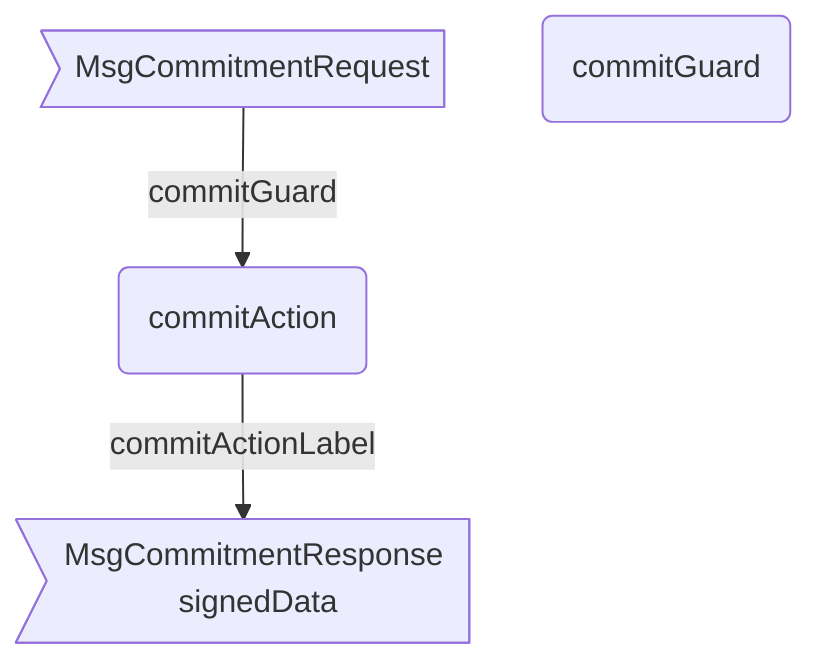

??? quote "Juvix imports"

    ```juvix
    module arch.node.engines.commitment_behaviour;

    import prelude open;
    import arch.system.identity.identity open;
    import arch.node.engines.commitment_messages open;
    import arch.node.engines.commitment_config open;
    import arch.node.engines.commitment_environment open;
    import arch.node.types.basics open;
    import arch.node.types.identities open;
    import arch.node.types.messages open;
    import arch.node.types.engine open;
    import arch.node.types.anoma as Anoma open;
    ```

# Commitment Behaviour

## Overview

The behavior of the Commitment Engine defines how it processes incoming
commitment requests and produces the corresponding responses.

## Action arguments

### `CommitmentActionArgumentReplyTo ReplyTo`

```juvix
type ReplyTo := mkReplyTo {
  whoAsked : Option EngineID;
  mailbox : Option MailboxID;
};
```

This action argument contains the address and mailbox ID of where the
response message should be sent.

`whoAsked`:
: is the address of the engine that sent the message.

`mailbox`:
: is the mailbox ID where the response message should be sent.

### `CommitmentActionArgument`

<!-- --8<-- [start:CommitmentActionArgument] -->
```juvix
type CommitmentActionArgument :=
  | CommitmentActionArgumentReplyTo ReplyTo
  ;
```
<!-- --8<-- [end:CommitmentActionArgument] -->

### `CommitmentActionArguments`

<!-- --8<-- [start:commitment-action-arguments] -->
```juvix
CommitmentActionArguments : Type := List CommitmentActionArgument;
```
<!-- --8<-- [end:commitment-action-arguments] -->

## Actions

??? quote "Auxiliary Juvix code"

    ### `CommitmentAction`

    ```juvix
    CommitmentAction : Type :=
      Action
        CommitmentCfg
        CommitmentLocalState
        CommitmentMailboxState
        CommitmentTimerHandle
        CommitmentActionArguments
        Anoma.Msg
        Anoma.Cfg
        Anoma.Env;
    ```

    ### `CommitmentActionInput`

    ```juvix
    CommitmentActionInput : Type :=
      ActionInput
        CommitmentCfg
        CommitmentLocalState
        CommitmentMailboxState
        CommitmentTimerHandle
        CommitmentActionArguments
        Anoma.Msg;
    ```

    ### `CommitmentActionEffect`

    ```juvix
    CommitmentActionEffect : Type :=
      ActionEffect
        CommitmentLocalState
        CommitmentMailboxState
        CommitmentTimerHandle
        Anoma.Msg
        Anoma.Cfg
        Anoma.Env;
    ```

    ### `CommitmentActionExec`

    ```juvix
    CommitmentActionExec : Type :=
      ActionExec
        CommitmentCfg
        CommitmentLocalState
        CommitmentMailboxState
        CommitmentTimerHandle
        CommitmentActionArguments
        Anoma.Msg
        Anoma.Cfg
        Anoma.Env;
    ```

#### `commitAction`

Generate a commitment (signature) for the given request.

State update
: The state remains unchanged.

Messages to be sent
: A `ResponseCommitment` message is sent back to the requester.

Engines to be spawned
: No engine is created by this action.

Timer updates
: No timers are set or cancelled.

<!-- --8<-- [start:commitAction] -->
```juvix
commitAction
  (input : CommitmentActionInput)
  : Option CommitmentActionEffect :=
  let
    env := ActionInput.env input;
    cfg := ActionInput.cfg input;
    tt := ActionInput.trigger input;
  in
    case getEngineMsgFromTimestampedTrigger tt of {
    | some emsg :=
      case emsg of {
      | mkEngineMsg@{msg := Anoma.MsgCommitment (MsgCommitmentRequest request)} :=
        let
          signedData := Signer.sign
            (CommitmentCfg.signer (EngineCfg.cfg cfg))
            (CommitmentCfg.backend (EngineCfg.cfg cfg))
            (RequestCommitment.data request);
          responseMsg := mkResponseCommitment@{
            commitment := signedData;
            err := none
          }
        in some mkActionEffect@{
          env := env;
          msgs := [
            mkEngineMsg@{
              sender := getEngineIDFromEngineCfg cfg;
              target := EngineMsg.sender emsg;
              mailbox := some 0;
              msg := Anoma.MsgCommitment (MsgCommitmentResponse responseMsg)
            }
          ];
          timers := [];
          engines := []
        }
      | _ := none
      }
    | _ := none
    }
```
<!-- --8<-- [end:commitAction] -->

## Action Labels

### `commitActionLabel`

```juvix
commitActionLabel : CommitmentActionExec := Seq [ commitAction ];
```

## Guards

??? quote "Auxiliary Juvix code"

    ### `CommitmentGuard`

    <!-- --8<-- [start:CommitmentGuard] -->
    ```juvix
    CommitmentGuard : Type :=
      Guard
        CommitmentCfg
        CommitmentLocalState
        CommitmentMailboxState
        CommitmentTimerHandle
        CommitmentActionArguments
        Anoma.Msg
        Anoma.Cfg
        Anoma.Env;
    ```
    <!-- --8<-- [end:CommitmentGuard] -->

    ### `CommitmentGuardOutput`

    <!-- --8<-- [start:CommitmentGuardOutput] -->
    ```juvix
    CommitmentGuardOutput : Type :=
      GuardOutput
        CommitmentCfg
        CommitmentLocalState
        CommitmentMailboxState
        CommitmentTimerHandle
        CommitmentActionArguments
        Anoma.Msg
        Anoma.Cfg
        Anoma.Env;
    ```
    <!-- --8<-- [end:CommitmentGuardOutput] -->

    ### `CommitmentGuardEval`

    <!-- --8<-- [start:CommitmentGuardEval] -->
    ```juvix
    CommitmentGuardEval : Type :=
      GuardEval
        CommitmentCfg
        CommitmentLocalState
        CommitmentMailboxState
        CommitmentTimerHandle
        CommitmentActionArguments
        Anoma.Msg
        Anoma.Cfg
        Anoma.Env;
    ```
    <!-- --8<-- [end:CommitmentGuardEval] -->

### `commitGuard`

Condition
: Message type is `MsgCommitmentRequest`.

<!-- --8<-- [start:commitGuard] -->
```juvix
commitGuard
  (tt : TimestampedTrigger CommitmentTimerHandle Anoma.Msg)
  (cfg : EngineCfg CommitmentCfg)
  (env : CommitmentEnv)
  : Option CommitmentGuardOutput :=
  case getEngineMsgFromTimestampedTrigger tt of {
    | some mkEngineMsg@{
        msg := Anoma.MsgCommitment (MsgCommitmentRequest _);
      } := some mkGuardOutput@{
        action := commitActionLabel;
        args := [];
      }
    | _ := none
    };
```
<!-- --8<-- [end:commitGuard] -->

## The Commitment behaviour

### `CommitmentBehaviour`

<!-- --8<-- [start:CommitmentBehaviour] -->
```juvix
CommitmentBehaviour : Type :=
  EngineBehaviour
    CommitmentCfg
    CommitmentLocalState
    CommitmentMailboxState
    CommitmentTimerHandle
    CommitmentActionArguments
    Anoma.Msg
    Anoma.Cfg
    Anoma.Env;
```
<!-- --8<-- [end:CommitmentBehaviour] -->

#### Instantiation

<!-- --8<-- [start:commitmentBehaviour] -->
```juvix
commitmentBehaviour : CommitmentBehaviour :=
  mkEngineBehaviour@{
    guards :=
      First [
        commitGuard
      ];
  };
```
<!-- --8<-- [end:commitmentBehaviour] -->

## Commitment Action Flowchart

### `commitAction` flowchart

<figure markdown>



<figcaption markdown="span">

`commitAction` flowchart

</figcaption>
</figure>