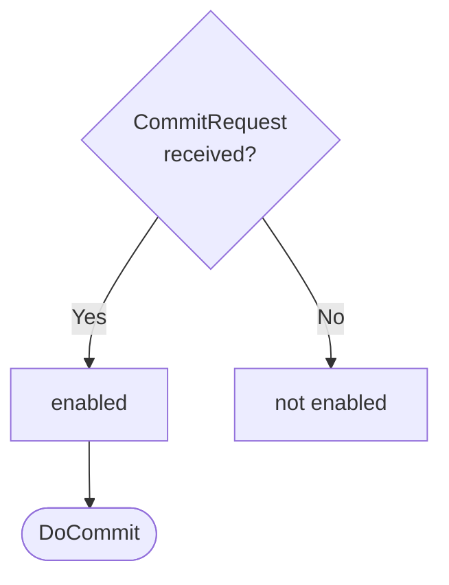

??? quote "Juvix imports"

    ```juvix
    module arch.node.engines.commitment_behaviour;
    import prelude open;
    import arch.system.identity.identity open;
    import arch.node.engines.commitment_messages open;
    import arch.node.engines.commitment_environment open;
    import arch.node.types.anoma_message open;
    import arch.node.types.engine_behaviour open;
    import arch.node.types.engine_environment open;
    import arch.node.types.identities open;
    import arch.node.types.messages open;
    ```

# Commitment Behaviour

## Overview

The behavior of the Commitment Engine defines how it processes incoming
commitment requests and produces the corresponding responses.

## Action labels

### `CommitmentActionLabelDoCommit DoCommit`

```juvix
type DoCommit := mkDoCommit {
  data : Signable
};
```

This action label corresponds to generating a commitment (signature) for the
given request.

???+ quote "Arguments"

    `data`:
    : The data to sign.

???+ quote "`DoCommit` action effect"

    This action does the following:

    | Aspect | Description |
    |--------|-------------|
    | State update          | The state remains unchanged. |
    | Messages to be sent   | A `ResponseCommitment` message is sent back to the requester. |
    | Engines to be spawned | No engine is created by this action. |
    | Timer updates         | No timers are set or cancelled. |

### `CommitmentActionLabel`

```juvix
type CommitmentActionLabel :=
  | CommitmentActionLabelDoCommit DoCommit
  ;
```

## Matchable arguments

### `CommitmentMatchableArgumentReplyTo ReplyTo`

```juvix
type ReplyTo := mkReplyTo {
  whoAsked : Option EngineID;
  mailbox : Option MailboxID;
};
```

???+ quote "Arguments"

    `whoAsked`:
    : The engine ID of the requester.

    `mailbox`:
    : The mailbox ID where the response should be sent.

### `CommitmentMatchableArgument`

```juvix
type CommitmentMatchableArgument :=
  | CommitmentMatchableArgumentReplyTo ReplyTo
;
```

## Precomputation results

The Commitment Engine does not require any non-trivial pre-computations.

```juvix
syntax alias CommitmentPrecomputation := Unit;
```

## Guards

??? quote "Auxiliary Juvix code"

    Type alias for the guard.

    ```juvix
    CommitmentGuard : Type :=
      Guard
        CommitmentLocalState
        CommitmentMailboxState
        CommitmentTimerHandle
        CommitmentMatchableArgument
        CommitmentActionLabel
        CommitmentPrecomputation;
    ```

    ```juvix
    CommitmentGuardOutput : Type :=
      GuardOutput
        CommitmentMatchableArgument
        CommitmentActionLabel
        CommitmentPrecomputation;
    ```

### `commitGuard`

<figure markdown>

<figcaption>commitGuard flowchart</figcaption>
</figure>

<!-- --8<-- [start:commitGuard] -->
```juvix
commitGuard
  (t : TimestampedTrigger CommitmentTimerHandle)
  (env : CommitmentEnvironment) : Option CommitmentGuardOutput
  := case getMessageFromTimestampedTrigger t of {
      | some (MsgCommitment (MsgCommitmentRequest request)) := do {
        sender <- getSenderFromTimestampedTrigger t;
        pure (mkGuardOutput@{
                  matchedArgs := [CommitmentMatchableArgumentReplyTo (mkReplyTo (some sender) none)] ;
                  actionLabel := CommitmentActionLabelDoCommit (mkDoCommit (RequestCommitment.data request));
                  precomputationTasks := unit
                });
        }
      | _ := none
  };
```
<!-- --8<-- [end:commitGuard] -->

## Action function

??? quote "Auxiliary Juvix code"

    Type alias for the action function.

    ```juvix
    CommitmentActionInput : Type :=
      ActionInput
        CommitmentLocalState
        CommitmentMailboxState
        CommitmentTimerHandle
        CommitmentMatchableArgument
        CommitmentActionLabel
        CommitmentPrecomputation;

    CommitmentActionEffect : Type :=
      ActionEffect
        CommitmentLocalState
        CommitmentMailboxState
        CommitmentTimerHandle
        CommitmentMatchableArgument
        CommitmentActionLabel
        CommitmentPrecomputation;
    ```

### `commitmentAction`

<!-- --8<-- [start:commitmentAction] -->
```juvix
commitmentAction (input : CommitmentActionInput) : CommitmentActionEffect :=
  let env := ActionInput.env input;
      out := ActionInput.guardOutput input;
      localState := EngineEnv.localState env;
  in
  case GuardOutput.actionLabel out of {
    | CommitmentActionLabelDoCommit (mkDoCommit data) :=
      case GuardOutput.matchedArgs out of {
        | CommitmentMatchableArgumentReplyTo (mkReplyTo (some whoAsked) _) :: _ := let
            signedData :=
              Signer.sign (CommitmentLocalState.signer localState)
                (CommitmentLocalState.backend localState)
                data;
            responseMsg := mkResponseCommitment@{
                  commitment := signedData;
                  err := none
                };
          in mkActionEffect@{
            newEnv := env; -- No state change
            producedMessages := [mkEngineMsg@{
              sender := mkPair none (some (EngineEnv.name env));
              target := whoAsked;
              mailbox := some 0;
              msg := MsgCommitment (MsgCommitmentResponse responseMsg)
            }];
            timers := [];
            spawnedEngines := []
          }
        | _ := mkActionEffect@{newEnv := env; producedMessages := []; timers := []; spawnedEngines := []}
      }
  };
```
<!-- --8<-- [end:commitmentAction] -->

## Conflict solver

### `commitmentConflictSolver`

```juvix
commitmentConflictSolver : Set CommitmentMatchableArgument -> List (Set CommitmentMatchableArgument)
  | _ := [];
```

## The Commitment Behaviour

### `CommitmentBehaviour`

<!-- --8<-- [start:CommitmentBehaviour] -->
```juvix
CommitmentBehaviour : Type :=
  EngineBehaviour
    CommitmentLocalState
    CommitmentMailboxState
    CommitmentTimerHandle
    CommitmentMatchableArgument
    CommitmentActionLabel
    CommitmentPrecomputation;
```
<!-- --8<-- [end:CommitmentBehaviour] -->

### Instantiation

<!-- --8<-- [start:commitmentBehaviour] -->
```juvix
commitmentBehaviour : CommitmentBehaviour :=
  mkEngineBehaviour@{
    guards := [commitGuard];
    action := commitmentAction;
    conflictSolver := commitmentConflictSolver;
  };
```
<!-- --8<-- [end:commitmentBehaviour] -->
