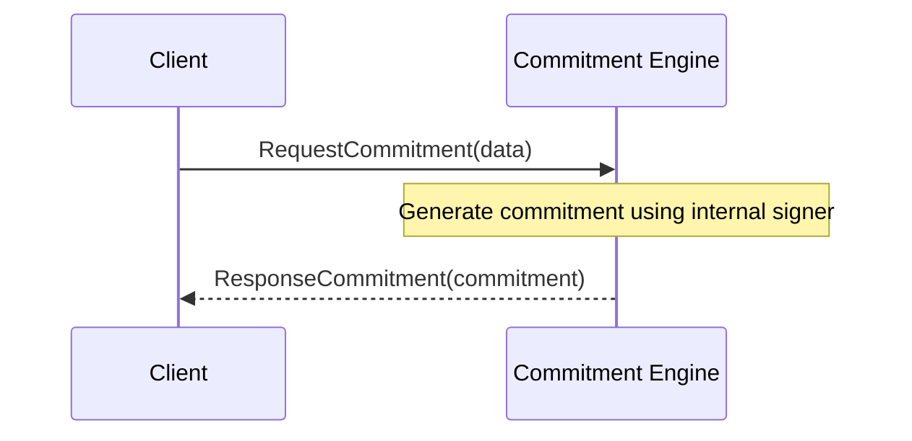

??? quote "Juvix imports"

    ```juvix
    module arch.node.engines.commitment_messages;
    import prelude open;
    import arch.node.types.identities open;
    ```

# Commitment Messages

## Message interface

### `MsgCommitmentRequest RequestCommitment`

```juvix
type RequestCommitment := mkRequestCommitment {
  data : Signable
};
```

A `RequestCommitment` instructs a commitment engine instance to produce a
commitment (signature) over the provided data.

???+ quote "Arguments"
    `data`:
    : The data to sign.

### `MsgCommitmentResponse ResponseCommitment`

```juvix
type ResponseCommitment := mkResponseCommitment {
  commitment : Commitment;
  err : Option String;
};
```

A `ResponseCommitment` contains the commitment (signature) generated by the
commitment engine instance in response to a `RequestCommitment`.

???+ quote "Arguments"

    `commitment`:
    : The generated commitment (signature).

    `err`:
    : An error message if commitment generation failed.

### `CommitmentMsg`

<!-- --8<-- [start:CommitmentMsg] -->
```juvix
type CommitmentMsg :=
  | MsgCommitmentRequest RequestCommitment
  | MsgCommitmentResponse ResponseCommitment
  ;
```
<!-- --8<-- [end:CommitmentMsg] -->

## Message sequence diagrams

### Commitment Generation Sequence

<!-- --8<-- [start:message-sequence-diagram] -->
<figure markdown="span">



<figcaption markdown="span">
Sequence diagram for commitment generation.
</figcaption>
</figure>
<!-- --8<-- [end:message-sequence-diagram] -->

## Engine Components

- [[Commitment Environment]]
- [[Commitment Behaviour]]
