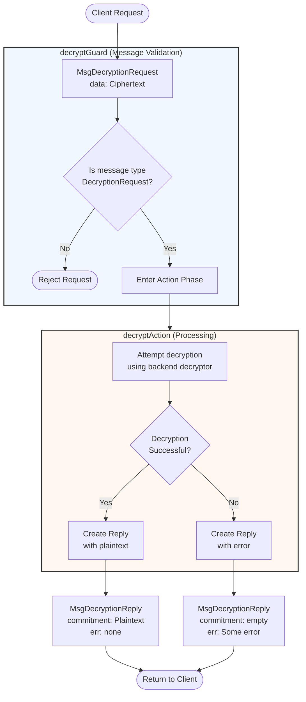

??? quote "Juvix imports"

    ```juvix
    module arch.node.engines.decryption_behaviour;

    import prelude open;
    import arch.node.types.messages open;
    import arch.system.identity.identity open;
    import arch.node.types.engine open;
    import arch.node.engines.decryption_config open;
    import arch.node.engines.decryption_environment open;
    import arch.node.engines.decryption_messages open;
    import arch.node.types.identities open;
    import arch.node.types.anoma as Anoma open;
    ```

# Decryption Behaviour

---

## Overview

The behavior of the Decryption Engine defines how it processes incoming
decryption requests and produces the corresponding decrypted outputs.

---

## Decryption Action Flowchart

---

### `decryptAction` flowchart

<figure markdown>



<figcaption markdown="span">

`decryptAction` flowchart

</figcaption>
</figure>

---

#### Explanation

1. **Initial Request**
   - A client sends a `MsgDecryptionRequest` containing encrypted data (`Ciphertext`).
   - The ciphertext must be encrypted for the identity associated with this decryption engine.
   - Any metadata needed for decryption should be included in the ciphertext structure.

2. **Guard Phase** (`decryptGuard`)
   - Validates incoming message structure and type.
   - Validation steps:
     - Verifies message type is `MsgDecryptionRequest`.
     - If validation fails, request is rejected immediately.
     - On success, passes control to `decryptActionLabel`.

3. **Action Phase** (`decryptAction`)
   - Processes valid decryption requests through these steps:
     - Extracts the ciphertext from the request.
     - Retrieves the decryptor from the engine's configuration.
     - Attempts to decrypt using the backend decryptor.
     - Constructs appropriate response based on result.

4. **Reply Generation**
   - **Successful Case**
     - Creates `MsgDecryptionReply` with:
       - `data`: The decrypted plaintext.
       - `err`: None.
   - **Error Case**
     - In all error cases, returns `MsgDecryptionReply` with:
       - `data`: emptyByteString (zero-length byte string).
       - `err`: Some "Decryption Failed".

5. **Reply Delivery**
   - Reply is sent back to the original requester.
   - Uses mailbox 0 (default mailbox for responses).

---

!!! note

    The commitment engine is stateless - each request is handled .

---

## Action arguments

---

### `ReplyTo`

```juvix
type ReplyTo := mkReplyTo@{
  whoAsked : Option EngineID;
  mailbox : Option MailboxID;
};
```

This action argument contains the address and mailbox ID of where the
response message should be sent.

???+ quote "Arguments"

    `whoAsked`:
    : is the address of the engine that sent the message.

    `mailbox`:
    : is the mailbox ID where the response message should be sent.

---

### `DecryptionActionArgument`

<!-- --8<-- [start:DecryptionActionArgument] -->
```juvix
type DecryptionActionArgument :=
  | DecryptionActionArgumentReplyTo ReplyTo
  ;
```
<!-- --8<-- [end:DecryptionActionArgument] -->

---

### `DecryptionActionArguments`

<!-- --8<-- [start:decryption-action-arguments] -->
```juvix
DecryptionActionArguments : Type := List DecryptionActionArgument;
```
<!-- --8<-- [end:decryption-action-arguments] -->

---

## Actions

??? quote "Auxiliary Juvix code"

    ---

    ### `DecryptionAction`

    ```juvix
    DecryptionAction : Type :=
      Action
        DecryptionCfg
        DecryptionLocalState
        DecryptionMailboxState
        DecryptionTimerHandle
        DecryptionActionArguments
        Anoma.Msg
        Anoma.Cfg
        Anoma.Env;
    ```

    ---

    ### `DecryptionActionInput`

    ```juvix
    DecryptionActionInput : Type :=
      ActionInput
        DecryptionCfg
        DecryptionLocalState
        DecryptionMailboxState
        DecryptionTimerHandle
        DecryptionActionArguments
        Anoma.Msg;
    ```

    ---

    ### `DecryptionActionEffect`

    ```juvix
    DecryptionActionEffect : Type :=
      ActionEffect
        DecryptionLocalState
        DecryptionMailboxState
        DecryptionTimerHandle
        Anoma.Msg
        Anoma.Cfg
        Anoma.Env;
    ```

    ---

    ### `DecryptionActionExec`

    ```juvix
    DecryptionActionExec : Type :=
      ActionExec
        DecryptionCfg
        DecryptionLocalState
        DecryptionMailboxState
        DecryptionTimerHandle
        DecryptionActionArguments
        Anoma.Msg
        Anoma.Cfg
        Anoma.Env;
    ```

---

### `decryptAction`

Process a decryption request.

State update
: The state remains unchanged.

Messages to be sent
: A `ReplyDecryption` message is sent back to the requester.

Engines to be spawned
: No engine is created by this action.

Timer updates
: No timers are set or cancelled.

<!-- --8<-- [start:decryptAction] -->
```juvix
decryptAction
  (input : DecryptionActionInput)
  : Option DecryptionActionEffect :=
  let
    env := ActionInput.env input;
    cfg := ActionInput.cfg input;
    tt := ActionInput.trigger input;
  in
    case getEngineMsgFromTimestampedTrigger tt of {
    | some emsg :=
      case EngineMsg.msg emsg of {
      | Anoma.MsgDecryption (MsgDecryptionRequest request) :=
        let
          decryptedData :=
            Decryptor.decrypt
              (DecryptionCfg.decryptor (EngineCfg.cfg cfg))
              (DecryptionCfg.backend (EngineCfg.cfg cfg))
              (RequestDecryption.data request);
          responseMsg := case decryptedData of {
            | none := mkReplyDecryption@{
                data := emptyByteString;
                err := some "Decryption Failed"
              }
            | some plaintext := mkReplyDecryption@{
                data := plaintext;
                err := none
              }
          }
        in some mkActionEffect@{
          env := env;
          msgs := [
            mkEngineMsg@{
              sender := getEngineIDFromEngineCfg cfg;
              target := EngineMsg.sender emsg;
              mailbox := some 0;
              msg := Anoma.MsgDecryption (MsgDecryptionReply responseMsg)
            }
          ];
          timers := [];
          engines := []
        }
      | _ := none
      }
    | _ := none
    };
```
<!-- --8<-- [end:decryptAction] -->

## Action Labels

### `decryptActionLabel`

```juvix
decryptActionLabel : DecryptionActionExec := Seq [ decryptAction ];
```

## Guards

??? quote "Auxiliary Juvix code"

    ### `DecryptionGuard`

    <!-- --8<-- [start:DecryptionGuard] -->
    ```juvix
    DecryptionGuard : Type :=
      Guard
        DecryptionCfg
        DecryptionLocalState
        DecryptionMailboxState
        DecryptionTimerHandle
        DecryptionActionArguments
        Anoma.Msg
        Anoma.Cfg
        Anoma.Env;
    ```
    <!-- --8<-- [end:DecryptionGuard] -->

    ### `DecryptionGuardOutput`

    <!-- --8<-- [start:DecryptionGuardOutput] -->
    ```juvix
    DecryptionGuardOutput : Type :=
      GuardOutput
        DecryptionCfg
        DecryptionLocalState
        DecryptionMailboxState
        DecryptionTimerHandle
        DecryptionActionArguments
        Anoma.Msg
        Anoma.Cfg
        Anoma.Env;
    ```
    <!-- --8<-- [end:DecryptionGuardOutput] -->

    ### `DecryptionGuardEval`

    <!-- --8<-- [start:DecryptionGuardEval] -->
    ```juvix
    DecryptionGuardEval : Type :=
      GuardEval
        DecryptionCfg
        DecryptionLocalState
        DecryptionMailboxState
        DecryptionTimerHandle
        DecryptionActionArguments
        Anoma.Msg
        Anoma.Cfg
        Anoma.Env;
    ```
    <!-- --8<-- [end:DecryptionGuardEval] -->

### `decryptGuard`

Condition
: Message type is `MsgDecryptionRequest`.

<!-- --8<-- [start:decryptGuard] -->
```juvix
decryptGuard
  (tt : TimestampedTrigger DecryptionTimerHandle Anoma.Msg)
  (cfg : EngineCfg DecryptionCfg)
  (env : DecryptionEnv)
  : Option DecryptionGuardOutput :=
  case getEngineMsgFromTimestampedTrigger tt of {
    | some mkEngineMsg@{
        msg := Anoma.MsgDecryption (MsgDecryptionRequest _);
      } := some mkGuardOutput@{
        action := decryptActionLabel;
        args := []
      }
    | _ := none
  };
```
<!-- --8<-- [end:decryptGuard] -->

## The Decryption Behavior

### `DecryptionBehaviour`

<!-- --8<-- [start:DecryptionBehaviour] -->
```juvix
DecryptionBehaviour : Type :=
  EngineBehaviour
    DecryptionCfg
    DecryptionLocalState
    DecryptionMailboxState
    DecryptionTimerHandle
    DecryptionActionArguments
    Anoma.Msg
    Anoma.Cfg
    Anoma.Env;
```
<!-- --8<-- [end:DecryptionBehaviour] -->

### Instantiation

<!-- --8<-- [start:decryptionBehaviour] -->
```juvix
decryptionBehaviour : DecryptionBehaviour :=
  mkEngineBehaviour@{
    guards :=
      First [
        decryptGuard
      ];
  };
```
<!-- --8<-- [end:decryptionBehaviour] -->
