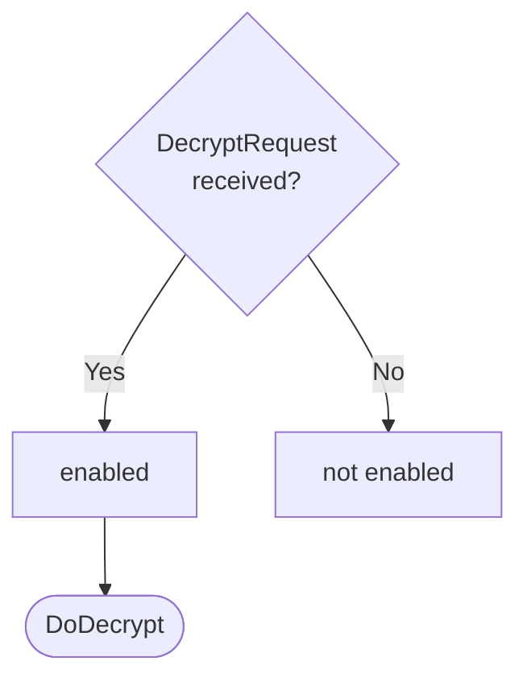

??? quote "Juvix imports"

    ```juvix
    module arch.node.engines.decryption_behaviour;
    import prelude open;
    import arch.node.types.messages open;
    import arch.system.identity.identity open;
    import arch.node.types.engine_behaviour open;
    import arch.node.types.engine_environment open;
    import arch.node.engines.decryption_environment open;
    import arch.node.engines.decryption_messages open;
    import arch.node.types.identities open;
    import arch.node.types.anoma_message open;
    ```

# Decryption Behaviour

## Overview

The behavior of the Decryption Engine define how it processes incoming
decryption requests and produces the corresponding responses.

## Action labels

### `DecryptionActionLabelDoDecrypt DoDecrypt`

```juvix
type DoDecrypt := mkDoDecrypt {
    data : ByteString
}
```

This action label corresponds to decrypting the data in the
given request.

???+ quote "Arguments"

    `data`:
    : The data to decrypt.

???+ quote "`DoDecrypt` action effect"

    This action does the following:

    | Aspect | Description |
    |--------|-------------|
    | State update          | The state remains unchanged. |
    | Messages to be sent   | A `ResponseDecryption` message is sent back to the requester. |
    | Engines to be spawned | No engine is created by this action. |
    | Timer updates         | No timers are set or cancelled. |


### `DecryptionActionLabel`

```juvix
type DecryptionActionLabel :=
  | DecryptionActionLabelDoDecrypt DoDecrypt
  ;
```

## Matchable arguments

### `DecryptionMatchableArgumentReplyTo ReplyTo`

```juvix
type ReplyTo := mkReplyTo {
  whoAsked : Option EngineID;
  mailbox : Option MailboxID;
};
```

???+ quote "Arguments"

    `whoAsked`:
    : The engine ID of the requester.

    `mailbox`:
    : The mailbox ID where the response should be sent.

### DecryptionMatchableArgument

```juvix
type DecryptionMatchableArgument :=
  | DecryptionMatchableArgumentReplyTo ReplyTo
;
```

## Precomputation results

The Decryption Engine does not require any non-trivial pre-computations.

```juvix
syntax alias DecryptionPrecomputation := Unit;
```

## Guards

??? quote "Auxiliary Juvix code"

    Type alias for the guard.

    ```juvix
    DecryptionGuard : Type :=
      Guard
        DecryptionLocalState
        DecryptionMailboxState
        DecryptionTimerHandle
        DecryptionMatchableArgument
        DecryptionActionLabel
        DecryptionPrecomputation;
    ```

    ```juvix
    DecryptionGuardOutput : Type :=
      GuardOutput
        DecryptionMatchableArgument
        DecryptionActionLabel
        DecryptionPrecomputation;
    ```

### `decryptGuard`

<figure markdown>

<figcaption>decryptGuard flowchart</figcaption>
</figure>

<!-- --8<-- [start:decryptGuard] -->
```juvix
decryptGuard
  (t : TimestampedTrigger DecryptionTimerHandle)
  (env : DecryptionEnvironment) : Option DecryptionGuardOutput
  := case getMessageFromTimestampedTrigger t of {
      | some (MsgDecryption (MsgDecryptionRequest request)) := do {
        sender <- getSenderFromTimestampedTrigger t;
        pure (mkGuardOutput@{
                  matchedArgs := [DecryptionMatchableArgumentReplyTo (mkReplyTo (some sender) none)] ;
                  actionLabel := DecryptionActionLabelDoDecrypt (mkDoDecrypt (RequestDecryption.data request));
                  precomputationTasks := unit
                });
        }
      | _ := none
  };
```
<!-- --8<-- [end:decryptGuard] -->

## Action function

??? quote "Auxiliary Juvix code"

    Type alias for the action function.

    ```juvix
    DecryptionActionInput : Type :=
      ActionInput
        DecryptionLocalState
        DecryptionMailboxState
        DecryptionTimerHandle
        DecryptionMatchableArgument
        DecryptionActionLabel
        DecryptionPrecomputation;

    DecryptionActionEffect : Type :=
      ActionEffect
        DecryptionLocalState
        DecryptionMailboxState
        DecryptionTimerHandle
        DecryptionMatchableArgument
        DecryptionActionLabel
        DecryptionPrecomputation;
    ```

### `decryptionAction`

<!-- --8<-- [start:decryptionAction] -->
```juvix
decryptionAction (input : DecryptionActionInput) : DecryptionActionEffect :=
  let env := ActionInput.env input;
      out := ActionInput.guardOutput input;
      localState := EngineEnvironment.localState env;
  in
  case GuardOutput.actionLabel out of {
    | DecryptionActionLabelDoDecrypt (mkDoDecrypt data) :=
      case GuardOutput.matchedArgs out of {
        | DecryptionMatchableArgumentReplyTo (mkReplyTo (some whoAsked) _) :: _ := let
            decryptedData :=
              Decryptor.decrypt (DecryptionLocalState.decryptor localState)
                (DecryptionLocalState.backend localState)
                data;
            responseMsg := case decryptedData of {
              | none := mkResponseDecryption@{
                  data := emptyByteString;
                  err := some "Decryption Failed"
                }
              | some plaintext := mkResponseDecryption@{
                  data := plaintext;
                  err := none
                }
            };
          in mkActionEffect@{
            newEnv := env; -- No state change
            producedMessages := [mkEngineMsg@{
              sender := mkPair none (some (EngineEnvironment.name env));
              target := whoAsked;
              mailbox := some 0;
              msg := MsgDecryption (MsgDecryptionResponse responseMsg)
            }];
            timers := [];
            spawnedEngines := []
          }
        | _ := mkActionEffect@{newEnv := env; producedMessages := []; timers := []; spawnedEngines := []}
      }
  };
```
<!-- --8<-- [end:decryptionAction] -->

## Conflict solver

### `decryptionConflictSolver`

```juvix
decryptionConflictSolver : Set DecryptionMatchableArgument -> List (Set DecryptionMatchableArgument)
  | _ := [];
```

## The Decryption Behavior

### `DecryptionBehaviour`

<!-- --8<-- [start:DecryptionBehaviour] -->
```juvix
DecryptionBehaviour : Type :=
  EngineBehaviour
    DecryptionLocalState
    DecryptionMailboxState
    DecryptionTimerHandle
    DecryptionMatchableArgument
    DecryptionActionLabel
    DecryptionPrecomputation;
```
<!-- --8<-- [end:DecryptionBehaviour] -->

### Instantiation

<!-- --8<-- [start:decryptionBehaviour] -->
```juvix
decryptionBehaviour : DecryptionBehaviour :=
  mkEngineBehaviour@{
    guards := [decryptGuard];
    action := decryptionAction;
    conflictSolver := decryptionConflictSolver;
  };
```
<!-- --8<-- [end:decryptionBehaviour] -->
