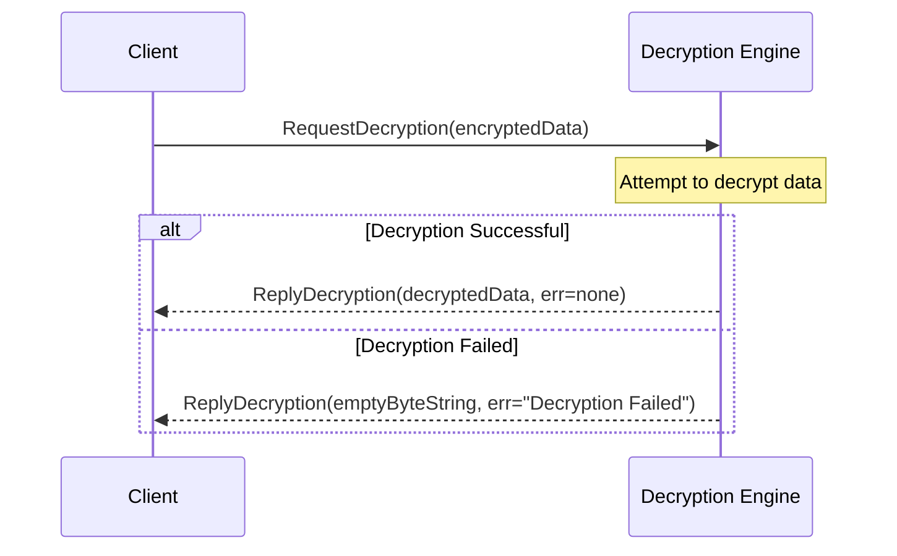

??? code "Juvix imports"

    ```juvix
    module arch.node.engines.decryption_messages;
    import prelude open;
    import arch.node.types.identities open;
    ```

# Decryption Messages

## Message interface

--8<-- "./decryption_messages.juvix.md:DecryptionMsg"

## Message sequence diagrams

---

### Request sequence

<!-- --8<-- [start:message-sequence-diagram] -->
<figure markdown="span">



<figcaption markdown="span">
Sequence diagram for decryption.
</figcaption>
</figure>
<!-- --8<-- [end:message-sequence-diagram] -->

---

## Message types

---

### `RequestDecryption`

```juvix
type RequestDecryption := mkRequestDecryption {
  data : Ciphertext
};
```

A `RequestDecryption` instructs a decryption engine instance to decrypt data.

???+ quote "Arguments"
    `data`:
    : The encrypted ciphertext to decrypt.

---

### `ReplyDecryption`

```juvix
type ReplyDecryption := mkReplyDecryption {
  data : Plaintext;
  err : Option String
};
```

A `ReplyDecryption` contains the data decrypted by a decryption engine instance
in response to a `RequestDecryption`.

???+ quote "Arguments"

    `data`:
    : The decrypted data.

    `err`:
    : An error message if decryption failed.

---

### `DecryptionMsg`

<!-- --8<-- [start:DecryptionMsg] -->
```juvix
type DecryptionMsg :=
  | MsgDecryptionRequest RequestDecryption
  | MsgDecryptionReply ReplyDecryption
  ;
```
<!-- --8<-- [end:DecryptionMsg] -->

---

## Engine components

- [[Decryption Configuration]]
- [[Decryption Environment]]
- [[Decryption Behaviour]]