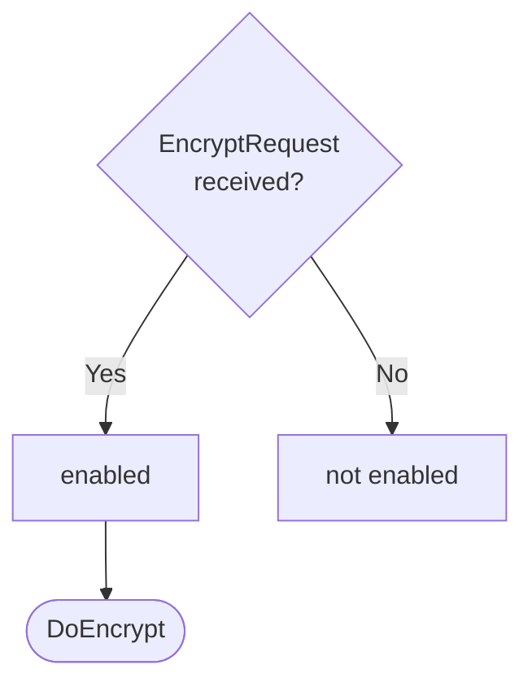

??? quote "Juvix imports"

    ```juvix
    module arch.node.engines.encryption_behaviour;
    import prelude open;
    import arch.system.identity.identity open hiding {ExternalIdentity};
    import arch.node.engines.encryption_environment open;
    import arch.node.engines.encryption_messages open;
    import arch.node.engines.reads_for_messages open;
    import arch.node.types.anoma_message open;
    import arch.node.types.engine_behaviour open;
    import arch.node.types.engine_environment open;
    import arch.node.types.identities open;
    import arch.node.types.messages open;
    ```

# Encryption Behaviour

## Overview

The behavior of the Encryption Engine defines how it processes incoming
encryption requests and produces the corresponding responses.

## Action labels

### `EncryptionActionLabelDoEncrypt DoEncrypt`

```juvix
type DoEncrypt := mkDoEncrypt {
  data : Plaintext;
  externalIdentity : ExternalIdentity;
  useReadsFor : Bool
};
```

This action label corresponds to encrypting the data in the given request.

???+ quote "Arguments"

    `data`:
    : The plaintext data to encrypt.

    `externalIdentity`:
    : The external identity to use for encryption.

    `useReadsFor`:
    : Whether to use ReadsFor evidence.

???+ quote "`DoEncrypt` action effect"

    This action does the following:

    | Aspect | Description |
    |--------|-------------|
    | State update          | If `useReadsFor` is true, the state is updated to store pending requests. Otherwise, the state remains unchanged. |
    | Messages to be sent   | If `useReadsFor` is false, an `ResponseEncrypt` message is sent back to the requester. If `useReadsFor` is true and it's the first request for this identity, a `QueryReadsForEvidenceRequest` is sent to the ReadsFor Engine. |
    | Engines to be spawned | No engines are created by this action. |
    | Timer updates         | No timers are set or cancelled. |

### `EncryptionActionLabelDoHandleReadsForResponse DoHandleReadsForResponse`

```juvix
type DoHandleReadsForResponse := mkDoHandleReadsForResponse {
  externalIdentity : ExternalIdentity;
  readsForEvidence : Set ReadsForEvidence
};
```

This action label corresponds to receiving reads for evidence and using it to address relevant pending requests.

???+ quote "Arguments"

    `externalIdentity`:
    : The external identity associated with the evidence.

    `readsForEvidence`:
    : The set of ReadsFor evidence received.

???+ quote "`DoHandleReadsForResponse` action effect"

    This action does the following:

    | Aspect | Description |
    |--------|-------------|
    | State update          | The state is updated to remove the processed pending requests for the given external identity. |
    | Messages to be sent   | `ResponseEncrypt` messages are sent to all requesters who were waiting for this ReadsFor evidence. |
    | Engines to be spawned | No engines are created by this action. |
    | Timer updates         | No timers are set or cancelled. |

### `EncryptionActionLabel`

```juvix
type EncryptionActionLabel :=
  | EncryptionActionLabelDoEncrypt DoEncrypt
  | EncryptionActionLabelDoHandleReadsForResponse DoHandleReadsForResponse
;
```

## Matchable arguments

### `ReplyTo`

```juvix
type ReplyTo := mkReplyTo {
  whoAsked : Option EngineID;
  mailbox : Option MailboxID
};
```

???+ quote "Arguments"

    `whoAsked`:
    : The engine ID of the requester.

    `mailbox`:
    : The mailbox ID where the response should be sent.

### `EncryptionMatchableArgument`

```juvix
type EncryptionMatchableArgument :=
  | EncryptionMatchableArgumentReplyTo ReplyTo
;
```

## Precomputation results

The Encryption Engine does not require any non-trivial pre-computations.

```juvix
syntax alias EncryptionPrecomputation := Unit;
```

## Guards

??? quote "Auxiliary Juvix code"

    Type alias for the guard.

    ```juvix
    EncryptionGuard : Type :=
      Guard
        EncryptionLocalState
        EncryptionMailboxState
        EncryptionTimerHandle
        EncryptionMatchableArgument
        EncryptionActionLabel
        EncryptionPrecomputation;

    EncryptionGuardOutput : Type :=
      GuardOutput
        EncryptionMatchableArgument
        EncryptionActionLabel
        EncryptionPrecomputation;
    ```

### `encryptGuard`

<figure markdown>

<figcaption>encryptGuard flowchart</figcaption>
</figure>

<!-- --8<-- [start:encryptGuard] -->
```juvix
encryptGuard
  (t : TimestampedTrigger EncryptionTimerHandle)
  (env : EncryptionEnvironment) : Option EncryptionGuardOutput
  := case getMessageFromTimestampedTrigger t of {
      | some (MsgEncryption (MsgEncryptionRequest (mkRequestEncrypt data externalIdentity useReadsFor))) := do {
        sender <- getSenderFromTimestampedTrigger t;
        pure (mkGuardOutput@{
                  matchedArgs := [EncryptionMatchableArgumentReplyTo (mkReplyTo (some sender) none)] ;
                  actionLabel := EncryptionActionLabelDoEncrypt (mkDoEncrypt data externalIdentity useReadsFor);
                  precomputationTasks := unit
                });
        }
      | _ := none
  };
```
<!-- --8<-- [end:encryptGuard] -->

### `readsForResponseGuard`

<!-- --8<-- [start:readsForResponseGuard] -->
```juvix
readsForResponseGuard
  (t : TimestampedTrigger EncryptionTimerHandle)
  (env : EncryptionEnvironment) : Option EncryptionGuardOutput
  := case getMessageFromTimestampedTrigger t of {
      | some (MsgReadsFor (MsgQueryReadsForEvidenceResponse (mkResponseQueryReadsForEvidence externalIdentity evidence err))) :=
          case getSenderFromTimestampedTrigger t of {
            | some sender :=
                case isEqual (Ord.cmp sender (EncryptionLocalState.readsForEngineAddress (EngineEnvironment.localState env))) of {
                  | true := some (mkGuardOutput@{
                      matchedArgs := [];
                      actionLabel := EncryptionActionLabelDoHandleReadsForResponse (mkDoHandleReadsForResponse externalIdentity evidence);
                      precomputationTasks := unit
                    })
                  | false := none
                }
            | none := none
          }
      | _ := none
  };
```
<!-- --8<-- [end:readsForResponseGuard] -->

## Action function

??? quote "Auxiliary Juvix code"

    Type alias for the action function.

    ```juvix
    EncryptionActionInput : Type :=
      ActionInput
        EncryptionLocalState
        EncryptionMailboxState
        EncryptionTimerHandle
        EncryptionMatchableArgument
        EncryptionActionLabel
        EncryptionPrecomputation;

    EncryptionActionEffect : Type :=
      ActionEffect
        EncryptionLocalState
        EncryptionMailboxState
        EncryptionTimerHandle
        EncryptionMatchableArgument
        EncryptionActionLabel
        EncryptionPrecomputation;
    ```

### `encryptResponse` helper

```juvix
encryptResponse
  (externalIdentity : ExternalIdentity)
  (env : EncryptionEnvironment)
  (evidence : Set ReadsForEvidence)
  (req : Pair EngineID Plaintext)
  : EngineMsg
  := let localState := EngineEnvironment.localState env;
      whoAsked := fst req;
      data := snd req;
      encryptedData :=
        Encryptor.encrypt
          (EncryptionLocalState.encryptor localState evidence externalIdentity)
          (EncryptionLocalState.backend localState)
          data;
      responseMsg := mkResponseEncrypt@{
        ciphertext := encryptedData;
        err := none
      };
      envelope := mkEngineMsg@{
        sender := mkPair none (some (EngineEnvironment.name env));
        target := whoAsked;
        mailbox := some 0;
        msg := MsgEncryption (MsgEncryptionResponse responseMsg)
      };
      in envelope;
```

### `encryptionAction`

<!-- --8<-- [start:encryptionAction] -->
```juvix
encryptionAction (input : EncryptionActionInput) : EncryptionActionEffect :=
  let env := ActionInput.env input;
      out := ActionInput.guardOutput input;
      localState := EngineEnvironment.localState env;
  in
  case GuardOutput.actionLabel out of {
    | EncryptionActionLabelDoEncrypt (mkDoEncrypt data externalIdentity' useReadsFor) :=
        case GuardOutput.matchedArgs out of {
          | EncryptionMatchableArgumentReplyTo (mkReplyTo (some whoAsked) _) :: _ :=
              case useReadsFor of {
                | false :=
                    let envelope := encryptResponse externalIdentity' env Set.empty (mkPair whoAsked data)
                    in mkActionEffect@{
                      newEnv := env; -- No state change
                      producedMessages := [envelope];
                      timers := [];
                      spawnedEngines := []
                    }
                | true := 
                    -- Need to request ReadsForEvidence from ReadsFor Engine
                    let existingRequests := Map.lookup externalIdentity' (EncryptionLocalState.pendingRequests localState);
                        newPendingList := case existingRequests of {
                          | some reqs := reqs ++ [mkPair whoAsked data]
                          | none := [mkPair whoAsked data]
                        };
                        newPendingRequests := Map.insert externalIdentity' newPendingList (EncryptionLocalState.pendingRequests localState);
                        newLocalState := localState@EncryptionLocalState{
                          pendingRequests := newPendingRequests
                        };
                        newEnv' := env@EngineEnvironment{
                          localState := newLocalState
                        };
                        -- Only send request to ReadsFor Engine if this is the first pending request for this identity
                        messagesToSend := case existingRequests of {
                          | some _ := [] -- Request already sent, do nothing
                          | none := let requestMsg := mkRequestQueryReadsForEvidence@{
                                          externalIdentity := externalIdentity'
                                        };
                                        envelope := mkEngineMsg@{
                                          sender := mkPair none (some (EngineEnvironment.name env));
                                          target := EncryptionLocalState.readsForEngineAddress localState;
                                          mailbox := some 0;
                                          msg := MsgReadsFor (MsgQueryReadsForEvidenceRequest requestMsg)
                                        };
                                        in [envelope]
                        };
                    in mkActionEffect@{
                      newEnv := newEnv';
                      producedMessages := messagesToSend;
                      timers := [];
                      spawnedEngines := []
                    }
              }
          | _ := mkActionEffect@{newEnv := env; producedMessages := []; timers := []; spawnedEngines := []}
      }
    | EncryptionActionLabelDoHandleReadsForResponse (mkDoHandleReadsForResponse externalIdentity evidence) :=
        -- Retrieve pending requests
        case Map.lookup externalIdentity (EncryptionLocalState.pendingRequests localState) of {
          | some reqs :=
              let messages := map (encryptResponse externalIdentity env evidence) reqs;
                  newPendingRequests := Map.delete externalIdentity (EncryptionLocalState.pendingRequests localState);
                  newLocalState := localState@EncryptionLocalState{
                    pendingRequests := newPendingRequests
                  };
                  newEnv' := env@EngineEnvironment{
                    localState := newLocalState
                  };
              in mkActionEffect@{
                newEnv := newEnv';
                producedMessages := messages;
                timers := [];
                spawnedEngines := []
              }
          | none :=
              -- No pending requests, do none
              mkActionEffect@{
                newEnv := env;
                producedMessages := [];
                timers := [];
                spawnedEngines := []
              }
        }
  };
```
<!-- --8<-- [end:encryptionAction] -->

## Conflict solver

### `encryptionConflictSolver`

```juvix
encryptionConflictSolver : Set EncryptionMatchableArgument -> List (Set EncryptionMatchableArgument)
  | _ := [];
```

## The Encryption Behaviour

### `EncryptionBehaviour`

<!-- --8<-- [start:EncryptionBehaviour] -->
```juvix
EncryptionBehaviour : Type :=
  EngineBehaviour
    EncryptionLocalState
    EncryptionMailboxState
    EncryptionTimerHandle
    EncryptionMatchableArgument
    EncryptionActionLabel
    EncryptionPrecomputation;
```
<!-- --8<-- [end:EncryptionBehaviour] -->

### Instantiation


<!-- --8<-- [start:encryptionBehaviour] -->
```juvix
encryptionBehaviour : EncryptionBehaviour :=
  mkEngineBehaviour@{
    guards := [encryptGuard; readsForResponseGuard];
    action := encryptionAction;
    conflictSolver := encryptionConflictSolver;
  };
```
<!-- --8<-- [end:encryptionBehaviour] -->
