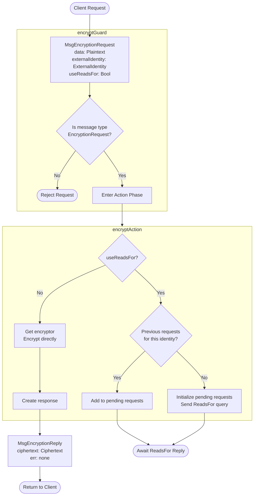
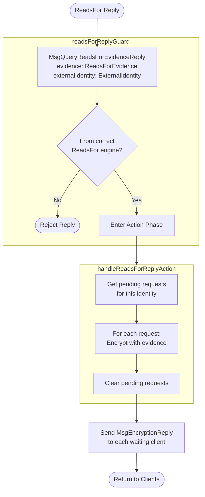

??? code "Juvix imports"

    ```juvix
    module arch.node.engines.encryption_behaviour;

    import prelude open;
    import arch.system.identity.identity open hiding {ExternalIdentity};
    import arch.node.engines.encryption_environment open;
    import arch.node.engines.encryption_messages open;
    import arch.node.engines.encryption_config open;
    import arch.node.engines.reads_for_messages open;
    import arch.node.types.anoma as Anoma open;
    import arch.node.types.engine open;
    import arch.node.types.identities open;
    import arch.node.types.messages open;
    ```

---

# Encryption Behaviour

## Overview

The behavior of the Encryption Engine defines how it processes incoming
encryption requests and produces the corresponding responses.

## Encryption Action Flowcharts

### `encryptAction` flowchart

<figure markdown>



<figcaption markdown="span">
`encryptAction` flowchart
</figcaption>
</figure>

#### Explanation

1. **Initial Request**
   - A client sends a `MsgEncryptionRequest` containing:
     - `data`: The plaintext that needs to be encrypted
     - `externalIdentity`: The target identity to encrypt for
     - `useReadsFor`: Boolean flag indicating whether to use reads-for relationships

2. **Guard Phase** (`encryptGuard`)
   - Validates that the incoming message is a proper encryption request
   - Checks occur in the following order:
     - Verifies message type is `MsgEncryptionRequest`
     - If validation fails, request is rejected without entering the action phase
     - On success, passes control to `encryptActionLabel`

3. **Action Phase** (`encryptAction`)
   - First decision point: Check `useReadsFor` flag

   - **Direct Path** (`useReadsFor: false`):
     - Gets encryptor from engine's configuration
     - Encrypts data directly for the target identity using empty evidence set
     - Creates `MsgEncryptionReply` with:
       - `ciphertext`: The encrypted data
       - `err`: None
     - Returns response immediately to client

   - **ReadsFor Path** (`useReadsFor: true`):
     - Checks if there are existing pending requests for this identity
     - If this is the first request:
       - Initializes a new pending request list
       - Adds current request to the list
       - Sends `MsgQueryReadsForEvidenceRequest` to ReadsFor engine
       - Awaits reply
     - If there are existing pending requests:
       - Adds current request to existing pending list
       - Awaits existing query's reply
     - No immediate response is sent to client

4. **State Changes**
   - Direct Path: No state changes
   - ReadsFor Path: Updates `pendingRequests` map in local state
     - Key: `externalIdentity`
     - Value: List of pending requests (pairs of requester ID and plaintext)

5. **Messages Generated**
   - Direct Path:
     - `MsgEncryptionReply` sent back to requester
     - Sends to mailbox 0 (the default)
   - ReadsFor Path:
     - If first request: `MsgQueryReadsForEvidenceRequest` sent to ReadsFor engine
     - No immediate response to requester

### `handleReadsForReplyAction` flowchart

<figure markdown>



<figcaption markdown="span">
`handleReadsForReplyAction` flowchart
</figcaption>
</figure>

#### Explanation

1. **Initial Input**
   - The ReadsFor Engine sends a `MsgQueryReadsForEvidenceReply` containing:
     - `evidence`: The ReadsFor evidence for the requested identity
     - `externalIdentity`: The identity the evidence relates to
     - `err`: Optional error message if evidence retrieval failed

2. **Guard Phase** (`readsForReplyGuard`)
   - Validates incoming message in following order:
     - Checks message type is `MsgQueryReadsForEvidenceReply`
     - Verifies the message sender matches the configured ReadsFor engine address
     - If either check fails, request is rejected without entering action phase
     - On success, passes control to `handleReadsForReplyActionLabel`

3. **Action Phase** (`handleReadsForReplyAction`)
   - Processing occurs in these steps:
     - Retrieves all pending encryption requests for the specified identity from state
     - For each pending request:
       - Gets encryptor from configuration
       - Applies ReadsFor evidence to encryptor
       - Encrypts the pending plaintext data
       - Creates response message with encrypted result
     - Clears all processed requests from the pending queue
     - Sends responses to all waiting clients

4. **Response Generation**
   - For each pending request, creates `MsgEncryptionReply` with:
     - `ciphertext`: The encrypted data using the provided evidence
     - `err`: None for successful encryption

5. **Response Delivery**
   - Each response is sent back to its original requester
   - Uses mailbox  0 (the default) for all responses

!!! warning "Important Notes"

    - All pending requests for an identity are processed in a single batch when evidence arrives
    - The same evidence is used for all pending requests for that identity
    - If no pending requests exist for the identity when evidence arrives, the evidence is discarded

## Action arguments

### `ReplyTo`

```juvix
type ReplyTo := mkReplyTo@{
  whoAsked : Option EngineID;
  mailbox : Option MailboxID
};
```

This action argument contains the address and mailbox ID of where the
response message should be sent.

???+ code "Arguments"

    `whoAsked`:
    : is the address of the engine that sent the message.

    `mailbox`:
    : is the mailbox ID where the response message should be sent.

### `EncryptionActionArgument`

<!-- --8<-- [start:EncryptionActionArgument] -->
```juvix
type EncryptionActionArgument :=
  | EncryptionActionArgumentReplyTo ReplyTo
  ;
```
<!-- --8<-- [end:EncryptionActionArgument] -->

### `EncryptionActionArguments`

<!-- --8<-- [start:encryption-action-arguments] -->
```juvix
EncryptionActionArguments : Type := List EncryptionActionArgument;
```
<!-- --8<-- [end:encryption-action-arguments] -->

## Actions

??? code "Auxiliary Juvix code"


    ### `EncryptionAction`

    ```juvix
    EncryptionAction : Type :=
      Action
        EncryptionCfg
        EncryptionLocalState
        EncryptionMailboxState
        EncryptionTimerHandle
        EncryptionActionArguments
        Anoma.Msg
        Anoma.Cfg
        Anoma.Env;
    ```


    ### `EncryptionActionInput`

    ```juvix
    EncryptionActionInput : Type :=
      ActionInput
        EncryptionCfg
        EncryptionLocalState
        EncryptionMailboxState
        EncryptionTimerHandle
        EncryptionActionArguments
        Anoma.Msg;
    ```


    ### `EncryptionActionEffect`

    ```juvix
    EncryptionActionEffect : Type :=
      ActionEffect
        EncryptionLocalState
        EncryptionMailboxState
        EncryptionTimerHandle
        Anoma.Msg
        Anoma.Cfg
        Anoma.Env;
    ```


    ### `EncryptionActionExec`

    ```juvix
    EncryptionActionExec : Type :=
      ActionExec
        EncryptionCfg
        EncryptionLocalState
        EncryptionMailboxState
        EncryptionTimerHandle
        EncryptionActionArguments
        Anoma.Msg
        Anoma.Cfg
        Anoma.Env;
    ```

### `encryptAction`

Process an encryption request.

State update
: If `useReadsFor` is true, the state is updated to store pending requests.
Otherwise, the state remains unchanged.

Messages to be sent
: If `useReadsFor` is false, a `ReplyEncrypt` message is sent back to
the requester. If `useReadsFor` is true and it's the first request for
this identity, a `QueryReadsForEvidenceRequest` is sent to the ReadsFor
Engine.

Engines to be spawned
: No engines are created by this action.

Timer updates
: No timers are set or cancelled.

```juvix
encryptAction
  (input : EncryptionActionInput)
  : Option EncryptionActionEffect :=
  let
    env := ActionInput.env input;
    cfg := ActionInput.cfg input;
    tt := ActionInput.trigger input;
    localState := EngineEnv.localState env;
  in
    case getEngineMsgFromTimestampedTrigger tt of {
    | some emsg :=
      case EngineMsg.msg emsg of {
      | Anoma.PreMsg.MsgEncryption (EncryptionMsg.Request (RequestEncrypt.mkRequestEncrypt data externalIdentity useReadsFor)) :=
        case useReadsFor of {
        | false :=
          some ActionEffect.mk@{
            env := env;
            msgs := [
              EngineMsg.mk@{
                sender := getEngineIDFromEngineCfg cfg;
                target := EngineMsg.sender emsg;
                mailbox := some 0;
                msg := Anoma.PreMsg.MsgEncryption (EncryptionMsg.Reply (
                  ReplyEncrypt.mkReplyEncrypt@{
                    ciphertext := Encryptor.encrypt
                      (EncryptionCfg.encryptor (EngineCfg.cfg cfg) Set.empty externalIdentity)
                      (EncryptionCfg.backend (EngineCfg.cfg cfg))
                      data;
                    err := none
                  }))
              }
            ];
            timers := [];
            engines := []
          }
        | true :=
          let existingRequests := Map.lookup externalIdentity (EncryptionLocalState.pendingRequests localState);
              newPendingList := case existingRequests of {
                | some reqs := reqs ++ [mkPair (EngineMsg.sender emsg) data]
                | none := [mkPair (EngineMsg.sender emsg) data]
              };
              newLocalState := localState@EncryptionLocalState{
                pendingRequests := Map.insert externalIdentity newPendingList (EncryptionLocalState.pendingRequests localState)
              };
          in some ActionEffect.mk@{
              env := env@EngineEnv{
                localState := newLocalState
              };
              msgs := case existingRequests of {
                | some _ := []
                | none := [
                    EngineMsg.mk@{
                      sender := getEngineIDFromEngineCfg cfg;
                      target := EncryptionCfg.readsForEngineAddress (EngineCfg.cfg cfg);
                      mailbox := some 0;
                      msg := Anoma.PreMsg.MsgReadsFor (ReadsForMsg.QueryReadsForEvidenceRequest (
                        RequestQueryReadsForEvidence.mkRequestQueryReadsForEvidence@{
                          externalIdentity := externalIdentity
                        }))
                    }
                  ]
              };
              timers := [];
              engines := []
            }
        }
      | _ := none
      }
    | _ := none
    };
```

### `handleReadsForReplyAction`

Process `reads-for` evidence response.

State update
: The state is updated to remove processed pending requests.

Messages to be sent
: `ReplyEncrypt` messages are sent to all requesters who were waiting
for this ReadsFor evidence.

Engines to be spawned
: No engines are created by this action.

Timer updates
: No timers are set or cancelled.

```juvix
handleReadsForReplyAction
  (input : EncryptionActionInput)
  : Option EncryptionActionEffect :=
  let
    env := ActionInput.env input;
    cfg := ActionInput.cfg input;
    tt := ActionInput.trigger input;
    localState := EngineEnv.localState env;
  in
    case getEngineMsgFromTimestampedTrigger tt of {
    | some emsg :=
      case EngineMsg.msg emsg of {
      | Anoma.PreMsg.MsgReadsFor (ReadsForMsg.QueryReadsForEvidenceReply (ReplyQueryReadsForEvidence.mkReplyQueryReadsForEvidence externalIdentity evidence err)) :=
        case Map.lookup externalIdentity (EncryptionLocalState.pendingRequests localState) of {
        | some reqs :=
          let newLocalState := localState@EncryptionLocalState{
                pendingRequests := Map.delete externalIdentity (EncryptionLocalState.pendingRequests localState)
              };
          in some ActionEffect.mk@{
              env := env@EngineEnv{
                localState := newLocalState
              };
              msgs := map
                (\{req := let whoAsked := fst req;
                            data := snd req;
                         in EngineMsg.mk@{
                              sender := getEngineIDFromEngineCfg cfg;
                              target := whoAsked;
                              mailbox := some 0;
                              msg := Anoma.PreMsg.MsgEncryption (EncryptionMsg.Reply (
                                ReplyEncrypt.mkReplyEncrypt@{
                                  ciphertext := Encryptor.encrypt
                                    (EncryptionCfg.encryptor (EngineCfg.cfg cfg) evidence externalIdentity)
                                    (EncryptionCfg.backend (EngineCfg.cfg cfg))
                                    data;
                                  err := none
                                }))
                            }})
                reqs;
              timers := [];
              engines := []
            }
        | none := none
        }
      | _ := none
      }
    | _ := none
    };
```

## Action Labels

### `encryptActionLabel`

```juvix
encryptActionLabel : EncryptionActionExec := ActionExec.Seq [ encryptAction ];
```

### `handleReadsForReplyActionLabel`

```juvix
handleReadsForReplyActionLabel : EncryptionActionExec := ActionExec.Seq [ handleReadsForReplyAction ];
```

## Guards

??? code "Auxiliary Juvix code"


    ### `EncryptionGuard`

    <!-- --8<-- [start:EncryptionGuard] -->
    ```juvix
    EncryptionGuard : Type :=
      Guard
        EncryptionCfg
        EncryptionLocalState
        EncryptionMailboxState
        EncryptionTimerHandle
        EncryptionActionArguments
        Anoma.Msg
        Anoma.Cfg
        Anoma.Env;
    ```
    <!-- --8<-- [end:EncryptionGuard] -->


    ### `EncryptionGuardOutput`

    <!-- --8<-- [start:EncryptionGuardOutput] -->
    ```juvix
    EncryptionGuardOutput : Type :=
      GuardOutput
        EncryptionCfg
        EncryptionLocalState
        EncryptionMailboxState
        EncryptionTimerHandle
        EncryptionActionArguments
        Anoma.Msg
        Anoma.Cfg
        Anoma.Env;
    ```
    <!-- --8<-- [end:EncryptionGuardOutput] -->

### `encryptGuard`

Condition
: Message type is `MsgEncryptionRequest`.

<!-- --8<-- [start:encryptGuard] -->
```juvix
encryptGuard
  (tt : TimestampedTrigger EncryptionTimerHandle Anoma.Msg)
  (cfg : EngineCfg EncryptionCfg)
  (env : EncryptionEnv)
  : Option EncryptionGuardOutput :=
  case getEngineMsgFromTimestampedTrigger tt of {
  | some EngineMsg.mk@{
      msg := Anoma.PreMsg.MsgEncryption (EncryptionMsg.Request _);
    } :=
    some GuardOutput.mk@{
      action := encryptActionLabel;
      args := []
    }
  | _ := none
  };
```
<!-- --8<-- [end:encryptGuard] -->

### `readsForReplyGuard`

<!-- --8<-- [start:readsForReplyGuard] -->
```juvix
readsForReplyGuard
  (tt : TimestampedTrigger EncryptionTimerHandle Anoma.Msg)
  (cfg : EngineCfg EncryptionCfg)
  (env : EncryptionEnv)
  : Option EncryptionGuardOutput :=
  case getEngineMsgFromTimestampedTrigger tt of {
  | some emsg :=
    case EngineMsg.msg emsg of {
    | Anoma.PreMsg.MsgReadsFor (ReadsForMsg.QueryReadsForEvidenceReply _) :=
      case isEqual (Ord.compare (EngineMsg.sender emsg) (EncryptionCfg.readsForEngineAddress (EngineCfg.cfg cfg))) of {
      | true := some GuardOutput.mk@{
          action := handleReadsForReplyActionLabel;
          args := []
        }
      | false := none
      }
    | _ := none
    }
  | _ := none
  };
```
<!-- --8<-- [end:readsForReplyGuard] -->

## The Encryption Behaviour

### `EncryptionBehaviour`

<!-- --8<-- [start:EncryptionBehaviour] -->
```juvix
EncryptionBehaviour : Type :=
  EngineBehaviour
    EncryptionCfg
    EncryptionLocalState
    EncryptionMailboxState
    EncryptionTimerHandle
    EncryptionActionArguments
    Anoma.Msg
    Anoma.Cfg
    Anoma.Env;
```
<!-- --8<-- [end:EncryptionBehaviour] -->

### Instantiation

<!-- --8<-- [start:encryptionBehaviour] -->
```juvix
encryptionBehaviour : EncryptionBehaviour :=
  EngineBehaviour.mk@{
    guards :=
      GuardEval.First [
        encryptGuard;
        readsForReplyGuard
      ];
  };
```
<!-- --8<-- [end:encryptionBehaviour] -->
