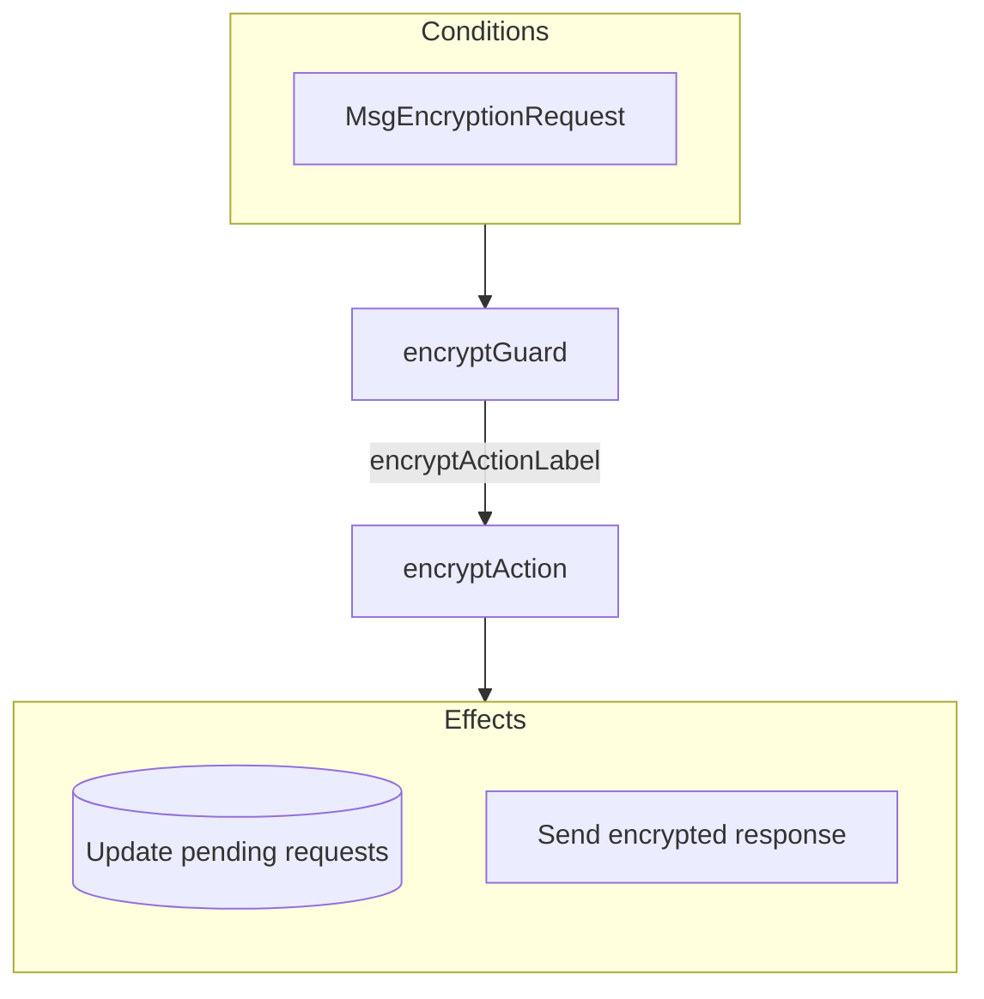
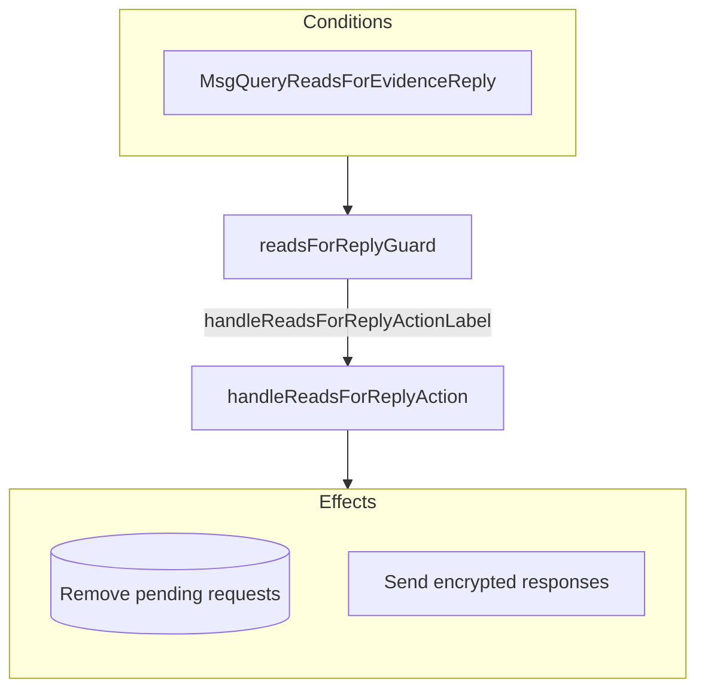

??? quote "Juvix imports"

    ```juvix
    module arch.node.engines.encryption_behaviour;

    import prelude open;
    import arch.system.identity.identity open hiding {ExternalIdentity};
    import arch.node.engines.encryption_environment open;
    import arch.node.engines.encryption_messages open;
    import arch.node.engines.encryption_config open;
    import arch.node.engines.reads_for_messages open;
    import arch.node.types.anoma as Anoma open;
    import arch.node.types.engine open;
    import arch.node.types.identities open;
    import arch.node.types.messages open;
    ```

# Encryption Behaviour

## Overview

The behavior of the Encryption Engine defines how it processes incoming
encryption requests and produces the corresponding responses.

## Action arguments

### `EncryptionActionArgumentReplyTo ReplyTo`

```juvix
type ReplyTo := mkReplyTo {
  whoAsked : Option EngineID;
  mailbox : Option MailboxID
};
```

This action argument contains the address and mailbox ID of where the
response message should be sent.

`whoAsked`:
: is the address of the engine that sent the message.

`mailbox`:
: is the mailbox ID where the response message should be sent.

### `EncryptionActionArgument`

<!-- --8<-- [start:EncryptionActionArgument] -->
```juvix
type EncryptionActionArgument :=
  | EncryptionActionArgumentReplyTo ReplyTo
  ;
```
<!-- --8<-- [end:EncryptionActionArgument] -->

### `EncryptionActionArguments`

<!-- --8<-- [start:encryption-action-arguments] -->
```juvix
EncryptionActionArguments : Type := List EncryptionActionArgument;
```
<!-- --8<-- [end:encryption-action-arguments] -->

## Actions

??? quote "Auxiliary Juvix code"

    ### `EncryptionAction`

    ```juvix
    EncryptionAction : Type :=
      Action
        EncryptionCfg
        EncryptionLocalState
        EncryptionMailboxState
        EncryptionTimerHandle
        EncryptionActionArguments
        Anoma.Msg
        Anoma.Cfg
        Anoma.Env;
    ```

    ### `EncryptionActionInput`

    ```juvix
    EncryptionActionInput : Type :=
      ActionInput
        EncryptionCfg
        EncryptionLocalState
        EncryptionMailboxState
        EncryptionTimerHandle
        EncryptionActionArguments
        Anoma.Msg;
    ```

    ### `EncryptionActionEffect`

    ```juvix
    EncryptionActionEffect : Type :=
      ActionEffect
        EncryptionLocalState
        EncryptionMailboxState
        EncryptionTimerHandle
        Anoma.Msg
        Anoma.Cfg
        Anoma.Env;
    ```

    ### `EncryptionActionExec`

    ```juvix
    EncryptionActionExec : Type :=
      ActionExec
        EncryptionCfg
        EncryptionLocalState
        EncryptionMailboxState
        EncryptionTimerHandle
        EncryptionActionArguments
        Anoma.Msg
        Anoma.Cfg
        Anoma.Env;
    ```

### `encryptAction`

Process an encryption request.

State update
: If `useReadsFor` is true, the state is updated to store pending requests.
Otherwise, the state remains unchanged.

Messages to be sent
: If `useReadsFor` is false, a `ReplyEncrypt` message is sent back to
the requester. If `useReadsFor` is true and it's the first request for
this identity, a `QueryReadsForEvidenceRequest` is sent to the ReadsFor
Engine.

Engines to be spawned
: No engines are created by this action.

Timer updates
: No timers are set or cancelled.

```juvix
encryptAction
  (input : EncryptionActionInput)
  : Option EncryptionActionEffect :=
  let
    env := ActionInput.env input;
    cfg := ActionInput.cfg input;
    tt := ActionInput.trigger input;
    localState := EngineEnv.localState env;
  in
    case getEngineMsgFromTimestampedTrigger tt of {
    | some emsg :=
      case EngineMsg.msg emsg of {
      | Anoma.MsgEncryption (MsgEncryptionRequest (mkRequestEncrypt data externalIdentity useReadsFor)) :=
        case useReadsFor of {
        | false :=
          some mkActionEffect@{
            env := env;
            msgs := [
              mkEngineMsg@{
                sender := getEngineIDFromEngineCfg cfg;
                target := EngineMsg.sender emsg;
                mailbox := some 0;
                msg := Anoma.MsgEncryption (MsgEncryptionReply (
                  mkReplyEncrypt@{
                    ciphertext := Encryptor.encrypt
                      (EncryptionCfg.encryptor (EngineCfg.cfg cfg) Set.empty externalIdentity)
                      (EncryptionCfg.backend (EngineCfg.cfg cfg))
                      data;
                    err := none
                  }))
              }
            ];
            timers := [];
            engines := []
          }
        | true :=
          let existingRequests := Map.lookup externalIdentity (EncryptionLocalState.pendingRequests localState);
              newPendingList := case existingRequests of {
                | some reqs := reqs ++ [mkPair (EngineMsg.sender emsg) data]
                | none := [mkPair (EngineMsg.sender emsg) data]
              };
              newLocalState := localState@EncryptionLocalState{
                pendingRequests := Map.insert externalIdentity newPendingList (EncryptionLocalState.pendingRequests localState)
              };
          in some mkActionEffect@{
              env := env@EngineEnv{
                localState := newLocalState
              };
              msgs := case existingRequests of {
                | some _ := []
                | none := [
                    mkEngineMsg@{
                      sender := getEngineIDFromEngineCfg cfg;
                      target := EncryptionCfg.readsForEngineAddress (EngineCfg.cfg cfg);
                      mailbox := some 0;
                      msg := Anoma.MsgReadsFor (MsgQueryReadsForEvidenceRequest (
                        mkRequestQueryReadsForEvidence@{
                          externalIdentity := externalIdentity
                        }))
                    }
                  ]
              };
              timers := [];
              engines := []
            }
        }
      | _ := none
      }
    | _ := none
    };
```

### `handleReadsForReplyAction`

Process reads-for evidence response.

State update
: The state is updated to remove processed pending requests.

Messages to be sent
: `ReplyEncrypt` messages are sent to all requesters who were waiting
for this ReadsFor evidence.

Engines to be spawned
: No engines are created by this action.

Timer updates
: No timers are set or cancelled.

```juvix
handleReadsForReplyAction
  (input : EncryptionActionInput)
  : Option EncryptionActionEffect :=
  let
    env := ActionInput.env input;
    cfg := ActionInput.cfg input;
    tt := ActionInput.trigger input;
    localState := EngineEnv.localState env;
  in
    case getEngineMsgFromTimestampedTrigger tt of {
    | some emsg :=
      case EngineMsg.msg emsg of {
      | Anoma.MsgReadsFor (MsgQueryReadsForEvidenceReply (mkReplyQueryReadsForEvidence externalIdentity evidence err)) :=
        case Map.lookup externalIdentity (EncryptionLocalState.pendingRequests localState) of {
        | some reqs :=
          let newLocalState := localState@EncryptionLocalState{
                pendingRequests := Map.delete externalIdentity (EncryptionLocalState.pendingRequests localState)
              };
          in some mkActionEffect@{
              env := env@EngineEnv{
                localState := newLocalState
              };
              msgs := map
                (\{req := let whoAsked := fst req;
                            data := snd req;
                         in mkEngineMsg@{
                              sender := getEngineIDFromEngineCfg cfg;
                              target := whoAsked;
                              mailbox := some 0;
                              msg := Anoma.MsgEncryption (MsgEncryptionReply (
                                mkReplyEncrypt@{
                                  ciphertext := Encryptor.encrypt
                                    (EncryptionCfg.encryptor (EngineCfg.cfg cfg) evidence externalIdentity)
                                    (EncryptionCfg.backend (EngineCfg.cfg cfg))
                                    data;
                                  err := none
                                }))
                            }})
                reqs;
              timers := [];
              engines := []
            }
        | none := none
        }
      | _ := none
      }
    | _ := none
    };
```

## Action Labels

### `encryptActionLabel`

```juvix
encryptActionLabel : EncryptionActionExec := Seq [ encryptAction ];
```

### `handleReadsForReplyActionLabel`

```juvix
handleReadsForReplyActionLabel : EncryptionActionExec := Seq [ handleReadsForReplyAction ];
```

## Guards

??? quote "Auxiliary Juvix code"

    ### `EncryptionGuard`

    <!-- --8<-- [start:EncryptionGuard] -->
    ```juvix
    EncryptionGuard : Type :=
      Guard
        EncryptionCfg
        EncryptionLocalState
        EncryptionMailboxState
        EncryptionTimerHandle
        EncryptionActionArguments
        Anoma.Msg
        Anoma.Cfg
        Anoma.Env;
    ```
    <!-- --8<-- [end:EncryptionGuard] -->

    ### `EncryptionGuardOutput`

    <!-- --8<-- [start:EncryptionGuardOutput] -->
    ```juvix
    EncryptionGuardOutput : Type :=
      GuardOutput
        EncryptionCfg
        EncryptionLocalState
        EncryptionMailboxState
        EncryptionTimerHandle
        EncryptionActionArguments
        Anoma.Msg
        Anoma.Cfg
        Anoma.Env;
    ```
    <!-- --8<-- [end:EncryptionGuardOutput] -->

### `encryptGuard`

Condition
: Message type is `MsgEncryptionRequest`.

<!-- --8<-- [start:encryptGuard] -->
```juvix
encryptGuard
  (tt : TimestampedTrigger EncryptionTimerHandle Anoma.Msg)
  (cfg : EngineCfg EncryptionCfg)
  (env : EncryptionEnv)
  : Option EncryptionGuardOutput :=
  case getEngineMsgFromTimestampedTrigger tt of {
  | some mkEngineMsg@{
      msg := Anoma.MsgEncryption (MsgEncryptionRequest _);
    } :=
    some mkGuardOutput@{
      action := encryptActionLabel;
      args := []
    }
  | _ := none
  };
```
<!-- --8<-- [end:encryptGuard] -->

### `readsForReplyGuard`

<!-- --8<-- [start:readsForReplyGuard] -->
```juvix
readsForReplyGuard
  (tt : TimestampedTrigger EncryptionTimerHandle Anoma.Msg)
  (cfg : EngineCfg EncryptionCfg)
  (env : EncryptionEnv)
  : Option EncryptionGuardOutput :=
  case getEngineMsgFromTimestampedTrigger tt of {
  | some emsg :=
    case EngineMsg.msg emsg of {
    | Anoma.MsgReadsFor (MsgQueryReadsForEvidenceReply _) :=
      case isEqual (Ord.cmp (EngineMsg.sender emsg) (EncryptionCfg.readsForEngineAddress (EngineCfg.cfg cfg))) of {
      | true := some mkGuardOutput@{
          action := handleReadsForReplyActionLabel;
          args := []
        }
      | false := none
      }
    | _ := none
    }
  | _ := none
  };
```
<!-- --8<-- [end:readsForReplyGuard] -->

## The Encryption Behaviour

### `EncryptionBehaviour`

<!-- --8<-- [start:EncryptionBehaviour] -->
```juvix
EncryptionBehaviour : Type :=
  EngineBehaviour
    EncryptionCfg
    EncryptionLocalState
    EncryptionMailboxState
    EncryptionTimerHandle
    EncryptionActionArguments
    Anoma.Msg
    Anoma.Cfg
    Anoma.Env;
```
<!-- --8<-- [end:EncryptionBehaviour] -->

### Instantiation

<!-- --8<-- [start:encryptionBehaviour] -->
```juvix
encryptionBehaviour : EncryptionBehaviour :=
  mkEngineBehaviour@{
    guards :=
      First [
        encryptGuard;
        readsForReplyGuard
      ];
  };
```
<!-- --8<-- [end:encryptionBehaviour] -->

## Encryption Action Flowcharts

### `encryptAction` flowchart

<figure markdown>



<figcaption markdown="span">
`encryptAction` flowchart
</figcaption>
</figure>

### `handleReadsForReplyAction` flowchart

<figure markdown>



<figcaption markdown="span">
`handleReadsForReplyAction` flowchart
</figcaption>
</figure>
