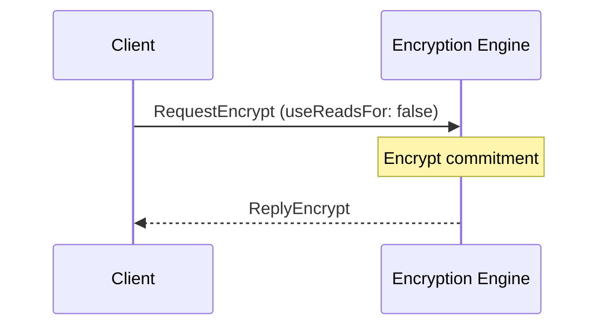
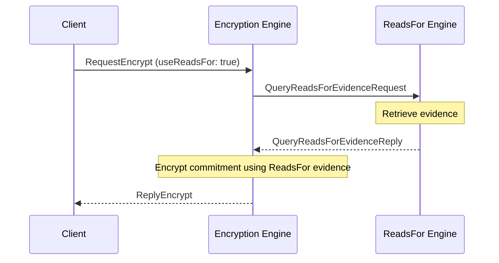

??? code "Juvix imports"

    ```juvix
    module arch.node.engines.encryption_messages;
    import prelude open;
    import arch.node.types.identities open;
    ```

# Encryption Messages

## Message interface

--8<-- "./encryption_messages.juvix.md:EncryptionMsg"

## Message sequence diagrams

### Encryption sequence (without `ReadsFor` evidence)

<!-- --8<-- [start:message-sequence-diagram-no-reads-for] -->
<figure markdown="span">



<figcaption markdown="span">
Sequence diagram for encryption (no reads for).
</figcaption>
</figure>
<!-- --8<-- [end:message-sequence-diagram-no-reads-for] -->

### Encryption sequence (with `ReadsFor` evidence)

<!-- --8<-- [start:message-sequence-diagram-reads-for] -->
<figure markdown="span">



<figcaption markdown="span">
Sequence diagram for encryption (with `reads_for` evidence).
</figcaption>
</figure>
<!-- --8<-- [end:message-sequence-diagram-reads-for] -->

## Message types

### `RequestEncrypt`

```juvix
type RequestEncrypt := mkRequestEncrypt {
  data : Plaintext;
  externalIdentity : ExternalIdentity;
  useReadsFor : Bool
};
```

A `RequestEncrypt` instructs the Encryption Engine to encrypt data to a
particular external identity, possibly using known `reads_for` relationships.

???+ code "Arguments"

    `data`:
    : The data to encrypt.

    `externalIdentity`:
    : The external identity requesting encryption.

    `useReadsFor`:
    : Whether to use known `reads_for` relationships or not.

### `ReplyEncrypt`

```juvix
type ReplyEncrypt := mkReplyEncrypt {
  ciphertext : Ciphertext;
  err : Option String
};
```

A `ReplyEncrypt` contains the data encrypted by the Encryption Engine in
response to a `RequestEncrypt`.

???+ code "Arguments"

    `ciphertext`:
    : The encrypted data.

    `err`:
    : An error message if encryption failed.

### `EncryptionMsg`

<!-- --8<-- [start:EncryptionMsg] -->
```juvix
type EncryptionMsg :=
  | MsgEncryptionRequest RequestEncrypt
  | MsgEncryptionReply ReplyEncrypt
  ;
```
<!-- --8<-- [end:EncryptionMsg] -->

## Engine components

- [[Encryption Configuration]]
- [[Encryption Environment]]
- [[Encryption Behaviour]]