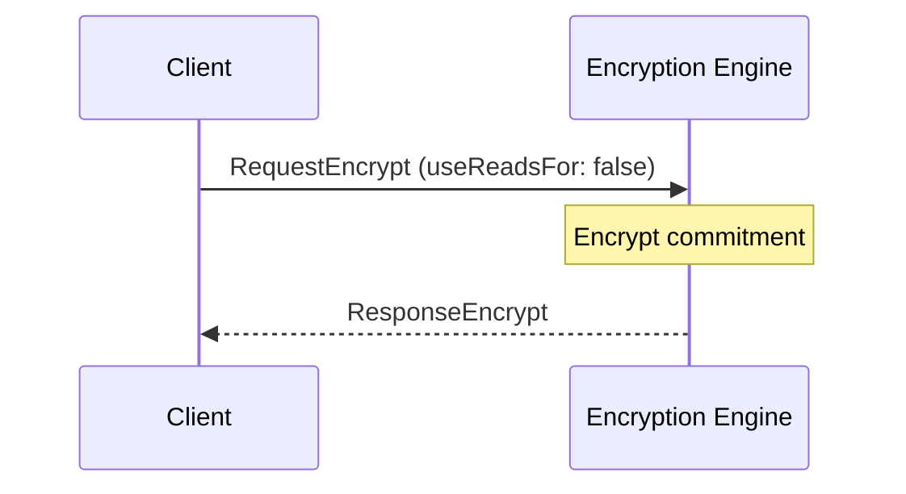
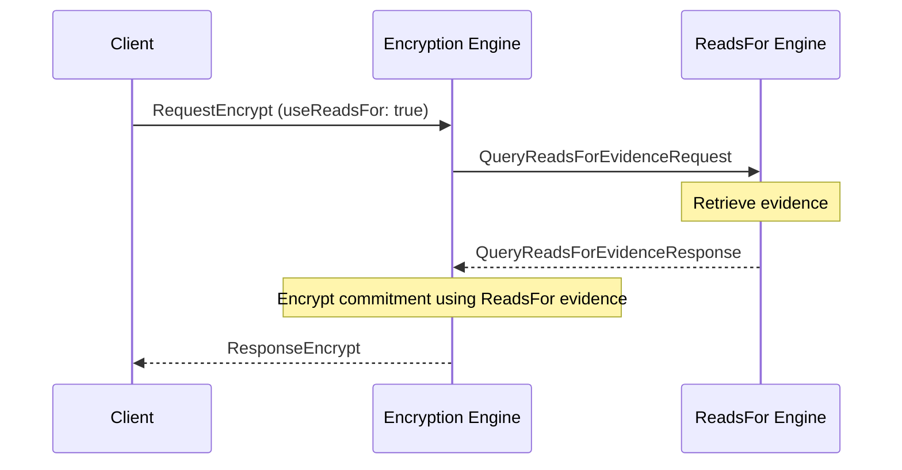

??? quote "Juvix imports"

    ```juvix
    module arch.node.engines.encryption_messages;
    import prelude open;
    import arch.node.types.identities open;
    ```

# Encryption Messages

## Message interface

### `MsgEncryptionRequest RequestEncrypt`

```juvix
type RequestEncrypt := mkRequestEncrypt {
  data : Plaintext;
  externalIdentity : ExternalIdentity;
  useReadsFor : Bool
};
```

An `RequestEncrypt` instructs the Encryption Engine to encrypt data to a particular external identity, possibly using known reads_for relationships.

???+ quote "Arguments"
    `data`:
    : The data to encrypt.

    `externalIdentity`:
    : The external identity requesting encryption.

    `useReadsFor`:
    : Whether to use known `reads_for` relationships or not.

### `MsgEncryptionResponse ResponseEncrypt`

```juvix
type ResponseEncrypt := mkResponseEncrypt {
  ciphertext : Ciphertext;
  err : Option String
};
```

An `ResponseEncrypt` contains the data encrypted by the Encryption Engine in response to an `RequestEncrypt`.

???+ quote "Arguments"
    `ciphertext`:
    : The encrypted data.

    `err`:
    : An error message if encryption failed.

### `EncryptionMsg`

<!-- --8<-- [start:EncryptionMsg] -->
```juvix
type EncryptionMsg :=
  | MsgEncryptionRequest RequestEncrypt
  | MsgEncryptionResponse ResponseEncrypt
  ;
```
<!-- --8<-- [end:EncryptionMsg] -->

## Message sequence diagrams

### Encryption Sequence (Without `ReadsFor` evidence)

<!-- --8<-- [start:message-sequence-diagram-no-reads-for] -->
<figure markdown="span">



<figcaption markdown="span">
Sequence diagram for encryption (no reads for).
</figcaption>
</figure>
<!-- --8<-- [end:message-sequence-diagram-no-reads-for] -->

### Encryption Sequence (With `ReadsFor` evidence)

<!-- --8<-- [start:message-sequence-diagram-reads-for] -->
<figure markdown="span">



<figcaption markdown="span">
Sequence diagram for encryption (reads for).
</figcaption>
</figure>
<!-- --8<-- [end:message-sequence-diagram-reads-for] -->

## Engine Components

- [[Encryption Environment]]
- [[Encryption Behaviour]]