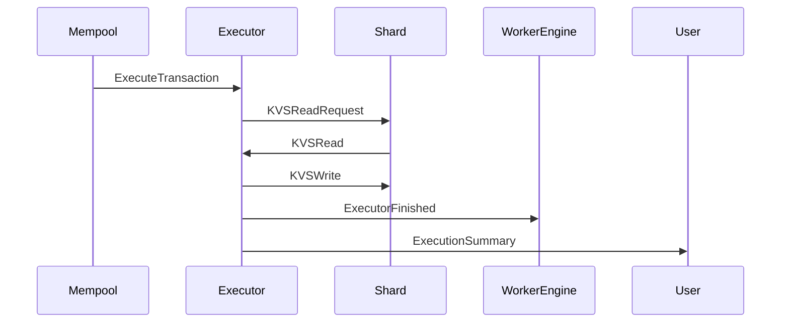

??? quote "Juvix imports"

    ```juvix
    module arch.node.engines.executor_2_messages;
    import prelude open;
    import arch.node.types.basics open;
    import arch.node.types.identities open;
    ```

# Executor Messages

These are the messages that the Executor engine can receive/respond to.

## Message interface

??? quote "Auxiliary Juvix code"

    ```juvix
    syntax alias TransactionExecutable := String;
    syntax alias TransactionLabel := String;
    syntax alias TxFingerprint := Nat;
    syntax alias KVSKey := String;
    syntax alias KVSDatum := String;
    ```

### `ExecutorMsgExecuteTransaction ExecuteTransactionRequest`

Request to execute a transaction.

<!-- --8<-- [start:ExecuteTransactionRequest] -->
```juvix
type ExecuteTransactionRequest : Type :=
  mkExecuteTransactionRequest {
    executable : TransactionExecutable;
    label : TransactionLabel;
    timestamp : TxFingerprint;
    curator : EngineID;
    issuer : EngineID
  }
```
<!-- --8<-- [end:ExecuteTransactionRequest] -->

???+ quote "Arguments"

    `executable`
    : The transaction code to be executed post-ordering

    `label`
    : Information about keys that the transaction can rightfully access

    `timestamp`
    : Ordering information sufficient for V1

    `curator`
    : The Worker Engine to be informed when execution completes

    `issuer`
    : The ID of the transaction request sender

### `ExecutorMsgExecutorFinished ExecutorFinishedMsg`

Notification that execution is complete.

<!-- --8<-- [start:ExecutorFinishedMsg] -->
```juvix
type ExecutorFinishedMsg : Type :=
  mkExecutorFinishedMsg {
    timestamp : TxFingerprint
  }
```
<!-- --8<-- [end:ExecutorFinishedMsg] -->

### `ExecutorMsgExecutionSummary ExecutionSummaryMsg`

Summary of execution results.

<!-- --8<-- [start:ExecutionSummaryMsg] -->
```juvix
type ExecutionSummaryMsg : Type :=
  mkExecutionSummaryMsg {
    timestamp : TxFingerprint;
    success : Bool
  }
```
<!-- --8<-- [end:ExecutionSummaryMsg] -->

### `ExecutorMsg`

<!-- --8<-- [start:ExecutorMsg] -->
```juvix
type ExecutorMsg :=
  | ExecutorMsgExecuteTransaction ExecuteTransactionRequest
  | ExecutorMsgExecutorFinished ExecutorFinishedMsg
  | ExecutorMsgExecutionSummary ExecutionSummaryMsg;
```
<!-- --8<-- [end:ExecutorMsg] -->

## Sequence Diagrams

### Transaction Execution Flow

<!-- --8<-- [start:message-sequence-diagram] -->
<figure markdown="span">



<figcaption markdown="span">
Sequence Diagram: Transaction Execution Flow
</figcaption>
</figure>
<!-- --8<-- [end:message-sequence-diagram] -->
