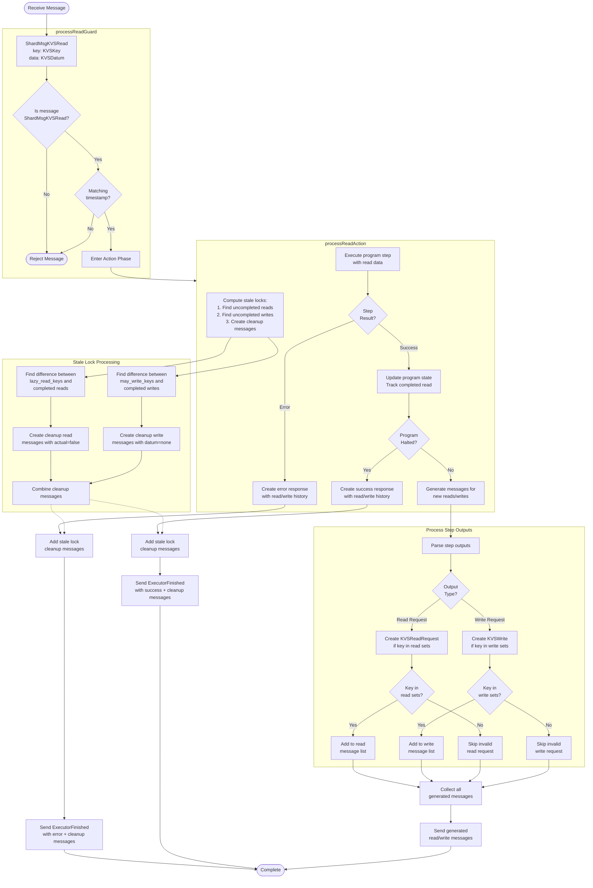

??? code "Juvix imports"

    ```juvix
    module arch.node.engines.executor_behaviour;

    import arch.node.engines.executor_messages open;
    import arch.node.engines.executor_config open;
    import arch.node.engines.executor_environment open;
    import arch.node.engines.shard_messages open;

    import prelude open;
    import arch.node.types.basics open;
    import arch.node.types.identities open;
    import arch.node.types.messages open;
    import arch.node.types.engine open;
    import arch.node.types.anoma as Anoma open;
    ```

# Executor Behaviour

## Overview

The executor behaviour defines how it processes incoming read responses and
performs state transitions to execute the transaction program.

## Executor Action Flowcharts

### `processRead` Flowchart

<figure markdown>



<figcaption markdown="span">

`processRead` flowchart showing read handling and execution steps

</figcaption>
</figure>

#### Explanation

1. **Initial Request Processing**
   - A client sends a `ShardMsgKVSRead` message containing:
     - `key`: The state key that was read.
     - `data`: The actual data value for that key.
     - A timestamp that identifies this execution context.
   - The message first passes through the guard phase which:
     - Validates the message is a `ShardMsgKVSRead`.
     - Ensures the timestamp matches this executor's configured timestamp.
     - Rejects messages that fail either check.
     - Routes valid messages to the action phase.

2. **Program Execution**
   - The action phase begins by executing the next program step:
     - Takes the current program state as context.
     - Provides the newly read key-value pair as input.
     - Produces either an error or a new program state with outputs.
   - On error:
     - Creates response detailing why execution failed.
     - Includes lists of all completed reads and writes.
     - Triggers stale lock cleanup before responding.
   - On success:
     - Updates internal program state with execution results.
     - Records the completed read in its tracking.
     - Determines if program has halted or continues.

3. **Continuation Flow**
   - If program hasn't halted:
     - Processes program outputs to generate new messages.
     - For read requests:
       - Validates key is in allowed read sets (lazy or eager).
       - Creates `KVSReadRequest` messages for valid reads.
     - For write operations:
       - Validates key is in allowed write sets (will or may).
       - Creates `KVSWrite` messages for valid writes
     - Sends all generated messages to appropriate shards.
     - Awaits next read response to continue execution.

4. **Completion Flow**
   - When program halts (either naturally or from error):
     - Computes stale lock information:
       - Finds difference between lazy_read_keys and actual reads.
       - Finds difference between may_write_keys and actual writes.
     - Generates cleanup messages:
       - `KVSReadRequest` with actual=false for unused reads.
       - `KVSWrite` with datum=none for unused writes.
     - Creates `ExecutorFinished` message containing:
       - Success/failure status
       - Complete list of values read
       - Complete list of values written
     - Sends cleanup messages and finished notification.
     - Terminates executor instance.

5. **Reply Delivery**
   - All responses are sent back using:
     - Executor's ID as sender.
     - Original requester as target.
     - Mailbox 0 (default response mailbox).
   - Three possible response patterns:
     - Error case: ExecutorFinished (success=false) + stale cleanup.
     - Success case: ExecutorFinished (success=true) + stale cleanup.
     - Continuation case: New read/write messages.

## Action arguments

### `ExecutorActionArguments`

<!-- --8<-- [start:executor-action-arguments] -->
```juvix
syntax alias ExecutorActionArguments := Unit;
```
<!-- --8<-- [end:executor-action-arguments] -->

## Actions

??? code "Auxiliary Juvix code"


    ### `ExecutorAction`

    ```juvix
    ExecutorAction (KVSKey KVSDatum Executable ProgramState : Type) : Type :=
      Action
        (ExecutorLocalCfg KVSKey Executable)
        (ExecutorLocalState KVSKey KVSDatum ProgramState)
        ExecutorMailboxState
        ExecutorTimerHandle
        ExecutorActionArguments
        (Anoma.PreMsg KVSKey KVSDatum Executable)
        (Anoma.PreCfg KVSKey KVSDatum Executable)
        (Anoma.PreEnv KVSKey KVSDatum Executable ProgramState);
    ```


    ### `ExecutorActionInput`

    ```juvix
    ExecutorActionInput (KVSKey KVSDatum Executable ProgramState : Type) : Type :=
      ActionInput
        (ExecutorLocalCfg KVSKey Executable)
        (ExecutorLocalState KVSKey KVSDatum ProgramState)
        ExecutorMailboxState
        ExecutorTimerHandle
        ExecutorActionArguments
        (Anoma.PreMsg KVSKey KVSDatum Executable);
    ```


    ### `ExecutorActionEffect`

    ```juvix
    ExecutorActionEffect (KVSKey KVSDatum Executable ProgramState : Type) : Type :=
      ActionEffect
        (ExecutorLocalState KVSKey KVSDatum ProgramState)
        ExecutorMailboxState
        ExecutorTimerHandle
        (Anoma.PreMsg KVSKey KVSDatum Executable)
        (Anoma.PreCfg KVSKey KVSDatum Executable)
        (Anoma.PreEnv KVSKey KVSDatum Executable ProgramState);
    ```


    ### `ExecutorActionExec`

    ```juvix
    ExecutorActionExec (KVSKey KVSDatum Executable ProgramState : Type) : Type :=
      ActionExec
        (ExecutorLocalCfg KVSKey Executable)
        (ExecutorLocalState KVSKey KVSDatum ProgramState)
        ExecutorMailboxState
        ExecutorTimerHandle
        ExecutorActionArguments
        (Anoma.PreMsg KVSKey KVSDatum Executable)
        (Anoma.PreCfg KVSKey KVSDatum Executable)
        (Anoma.PreEnv KVSKey KVSDatum Executable ProgramState);
    ```

### `processReadAction`

Process a read response and execute the next program step.

State update
: Updates the program state with executed step results and tracks completed reads/writes

Messages to be sent
: - Read/Write messages to shards based on program outputs
: - Notification messages for stale locks if program halts
: - ExecutorFinished message if program halts

Engines to be spawned
: No engines are created by this action.

Timer updates
: No timers are set or cancelled.

<!-- --8<-- [start:processReadAction] -->
```juvix
processReadAction
  {KVSKey KVSDatum Executable ProgramState}
  {{Ord KVSKey}}
  {{rinst : Runnable KVSKey KVSDatum Executable ProgramState}}
  (input : ExecutorActionInput KVSKey KVSDatum Executable ProgramState)
  : Option (ExecutorActionEffect KVSKey KVSDatum Executable ProgramState) :=
  let
    cfg := EngineCfg.cfg (ActionInput.cfg input);
    env := ActionInput.env input;
    trigger := ActionInput.trigger input;
  in case getMsgFromTimestampedTrigger trigger of {
    | some (PreMsg.MsgShard (ShardMsg.KVSRead (KVSReadMsg.mkKVSReadMsg@{key := readKey; data := readValue}))) :=
      let
        envelope (target : EngineID) (msg : Anoma.PreMsg KVSKey KVSDatum Executable) : EngineMsg (Anoma.PreMsg KVSKey KVSDatum Executable) :=
          EngineMsg.mk@{
            sender := getEngineIDFromEngineCfg (ActionInput.cfg input);
            target := target;
            mailbox := some 0;
            msg := msg
          };
        local := EngineEnv.localState env;
        reads := ExecutorLocalState.completed_reads local;
        writes := ExecutorLocalState.completed_writes local;

        -- Precompute messages to notify shards of stale locks
        -- These inform the shards that they can release pending locks in the
        -- case that the executor halts.
        staleReadMsg (key : KVSKey) : EngineMsg (Anoma.PreMsg KVSKey KVSDatum Executable) :=
          envelope (ExecutorLocalCfg.keyToShard cfg key) (PreMsg.MsgShard (ShardMsg.KVSReadRequest (KVSReadRequestMsg.mkKVSReadRequestMsg@{
            timestamp := ExecutorLocalCfg.timestamp cfg;
            key := key;
            actual := false
          })));
        staleWriteMsg (key : KVSKey) : EngineMsg (Anoma.PreMsg KVSKey KVSDatum Executable) :=
          envelope (ExecutorLocalCfg.keyToShard cfg key) (PreMsg.MsgShard (ShardMsg.KVSWrite (KVSWriteMsg.mkKVSWriteMsg@{
            timestamp := ExecutorLocalCfg.timestamp cfg;
            key := key;
            datum := none
          })));
        staleReadLocations :=
          Set.difference (ExecutorLocalCfg.lazy_read_keys cfg) (Set.fromList (Map.keys reads));
        readStaleMsgs := map staleReadMsg (Set.toList staleReadLocations);
        staleWriteLocations :=
          Set.difference (ExecutorLocalCfg.may_write_keys cfg) (Set.fromList (Map.keys writes));
        writeStaleMsgs := map staleWriteMsg (Set.toList staleWriteLocations);
        staleMsgs := readStaleMsgs ++ writeStaleMsgs;

        stepInput := mkPair readKey readValue;
        stepResult := Runnable.executeStep
          (ExecutorLocalCfg.executable cfg)
          (ExecutorLocalState.program_state local)
          stepInput;
      in case stepResult of {
        | error err :=
            let
              local := EngineEnv.localState env;
              finishedMsg :=
                envelope (ExecutorLocalCfg.issuer cfg)
                  (PreMsg.MsgExecutor (ExecutorMsg.ExecutorFinished ExecutorFinishedMsg.mkExecutorFinishedMsg@{
                    success := false;
                    values_read := (mkPair readKey readValue) :: Map.toList reads;
                    values_written := Map.toList writes
                }));
            in some ActionEffect.mkActionEffect@{
                env := env;
                msgs := finishedMsg :: staleMsgs;
                timers := [];
                engines := []
              }
        | ok (mkPair program' outputs) :=
          let
            accReads (key : KVSKey)
                     (msgs : List (EngineMsg (Anoma.PreMsg KVSKey KVSDatum Executable))) :
                     List (EngineMsg (Anoma.PreMsg KVSKey KVSDatum Executable)) :=
              let msg :=
                envelope (ExecutorLocalCfg.keyToShard cfg key) (PreMsg.MsgShard (ShardMsg.KVSReadRequest (KVSReadRequestMsg.mkKVSReadRequestMsg@{
                    timestamp := ExecutorLocalCfg.timestamp cfg;
                    key := key;
                    actual := true
                  })))
              in case or (Set.isMember key (ExecutorLocalCfg.lazy_read_keys cfg))
                         (Set.isMember key (ExecutorLocalCfg.eager_read_keys cfg)) of {
                | true := msg :: msgs
                | false := msgs
              };
            accWrites (key : KVSKey)
                      (value : KVSDatum)
                      (msgs : List (EngineMsg (Anoma.PreMsg KVSKey KVSDatum Executable))) :
                      List (EngineMsg (Anoma.PreMsg KVSKey KVSDatum Executable)) :=
              let msg :=
                envelope (ExecutorLocalCfg.keyToShard cfg key)
                  (PreMsg.MsgShard (ShardMsg.KVSWrite (KVSWriteMsg.mkKVSWriteMsg@{
                    timestamp := ExecutorLocalCfg.timestamp cfg;
                    key := key;
                    datum := some value
                  })))
              in case or (Set.isMember key (ExecutorLocalCfg.will_write_keys cfg))
                         (Set.isMember key (ExecutorLocalCfg.may_write_keys cfg)) of {
                | true := msg :: msgs
                | false := msgs
              };
            sendHelper (acc : Pair (ExecutorLocalState KVSKey KVSDatum ProgramState) (List (EngineMsg (Anoma.PreMsg KVSKey KVSDatum Executable))))
                       (out : Either KVSKey (Pair KVSKey KVSDatum)) :
                Pair (ExecutorLocalState KVSKey KVSDatum ProgramState) (List (EngineMsg (Anoma.PreMsg KVSKey KVSDatum Executable))) :=
              let state := fst acc;
                  msgs := snd acc;
              in case out of {
                | left key := mkPair state (accReads key msgs)
                | right (mkPair key value) :=
                    let newState := state@ExecutorLocalState{
                        completed_writes := Map.insert key value (ExecutorLocalState.completed_writes state)
                      };
                    in mkPair newState (accWrites key value msgs)
              };
            initial := mkPair (local@ExecutorLocalState{
                        program_state := program';
                        completed_reads := Map.insert readKey readValue (ExecutorLocalState.completed_reads local)
                       }) [];
            final := foldl sendHelper initial outputs;
            newLocalState := fst final;
            msgList := snd final;
            newEnv := env@EngineEnv{localState := newLocalState};
          in case Runnable.halted {{rinst}} program' of {
            | false := some ActionEffect.mkActionEffect@{
                  env := newEnv;
                  msgs := msgList;
                  timers := [];
                  engines := []
                }
            | true :=
              let
                finishedMsg :=
                  envelope
                    (ExecutorLocalCfg.issuer cfg)
                    (PreMsg.MsgExecutor (ExecutorMsg.ExecutorFinished ExecutorFinishedMsg.mkExecutorFinishedMsg@{
                      success := true;
                      values_read := Map.toList reads;
                      values_written := Map.toList writes
                  }));
              in some ActionEffect.mkActionEffect@{
                  env := newEnv;
                  msgs := msgList ++ finishedMsg :: staleMsgs;
                  timers := [];
                  engines := []
                }
          }
      }
    | _ := none
  };
```
<!-- --8<-- [end:processReadAction] -->

### Action Labels

```juvix
processReadActionLabel
  {KVSKey KVSDatum Executable ProgramState}
  {{Ord KVSKey}}
  {{Runnable KVSKey KVSDatum Executable ProgramState}}
  : ExecutorActionExec KVSKey KVSDatum Executable ProgramState := ActionExec.Seq [ processReadAction ];
```

## Guards

??? code "Auxiliary Juvix code"

    ### `ExecutorGuard`

    <!-- --8<-- [start:ExecutorGuard] -->
    ```juvix
    ExecutorGuard (KVSKey KVSDatum Executable ProgramState : Type) : Type :=
      Guard
        (ExecutorLocalCfg KVSKey Executable)
        (ExecutorLocalState KVSKey KVSDatum ProgramState)
        ExecutorMailboxState
        ExecutorTimerHandle
        ExecutorActionArguments
        (Anoma.PreMsg KVSKey KVSDatum Executable)
        (Anoma.PreCfg KVSKey KVSDatum Executable)
        (Anoma.PreEnv KVSKey KVSDatum Executable ProgramState);
    ```
    <!-- --8<-- [end:ExecutorGuard] -->


    ### `ExecutorGuardOutput`

    <!-- --8<-- [start:ExecutorGuardOutput] -->
    ```juvix
    ExecutorGuardOutput (KVSKey KVSDatum Executable ProgramState : Type) : Type :=
      GuardOutput
        (ExecutorLocalCfg KVSKey Executable)
        (ExecutorLocalState KVSKey KVSDatum ProgramState)
        ExecutorMailboxState
        ExecutorTimerHandle
        ExecutorActionArguments
        (Anoma.PreMsg KVSKey KVSDatum Executable)
        (Anoma.PreCfg KVSKey KVSDatum Executable)
        (Anoma.PreEnv KVSKey KVSDatum Executable ProgramState);
    ```
    <!-- --8<-- [end:ExecutorGuardOutput] -->


    ### `ExecutorGuardEval`

    <!-- --8<-- [start:ExecutorGuardEval] -->
    ```juvix
    ExecutorGuardEval (KVSKey KVSDatum Executable ProgramState : Type) : Type :=
      GuardEval
        (ExecutorLocalCfg KVSKey Executable)
        (ExecutorLocalState KVSKey KVSDatum ProgramState)
        ExecutorMailboxState
        ExecutorTimerHandle
        ExecutorActionArguments
        (Anoma.PreMsg KVSKey KVSDatum Executable)
        (Anoma.PreCfg KVSKey KVSDatum Executable)
        (Anoma.PreEnv KVSKey KVSDatum Executable ProgramState);
    ```
    <!-- --8<-- [end:ExecutorGuardEval] -->

### `processReadGuard`

Guard for processing read responses.

<!-- --8<-- [start:processReadGuard] -->
```juvix
processReadGuard
  {KVSKey KVSDatum Executable ProgramState}
  {{Ord KVSKey}}
  {{Runnable KVSKey KVSDatum Executable ProgramState}}
  (trigger : TimestampedTrigger ExecutorTimerHandle (Anoma.PreMsg KVSKey KVSDatum Executable))
  (cfg : ExecutorCfg KVSKey Executable)
  (env : ExecutorEnv KVSKey KVSDatum ProgramState)
  : Option (ExecutorGuardOutput KVSKey KVSDatum Executable ProgramState) :=
  case getEngineMsgFromTimestampedTrigger trigger of {
  | some EngineMsg.mk@{msg := PreMsg.MsgShard (ShardMsg.KVSRead (KVSReadMsg.mkKVSReadMsg@{
      timestamp := timestamp;
      key := _;
      data := _
    }))} :=
    case timestamp == ExecutorLocalCfg.timestamp (EngineCfg.cfg cfg) of {
    | true :=
      some GuardOutput.mkGuardOutput@{
        action := processReadActionLabel;
        args := unit
      }
    | false := none
    }
  | _ := none
  };
```
<!-- --8<-- [end:processReadGuard] -->

## The Executor Behaviour

### `ExecutorBehaviour`

<!-- --8<-- [start:ExecutorBehaviour] -->
```juvix
ExecutorBehaviour (KVSKey KVSDatum Executable ProgramState : Type) : Type :=
  EngineBehaviour
    (ExecutorLocalCfg KVSKey Executable)
    (ExecutorLocalState KVSKey KVSDatum ProgramState)
    ExecutorMailboxState
    ExecutorTimerHandle
    ExecutorActionArguments
    (Anoma.PreMsg KVSKey KVSDatum Executable)
    (Anoma.PreCfg KVSKey KVSDatum Executable)
    (Anoma.PreEnv KVSKey KVSDatum Executable ProgramState);
```
<!-- --8<-- [end:ExecutorBehaviour] -->

### Instantiation

<!-- --8<-- [start:executorBehaviour] -->
```juvix
instance dummyRunnable : Runnable String String ByteString String :=
  Runnable.mkRunnable@{
    executeStep := \{_ _ _ := error "Not implemented"};
    halted := \{_ := false};
    startingState := ""
  };

executorBehaviour : ExecutorBehaviour String String ByteString String :=
  EngineBehaviour.mk@{
    guards := GuardEval.First [
      processReadGuard
    ]
  };
```
<!-- --8<-- [end:executorBehaviour] -->

---