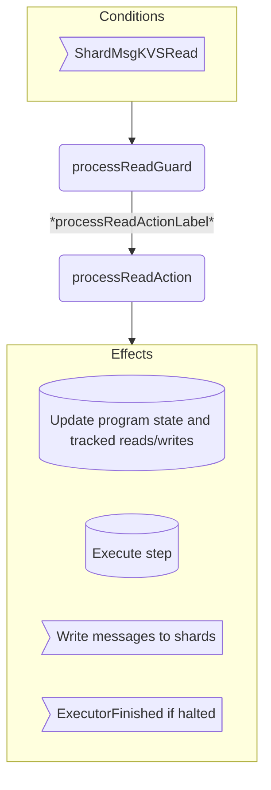

??? quote "Juvix imports"

    ```juvix
    module arch.node.engines.executor_behaviour;

    import arch.node.engines.executor_messages open;
    import arch.node.engines.executor_config open;
    import arch.node.engines.executor_environment open;
    import arch.node.engines.shard_messages open;

    import prelude open;
    import arch.node.types.basics open;
    import arch.node.types.identities open;
    import arch.node.types.messages open;
    import arch.node.types.engine open;
    import arch.node.types.anoma as Anoma open;
    ```

# Executor Behaviour

## Overview

The executor behaviour defines how it processes incoming read responses and performs state transitions to execute the transaction program.

## Action arguments

### `ExecutorActionArguments`

<!-- --8<-- [start:executor-action-arguments] -->
```juvix
syntax alias ExecutorActionArguments := Unit;
```
<!-- --8<-- [end:executor-action-arguments] -->

## Actions

??? quote "Auxiliary Juvix code"

    ### ExecutorAction

    ```juvix
    ExecutorAction : Type :=
      Action
        ExecutorCfg
        ExecutorLocalState 
        ExecutorMailboxState
        ExecutorTimerHandle
        ExecutorActionArguments
        Anoma.Msg
        Anoma.Cfg
        Anoma.Env;
    ```

    ### ExecutorActionInput
    
    ```juvix
    ExecutorActionInput : Type := 
      ActionInput
        ExecutorCfg
        ExecutorLocalState
        ExecutorMailboxState
        ExecutorTimerHandle
        ExecutorActionArguments
        Anoma.Msg;
    ```

    ### ExecutorActionEffect

    ```juvix
    ExecutorActionEffect : Type :=
      ActionEffect
        ExecutorLocalState
        ExecutorMailboxState
        ExecutorTimerHandle
        Anoma.Msg
        Anoma.Cfg
        Anoma.Env;
    ```

    ### ExecutorActionExec

    ```juvix
    ExecutorActionExec : Type :=
      ActionExec
        ExecutorCfg
        ExecutorLocalState
        ExecutorMailboxState
        ExecutorTimerHandle
        ExecutorActionArguments
        Anoma.Msg
        Anoma.Cfg
        Anoma.Env;
    ```

### `processReadAction`

Process a read response and execute the next program step.

<!-- --8<-- [start:processReadAction] -->
```juvix
processReadAction
  (input : ExecutorActionInput)
  : Option ExecutorActionEffect :=
  let
    cfg := EngineCfg.cfg (ActionInput.cfg input);
    env := ActionInput.env input;
    trigger := ActionInput.trigger input;
  in case getMsgFromTimestampedTrigger trigger of {
    | some (MsgShard (ShardMsgKVSRead (mkKVSReadMsg@{key := key; data := value}))) :=
      let
        envelope (target : EngineID) (msg : Anoma.Msg) : EngineMsg Anoma.Msg := 
          mkEngineMsg@{
            sender := getEngineIDFromEngineCfg (ActionInput.cfg input);
            target := target;
            mailbox := some 0;
            msg := msg
          };
        local := EngineEnv.localState env;
        reads := ExecutorLocalState.completed_reads local;
        writes := ExecutorLocalState.completed_writes local;
        -- Messages to notify shards of stale locks
        readMsg (key : KVSKey) : EngineMsg Anoma.Msg :=
          envelope (keyToShard key) (MsgShard (ShardMsgKVSReadRequest (mkKVSReadRequestMsg@{
            timestamp := ExecutorCfg.timestamp cfg;
            key := key;
            actual := false
          })));
        writeMsg (key : KVSKey) : EngineMsg Anoma.Msg :=
          envelope (keyToShard key) (MsgShard (ShardMsgKVSWrite (mkKVSWriteMsg@{
            timestamp := ExecutorCfg.timestamp cfg;
            key := key;
            datum := none
          })));
        staleReadLocations := 
          Set.difference (ExecutorCfg.lazy_read_keys cfg) (Set.fromList (Map.keys reads));
        readStaleMsgs := map readMsg (Set.toList staleReadLocations);
        staleWriteLocations := 
          Set.difference (ExecutorCfg.may_write_keys cfg) (Set.fromList (Map.keys writes));
        writeStaleMsgs := map writeMsg (Set.toList staleWriteLocations);
        staleMsgs := readStaleMsgs ++ writeStaleMsgs;

        stepInput := mkPair key value;
        stepResult := executeStep
          (ExecutorCfg.executable cfg)
          (ExecutorLocalState.program_state local)
          stepInput;
      in case stepResult of {
        | error err := 
            let 
              local := EngineEnv.localState env;
              finishedMsg := 
              envelope (ExecutorCfg.issuer cfg) 
                (MsgExecutor (ExecutorMsgExecutorFinished mkExecutorFinishedMsg@{
                  success := false;
                  values_read := Map.toList reads;
                  values_written := Map.toList writes
              }));
            in some mkActionEffect@{
                env := env;
                msgs := finishedMsg :: staleMsgs;  
                timers := [];
                engines := []
              }
        | ok (mkPair program' outputs) :=
          let
            sendRead (key : KVSKey)
                     (msgs : List (EngineMsg Anoma.Msg)) : 
                     List (EngineMsg Anoma.Msg) :=
              let msg :=
                envelope (keyToShard key) (MsgShard (ShardMsgKVSReadRequest (mkKVSReadRequestMsg@{
                    timestamp := ExecutorCfg.timestamp cfg;
                    key := key;
                    actual := true
                  })))
              in case or (Set.isMember key (ExecutorCfg.lazy_read_keys cfg)) 
                         (Set.isMember key (ExecutorCfg.eager_read_keys cfg)) of {
                | true := msg :: msgs
                | false := msgs
              };
            sendWrite (key : KVSKey) 
                      (value : KVSDatum) 
                      (msgs : List (EngineMsg Anoma.Msg)) : 
                      List (EngineMsg Anoma.Msg) :=
              let msg :=
                envelope (keyToShard key) 
                  (MsgShard (ShardMsgKVSWrite (mkKVSWriteMsg@{
                    timestamp := ExecutorCfg.timestamp cfg;
                    key := key;
                    datum := some value
                  })))
              in case or (Set.isMember key (ExecutorCfg.will_write_keys cfg)) 
                         (Set.isMember key (ExecutorCfg.may_write_keys cfg)) of {
                | true := msg :: msgs
                | false := msgs
              };
            processOutput (acc : Pair ExecutorLocalState (List (EngineMsg Anoma.Msg)))
                          (out : Either KVSKey (Pair KVSKey KVSDatum)) :
                Pair ExecutorLocalState (List (EngineMsg Anoma.Msg)) :=
              let state := fst acc;
                  msgs := snd acc;
              in case out of {
                | left key := mkPair state (sendRead key msgs)
                | right (mkPair key value) := 
                    let newState := state@ExecutorLocalState{
                        completed_writes := Map.insert key value (ExecutorLocalState.completed_writes state)
                      };
                    in mkPair newState (sendWrite key value msgs)
              };
            initial := mkPair (local@ExecutorLocalState{program_state := program'}) [];
            final := foldl processOutput initial outputs;
            newLocalState := fst final;
            msgList := snd final;
            newEnv := env@EngineEnv{localState := newLocalState};
          in case ProgramState.halted program' of {
            | false := some mkActionEffect@{
                  env := newEnv;
                  msgs := msgList;
                  timers := [];
                  engines := []
                }
            | true :=  
              let 
                finishedMsg := 
                  envelope 
                    (ExecutorCfg.issuer cfg) 
                    (MsgExecutor (ExecutorMsgExecutorFinished mkExecutorFinishedMsg@{
                      success := true;
                      values_read := Map.toList reads;
                      values_written := Map.toList writes
                  }));
              in some mkActionEffect@{
                  env := newEnv;
                  msgs := msgList ++ finishedMsg :: staleMsgs;
                  timers := [];
                  engines := []
                }
          }
      }
    | _ := none
  };
```
<!-- --8<-- [end:processReadAction] -->

### Action Labels

```juvix
processReadActionLabel : ExecutorActionExec := Seq [ processReadAction ];
```

## Guards

??? quote "Auxiliary Juvix code"

    ### `ExecutorGuard`

    <!-- --8<-- [start:ExecutorGuard] -->
    ```juvix
    ExecutorGuard : Type :=
      Guard
        ExecutorCfg
        ExecutorLocalState
        ExecutorMailboxState
        ExecutorTimerHandle
        ExecutorActionArguments
        Anoma.Msg
        Anoma.Cfg
        Anoma.Env;
    ```
    <!-- --8<-- [end:ExecutorGuard] -->

    ### `ExecutorGuardOutput`

    <!-- --8<-- [start:ExecutorGuardOutput] -->
    ```juvix 
    ExecutorGuardOutput : Type :=
      GuardOutput
        ExecutorCfg
        ExecutorLocalState
        ExecutorMailboxState
        ExecutorTimerHandle
        ExecutorActionArguments
        Anoma.Msg
        Anoma.Cfg
        Anoma.Env;
    ```
    <!-- --8<-- [end:ExecutorGuardOutput] -->

    ### `ExecutorGuardEval`

    <!-- --8<-- [start:ExecutorGuardEval] -->
    ```juvix
    ExecutorGuardEval : Type :=
      GuardEval
        ExecutorCfg
        ExecutorLocalState
        ExecutorMailboxState
        ExecutorTimerHandle
        ExecutorActionArguments
        Anoma.Msg
        Anoma.Cfg
        Anoma.Env;
    ```
    <!-- --8<-- [end:ExecutorGuardEval] -->

### `processReadGuard`

Guard for processing read responses.

<!-- --8<-- [start:processReadGuard] -->
```juvix
processReadGuard
  (trigger : TimestampedTrigger ExecutorTimerHandle Anoma.Msg)
  (cfg : EngineCfg ExecutorCfg)
  (env : ExecutorEnv)
  : Option ExecutorGuardOutput :=
  case getEngineMsgFromTimestampedTrigger trigger of {
  | some mkEngineMsg@{msg := MsgShard (ShardMsgKVSRead (mkKVSReadMsg@{
      timestamp := timestamp;
      key := _;
      data := _
    }))} :=
    case timestamp == ExecutorCfg.timestamp (EngineCfg.cfg cfg) of {
    | true :=
      some mkGuardOutput@{
        action := processReadActionLabel;
        args := unit
      }
    | false := none
    }
  | _ := none
  };
```
<!-- --8<-- [end:processReadGuard] -->

## The Executor Behaviour

### `ExecutorBehaviour`

<!-- --8<-- [start:ExecutorBehaviour] -->
```juvix
ExecutorBehaviour : Type :=
  EngineBehaviour
    ExecutorCfg
    ExecutorLocalState
    ExecutorMailboxState
    ExecutorTimerHandle
    ExecutorActionArguments
    Anoma.Msg
    Anoma.Cfg
    Anoma.Env;
```
<!-- --8<-- [end:ExecutorBehaviour] -->

### Instantiation

<!-- --8<-- [start:executorBehaviour] -->
```juvix
executorBehaviour : ExecutorBehaviour :=
  mkEngineBehaviour@{
    guards := First [
      processReadGuard
    ]
  };
```
<!-- --8<-- [end:executorBehaviour] -->

## Executor Action Flowcharts

### `processRead` Flowchart

<figure markdown>



<figcaption markdown="span">

`processRead` flowchart showing read handling and execution steps

</figcaption>
</figure>
