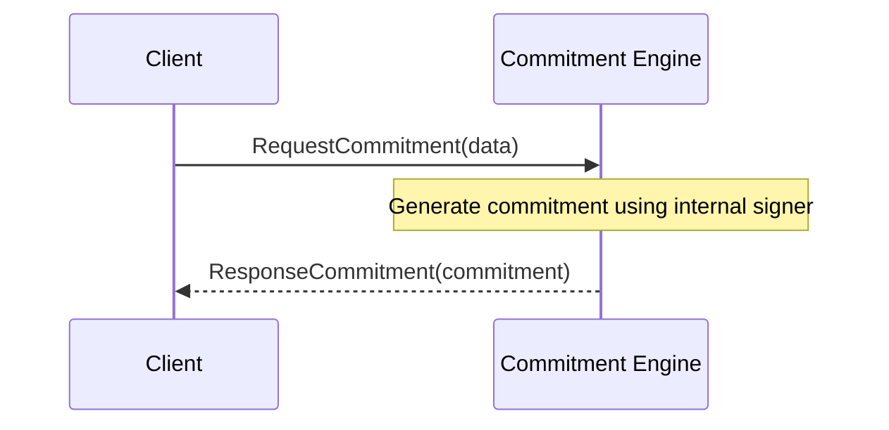

??? quote "Juvix imports"

    ```juvix
    module arch.node.engines.executor_messages;
    import prelude open;
    ```

# Executor Messages

## Message interface

### `ExecuteTransaction`

```juvix
type ExecuteTransaction := mkExecuteTransaction {
  executable : TransactionExecutable; -- "code" to be executed post-ordering
  label : TransactionLabel; -- information about keys that the transaction can rightfully access
  timestamp : TxFingerprint; -- (partial) ordering information (sufficient for total order in  V0.2.0 and earlier)  
  curator : ExternalIdentity; -- the [[Worker Engine]] to be informed when execution completes (e.g. for logs) 
  issuer : ExternalIdentity; -- the ID of the sender of the [[TransactionRequest]]   
};
```
!!! todo
    make this type check properly (may require introduing TxFingerprint and such types somewhere)

The [[Mempool Engines|mempool engines]] instruct the [[Executor]] that a new
 [[TransactionCandidate]] has been recorded, its locks are being
 acquired, and will eventually need to be executed.

???+ quote "Arguments"
     `executable`:
     : "code" to be executed post-ordering

     `label`:
     : information about keys that the transaction can rightfully access

     `timestamp`:
     : (partial) ordering information (sufficient for total order in  V0.2.0 and earlier)  

     `curator`:
     : the [[Worker Engine]] to be informed when execution completes (e.g. for logs) 

     `issuer`:
     : the ID of the sender of the [[TransactionRequest]]  


Sent _from_ [[Mempool]]

#### Effects

This message is sent to an [[Executor]] that is already running.
Concurrently, when the [[Worker Engine]] sends a [[KVSAcquireLock]] to
 [[Shard]]s, they can include *eager reads*, which will result in
 [[KVSRead]]s sent to this [[Executor]].

The [[TxFingerprint|timestamp]] should match the
 [[TxFingerprint|timestamp]] of the [[TransactionCandidate]] for this
 [[Executor]].

#### Triggers

- {[[KVSReadRequest|KVSReadRequest]], [[KVSWrite]]}→[[Shard]]s:
  In the course of evaluating the
   *executor function*,
   lazy reads are requested, and final writes are output.

  - [[KVSReadRequest|KVSReadRequest]] to [[Shard]]
  - [[KVSWrite]] to [[Shard]]

#### Notes

- Getting served read requests amounts to locks being granted by the shards.


### `KVSRead`
```juvix
type KVSRead := mkKVSRead {
  timestamp : TxFingerprint; -- the timestamp at which the datum was read
  key : KVSKey; --  the key from which the datum is read 
  data : KVSDatum; -- the datum read  
}
```
!!! todo
    make this type check properly (may require introduing KVSKey and such types somewhere)

[[Executor]]s have to read data from keys to execute
 [[TransactionCandidate]]s.
When a [[Shard]] has determined what the value read is at the
 appropriate [[TxFingerprint|timestamp]],
 it sends a [[KVSRead]] to the appropriate [[Executor]].

???+ quote "Arguments"
     `timestamp`:
     : the timestamp at which the datum was read

     `key`:
     : the key from which the datum is read

     `data`:
     : the datum read 


#### Effects

These read values are input for the [[TransactionExecutable]].
Some may be lazy inputs, and some may never be used, but they're all
 inputs.
If this lets us finish the [[TransactionExecutable]], it may trigger
 [[KVSWrite]]s (outputs of the executable), and shutting down the
 [[Executor]] entirely.

#### Triggers

- to [[Shard]]: [[KVSWrite]]
  `for each` value the [[TransactionExecutable]] outputs to write
  send a [[KVSWrite]] message to the appropriate [[Shard]]
- to [[Shard]]: [[KVSReadRequest|KVSReadRequest]]
  `for each` lazy read the [[TransactionExecutable]] now requires, and
   each lazy read the [[TransactionExecutable]] hasn't read when it
   terminates:
  send a [[KVSReadRequest|KVSReadRequest]] message to the appropriate [[Shard]]
- to [[Worker Engine]]: [[ExecutorFinished]]
  `If` [[TransactionExecutable]] has terminated
  `then` notify the `curator` specified in [[ExecuteTransaction]]
  or [[ExecuteReadTransaction]]
  that the transaction is done with an [[ExecutorFinished]].
- to [[User]],[[Solver]]: [[ExecutionSummary]]
  The issuer of the [[TransactionRequest|transaction request]]
  is always provided with the [[ExecutionSummary]]


!!! todo
    Any remaining message types (read only transactions?)

## Message sequence diagrams

### Executor TransactionRequest Sequence
!!! todo
    Using the template from commitment messages, make a mermaid diagram with a typical  sequence. 

<!-- --8<-- [start:message-sequence-diagram] -->
<figure markdown="span">



<figcaption markdown="span">
Sequence diagram for commitment generation.
</figcaption>
</figure>
<!-- --8<-- [end:message-sequence-diagram] -->

## Engine Components

- [[Executor Environment]]
- [[Executor Behaviour]]
