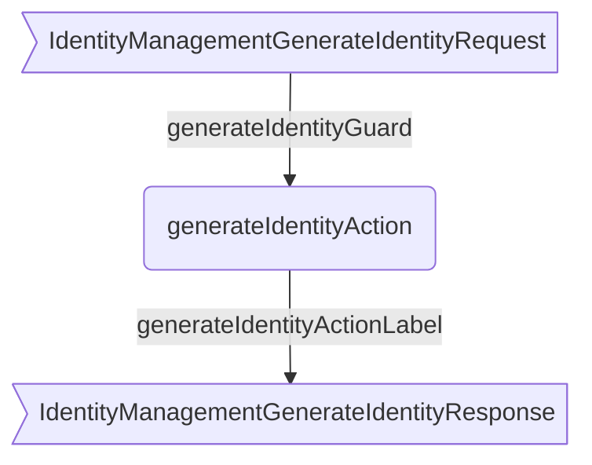
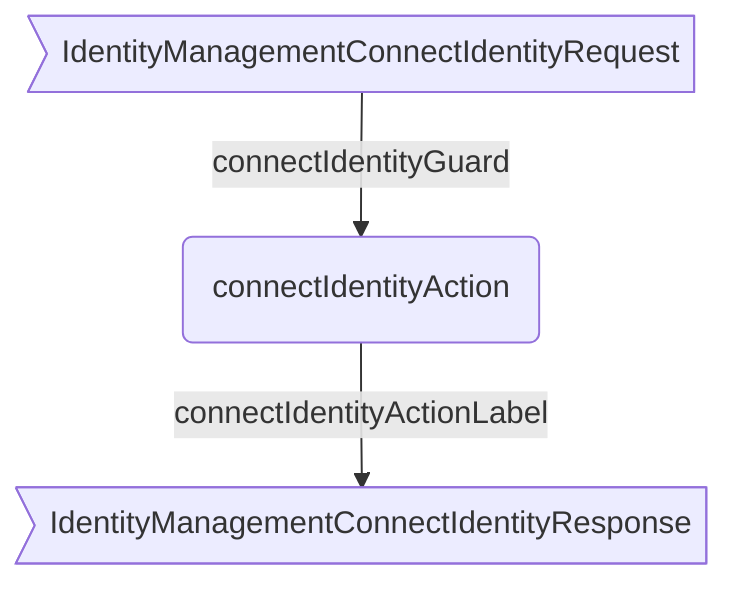
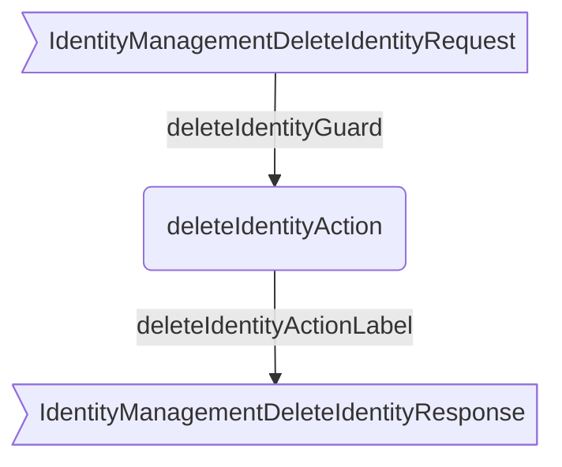

??? quote "Juvix imports"

    ```juvix
    module arch.node.engines.identity_management_behaviour;

    import prelude open;
    import arch.node.engines.commitment_environment open;
    import arch.node.engines.decryption_environment open;
    import arch.node.engines.identity_management_environment open;
    import arch.node.engines.identity_management_messages open;
    import arch.node.engines.identity_management_config open;
    import arch.node.types.anoma as Anoma open;
    import arch.node.types.engine open;
    import arch.node.types.engine_environment open;
    import arch.node.types.identities open;
    import arch.node.types.messages open;
    import arch.system.identity.identity open hiding {ExternalIdentity};
    ```

# Identity Management Behaviour

## Overview

The behavior of the Identity Management Engine defines how it processes
incoming messages (requests) and produces the corresponding responses and
actions.

## Action arguments

### `MessageFrom`

```juvix
type MessageFrom := mkMessageFrom {
  whoAsked : Option EngineID;
  mailbox : Option MailboxID
};
```

### `IdentityManagementActionArgument`

<!-- --8<-- [start:IdentityManagementActionArgument] -->
```juvix
type IdentityManagementActionArgument :=
  | IdentityManagementActionArgumentMessageFrom MessageFrom;
```
<!-- --8<-- [end:IdentityManagementActionArgument] -->

### `IdentityManagementActionArguments`

<!-- --8<-- [start:identity-management-action-arguments] -->
```juvix
IdentityManagementActionArguments : Type := List IdentityManagementActionArgument;
```
<!-- --8<-- [end:identity-management-action-arguments] -->

## Actions

??? quote "Auxiliary Juvix code"

    ```juvix
    IdentityManagementAction : Type :=
      Action
        IdentityManagementCfg
        IdentityManagementLocalState
        IdentityManagementMailboxState
        IdentityManagementTimerHandle
        IdentityManagementActionArguments
        Anoma.Msg
        Anoma.Cfg
        Anoma.Env;

    IdentityManagementActionInput : Type :=
      ActionInput
        IdentityManagementCfg
        IdentityManagementLocalState
        IdentityManagementMailboxState
        IdentityManagementTimerHandle
        IdentityManagementActionArguments
        Anoma.Msg;

    IdentityManagementActionEffect : Type :=
      ActionEffect
        IdentityManagementLocalState
        IdentityManagementMailboxState
        IdentityManagementTimerHandle
        Anoma.Msg
        Anoma.Cfg
        Anoma.Env;

    IdentityManagementActionExec : Type :=
      ActionExec
        IdentityManagementCfg
        IdentityManagementLocalState
        IdentityManagementMailboxState
        IdentityManagementTimerHandle
        IdentityManagementActionArguments
        Anoma.Msg
        Anoma.Cfg
        Anoma.Env;
    ```

### Helper Functions

```juvix
makeDecryptEnv
  (env : IdentityManagementEnv)
  (backend' : Backend)
  (addr : EngineID)
  : DecryptionEnv :=
  mkEngineEnv@{
    localState := mkDecryptionLocalState@{
      decryptor := IdentityManagementLocalState.genDecryptor (EngineEnv.localState env) backend';
      backend := backend'
    };
    mailboxCluster := Map.empty;
    acquaintances := Set.empty;
    timers := []
  };

makeCommitmentEnv
  (env : IdentityManagementEnv)
  (backend' : Backend)
  (addr : EngineID)
  : CommitmentEnv :=
  mkEngineEnv@{
    localState := mkCommitmentLocalState@{
      signer := IdentityManagementLocalState.genSigner (EngineEnv.localState env) backend';
      backend := backend'
    };
    mailboxCluster := Map.empty;
    acquaintances := Set.empty;
    timers := []
  };

hasCommitCapability (capabilities : Capabilities) : Bool :=
  case capabilities of {
    | CapabilityCommit := true
    | CapabilityCommitAndDecrypt := true
    | _ := false
  };

hasDecryptCapability (capabilities : Capabilities) : Bool :=
  case capabilities of {
    | CapabilityDecrypt := true
    | CapabilityCommitAndDecrypt := true
    | _ := false
  };

isSubsetCapabilities
  (requested : Capabilities)
  (available : Capabilities)
  : Bool :=
  (not (hasCommitCapability requested) || hasCommitCapability available)
  && (not (hasDecryptCapability requested) || hasDecryptCapability available);


updateIdentityAndSpawnEngines
  (env : IdentityManagementEnv)
  (backend' : Backend)
  (whoAsked : EngineID)
  (identityInfo : IdentityInfo)
  (capabilities' : Capabilities)
  : Pair IdentityInfo (List (Pair Cfg Env)) :=
  case capabilities' of {
    | CapabilityCommitAndDecrypt :=
        let commitmentEnv := makeCommitmentEnv env backend' whoAsked;
            decryptionEnv := makeDecryptEnv env backend' whoAsked;
            spawnedEngines := [mkPair CfgCommitment (EnvCommitment commitmentEnv); mkPair CfgDecryption (EnvDecryption decryptionEnv)];
            commitmentEngineName := nameGen "committer" (snd whoAsked) whoAsked;
            decryptionEngineName := nameGen "decryptor" (snd whoAsked) whoAsked;
            updatedIdentityInfo1 := identityInfo@IdentityInfo{
              commitmentEngine := some (mkPair none commitmentEngineName);
              decryptionEngine := some (mkPair none decryptionEngineName)
            };
        in mkPair updatedIdentityInfo1 spawnedEngines
    | CapabilityCommit :=
        let commitmentEnv := makeCommitmentEnv env backend' whoAsked;
            spawnedEngines := [mkPair CfgCommitment (EnvCommitment commitmentEnv)];
            commitmentEngineName := nameGen "committer" (snd whoAsked) whoAsked;
            updatedIdentityInfo1 := identityInfo@IdentityInfo{
              commitmentEngine := some (mkPair none commitmentEngineName)
            };
        in mkPair updatedIdentityInfo1 spawnedEngines
    | CapabilityDecrypt :=
        let decryptionEnv := makeDecryptEnv env backend' whoAsked;
            spawnedEngines := [mkPair CfgDecryption (EnvDecryption decryptionEnv)];
            decryptionEngineName := nameGen "decryptor" (snd whoAsked) whoAsked;
            updatedIdentityInfo1 := identityInfo@IdentityInfo{
              decryptionEngine := some (mkPair none decryptionEngineName)
            };
        in mkPair updatedIdentityInfo1 spawnedEngines
  };

copyEnginesForCapabilities
  (env : IdentityManagementEnv)
  (whoAsked : EngineID)
  (externalIdentityInfo : IdentityInfo)
  (requestedCapabilities : Capabilities)
  : IdentityInfo :=
  let newIdentityInfo := mkIdentityInfo@{
        backend := IdentityInfo.backend externalIdentityInfo;
        capabilities := requestedCapabilities;
        commitmentEngine :=
          case hasCommitCapability requestedCapabilities of {
            | true := IdentityInfo.commitmentEngine externalIdentityInfo
            | false := none
          };
        decryptionEngine :=
          case hasDecryptCapability requestedCapabilities of {
            | true := IdentityInfo.decryptionEngine externalIdentityInfo
            | false := none
          }
      };
  in newIdentityInfo;
```

### `generateIdentityAction`

State update
: A new identity is created and added to the identities map if it doesn't exist.

Messages to be sent
: A GenerateIdentityResponse message containing the new identity info or error.

Engines to be spawned
: Commitment and/or Decryption engines based on capabilities.

Timer updates
: No timers are set or cancelled.

<!-- --8<-- [start:generateIdentityAction] -->
```juvix
generateIdentityAction
  (input : IdentityManagementActionInput)
  : Option IdentityManagementActionEffect :=
  let
    env := ActionInput.env input;
    local := EngineEnv.localState env;
    identities := IdentityManagementLocalState.identities local;
    trigger := ActionInput.trigger input;
  in case getEngineMsgFromTimestampedTrigger trigger of {
    | some emsg := 
      let whoAsked := EngineMsg.sender emsg;
      in case Map.lookup whoAsked identities of {
        | some _ :=
          some mkActionEffect@{
            env := env;
            msgs := [mkEngineMsg@{
              sender := getEngineIDFromEngineCfg (ActionInput.cfg input);
              target := whoAsked;
              mailbox := some 0;
              msg := MsgIdentityManagement (MsgIdentityManagementGenerateIdentityResponse 
                (mkResponseGenerateIdentity@{
                  commitmentEngine := none;
                  decryptionEngine := none;
                  externalIdentity := whoAsked;
                  err := some "Identity already exists"
                }))
            }];
            timers := [];
            engines := []
          }
        | none := 
          case emsg of {
            | mkEngineMsg@{msg := Anoma.MsgIdentityManagement (MsgIdentityManagementGenerateIdentityRequest (mkRequestGenerateIdentity backend' params' capabilities'))} := 
              let identityInfo := mkIdentityInfo@{
                    backend := backend';
                    capabilities := capabilities';
                    commitmentEngine := none;
                    decryptionEngine := none
                  };
                  pair' := updateIdentityAndSpawnEngines env backend' whoAsked identityInfo capabilities';
                  updatedIdentityInfo := fst pair';
                  spawnedEnginesFinal := snd pair';
                  updatedIdentities := Map.insert whoAsked updatedIdentityInfo identities;
                  newLocalState := local@IdentityManagementLocalState{
                    identities := updatedIdentities
                  };
                  newEnv' := env@EngineEnv{
                    localState := newLocalState
                  };
              in some mkActionEffect@{
                env := newEnv';
                msgs := [mkEngineMsg@{
                  sender := getEngineIDFromEngineCfg (ActionInput.cfg input);
                  target := whoAsked;
                  mailbox := some 0;
                  msg := MsgIdentityManagement (MsgIdentityManagementGenerateIdentityResponse 
                    (mkResponseGenerateIdentity@{
                      commitmentEngine := IdentityInfo.commitmentEngine updatedIdentityInfo;
                      decryptionEngine := IdentityInfo.decryptionEngine updatedIdentityInfo;
                      externalIdentity := whoAsked;
                      err := none
                    }))
                }];
                timers := [];
                engines := spawnedEnginesFinal
              }
            | _ := none
          }
      }
    | _ := none
  };
```
<!-- --8<-- [end:generateIdentityAction] -->

### `connectIdentityAction`

State update
: A new identity is created with copied capabilities if valid.

Messages to be sent
: A ConnectIdentityResponse message with confirmation or error.

Engines to be spawned
: No new engines are spawned.

Timer updates
: No timers are set or cancelled.

<!-- --8<-- [start:connectIdentityAction] -->
```juvix
connectIdentityAction
  (input : IdentityManagementActionInput)
  : Option IdentityManagementActionEffect :=
  let
    env := ActionInput.env input;
    local := EngineEnv.localState env;
    identities := IdentityManagementLocalState.identities local;
    trigger := ActionInput.trigger input;
  in case getEngineMsgFromTimestampedTrigger trigger of {
    | some emsg := 
      let whoAsked := EngineMsg.sender emsg;
      in case Map.lookup whoAsked identities of {
        | some _ :=
          some mkActionEffect@{
            env := env;
            msgs := [mkEngineMsg@{
              sender := getEngineIDFromEngineCfg (ActionInput.cfg input);
              target := whoAsked;
              mailbox := some 0;
              msg := MsgIdentityManagement (MsgIdentityManagementConnectIdentityResponse 
                (mkConnectIdentityResponse@{
                  commitmentEngine := none;
                  decryptionEngine := none;
                  err := some "Identity already exists"
                }))
            }];
            timers := [];
            engines := []
          }
        | none :=
          case emsg of {
            | mkEngineMsg@{msg := Anoma.MsgIdentityManagement (MsgIdentityManagementConnectIdentityRequest (mkRequestConnectIdentity externalIdentity' backend' capabilities'))} :=
              case Map.lookup externalIdentity' identities of {
                | none :=
                  some mkActionEffect@{
                    env := env;
                    msgs := [mkEngineMsg@{
                      sender := getEngineIDFromEngineCfg (ActionInput.cfg input);
                      target := whoAsked;
                      mailbox := some 0;
                      msg := MsgIdentityManagement (MsgIdentityManagementConnectIdentityResponse 
                        (mkConnectIdentityResponse@{
                          commitmentEngine := none;
                          decryptionEngine := none;
                          err := some "External identity not found"
                        }))
                    }];
                    timers := [];
                    engines := []
                  }
                | some externalIdentityInfo :=
                  let isSubset := isSubsetCapabilities capabilities' (IdentityInfo.capabilities externalIdentityInfo);
                  in case isSubset of {
                    | true :=
                      let newIdentityInfo := copyEnginesForCapabilities env whoAsked externalIdentityInfo capabilities';
                          updatedIdentities := Map.insert whoAsked newIdentityInfo identities;
                          newLocalState := local@IdentityManagementLocalState{
                            identities := updatedIdentities
                          };
                          newEnv' := env@EngineEnv{
                            localState := newLocalState
                          };
                      in some mkActionEffect@{
                        env := newEnv';
                        msgs := [mkEngineMsg@{
                          sender := getEngineIDFromEngineCfg (ActionInput.cfg input);
                          target := whoAsked;
                          mailbox := some 0;
                          msg := MsgIdentityManagement (MsgIdentityManagementConnectIdentityResponse 
                            (mkConnectIdentityResponse@{
                              commitmentEngine := IdentityInfo.commitmentEngine newIdentityInfo;
                              decryptionEngine := IdentityInfo.decryptionEngine newIdentityInfo;
                              err := none
                            }))
                        }];
                        timers := [];
                        engines := []
                      }
                    | false :=
                      some mkActionEffect@{
                        env := env;
                        msgs := [mkEngineMsg@{
                          sender := getEngineIDFromEngineCfg (ActionInput.cfg input);
                          target := whoAsked;
                          mailbox := some 0;
                          msg := MsgIdentityManagement (MsgIdentityManagementConnectIdentityResponse 
                            (mkConnectIdentityResponse@{
                              commitmentEngine := none;
                              decryptionEngine := none;
                              err := some "Requested capabilities not available"
                            }))
                        }];
                        timers := [];
                        engines := []
                      }
                  }
              }
            | _ := none
          }
      }
    | _ := none
  };
```
<!-- --8<-- [end:connectIdentityAction] -->

### `deleteIdentityAction`

State update
: Removes the specified identity if it exists.

Messages to be sent
: A DeleteIdentityResponse message with confirmation or error.

Engines to be spawned
: No engines are spawned.

Timer updates
: No timers are set or cancelled.

<!-- --8<-- [start:deleteIdentityAction] -->
```juvix
deleteIdentityAction
  (input : IdentityManagementActionInput)
  : Option IdentityManagementActionEffect :=
  let
    env := ActionInput.env input;
    local := EngineEnv.localState env;
    identities := IdentityManagementLocalState.identities local;
    trigger := ActionInput.trigger input;
  in case getEngineMsgFromTimestampedTrigger trigger of {
    | some emsg := 
      let whoAsked := EngineMsg.sender emsg;
      in case emsg of {
        | mkEngineMsg@{msg := Anoma.MsgIdentityManagement (MsgIdentityManagementDeleteIdentityRequest (mkRequestDeleteIdentity externalIdentity backend'))} :=
          case Map.lookup externalIdentity identities of {
            | none :=
              some mkActionEffect@{
                env := env;
                msgs := [mkEngineMsg@{
                  sender := getEngineIDFromEngineCfg (ActionInput.cfg input);
                  target := whoAsked;
                  mailbox := some 0;
                  msg := MsgIdentityManagement (MsgIdentityManagementDeleteIdentityResponse 
                    (mkResponseDeleteIdentity@{
                      err := some "Identity does not exist"
                    }))
                }];
                timers := [];
                engines := []
              }
            | some _ :=
              let updatedIdentities := Map.delete externalIdentity identities;
                  newLocalState := local@IdentityManagementLocalState{
                    identities := updatedIdentities
                  };
                  newEnv' := env@EngineEnv{
                    localState := newLocalState
                  };
              in some mkActionEffect@{
                env := newEnv';
                msgs := [mkEngineMsg@{
                  sender := getEngineIDFromEngineCfg (ActionInput.cfg input);
                  target := whoAsked;
                  mailbox := some 0;
                  msg := MsgIdentityManagement (MsgIdentityManagementDeleteIdentityResponse 
                    (mkResponseDeleteIdentity@{
                      err := none
                    }))
                }];
                timers := [];
                engines := []
              }
          }
        | _ := none
      }
    | _ := none
  };
```
<!-- --8<-- [end:deleteIdentityAction] -->

### Action Labels

```juvix
generateIdentityActionLabel : IdentityManagementActionExec := Seq [ generateIdentityAction ];

connectIdentityActionLabel : IdentityManagementActionExec := Seq [ connectIdentityAction ];

deleteIdentityActionLabel : IdentityManagementActionExec := Seq [ deleteIdentityAction ];
```

## Guards

??? quote "Auxiliary Juvix code"

    ```juvix
    IdentityManagementGuard : Type :=
      Guard
        IdentityManagementCfg
        IdentityManagementLocalState
        IdentityManagementMailboxState
        IdentityManagementTimerHandle
        IdentityManagementActionArguments
        Anoma.Msg
        Anoma.Cfg
        Anoma.Env;

    IdentityManagementGuardOutput : Type :=
      GuardOutput
        IdentityManagementCfg
        IdentityManagementLocalState
        IdentityManagementMailboxState
        IdentityManagementTimerHandle
        IdentityManagementActionArguments
        Anoma.Msg
        Anoma.Cfg
        Anoma.Env;

    IdentityManagementGuardEval : Type :=
      GuardEval
        IdentityManagementCfg
        IdentityManagementLocalState
        IdentityManagementMailboxState
        IdentityManagementTimerHandle
        IdentityManagementActionArguments
        Anoma.Msg
        Anoma.Cfg
        Anoma.Env;
    ```

### `generateIdentityGuard`

Condition
: Message type is MsgIdentityManagementGenerateIdentityRequest.

<!-- --8<-- [start:generateIdentityGuard] -->
```juvix
generateIdentityGuard
  (trigger : TimestampedTrigger IdentityManagementTimerHandle Anoma.Msg)
  (cfg : EngineCfg IdentityManagementCfg)
  (env : IdentityManagementEnv)
  : Option IdentityManagementGuardOutput :=
  case getEngineMsgFromTimestampedTrigger trigger of {
    | some mkEngineMsg@{
        msg := Anoma.MsgIdentityManagement (MsgIdentityManagementGenerateIdentityRequest _)
      } := 
      some mkGuardOutput@{
        action := generateIdentityActionLabel;
        args := []
      }
    | _ := none
  };
```
<!-- --8<-- [end:generateIdentityGuard] -->

### `connectIdentityGuard`

Condition
: Message type is MsgIdentityManagementConnectIdentityRequest.

<!-- --8<-- [start:connectIdentityGuard] -->
```juvix
connectIdentityGuard
  (trigger : TimestampedTrigger IdentityManagementTimerHandle Anoma.Msg)
  (cfg : EngineCfg IdentityManagementCfg)
  (env : IdentityManagementEnv)
  : Option IdentityManagementGuardOutput :=
  case getEngineMsgFromTimestampedTrigger trigger of {
    | some mkEngineMsg@{
        msg := Anoma.MsgIdentityManagement (MsgIdentityManagementConnectIdentityRequest _)
      } := 
      some mkGuardOutput@{
        action := connectIdentityActionLabel;
        args := []
      }
    | _ := none
  };
```
<!-- --8<-- [end:connectIdentityGuard] -->

### `deleteIdentityGuard`

Condition
: Message type is MsgIdentityManagementDeleteIdentityRequest.

<!-- --8<-- [start:deleteIdentityGuard] -->
```juvix
deleteIdentityGuard
  (trigger : TimestampedTrigger IdentityManagementTimerHandle Anoma.Msg)
  (cfg : EngineCfg IdentityManagementCfg)
  (env : IdentityManagementEnv)
  : Option IdentityManagementGuardOutput :=
  case getEngineMsgFromTimestampedTrigger trigger of {
    | some mkEngineMsg@{
        msg := Anoma.MsgIdentityManagement (MsgIdentityManagementDeleteIdentityRequest _)
      } := 
      some mkGuardOutput@{
        action := deleteIdentityActionLabel;
        args := []
      }
    | _ := none
  };
```
<!-- --8<-- [end:deleteIdentityGuard] -->

## The Identity Management Behaviour

### `IdentityManagementBehaviour`

<!-- --8<-- [start:IdentityManagementBehaviour] -->
```juvix
IdentityManagementBehaviour : Type :=
  EngineBehaviour
    IdentityManagementCfg
    IdentityManagementLocalState
    IdentityManagementMailboxState
    IdentityManagementTimerHandle
    IdentityManagementActionArguments
    Anoma.Msg
    Anoma.Cfg
    Anoma.Env;
```
<!-- --8<-- [end:IdentityManagementBehaviour] -->

### Instantiation

<!-- --8<-- [start:identityManagementBehaviour] -->
```juvix
identityManagementBehaviour : IdentityManagementBehaviour :=
  mkEngineBehaviour@{
    guards := First [
      generateIdentityGuard;
      connectIdentityGuard;
      deleteIdentityGuard
    ]
  };
```
<!-- --8<-- [end:identityManagementBehaviour] -->

## Identity Management Action Flowcharts

### `generateIdentityAction` flowchart

<figure markdown>



<figcaption markdown="span">

`generateIdentityAction` flowchart

</figcaption>
</figure>

### `connectIdentityAction` flowchart

<figure markdown>



<figcaption markdown="span">

`connectIdentityAction` flowchart

</figcaption>
</figure>

### `deleteIdentityAction` flowchart

<figure markdown>



<figcaption markdown="span">

`deleteIdentityAction` flowchart

</figcaption>
</figure>