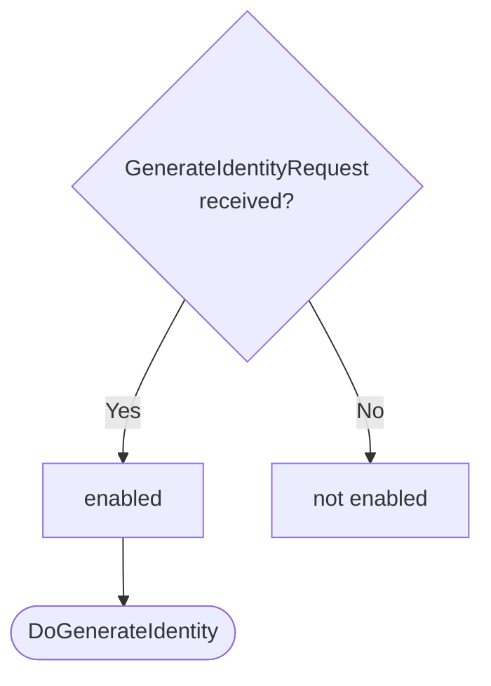
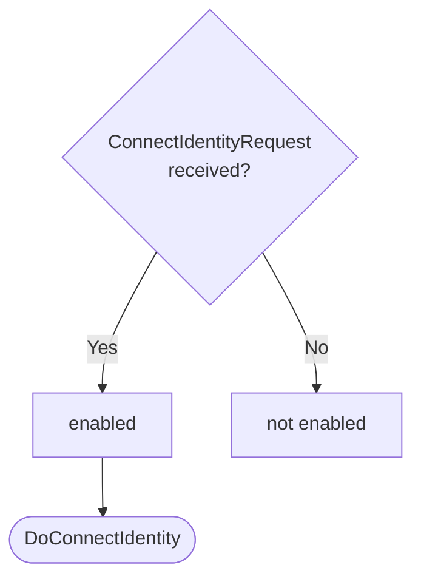
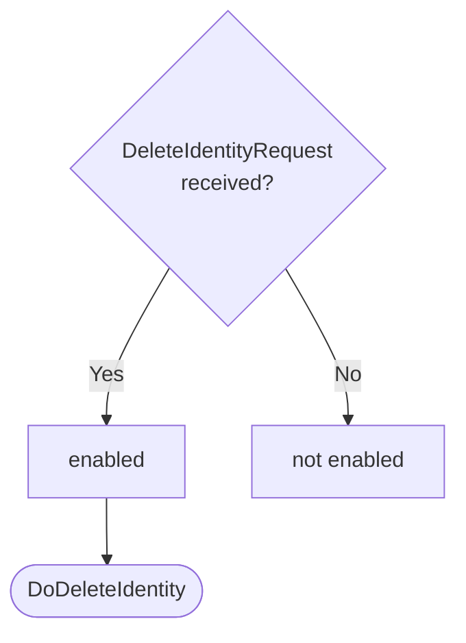

??? quote "Juvix imports"

    ```juvix
    module arch.node.engines.identity_management_behaviour;
    import prelude open;
    import arch.node.engines.commitment_environment open;
    import arch.node.engines.decryption_environment open;
    import arch.node.engines.identity_management_environment open;
    import arch.node.engines.identity_management_messages open;
    import arch.node.types.anoma_environment open;
    import arch.node.types.anoma_message open;
    import arch.node.types.engine_behaviour open;
    import arch.node.types.engine_environment open;
    import arch.node.types.identities open;
    import arch.node.types.messages open;
    import arch.system.identity.identity open hiding {ExternalIdentity};
    ```

# Identity Management Behaviour

## Overview

The behavior of the Identity Management Engine defines how it processes
incoming messages (requests) and produces the corresponding responses and
actions.

## Action labels

### `IdentityManagementActionLabelDoGenerateIdentity DoGenerateIdentity`

```juvix
type DoGenerateIdentity := mkDoGenerateIdentity {
  backend : Backend;
  params : IDParams;
  capabilities : Capabilities
};
```

This action label corresponds to generating a new identity.

???+ quote "Arguments"

    `backend`:
    : The backend to use for the new identity.

    `params`:
    : The parameters for identity generation.

    `capabilities`:
    : The capabilities requested for the new identity.

???+ quote "`DoGenerateIdentity` action effect"

    This action does the following:

    | Aspect | Description |
    |--------|-------------|
    | State update          | A new identity is created and added to the `identities` map in the local state. The identity includes information about backend, capabilities, and potentially spawned engine references. |
    | Messages to be sent   | A `GenerateIdentityResponse` message is sent to the requester, containing the new identity information including references to spawned engines (if any) or an error message if the identity already exists. |
    | Engines to be spawned | Depending on the requested capabilities, Commitment and/or Decryption engines may be spawned. |
    | Timer updates         | No timers are set or cancelled. |

### `IdentityManagementActionLabelDoConnectIdentity DoConnectIdentity`

```juvix
type DoConnectIdentity := mkDoConnectIdentity {
  externalIdentity : EngineID;
  backend : Backend;
  capabilities : Capabilities
};
```

???+ quote "Arguments"

    `externalIdentity`:
    : The external identity to connect to.

    `backend`:
    : The backend to use for the connection.

    `capabilities`:
    : The capabilities requested for the connection.

???+ quote "`DoConnectIdentity` action effect"

    This action does the following:

    | Aspect | Description |
    |--------|-------------|
    | State update          | If successful, a new entry is added to the `identities` map in the local state, copying the external identity's information to the requesting identity, filtered by the requested capabilities. |
    | Messages to be sent   | A `ConnectIdentityResponse` message is sent to the requester, confirming the connection and providing references to relevant engines, or an error message if the connection fails (e.g., identity already exists, external identity not found, or requested capabilities not available). |
    | Engines to be spawned | No new engines are spawned. The action reuses existing engine references from the external identity. |
    | Timer updates         | No timers are set or cancelled. |

### `IdentityManagementActionLabelDoDeleteIdentity DoDeleteIdentity`

```juvix
type DoDeleteIdentity := mkDoDeleteIdentity {
  externalIdentity : EngineID;
  backend : Backend
};
```

???+ quote "Arguments"

    `externalIdentity`:
    : The identity to delete.

    `backend`:
    : The backend associated with the identity.

???+ quote "`DoDeleteIdentity` action effect"

    This action does the following:

    | Aspect | Description |
    |--------|-------------|
    | State update          | The specified identity is removed from the `identities` map in the local state if it exists. |
    | Messages to be sent   | A `DeleteIdentityResponse` message is sent to the requester, confirming the deletion or providing an error message if the identity doesn't exist. |
    | Engines to be spawned | No engines are spawned by this action. |
    | Timer updates         | No timers are set or cancelled. |

### `IdentityManagementActionLabel`

```juvix
type IdentityManagementActionLabel :=
  | IdentityManagementActionLabelDoGenerateIdentity DoGenerateIdentity
  | IdentityManagementActionLabelDoConnectIdentity DoConnectIdentity
  | IdentityManagementActionLabelDoDeleteIdentity DoDeleteIdentity
;
```

## Matchable arguments

### `MessageFrom`

```juvix
type MessageFrom := mkMessageFrom {
  whoAsked : Option EngineID;
  mailbox : Option MailboxID
};
```

???+ quote "Arguments"

    `whoAsked`:
    : The engine ID of the requester.

    `mailbox`:
    : The mailbox ID where the response should be sent.

### `IdentityManagementMatchableArgument`

```juvix
type IdentityManagementMatchableArgument :=
  | IdentityManagementMatchableArgumentMessageFrom MessageFrom
;
```

## Precomputation results

The Identity Management Engine does not require any non-trivial pre-computations.

```juvix
syntax alias IdentityManagementPrecomputation := Unit;
```

## Guards

??? quote "Auxiliary Juvix code"

    Type alias for the guard.

    ```juvix
    IdentityManagementGuard : Type :=
      Guard
        IdentityManagementLocalState
        IdentityManagementMailboxState
        IdentityManagementTimerHandle
        IdentityManagementMatchableArgument
        IdentityManagementActionLabel
        IdentityManagementPrecomputation;

    IdentityManagementGuardOutput : Type :=
      GuardOutput IdentityManagementMatchableArgument IdentityManagementActionLabel IdentityManagementPrecomputation;
    ```

### `generateIdentityGuard`

<figure markdown>

<figcaption>generateIdentityGuard flowchart</figcaption>
</figure>

<!-- --8<-- [start:generateIdentityGuard] -->
```juvix
generateIdentityGuard
  (t : TimestampedTrigger IdentityManagementTimerHandle)
  (env : IdentityManagementEnvironment) : Option IdentityManagementGuardOutput
  := case getMessageFromTimestampedTrigger t of {
      | some (MsgIdentityManagement (MsgIdentityManagementGenerateIdentityRequest (mkRequestGenerateIdentity x y z))) := do {
        sender <- getSenderFromTimestampedTrigger t;
        pure (mkGuardOutput@{
                  matchedArgs := [IdentityManagementMatchableArgumentMessageFrom (mkMessageFrom (some sender) none)];
                  actionLabel := IdentityManagementActionLabelDoGenerateIdentity (mkDoGenerateIdentity x y z);
                  precomputationTasks := unit
                });
      }
      | _ := none
  };
```
<!-- --8<-- [end:generateIdentityGuard] -->

### `connectIdentityGuard`

<figure markdown>

<figcaption>connectIdentityGuard flowchart</figcaption>
</figure>

<!-- --8<-- [start:connectIdentityGuard] -->
```juvix
connectIdentityGuard
  (t : TimestampedTrigger IdentityManagementTimerHandle)
  (env : IdentityManagementEnvironment) : Option IdentityManagementGuardOutput
  := case getMessageFromTimestampedTrigger t of {
      | some (MsgIdentityManagement (MsgIdentityManagementConnectIdentityRequest (mkRequestConnectIdentity x y z))) := do {
        sender <- getSenderFromTimestampedTrigger t;
        pure (mkGuardOutput@{
                  matchedArgs := [IdentityManagementMatchableArgumentMessageFrom (mkMessageFrom (some sender) none)];
                  actionLabel := IdentityManagementActionLabelDoConnectIdentity (mkDoConnectIdentity x y z);
                  precomputationTasks := unit
                });
        }
      | _ := none
  };
```
<!-- --8<-- [end:connectIdentityGuard] -->

### `deleteIdentityGuard`

<figure markdown>

<figcaption>deleteIdentityGuard flowchart</figcaption>
</figure>

<!-- --8<-- [start:deleteIdentityGuard] -->
```juvix
deleteIdentityGuard
  (t : TimestampedTrigger IdentityManagementTimerHandle)
  (env : IdentityManagementEnvironment) : Option IdentityManagementGuardOutput
  := case getMessageFromTimestampedTrigger t of {
      | some (MsgIdentityManagement (MsgIdentityManagementDeleteIdentityRequest (mkRequestDeleteIdentity x y))) := do {
        sender <- getSenderFromTimestampedTrigger t;
        pure (mkGuardOutput@{
                  matchedArgs := [IdentityManagementMatchableArgumentMessageFrom (mkMessageFrom (some sender) none)];
                  actionLabel := IdentityManagementActionLabelDoDeleteIdentity (mkDoDeleteIdentity x y);
                  precomputationTasks := unit
                });
        }
      | _ := none
  };
```
<!-- --8<-- [end:deleteIdentityGuard] -->

## Action function

??? quote "Auxiliary Juvix code"

    Type alias for the action function.

    ```juvix
    IdentityManagementActionInput : Type :=
      ActionInput
        IdentityManagementLocalState
        IdentityManagementMailboxState
        IdentityManagementTimerHandle
        IdentityManagementMatchableArgument
        IdentityManagementActionLabel
        IdentityManagementPrecomputation;

    IdentityManagementActionEffect : Type :=
      ActionEffect
        IdentityManagementLocalState
        IdentityManagementMailboxState
        IdentityManagementTimerHandle
        IdentityManagementMatchableArgument
        IdentityManagementActionLabel
        IdentityManagementPrecomputation;
    ```

### `makeDecryptEnv`

```juvix
makeDecryptEnv
  (env : IdentityManagementEnvironment)
  (backend' : Backend)
  (addr : EngineID)
  : DecryptionEnvironment
  := let
      local := EngineEnv.localState env;
  in mkEngineEnv@{
      name := nameGen "decryptor" (EngineEnv.name env) addr;
      localState := mkDecryptionLocalState@{
        decryptor := IdentityManagementLocalState.genDecryptor local backend';
        backend := backend';
      };
      -- The Decryption engine has one empty mailbox.
      mailboxCluster := Map.fromList [(mkPair 0 (mkMailbox@{
        messages := [];
        mailboxState := none;
      }))];
      acquaintances := Set.fromList [nameStr addr];
      timers := []
    };
```

### `makeCommitmentEnv`

```juvix
makeCommitmentEnv
  (env : IdentityManagementEnvironment)
  (backend' : Backend)
  (addr : EngineID)
  : CommitmentEnvironment
  := let
      local := EngineEnv.localState env;
    in mkEngineEnv@{
      name := nameGen "committer" (EngineEnv.name env) addr;
      localState := mkCommitmentLocalState@{
        signer := IdentityManagementLocalState.genSigner local backend';
        backend := backend';
      };
      -- The Commitment engine has one empty mailbox.
      mailboxCluster := Map.fromList [(mkPair 0 (mkMailbox@{
        messages := [];
        mailboxState := none;
      }))];
      acquaintances := Set.fromList [nameStr addr];
      timers := []
    };
```

### `hasCommitCapability`

```juvix
hasCommitCapability (capabilities : Capabilities) : Bool :=
  case capabilities of {
    | CapabilityCommit := true
    | CapabilityCommitAndDecrypt := true
    | _ := false
  };
```

### `hasDecryptCapability`

```juvix
hasDecryptCapability (capabilities : Capabilities) : Bool :=
  case capabilities of {
    | CapabilityDecrypt := true
    | CapabilityCommitAndDecrypt := true
    | _ := false
  };
```

### `isSubsetCapabilities`

```juvix
isSubsetCapabilities
  (requested : Capabilities)
  (available : Capabilities)
  : Bool
  := (not (hasCommitCapability requested) || hasCommitCapability available)
  && (not (hasDecryptCapability requested) || hasDecryptCapability available);
```

### `updateIdentityAndSpawnEngines`

```juvix
updateIdentityAndSpawnEngines
  (env : IdentityManagementEnvironment)
  (backend' : Backend)
  (whoAsked : EngineID)
  (identityInfo : IdentityInfo)
  (capabilities' : Capabilities)
  : Pair IdentityInfo (List Env)
  := case capabilities' of {
    | CapabilityCommitAndDecrypt :=
        let commitmentEnv := makeCommitmentEnv env backend' whoAsked;
            commitmentEngineName := EngineEnv.name commitmentEnv;
            decryptionEnv := makeDecryptEnv env backend' whoAsked;
            decryptionEngineName := EngineEnv.name decryptionEnv;
            spawnedEngines := [EnvCommitment commitmentEnv; EnvDecryption decryptionEnv];
            updatedIdentityInfo1 := identityInfo@IdentityInfo{
              commitmentEngine := some (mkPair none (some commitmentEngineName));
              decryptionEngine := some (mkPair none (some decryptionEngineName))
            };
        in mkPair updatedIdentityInfo1 spawnedEngines
    | CapabilityCommit :=
        let commitmentEnv := makeCommitmentEnv env backend' whoAsked;
            commitmentEngineName := EngineEnv.name commitmentEnv;
            spawnedEngines := [EnvCommitment commitmentEnv];
            updatedIdentityInfo1 := identityInfo@IdentityInfo{
              commitmentEngine := some (mkPair none (some commitmentEngineName))
            };
        in mkPair updatedIdentityInfo1 spawnedEngines
    | CapabilityDecrypt :=
        let decryptionEnv := makeDecryptEnv env backend' whoAsked;
            decryptionEngineName := EngineEnv.name decryptionEnv;
            spawnedEngines := [EnvDecryption decryptionEnv];
            updatedIdentityInfo1 := identityInfo@IdentityInfo{
              decryptionEngine := some (mkPair none (some decryptionEngineName))
            };
        in mkPair updatedIdentityInfo1 spawnedEngines
  };
```

### `copyEnginesForCapabilities`

```juvix
copyEnginesForCapabilities
  (env : IdentityManagementEnvironment)
  (whoAsked : EngineID)
  (externalIdentityInfo : IdentityInfo)
  (requestedCapabilities : Capabilities)
  : IdentityInfo
  :=
  let newIdentityInfo := mkIdentityInfo@{
        backend := IdentityInfo.backend externalIdentityInfo;
        capabilities := requestedCapabilities;
        commitmentEngine :=
          case hasCommitCapability requestedCapabilities of {
            | true := IdentityInfo.commitmentEngine externalIdentityInfo
            | false := none
          };
        decryptionEngine :=
          case hasDecryptCapability requestedCapabilities of {
            | true := IdentityInfo.decryptionEngine externalIdentityInfo
            | false := none
          }
      };
  in newIdentityInfo;
```

### `identityManagementAction`

<!-- --8<-- [start:identityManagementAction] -->

```juvix
identityManagementAction
  (input : IdentityManagementActionInput)
  : IdentityManagementActionEffect
  := let env := ActionInput.env input;
      out := ActionInput.guardOutput input;
      local := EngineEnv.localState env;
      identities := IdentityManagementLocalState.identities local;
  in
  case GuardOutput.actionLabel out of {
    | IdentityManagementActionLabelDoGenerateIdentity (mkDoGenerateIdentity backend' params' capabilities') :=
      case GuardOutput.matchedArgs out of {
        | (IdentityManagementMatchableArgumentMessageFrom (mkMessageFrom (some whoAsked) _)) :: _ :=
            case Map.lookup whoAsked identities of {
              | some _ :=
                  -- Identity already exists, return error
                  let responseMsg := mkResponseGenerateIdentity@{
                    commitmentEngine := none;
                    decryptionEngine := none;
                    externalIdentity := whoAsked;
                    err := some "Identity already exists"
                  };
                  in mkActionEffect@{
                    newEnv := env;
                    producedMessages := [mkEngineMsg@{
                      sender := mkPair none (some (EngineEnv.name env));
                      target := whoAsked;
                      mailbox := some 0;
                      msg := MsgIdentityManagement (MsgIdentityManagementGenerateIdentityResponse responseMsg)
                    }];
                    timers := [];
                    spawnedEngines := []
                  }
              | none :=
                  -- Proceed to create identity
                  let identityInfo := mkIdentityInfo@{
                        backend := backend';
                        capabilities := capabilities';
                        commitmentEngine := none;
                        decryptionEngine := none
                      };
                      -- Update identityInfo and spawnedEngines based on capabilities
                      pair' := updateIdentityAndSpawnEngines env backend' whoAsked identityInfo capabilities';
                      updatedIdentityInfo := fst pair';
                      spawnedEnginesFinal := snd pair';
                      updatedIdentities := Map.insert whoAsked updatedIdentityInfo identities;
                      newLocalState := local@IdentityManagementLocalState{
                        identities := updatedIdentities
                      };
                      newEnv' := env@EngineEnv{
                        localState := newLocalState
                      };
                      responseMsg := mkResponseGenerateIdentity@{
                        commitmentEngine := IdentityInfo.commitmentEngine updatedIdentityInfo;
                        decryptionEngine := IdentityInfo.decryptionEngine updatedIdentityInfo;
                        externalIdentity := whoAsked;
                        err := none
                      };
                  in mkActionEffect@{
                    newEnv := newEnv';
                    producedMessages := [mkEngineMsg@{
                      sender := mkPair none (some (EngineEnv.name env));
                      target := whoAsked;
                      mailbox := some 0;
                      msg := MsgIdentityManagement (MsgIdentityManagementGenerateIdentityResponse responseMsg)
                    }];
                    timers := [];
                    spawnedEngines := spawnedEnginesFinal
                  }
            }
        | _ := mkActionEffect@{newEnv := env; producedMessages := []; timers := []; spawnedEngines := []}
      }

    | IdentityManagementActionLabelDoConnectIdentity (mkDoConnectIdentity externalIdentity' backend' capabilities') :=
      case GuardOutput.matchedArgs out of {
        | (IdentityManagementMatchableArgumentMessageFrom (mkMessageFrom (some whoAsked) _)) :: _ :=
            -- Check if whoAsked already exists
            case Map.lookup whoAsked identities of {
              | some _ :=
                  -- whoAsked already exists, return error
                  let responseMsg := mkConnectIdentityResponse@{
                    commitmentEngine := none;
                    decryptionEngine := none;
                    err := some "Identity already exists"
                  };
                  in mkActionEffect@{
                    newEnv := env;
                    producedMessages := [mkEngineMsg@{
                      sender := mkPair none (some (EngineEnv.name env));
                      target := whoAsked;
                      mailbox := some 0;
                      msg := MsgIdentityManagement (MsgIdentityManagementConnectIdentityResponse responseMsg)
                    }];
                    timers := [];
                    spawnedEngines := []
                  }
              | none :=
                  -- whoAsked does not exist, proceed
                  case Map.lookup externalIdentity' identities of {
                    | none :=
                        -- externalIdentity' does not exist, return error
                        let responseMsg := mkConnectIdentityResponse@{
                          commitmentEngine := none;
                          decryptionEngine := none;
                          err := some "External identity not found"
                        };
                        in mkActionEffect@{
                          newEnv := env;
                          producedMessages := [mkEngineMsg@{
                            sender := mkPair none (some (EngineEnv.name env));
                            target := whoAsked;
                            mailbox := some 0;
                            msg := MsgIdentityManagement (MsgIdentityManagementConnectIdentityResponse responseMsg)
                          }];
                          timers := [];
                          spawnedEngines := []
                        }
                    | some externalIdentityInfo :=
                        -- Compare capabilities
                        let externalCapabilities := IdentityInfo.capabilities externalIdentityInfo;
                            requestedCapabilities := capabilities';
                            isSubset := isSubsetCapabilities requestedCapabilities externalCapabilities;
                        in
                        case isSubset of {
                          | true :=
                              -- Capabilities are a subset, proceed
                              -- Copy the engine information for the requested capabilities
                              let newIdentityInfo := copyEnginesForCapabilities env whoAsked externalIdentityInfo requestedCapabilities;
                                  updatedIdentities := Map.insert whoAsked newIdentityInfo identities;
                                  newLocalState := local@IdentityManagementLocalState{
                                    identities := updatedIdentities
                                  };
                                  newEnv' := env@EngineEnv{
                                    localState := newLocalState
                                  };
                                  responseMsg := mkConnectIdentityResponse@{
                                    commitmentEngine := IdentityInfo.commitmentEngine newIdentityInfo;
                                    decryptionEngine := IdentityInfo.decryptionEngine newIdentityInfo;
                                    err := none
                                  };
                              in mkActionEffect@{
                                newEnv := newEnv';
                                producedMessages := [mkEngineMsg@{
                                  sender := mkPair none (some (EngineEnv.name env));
                                  target := whoAsked;
                                  mailbox := some 0;
                                  msg := MsgIdentityManagement (MsgIdentityManagementConnectIdentityResponse responseMsg);
                                }];
                                timers := [];
                                spawnedEngines := []
                              }
                          | false :=
                              -- Capabilities not a subset, return error
                              let responseMsg := mkConnectIdentityResponse@{
                                commitmentEngine := none;
                                decryptionEngine := none;
                                err := some "Requested capabilities not available"
                              };
                              in mkActionEffect@{
                                newEnv := env;
                                producedMessages := [mkEngineMsg@{
                                  sender := mkPair none (some (EngineEnv.name env));
                                  target := whoAsked;
                                  mailbox := some 0;
                                  msg := MsgIdentityManagement (MsgIdentityManagementConnectIdentityResponse responseMsg)
                                }];
                                timers := [];
                                spawnedEngines := []
                              }
                        }
                  }
            }
        | _ := mkActionEffect@{newEnv := env; producedMessages := []; timers := []; spawnedEngines := []}
      }

    | IdentityManagementActionLabelDoDeleteIdentity (mkDoDeleteIdentity externalIdentity backend') :=
      case GuardOutput.matchedArgs out of {
        | (IdentityManagementMatchableArgumentMessageFrom (mkMessageFrom (some whoAsked) _)) :: _ :=
            -- Check if the identity exists
            case Map.lookup externalIdentity identities of {
              | none :=
                  -- Identity does not exist, return error
                  let responseMsg := mkResponseDeleteIdentity@{
                    err := some "Identity does not exist"
                  };
                  in mkActionEffect@{
                    newEnv := env;
                    producedMessages := [mkEngineMsg@{
                      sender := mkPair none (some (EngineEnv.name env));
                      target := whoAsked;
                      mailbox := some 0;
                      msg := MsgIdentityManagement (MsgIdentityManagementDeleteIdentityResponse responseMsg)
                    }];
                    timers := [];
                    spawnedEngines := []
                  }
              | some _ :=
                  -- Identity exists, proceed to delete
                  let updatedIdentities := Map.delete externalIdentity identities;
                      newLocalState := local@IdentityManagementLocalState{
                        identities := updatedIdentities
                      };
                      newEnv' := env@EngineEnv{
                        localState := newLocalState
                      };
                      responseMsg := mkResponseDeleteIdentity@{
                        err := none
                      };
                  in mkActionEffect@{
                    newEnv := newEnv';
                    producedMessages := [mkEngineMsg@{
                      sender := mkPair none (some (EngineEnv.name env));
                      target := whoAsked;
                      mailbox := some 0;
                      msg := MsgIdentityManagement (MsgIdentityManagementDeleteIdentityResponse responseMsg)
                    }];
                    timers := [];
                    spawnedEngines := []
                  }
            }
        | _ := mkActionEffect@{newEnv := env; producedMessages := []; timers := []; spawnedEngines := []}
      }
  };
```
<!-- --8<-- [end:identityManagementAction] -->

## Conflict solver

```juvix
identityManagementConflictSolver : Set IdentityManagementMatchableArgument -> List (Set IdentityManagementMatchableArgument)
  | _ := [];
```

## The Identity Management Behaviour

### `IdentityManagementBehaviour`

<!-- --8<-- [start:IdentityManagementBehaviour] -->
```juvix
IdentityManagementBehaviour : Type :=
  EngineBehaviour
    IdentityManagementLocalState
    IdentityManagementMailboxState
    IdentityManagementTimerHandle
    IdentityManagementMatchableArgument
    IdentityManagementActionLabel
    IdentityManagementPrecomputation;
```
<!-- --8<-- [end:IdentityManagementBehaviour] -->

### Instantiation

<!-- --8<-- [start:identityManagementBehaviour] -->
```juvix
identityManagementBehaviour : IdentityManagementBehaviour :=
  mkEngineBehaviour@{
    guards := [generateIdentityGuard; connectIdentityGuard; deleteIdentityGuard];
    action := identityManagementAction;
    conflictSolver := identityManagementConflictSolver;
  }
```
<!-- --8<-- [end:identityManagementBehaviour] -->