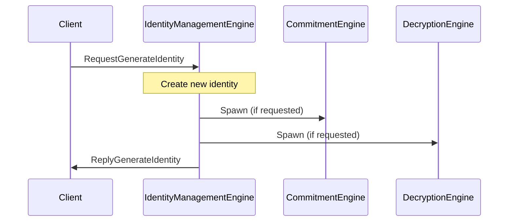
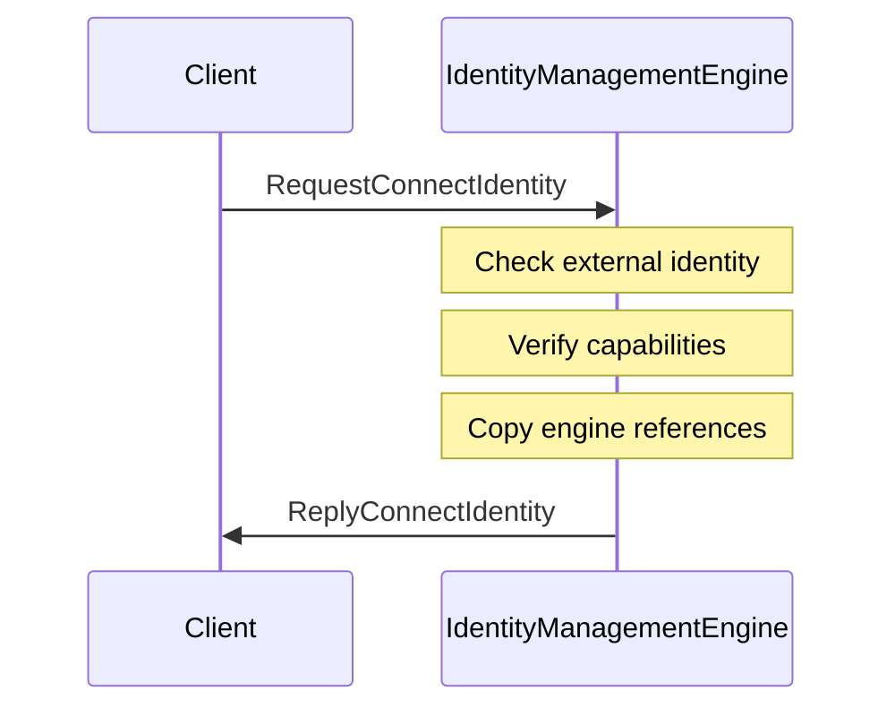
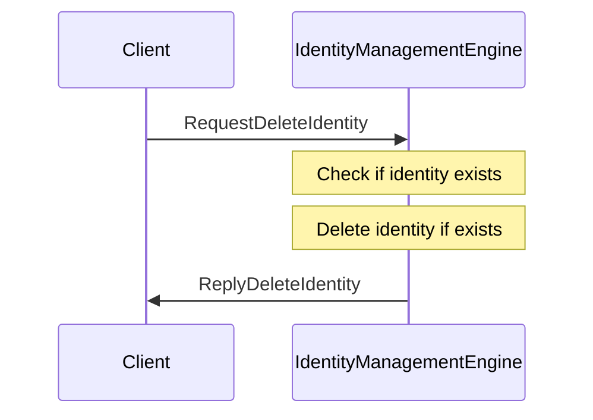

??? quote "Juvix imports"

    ```juvix
    module arch.node.engines.identity_management_messages;
    import prelude open;
    import arch.node.types.identities open;
    ```

# Identity Management Messages

## Message interface

--8<-- "./identity_management_messages.juvix.md:IdentityManagementMsg"

## Message sequence diagrams

---

### Generating an identity

<!-- --8<-- [start:message-sequence-diagram-generate] -->
<figure markdown="span">



<figcaption markdown="span">
Generating an identity
</figcaption>
</figure>
<!-- --8<-- [end:message-sequence-diagram-generate] -->

---

### Connecting to an existing identity

<!-- --8<-- [start:message-sequence-diagram-connect] -->
<figure markdown="span">



<figcaption markdown="span">
Connecting to an existing identity
</figcaption>
</figure>
<!-- --8<-- [end:message-sequence-diagram-connect] -->

---

### Deleting an identity

<!-- --8<-- [start:message-sequence-diagram-delete] -->
<figure markdown="span">



<figcaption markdown="span">
Deleting an identity
</figcaption>
</figure>
<!-- --8<-- [end:message-sequence-diagram-delete] -->

---

## Message types

### `RequestGenerateIdentity`

```juvix
type RequestGenerateIdentity := mkRequestGenerateIdentity@{
  backend : Backend;
  params : IDParams;
  capabilities : Capabilities
};
```

A `RequestGenerateIdentity` instructs the Identity Management Engine to generate
a new identity using the specified backend, parameters, and capabilities.

???+ quote "Arguments"

    `backend`:
    : The backend to use for identity generation.

    `params`:
    : Parameters to pass to the backend.

    `capabilities`:
    : Capabilities to request (e.g., commitment, decryption, or both).

---

### `ReplyGenerateIdentity`

```juvix
type ReplyGenerateIdentity := mkReplyGenerateIdentity@{
  commitmentEngine : Option EngineID;
  decryptionEngine : Option EngineID;
  externalIdentity : EngineID;
  err : Option String
};
```

A `ReplyGenerateIdentity` provides the handles to the decryption and
commitment engine instances for the newly generated identity, or an error if a
failure occurred.

???+ quote "Arguments"

    `commitmentEngine`:
    : Reference to the newly instantiated commitment engine.

    `decryptionEngine`:
    : Reference to the newly instantiated decryption engine.

    `externalIdentity`:
    : The external identity of the newly created identity.

    `err`:
    : An error message if identity generation failed.

---

### `RequestConnectIdentity`

```juvix
type RequestConnectIdentity := mkRequestConnectIdentity@{
  externalIdentity : EngineID;
  backend : Backend;
  capabilities : Capabilities
};
```

A `RequestConnectIdentity` instructs the Identity Management Engine to connect
to an existing identity using the specified backend.

???+ quote "Arguments"

    `externalIdentity`:
    : The external identity to connect.

    `backend`:
    : The backend to use for the connection.

    `capabilities`:
    : Capabilities to request (e.g., commitment, decryption, or both).

---

### `ReplyConnectIdentity`

```juvix
type ReplyConnectIdentity := mkReplyConnectIdentity@{
  commitmentEngine : Option EngineID;
  decryptionEngine : Option EngineID;
  err : Option String
};
```

A `ReplyConnectIdentity` provides the handles to the decryption and
commitment engine instances for the connected identity, or an error if a failure
occurred.

???+ quote "Arguments"

    `commitmentEngine`:
    : Reference to the newly connected commitment engine.

    `decryptionEngine`:
    : Reference to the newly connected decryption engine.

    `err`:
    : An error message if identity connection failed.

---

### `RequestDeleteIdentity`

```juvix
type RequestDeleteIdentity := mkRequestDeleteIdentity@{
  externalIdentity : EngineID;
  backend : Backend
};
```

A `RequestDeleteIdentity` instructs the Identity Management Engine to delete an
existing identity using the specified backend.

???+ quote "Arguments"

    `externalIdentity`:
    : The external identity to delete.

    `backend`:
    : The backend to use for deletion.

---

### `ReplyDeleteIdentity`

```juvix
type ReplyDeleteIdentity := mkReplyDeleteIdentitsy@{
  err : Option String
};
```

A `ReplyDeleteIdentity` provides the response from an attempt to delete an
identity.

???+ quote "Arguments"

    `err`:
    : An error message if identity deletion failed.

---

### `IdentityManagementMsg`

<!-- --8<-- [start:IdentityManagementMsg] -->
```juvix
type IdentityManagementMsg :=
  | MsgIdentityManagementGenerateIdentityRequest RequestGenerateIdentity
  | MsgIdentityManagementGenerateIdentityReply ReplyGenerateIdentity
  | MsgIdentityManagementConnectIdentityRequest RequestConnectIdentity
  | MsgIdentityManagementConnectIdentityReply ReplyConnectIdentity
  | MsgIdentityManagementDeleteIdentityRequest RequestDeleteIdentity
  | MsgIdentityManagementDeleteIdentityReply ReplyDeleteIdentity
  ;
```
<!-- --8<-- [end:IdentityManagementMsg] -->

---

## Engine components

- [[Identity Management Configuration]]
- [[Identity Management Environment]]
- [[Identity Management Behaviour]]