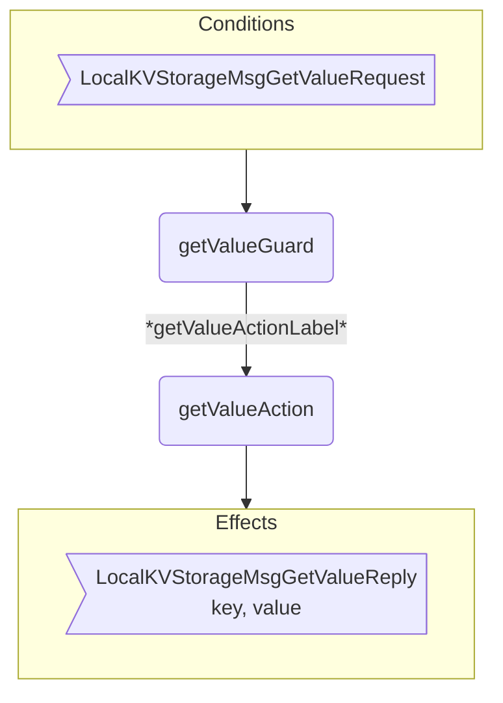
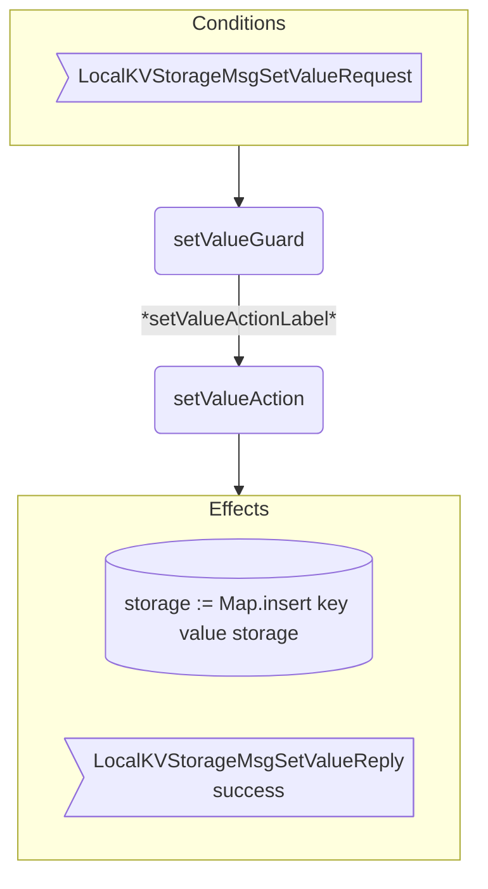
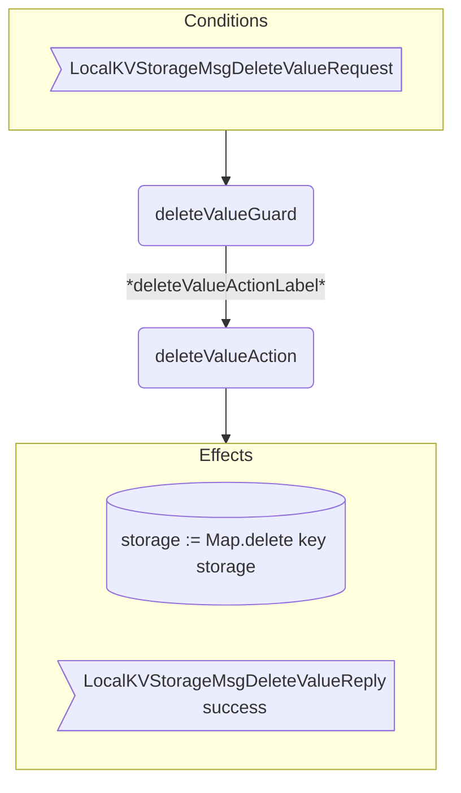

??? code "Juvix imports"

    ```juvix
    module arch.node.engines.local_key_value_storage_behaviour;

    import arch.node.engines.local_key_value_storage_messages open;
    import arch.node.engines.local_key_value_storage_config open;
    import arch.node.engines.local_key_value_storage_environment open;

    import prelude open;
    import arch.node.types.basics open;
    import arch.node.types.identities open;
    import arch.node.types.messages open;
    import arch.node.types.engine open;
    import arch.node.types.anoma as Anoma open;
    ```

# Local Key-Value Storage Behaviour

## Overview

The Local Key-Value Storage engine processes get, set, and delete operations on key-value pairs.

## Action arguments

### `LocalKVStorageActionArgument`

<!-- --8<-- [start:LocalKVStorageActionArgument] -->
```juvix
type LocalKVStorageActionArgument :=
  | LocalKVStorageReplyTo EngineID
  ;
```
<!-- --8<-- [end:LocalKVStorageActionArgument] -->

### `LocalKVStorageActionArguments`

<!-- --8<-- [start:LocalKVStorageActionArguments] -->
```juvix
LocalKVStorageActionArguments : Type := List LocalKVStorageActionArgument;
```
<!-- --8<-- [end:LocalKVStorageActionArguments] -->

## Actions

??? code "Auxiliary Juvix code"

    ### `LocalKVStorageAction`

    <!-- --8<-- [start:LocalKVStorageAction] -->
    ```juvix
    LocalKVStorageAction : Type :=
      Action
        LocalKVStorageCfg
        LocalKVStorageLocalState
        LocalKVStorageMailboxState
        LocalKVStorageTimerHandle
        LocalKVStorageActionArguments
        Anoma.Msg
        Anoma.Cfg
        Anoma.Env;
    ```
    <!-- --8<-- [end:LocalKVStorageAction] -->

    ### `LocalKVStorageActionInput`

    <!-- --8<-- [start:LocalKVStorageActionInput] -->
    ```juvix
    LocalKVStorageActionInput : Type :=
      ActionInput
        LocalKVStorageCfg
        LocalKVStorageLocalState
        LocalKVStorageMailboxState
        LocalKVStorageTimerHandle
        LocalKVStorageActionArguments
        Anoma.Msg;
    ```
    <!-- --8<-- [end:LocalKVStorageActionInput] -->

    ### `LocalKVStorageActionEffect`

    <!-- --8<-- [start:LocalKVStorageActionEffect] -->
    ```juvix
    LocalKVStorageActionEffect : Type :=
      ActionEffect
        LocalKVStorageLocalState
        LocalKVStorageMailboxState
        LocalKVStorageTimerHandle
        Anoma.Msg
        Anoma.Cfg
        Anoma.Env;
    ```
    <!-- --8<-- [end:LocalKVStorageActionEffect] -->

    ### `LocalKVStorageActionExec`

    <!-- --8<-- [start:LocalKVStorageActionExec] -->
    ```juvix
    LocalKVStorageActionExec : Type :=
      ActionExec
        LocalKVStorageCfg
        LocalKVStorageLocalState
        LocalKVStorageMailboxState
        LocalKVStorageTimerHandle
        LocalKVStorageActionArguments
        Anoma.Msg
        Anoma.Cfg
        Anoma.Env;
    ```
    <!-- --8<-- [end:LocalKVStorageActionExec] -->

### `getValueAction`

Retrieve a value from storage by key.

State update
: The state remains unchanged.

Messages to be sent
: A `GetValueKVStoreReply` message with the requested value.

Engines to be spawned
: No engines are created by this action.

Timer updates
: No timers are set or cancelled.

<!-- --8<-- [start:getValueAction] -->
```juvix
getValueAction
  (input : LocalKVStorageActionInput)
  : Option LocalKVStorageActionEffect :=
  let
    env := ActionInput.env input;
    cfg := ActionInput.cfg input;
    local := EngineEnv.localState env;
    storage := LocalKVStorageLocalState.storage local;
    trigger := ActionInput.trigger input;
  in case getEngineMsgFromTimestampedTrigger trigger of {
    | some emsg :=
      case emsg of {
        | mkEngineMsg@{msg := Anoma.MsgLocalKVStorage (LocalKVStorageMsgGetValueRequest req)} :=
          some mkActionEffect@{
            env := env;
            msgs := [mkEngineMsg@{
              sender := getEngineIDFromEngineCfg cfg;
              target := EngineMsg.sender emsg;
              mailbox := some 0;
              msg := Anoma.MsgLocalKVStorage (LocalKVStorageMsgGetValueReply
                (mkGetValueKVStoreReply@{
                  key := GetValueKVStoreRequest.key req;
                  value := fromOption (Map.lookup (GetValueKVStoreRequest.key req) storage) ""
                }))
            }];
            timers := [];
            engines := [];
          }
        | _ := none
      }
    | _ := none
  };
```
<!-- --8<-- [end:getValueAction] -->

### `setValueAction`

Store a value in storage with given key.

State update
: The storage map is updated with new key-value pair.

Messages to be sent
: A `SetValueKVStoreReply` message indicating success/failure.
: Several `LocalKVStorageMsgValueChanged` messages to those interested engines.

Engines to be spawned
: No engines are created by this action.

Timer updates
: No timers are set or cancelled.

<!-- --8<-- [start:setValueAction] -->
```juvix
setValueAction
  (input : LocalKVStorageActionInput)
  : Option LocalKVStorageActionEffect :=
  let
    env := ActionInput.env input;
    cfg := ActionInput.cfg input;
    local := EngineEnv.localState env;
    storage := LocalKVStorageLocalState.storage local;
    trigger := ActionInput.trigger input;
    newTime := advanceTime (LocalKVStorageLocalState.localClock local)
  in case getEngineMsgFromTimestampedTrigger trigger of {
    | some emsg :=
      case emsg of {
        | mkEngineMsg@{msg := Anoma.MsgLocalKVStorage (LocalKVStorageMsgSetValueRequest req)} :=
          let
            key := SetValueKVStoreRequest.key req;
            value := SetValueKVStoreRequest.value req;
            newStorage := Map.insert key value storage;
            newLocal := local@LocalKVStorageLocalState{storage := newStorage; localClock := newTime};
            newEnv := env@EngineEnv{localState := newLocal};
            responseMsg := mkEngineMsg@{
              sender := getEngineIDFromEngineCfg cfg;
              target := EngineMsg.sender emsg;
              mailbox := some 0;
              msg := Anoma.MsgLocalKVStorage (LocalKVStorageMsgSetValueReply
                (mkSetValueKVStoreReply@{
                  key := key;
                  success := true
                }))
            };
            notificationMsg := \{target := mkEngineMsg@{
              sender := getEngineIDFromEngineCfg cfg;
              target := target;
              mailbox := some 0;
              msg := Anoma.MsgLocalKVStorage (LocalKVStorageMsgValueChanged
                (mkValueChangedKVStore@{
                  key := key;
                  value := value;
                  timestamp := newTime
                }))
            }};
            notificationMsgs := map notificationMsg (getNotificationTargets key);
          in some mkActionEffect@{
            env := newEnv;
            msgs := responseMsg :: notificationMsgs;
            timers := [];
            engines := [];
          }
        | _ := none
      }
    | _ := none
  };
```
<!-- --8<-- [end:setValueAction] -->

### `deleteValueAction`

Remove a value from storage by key.

State update
: The storage map is updated to remove the key-value pair.

Messages to be sent
: A `DeleteValueKVStoreReply message` indicating success/failure.
: Several `LocalKVStorageMsgValueChanged` messages to those interested engines.

Engines to be spawned
: No engines are created by this action.

Timer updates
: No timers are set or cancelled.

<!-- --8<-- [start:deleteValueAction] -->
```juvix
deleteValueAction
  (input : LocalKVStorageActionInput)
  : Option LocalKVStorageActionEffect :=
  let
    env := ActionInput.env input;
    cfg := ActionInput.cfg input;
    local := EngineEnv.localState env;
    storage := LocalKVStorageLocalState.storage local;
    trigger := ActionInput.trigger input;
    newTime := advanceTime (LocalKVStorageLocalState.localClock local)
  in case getEngineMsgFromTimestampedTrigger trigger of {
    | some emsg :=
      case emsg of {
        | mkEngineMsg@{msg := Anoma.MsgLocalKVStorage (LocalKVStorageMsgDeleteValueRequest req)} :=
          let
            key := DeleteValueKVStoreRequest.key req;
            newStorage := Map.delete key storage;
            newLocal := local@LocalKVStorageLocalState{storage := newStorage; localClock := newTime};
            newEnv := env@EngineEnv{localState := newLocal};
            responseMsg := mkEngineMsg@{
              sender := getEngineIDFromEngineCfg cfg;
              target := EngineMsg.sender emsg;
              mailbox := some 0;
              msg := Anoma.MsgLocalKVStorage (LocalKVStorageMsgDeleteValueReply
                (mkDeleteValueKVStoreReply@{
                  key := key;
                  success := true
                }))
            };
            notificationMsg := \{target := mkEngineMsg@{
              sender := getEngineIDFromEngineCfg cfg;
              target := target;
              mailbox := some 0;
              msg := Anoma.MsgLocalKVStorage (LocalKVStorageMsgValueChanged
                (mkValueChangedKVStore@{
                  key := key;
                  value := "";
                  timestamp := newTime
                }))
            }};
            notificationMsgs := map notificationMsg (getNotificationTargets key);
          in some mkActionEffect@{
            env := newEnv;
            msgs := responseMsg :: notificationMsgs;
            timers := [];
            engines := [];
          }
        | _ := none
      }
    | _ := none
  };
```
<!-- --8<-- [end:deleteValueAction] -->

## Action Labels

### `getValueActionLabel`

```juvix
getValueActionLabel : LocalKVStorageActionExec := Seq [ getValueAction ];
```

### `setValueActionLabel`

```juvix
setValueActionLabel : LocalKVStorageActionExec := Seq [ setValueAction ];
```

### `deleteValueActionLabel`

```juvix
deleteValueActionLabel : LocalKVStorageActionExec := Seq [ deleteValueAction ];
```

## Guards

??? code "Auxiliary Juvix code"

    ### `LocalKVStorageGuard`

    <!-- --8<-- [start:LocalKVStorageGuard] -->
    ```juvix
    LocalKVStorageGuard : Type :=
      Guard
        LocalKVStorageCfg
        LocalKVStorageLocalState
        LocalKVStorageMailboxState
        LocalKVStorageTimerHandle
        LocalKVStorageActionArguments
        Anoma.Msg
        Anoma.Cfg
        Anoma.Env;
    ```
    <!-- --8<-- [end:LocalKVStorageGuard] -->

    ### `LocalKVStorageGuardOutput`

    <!-- --8<-- [start:LocalKVStorageGuardOutput] -->
    ```juvix
    LocalKVStorageGuardOutput : Type :=
      GuardOutput
        LocalKVStorageCfg
        LocalKVStorageLocalState
        LocalKVStorageMailboxState
        LocalKVStorageTimerHandle
        LocalKVStorageActionArguments
        Anoma.Msg
        Anoma.Cfg
        Anoma.Env;
    ```
    <!-- --8<-- [end:LocalKVStorageGuardOutput] -->

    ### `LocalKVStorageGuardEval`

    <!-- --8<-- [start:LocalKVStorageGuardEval] -->
    ```juvix
    LocalKVStorageGuardEval : Type :=
      GuardEval
        LocalKVStorageCfg
        LocalKVStorageLocalState
        LocalKVStorageMailboxState
        LocalKVStorageTimerHandle
        LocalKVStorageActionArguments
        Anoma.Msg
        Anoma.Cfg
        Anoma.Env;
    ```
    <!-- --8<-- [end:LocalKVStorageGuardEval] -->

### `getValueGuard`

Condition
: Message type is `LocalKVStorageMsgGetValueRequest`.

<!-- --8<-- [start:getValueGuard] -->
```juvix
getValueGuard
  (trigger : LocalKVStorageTimestampedTrigger)
  (cfg : EngineCfg LocalKVStorageCfg)
  (env : LocalKVStorageEnv)
  : Option LocalKVStorageGuardOutput :=
  case getEngineMsgFromTimestampedTrigger trigger of {
    | some mkEngineMsg@{msg := Anoma.MsgLocalKVStorage (LocalKVStorageMsgGetValueRequest _)} :=
      some mkGuardOutput@{
        action := getValueActionLabel;
        args := [];
      }
    | _ := none
  };
```
<!-- --8<-- [end:getValueGuard] -->

### `setValueGuard`

Condition
: Message type is `LocalKVStorageMsgSetValueRequest`.

<!-- --8<-- [start:setValueGuard] -->
```juvix
setValueGuard
  (trigger : LocalKVStorageTimestampedTrigger)
  (cfg : EngineCfg LocalKVStorageCfg)
  (env : LocalKVStorageEnv)
  : Option LocalKVStorageGuardOutput :=
  case getEngineMsgFromTimestampedTrigger trigger of {
    | some mkEngineMsg@{msg := Anoma.MsgLocalKVStorage (LocalKVStorageMsgSetValueRequest _)} :=
      some mkGuardOutput@{
        action := setValueActionLabel;
        args := [];
      }
    | _ := none
  };
```
<!-- --8<-- [end:setValueGuard] -->

### `deleteValueGuard`

Condition
: Message type is `LocalKVStorageMsgDeleteValueRequest`.

<!-- --8<-- [start:deleteValueGuard] -->
```juvix
deleteValueGuard
  (trigger : LocalKVStorageTimestampedTrigger)
  (cfg : EngineCfg LocalKVStorageCfg)
  (env : LocalKVStorageEnv)
  : Option LocalKVStorageGuardOutput :=
  case getEngineMsgFromTimestampedTrigger trigger of {
    | some mkEngineMsg@{msg := Anoma.MsgLocalKVStorage (LocalKVStorageMsgDeleteValueRequest _)} :=
      some mkGuardOutput@{
        action := deleteValueActionLabel;
        args := [];
      }
    | _ := none
  };
```
<!-- --8<-- [end:deleteValueGuard] -->

## The Local Key-Value Storage behaviour

### `LocalKVStorageBehaviour`

<!-- --8<-- [start:LocalKVStorageBehaviour] -->
```juvix
LocalKVStorageBehaviour : Type :=
  EngineBehaviour
    LocalKVStorageCfg
    LocalKVStorageLocalState
    LocalKVStorageMailboxState
    LocalKVStorageTimerHandle
    LocalKVStorageActionArguments
    Anoma.Msg
    Anoma.Cfg
    Anoma.Env;
```
<!-- --8<-- [end:LocalKVStorageBehaviour] -->

#### Instantiation

<!-- --8<-- [start:localKVStorageBehaviour] -->
```juvix
localKVStorageBehaviour : LocalKVStorageBehaviour :=
  mkEngineBehaviour@{
    guards := First [
      getValueGuard;
      setValueGuard;
      deleteValueGuard;
    ];
  };
```
<!-- --8<-- [end:localKVStorageBehaviour] -->

## Local Key-Value Storage Action Flowcharts

### `getValue` Flowchart

<figure markdown>



<figcaption markdown="span">
getValue flowchart
</figcaption>
</figure>

### `setValue` Flowchart

<figure markdown>



<figcaption markdown="span">
setValue flowchart
</figcaption>
</figure>

### `deleteValue` Flowchart

<figure markdown>



<figcaption markdown="span">
deleteValue flowchart
</figcaption>
</figure>