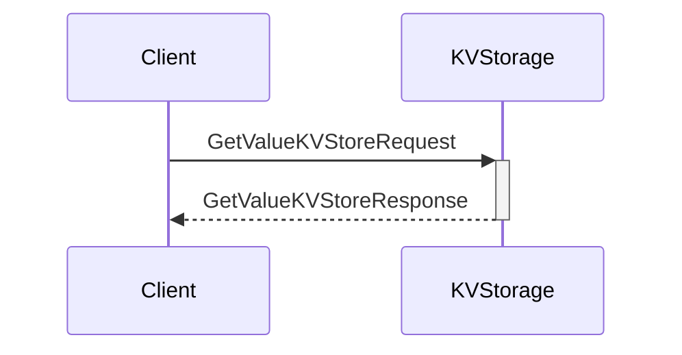
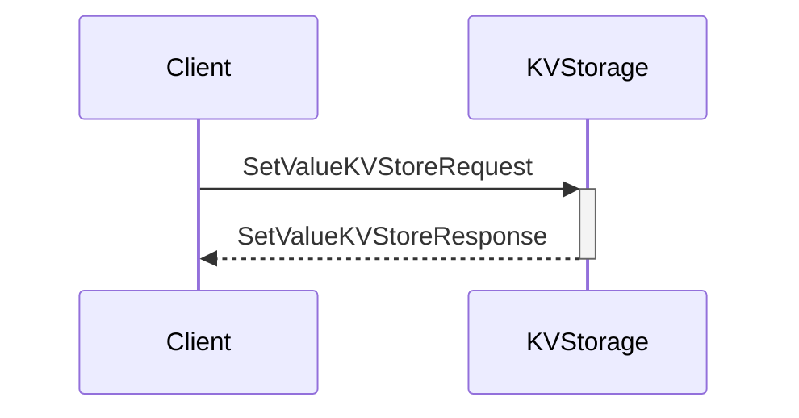
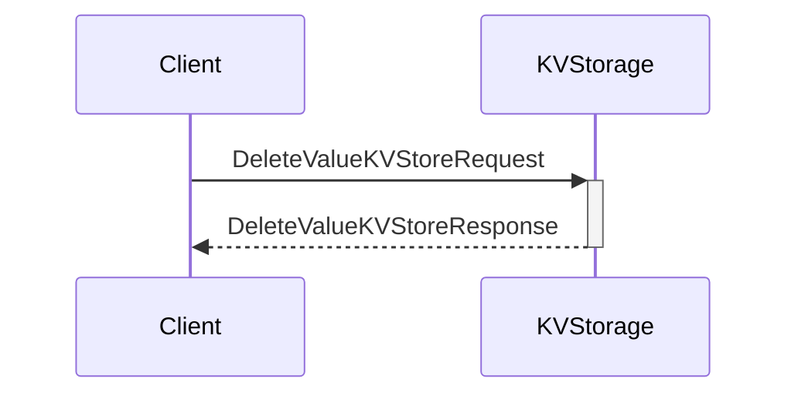

??? quote "Juvix imports"

    ```juvix
    module arch.node.engines.local_key_value_storage_messages;
    import prelude open;
    ```

# Local Key-Value Storage Messages

These are the messages that the Local Key-Value Storage engine can receive/respond to.

## Message interface

??? quote "Auxiliary Juvix code"

    ```juvix
    syntax alias StorageKey := String;
    syntax alias StorageValue := String;
    syntax alias EpochTimestamp := Nat;
    ```

### `GetValueKVStoreRequest GetValueKVStoreRequest`

Request to get a value from storage.

<!-- --8<-- [start:GetValueKVStoreRequest] -->
```juvix
type GetValueKVStoreRequest := mkGetValueKVStoreRequest {
  key : StorageKey;
};
```
<!-- --8<-- [end:GetValueKVStoreRequest] -->

???+ quote "Arguments"

    `key`
    : The key that maps to the requested value in the KV-store.

### `GetValueKVStoreResponse GetValueKVStoreResponse`

Response containing requested value.

<!-- --8<-- [start:GetValueKVStoreResponse] -->
```juvix
type GetValueKVStoreResponse := mkGetValueKVStoreResponse {
  key : StorageKey;
  value : StorageValue;
};
```
<!-- --8<-- [end:GetValueKVStoreResponse] -->

???+ quote "Arguments"

    `key`
    : The key that maps to the requested value in the KV-store.

    `value`
    : The requested value from the KV-store.

### `SetValueKVStoreRequest SetValueKVStoreRequest`

Request to set a value in storage.

<!-- --8<-- [start:SetValueKVStoreRequest] -->
```juvix
type SetValueKVStoreRequest := mkSetValueKVStoreRequest {
  key : StorageKey;
  value : StorageValue;
};
```
<!-- --8<-- [end:SetValueKVStoreRequest] -->

???+ quote "Arguments"

    `key`
    : The key that identifies the data in the KV-store.

    `value`
    : The value to store in the KV-store.

### `SetValueKVStoreResponse SetValueKVStoreResponse`

Response indicating success/failure of set operation.

<!-- --8<-- [start:SetValueKVStoreResponse] -->
```juvix
type SetValueKVStoreResponse := mkSetValueKVStoreResponse {
  key : StorageKey;
  success : Bool;
};
```
<!-- --8<-- [end:SetValueKVStoreResponse] -->

### `DeleteValueKVStoreRequest DeleteValueKVStoreRequest`

Request to delete a value from storage.

<!-- --8<-- [start:DeleteValueKVStoreRequest] -->
```juvix
type DeleteValueKVStoreRequest := mkDeleteValueKVStoreRequest {
  key : StorageKey;
};
```
<!-- --8<-- [end:DeleteValueKVStoreRequest] -->

### `DeleteValueKVStoreResponse DeleteValueKVStoreResponse`

Response indicating success/failure of delete operation.

<!-- --8<-- [start:DeleteValueKVStoreResponse] -->
```juvix
type DeleteValueKVStoreResponse := mkDeleteValueKVStoreResponse {
  key : StorageKey;
  success : Bool;
};
```
<!-- --8<-- [end:DeleteValueKVStoreResponse] -->

### `ValueChangedKVStore`

Notification that a value has changed. (Note: this seems unused)

<!-- --8<-- [start:ValueChangedKVStore] -->
```juvix
type ValueChangedKVStore := mkValueChangedKVStore {
  key : StorageKey;
  value : StorageValue;
  timestamp : EpochTimestamp;
};
```
<!-- --8<-- [end:ValueChangedKVStore] -->

### `LocalKVStorageMsg`

<!-- --8<-- [start:LocalKVStorageMsg] -->
```juvix
type LocalKVStorageMsg :=
  | LocalKVStorageMsgGetValueRequest GetValueKVStoreRequest
  | LocalKVStorageMsgGetValueResponse GetValueKVStoreResponse
  | LocalKVStorageMsgSetValueRequest SetValueKVStoreRequest
  | LocalKVStorageMsgSetValueResponse SetValueKVStoreResponse
  | LocalKVStorageMsgDeleteValueRequest DeleteValueKVStoreRequest
  | LocalKVStorageMsgDeleteValueResponse DeleteValueKVStoreResponse
  | LocalKVStorageMsgValueChanged ValueChangedKVStore;
```
<!-- --8<-- [end:LocalKVStorageMsg] -->

## Sequence Diagrams

### Get Value Request/Response Flow

<!-- --8<-- [start:message-sequence-diagram-get] -->
<figure markdown>



<figcaption markdown="span">
Get Value Request/Response Flow
</figcaption>
</figure>
<!-- --8<-- [end:message-sequence-diagram-get] -->

### Set Value Request/Response Flow

<!-- --8<-- [start:message-sequence-diagram-set] -->
<figure markdown>



<figcaption markdown="span">
Set Value Request/Response Flow
</figcaption>
</figure>
<!-- --8<-- [end:message-sequence-diagram-set] -->

### Delete Value Request/Response Flow

<!-- --8<-- [start:message-sequence-diagram-delete] -->
<figure markdown>



<figcaption markdown="span">
Delete Value Request/Response Flow
</figcaption>
</figure>
<!-- --8<-- [end:message-sequence-diagram-delete] -->
