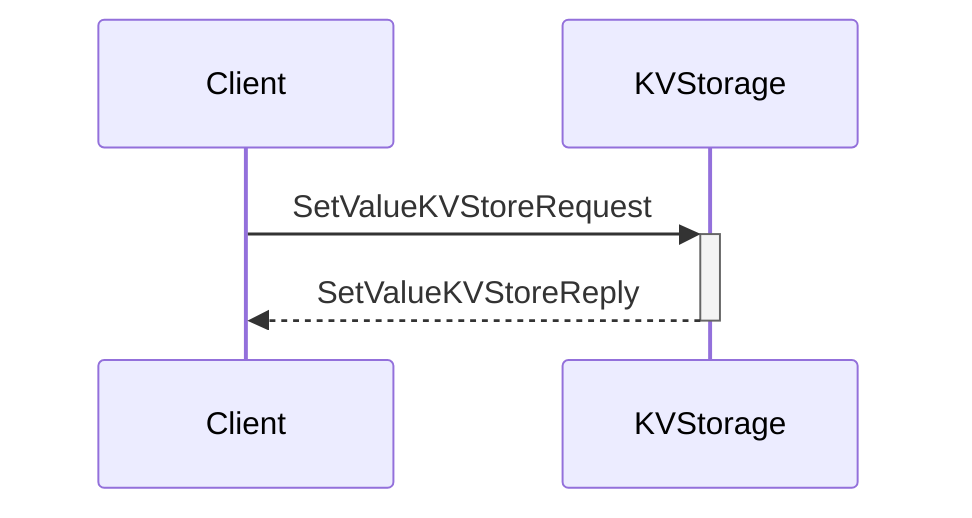
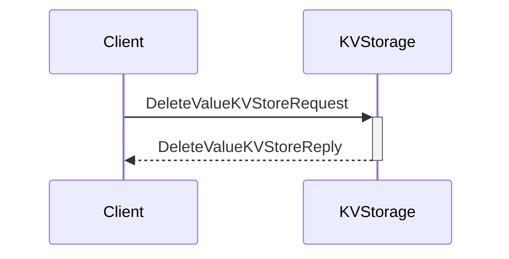

??? quote "Juvix imports"

    ```juvix
    module arch.node.engines.local_key_value_storage_messages;
    import prelude open;
    ```

# Local Key-Value Storage Messages

These are the messages that the Local Key-Value Storage engine can receive/respond to.

## Message interface

--8<-- "./local_key_value_storage_messages.juvix.md:LocalKVStorageMsg"

## Message sequence diagrams

---

### Get value request/response flow

<!-- --8<-- [start:message-sequence-diagram-get] -->
<figure markdown>


<figcaption markdown="span">
Get Value Request/Reply Flow
</figcaption>
</figure>
<!-- --8<-- [end:message-sequence-diagram-get] -->

---

### Set value request/response flow

<!-- --8<-- [start:message-sequence-diagram-set] -->
<figure markdown>



<figcaption markdown="span">
Set Value Request/Reply Flow
</figcaption>
</figure>
<!-- --8<-- [end:message-sequence-diagram-set] -->

---

### Delete value request/response flow

<!-- --8<-- [start:message-sequence-diagram-delete] -->
<figure markdown>



<figcaption markdown="span">
Delete Value Request/Reply Flow
</figcaption>
</figure>
<!-- --8<-- [end:message-sequence-diagram-delete] -->

---

## Message types

??? quote "Auxiliary Juvix code"

    ```juvix
    syntax alias StorageKey := String;
    syntax alias StorageValue := String;
    syntax alias EpochTimestamp := Nat;
    ```

---

### `GetValueKVStoreRequest`

Request to get a value from storage.

<!-- --8<-- [start:GetValueKVStoreRequest] -->
```juvix
type GetValueKVStoreRequest := mkGetValueKVStoreRequest {
  key : StorageKey;
};
```
<!-- --8<-- [end:GetValueKVStoreRequest] -->

???+ quote "Arguments"

    `key`
    : The key that maps to the requested value in the KV-store.

---

### `GetValueKVStoreReply`

Reply containing requested value.

<!-- --8<-- [start:GetValueKVStoreReply] -->
```juvix
type GetValueKVStoreReply := mkGetValueKVStoreReply {
  key : StorageKey;
  value : StorageValue;
};
```
<!-- --8<-- [end:GetValueKVStoreReply] -->

???+ quote "Arguments"

    `key`
    : The key that maps to the requested value in the KV-store.

    `value`
    : The requested value from the KV-store.

---

### `SetValueKVStoreRequest`

Request to set a value in storage.

<!-- --8<-- [start:SetValueKVStoreRequest] -->
```juvix
type SetValueKVStoreRequest := mkSetValueKVStoreRequest {
  key : StorageKey;
  value : StorageValue;
};
```
<!-- --8<-- [end:SetValueKVStoreRequest] -->

???+ quote "Arguments"

    `key`
    : The key that identifies the data in the KV-store.

    `value`
    : The value to store in the KV-store.

---

### `SetValueKVStoreReply`

Reply indicating success/failure of set operation.

<!-- --8<-- [start:SetValueKVStoreReply] -->
```juvix
type SetValueKVStoreReply := mkSetValueKVStoreReply {
  key : StorageKey;
  success : Bool;
};
```
<!-- --8<-- [end:SetValueKVStoreReply] -->

---

### `DeleteValueKVStoreRequest`

Request to delete a value from storage.

<!-- --8<-- [start:DeleteValueKVStoreRequest] -->
```juvix
type DeleteValueKVStoreRequest := mkDeleteValueKVStoreRequest {
  key : StorageKey;
};
```
<!-- --8<-- [end:DeleteValueKVStoreRequest] -->

---

### `DeleteValueKVStoreReply`

Reply indicating success/failure of a delete operation.

<!-- --8<-- [start:DeleteValueKVStoreReply] -->
```juvix
type DeleteValueKVStoreReply := mkDeleteValueKVStoreReply {
  key : StorageKey;
  success : Bool;
};
```
<!-- --8<-- [end:DeleteValueKVStoreReply] -->

### `ValueChangedKVStore`

Notification that a value has changed.

<!-- --8<-- [start:ValueChangedKVStore] -->
```juvix
type ValueChangedKVStore := mkValueChangedKVStore {
  key : StorageKey;
  value : StorageValue;
  timestamp : EpochTimestamp;
};
```
<!-- --8<-- [end:ValueChangedKVStore] -->

### `LocalKVStorageMsg`

<!-- --8<-- [start:LocalKVStorageMsg] -->
```juvix
type LocalKVStorageMsg :=
  | LocalKVStorageMsgGetValueRequest GetValueKVStoreRequest
  | LocalKVStorageMsgGetValueReply GetValueKVStoreReply
  | LocalKVStorageMsgSetValueRequest SetValueKVStoreRequest
  | LocalKVStorageMsgSetValueReply SetValueKVStoreReply
  | LocalKVStorageMsgDeleteValueRequest DeleteValueKVStoreRequest
  | LocalKVStorageMsgDeleteValueReply DeleteValueKVStoreReply
  | LocalKVStorageMsgValueChanged ValueChangedKVStore;
```
<!-- --8<-- [end:LocalKVStorageMsg] -->

## Engine components

- [[Local Key Value Storage Configuration]]
- [[Local Key Value Storage Environment]]
- [[Local Key Value Storage Behaviour]]
