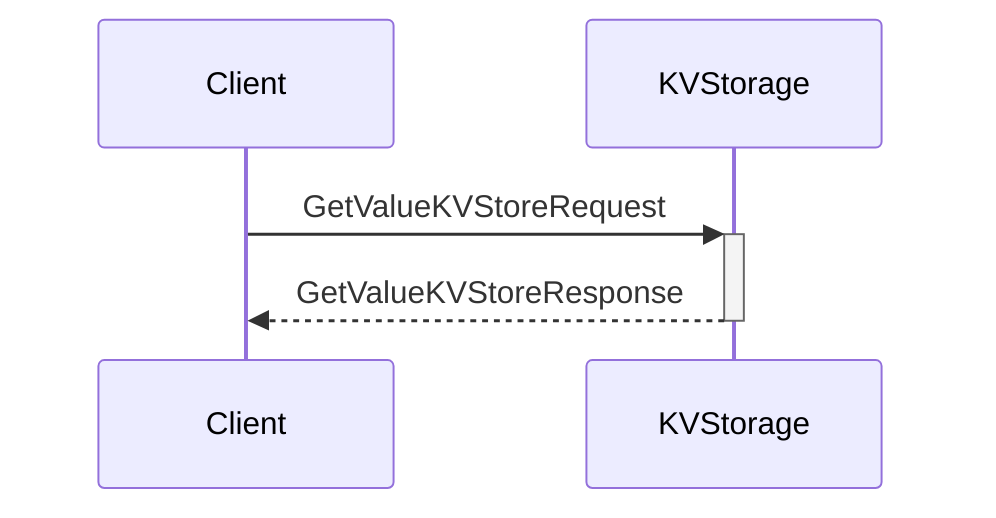
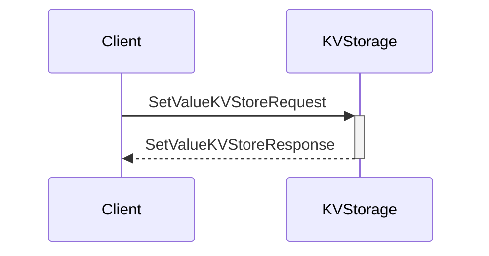
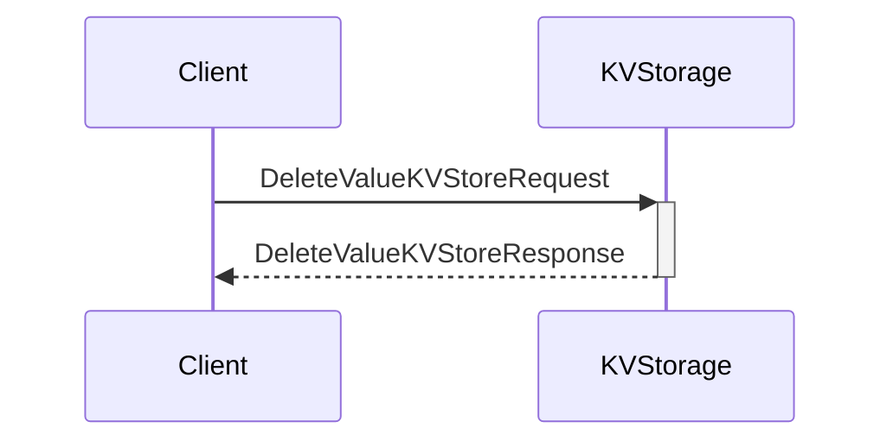

??? quote "Juvix imports"

    ```juvix
    module arch.node.engines.local_key_value_storage_messages;
    import prelude open;
    ```

# Local Key-Value Storage Messages

These are the messages that the Local Key-Value Storage engine can receive/respond to.

## Message interface

??? quote "Auxiliary Juvix code"

    ```juvix
    syntax alias StorageKey := String;
    syntax alias StorageValue := String;
    ```

### `GetValueKVStoreRequest GetValueKVStoreRequestV1`

Request to get a value from storage.

<!-- --8<-- [start:GetValueKVStoreRequestV1] -->
```juvix
type GetValueKVStoreRequestV1 := mkGetValueKVStoreRequestV1 {
  key : StorageKey;
};
```
<!-- --8<-- [end:GetValueKVStoreRequestV1] -->

???+ quote "Arguments"

    `key`
    : The key that maps to the requested value in the KV-store.

### `GetValueKVStoreResponse GetValueKVStoreResponseV1`

Response containing requested value.

<!-- --8<-- [start:GetValueKVStoreResponseV1] -->
```juvix
type GetValueKVStoreResponseV1 := mkGetValueKVStoreResponseV1 {
  key : StorageKey;
  value : StorageValue;
};
```
<!-- --8<-- [end:GetValueKVStoreResponseV1] -->

???+ quote "Arguments"

    `key`
    : The key that maps to the requested value in the KV-store.

    `value`
    : The requested value from the KV-store.

### `SetValueKVStoreRequest SetValueKVStoreRequestV1`

Request to set a value in storage.

<!-- --8<-- [start:SetValueKVStoreRequestV1] -->
```juvix
type SetValueKVStoreRequestV1 := mkSetValueKVStoreRequestV1 {
  key : StorageKey;
  value : StorageValue;
};
```
<!-- --8<-- [end:SetValueKVStoreRequestV1] -->

???+ quote "Arguments"

    `key`
    : The key that identifies the data in the KV-store.

    `value`
    : The value to store in the KV-store.

### `SetValueKVStoreResponse SetValueKVStoreResponseV1`

Response indicating success/failure of set operation.

<!-- --8<-- [start:SetValueKVStoreResponseV1] -->
```juvix
type SetValueKVStoreResponseV1 := mkSetValueKVStoreResponseV1 {
  key : StorageKey;
  success : Bool;
};
```
<!-- --8<-- [end:SetValueKVStoreResponseV1] -->

### `DeleteValueKVStoreRequest DeleteValueKVStoreRequestV1`

Request to delete a value from storage.

<!-- --8<-- [start:DeleteValueKVStoreRequestV1] -->
```juvix
type DeleteValueKVStoreRequestV1 := mkDeleteValueKVStoreRequestV1 {
  key : StorageKey;
};
```
<!-- --8<-- [end:DeleteValueKVStoreRequestV1] -->

### `DeleteValueKVStoreResponse DeleteValueKVStoreResponseV1`

Response indicating success/failure of delete operation.

<!-- --8<-- [start:DeleteValueKVStoreResponseV1] -->
```juvix
type DeleteValueKVStoreResponseV1 := mkDeleteValueKVStoreResponseV1 {
  key : StorageKey;
  success : Bool;
};
```
<!-- --8<-- [end:DeleteValueKVStoreResponseV1] -->

### `ValueChangedKVStore`

Notification that a value has changed. (Note: this seems unused)

<!-- --8<-- [start:ValueChangedKVStore] -->
```juvix
type ValueChangedKVStore := mkValueChangedKVStore {
  key : StorageKey;
  value : StorageValue;
  timestamp : Nat;
};
```
<!-- --8<-- [end:ValueChangedKVStore] -->

### `LocalKVStorageMsg`

<!-- --8<-- [start:LocalKVStorageMsg] -->
```juvix
type LocalKVStorageMsg :=
  | LocalKVStorageMsgGetValueRequest GetValueKVStoreRequestV1
  | LocalKVStorageMsgGetValueResponse GetValueKVStoreResponseV1
  | LocalKVStorageMsgSetValueRequest SetValueKVStoreRequestV1
  | LocalKVStorageMsgSetValueResponse SetValueKVStoreResponseV1
  | LocalKVStorageMsgDeleteValueRequest DeleteValueKVStoreRequestV1
  | LocalKVStorageMsgDeleteValueResponse DeleteValueKVStoreResponseV1
  | LocalKVStorageMsgValueChanged ValueChangedKVStore;
```
<!-- --8<-- [end:LocalKVStorageMsg] -->

## Sequence Diagrams

### Get Value Request/Response Flow

<!-- --8<-- [start:message-sequence-diagram-get] -->
<figure markdown>



<figcaption markdown="span">
Get Value Request/Response Flow
</figcaption>
</figure>
<!-- --8<-- [end:message-sequence-diagram-get] -->

### Set Value Request/Response Flow

<!-- --8<-- [start:message-sequence-diagram-set] -->
<figure markdown>



<figcaption markdown="span">
Set Value Request/Response Flow
</figcaption>
</figure>
<!-- --8<-- [end:message-sequence-diagram-set] -->

### Delete Value Request/Response Flow

<!-- --8<-- [start:message-sequence-diagram-delete] -->
<figure markdown>



<figcaption markdown="span">
Delete Value Request/Response Flow
</figcaption>
</figure>
<!-- --8<-- [end:message-sequence-diagram-delete] -->
