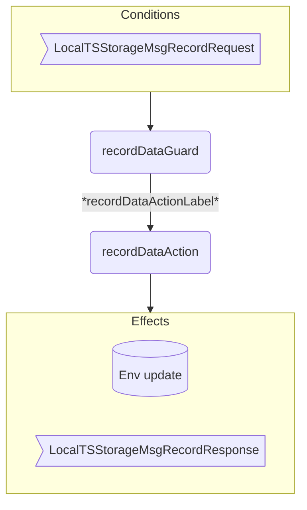
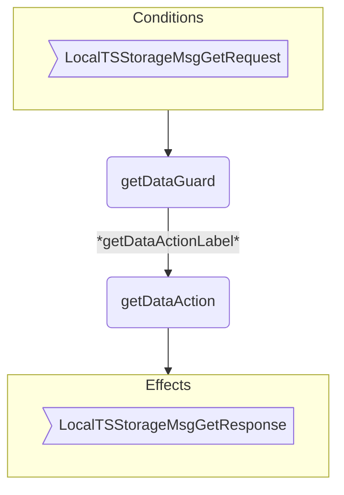
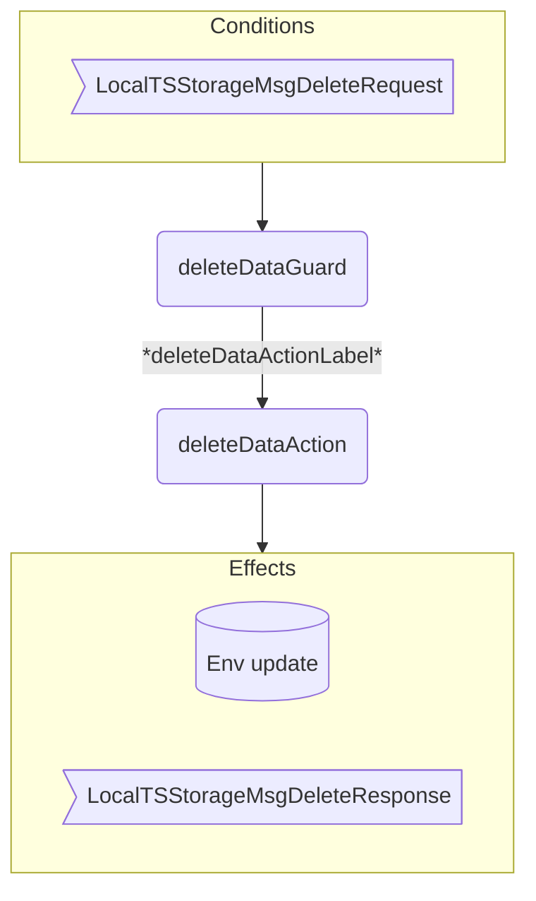

??? quote "Juvix imports"

    ```juvix
    module arch.node.engines.local_time_series_storage_behaviour;

    import arch.node.engines.local_time_series_storage_messages open;
    import arch.node.engines.local_time_series_storage_config open;
    import arch.node.engines.local_time_series_storage_environment open;

    import prelude open;
    import arch.node.types.basics open;
    import arch.node.types.identities open;
    import arch.node.types.messages open;
    import arch.node.types.engine open;
    import arch.node.types.anoma as Anoma open;
    ```

# Local Time Series Storage Behaviour

## Overview

A local time series storage engine acts in the ways described on this page.
The action labels correspond to the actions that can be performed by the engine.
Using the action labels, we describe the effects of the actions.

## Action arguments

The action arguments are set by a guard
and passed to the action function as part of the `GuardOutput`.

??? quote "Auxiliary Juvix code"

    <!-- --8<-- [start:MessageFrom] -->
    ```juvix
    type MessageFrom := mkMessageFrom {
      whoAsked : Option EngineID;
      mailbox : Option MailboxID;
    };
    ```
    <!-- --8<-- [end:MessageFrom] -->

### `LocalTSStorageActionArgument`

<!-- --8<-- [start:LocalTSStorageActionArgument] -->
```juvix
type LocalTSStorageActionArgument :=
  | LocalTSStorageActionArgumentMessageFrom MessageFrom
  ;
```
<!-- --8<-- [end:LocalTSStorageActionArgument] -->

### `LocalTSStorageActionArguments`

<!-- --8<-- [start:LocalTSStorageActionArguments] -->
```juvix
LocalTSStorageActionArguments : Type := List LocalTSStorageActionArgument;
```
<!-- --8<-- [end:LocalTSStorageActionArguments] -->

## Actions

??? quote "Auxiliary Juvix code"

    ### `LocalTSStorageAction`

    <!-- --8<-- [start:LocalTSStorageAction] -->
    ```juvix
    LocalTSStorageAction : Type :=
      Action
        LocalTSStorageCfg
        LocalTSStorageLocalState
        LocalTSStorageMailboxState
        LocalTSStorageTimerHandle
        LocalTSStorageActionArguments
        Anoma.Msg
        Anoma.Cfg
        Anoma.Env;
    ```
    <!-- --8<-- [end:LocalTSStorageAction] -->

    ### `LocalTSStorageActionInput`

    <!-- --8<-- [start:LocalTSStorageActionInput] -->
    ```juvix
    LocalTSStorageActionInput : Type :=
      ActionInput
        LocalTSStorageCfg
        LocalTSStorageLocalState
        LocalTSStorageMailboxState
        LocalTSStorageTimerHandle
        LocalTSStorageActionArguments
        Anoma.Msg;
    ```
    <!-- --8<-- [end:LocalTSStorageActionInput] -->

    ### `LocalTSStorageActionEffect`

    <!-- --8<-- [start:LocalTSStorageActionEffect] -->
    ```juvix
    LocalTSStorageActionEffect : Type :=
      ActionEffect
        LocalTSStorageLocalState
        LocalTSStorageMailboxState
        LocalTSStorageTimerHandle
        Anoma.Msg
        Anoma.Cfg
        Anoma.Env;
    ```
    <!-- --8<-- [end:LocalTSStorageActionEffect] -->

    ### `LocalTSStorageActionExec`

    <!-- --8<-- [start:LocalTSStorageActionExec] -->
    ```juvix
    LocalTSStorageActionExec : Type :=
      ActionExec
        LocalTSStorageCfg
        LocalTSStorageLocalState
        LocalTSStorageMailboxState
        LocalTSStorageTimerHandle
        LocalTSStorageActionArguments
        Anoma.Msg
        Anoma.Cfg
        Anoma.Env;
    ```
    <!-- --8<-- [end:LocalTSStorageActionExec] -->

### `recordDataAction`

Records data in the time series storage.

State update
: Updates state with the data from request.

Messages to be sent
: A response message indicating success or failure.

Engines to be spawned
: No engines are created by this action.

Timer updates
: No timers are set or cancelled.

<!-- --8<-- [start:recordDataAction] -->
```juvix
recordDataAction
  (input : LocalTSStorageActionInput)
  : Option LocalTSStorageActionEffect :=
  let
    cfg := ActionInput.cfg input;
    env := ActionInput.env input;
    trigger := ActionInput.trigger input;
    local := ActionInput.env input;
  in case getEngineMsgFromTimestampedTrigger trigger of {
    | some mkEngineMsg@{
        msg := Anoma.MsgLocalTSStorage (LocalTSStorageMsgRecordRequest req);
        sender := whoAsked;
        mailbox := mailboxId;
      } :=
      some mkActionEffect@{
        env := env@EngineEnv{
          localState := mkLocalTSStorageLocalState@{
            taskQueue := mkCustomData@{
              word := RecordDataTSStorageDBRequest.query req
            }
          }
        };
        msgs := [
          mkEngineMsg@{
            sender := getEngineIDFromEngineCfg cfg;
            target := whoAsked;
            mailbox := some 0;
            msg :=
              Anoma.MsgLocalTSStorage
                (LocalTSStorageMsgRecordResponse
                  (mkRecordDataTSStorageDBResponse@{
                    query := RecordDataTSStorageDBRequest.query req;
                    success := true
                  }))
          }
        ];
        timers := [];
        engines := [];
      }
    | _ := none
    };
```
<!-- --8<-- [end:recordDataAction] -->

### `getDataAction`

Retrieves data from the time series storage.

State update
: The state remains unchanged.

Messages to be sent
: A response message containing the requested data.

Engines to be spawned
: No engines are created by this action.

Timer updates
: No timers are set or cancelled.

<!-- --8<-- [start:getDataAction] -->
```juvix
getDataAction
  (input : LocalTSStorageActionInput)
  : Option LocalTSStorageActionEffect :=
  let
    cfg := ActionInput.cfg input;
    env := ActionInput.env input;
    trigger := ActionInput.trigger input;
  in case getEngineMsgFromTimestampedTrigger trigger of {
    | some mkEngineMsg@{
        msg := Anoma.MsgLocalTSStorage (LocalTSStorageMsgGetRequest req);
        sender := whoAsked;
        mailbox := mailboxId;
      } :=
      some mkActionEffect@{
        env := env;
        msgs := [
          mkEngineMsg@{
            sender := getEngineIDFromEngineCfg cfg;
            target := whoAsked;
            mailbox := some 0;
            msg :=
              Anoma.MsgLocalTSStorage
                (LocalTSStorageMsgGetResponse
                  (mkGetDataTSStorageDBResponse@{
                    query := GetDataTSStorageDBRequest.query req;
                    data := "data"
                  }))
          }
        ];
        timers := [];
        engines := [];
      }
    | _ := none
    };
```
<!-- --8<-- [end:getDataAction] -->

### `deleteDataAction`

Deletes data from the time series storage.

State update
: Updates state to reflect deleted data.

Messages to be sent
: A response message indicating success or failure.

Engines to be spawned
: No engines are created by this action.

Timer updates
: No timers are set or cancelled.

<!-- --8<-- [start:deleteDataAction] -->
```juvix
deleteDataAction
  (input : LocalTSStorageActionInput)
  : Option LocalTSStorageActionEffect :=
  let
    cfg := ActionInput.cfg input;
    env := ActionInput.env input;
    trigger := ActionInput.trigger input;
  in case getEngineMsgFromTimestampedTrigger trigger of {
    | some mkEngineMsg@{
        msg := Anoma.MsgLocalTSStorage (LocalTSStorageMsgDeleteRequest req);
        sender := whoAsked;
        mailbox := mailboxId;
      } :=
      some mkActionEffect@{
        env := env@EngineEnv{
          localState := mkLocalTSStorageLocalState@{
            taskQueue := mkCustomData@{
              word := DeleteDataTSStorageDBRequest.query req
            }
          }
        };
        msgs := [
          mkEngineMsg@{
            sender := getEngineIDFromEngineCfg cfg;
            target := whoAsked;
            mailbox := some 0;
            msg :=
              Anoma.MsgLocalTSStorage
                (LocalTSStorageMsgDeleteResponse
                  (mkDeleteDataTSStorageDBResponse@{
                    query := DeleteDataTSStorageDBRequest.query req;
                    success := true
                  }))
          }
        ];
        timers := [];
        engines := [];
      }
    | _ := none
    };
```
<!-- --8<-- [end:deleteDataAction] -->

## Action Labels

### `recordDataActionLabel`

```juvix
recordDataActionLabel : LocalTSStorageActionExec := Seq [ recordDataAction ];
```

### `getDataActionLabel`

```juvix
getDataActionLabel : LocalTSStorageActionExec := Seq [ getDataAction ];
```

### `deleteDataActionLabel`

```juvix
deleteDataActionLabel : LocalTSStorageActionExec := Seq [ deleteDataAction ];
```

## Guards

??? quote "Auxiliary Juvix code"

    ### `LocalTSStorageGuard`

    <!-- --8<-- [start:LocalTSStorageGuard] -->
    ```juvix
    LocalTSStorageGuard : Type :=
      Guard
        LocalTSStorageCfg
        LocalTSStorageLocalState
        LocalTSStorageMailboxState
        LocalTSStorageTimerHandle
        LocalTSStorageActionArguments
        Anoma.Msg
        Anoma.Cfg
        Anoma.Env;
    ```
    <!-- --8<-- [end:LocalTSStorageGuard] -->

    ### `LocalTSStorageGuardOutput`

    <!-- --8<-- [start:LocalTSStorageGuardOutput] -->
    ```juvix
    LocalTSStorageGuardOutput : Type :=
      GuardOutput
        LocalTSStorageCfg
        LocalTSStorageLocalState
        LocalTSStorageMailboxState
        LocalTSStorageTimerHandle
        LocalTSStorageActionArguments
        Anoma.Msg
        Anoma.Cfg
        Anoma.Env;
    ```
    <!-- --8<-- [end:LocalTSStorageGuardOutput] -->

    ### `LocalTSStorageGuardEval`

    <!-- --8<-- [start:LocalTSStorageGuardEval] -->
    ```juvix
    LocalTSStorageGuardEval : Type :=
      GuardEval
        LocalTSStorageCfg
        LocalTSStorageLocalState
        LocalTSStorageMailboxState
        LocalTSStorageTimerHandle
        LocalTSStorageActionArguments
        Anoma.Msg
        Anoma.Cfg
        Anoma.Env;
    ```
    <!-- --8<-- [end:LocalTSStorageGuardEval] -->

### `recordDataGuard`

<!-- --8<-- [start:recordDataGuard] -->
```juvix
recordDataGuard
  (trigger : LocalTSStorageTimestampedTrigger)
  (cfg : EngineCfg LocalTSStorageCfg)
  (env : LocalTSStorageEnv)
  : Option LocalTSStorageGuardOutput :=
  case getEngineMsgFromTimestampedTrigger trigger of {
    | some mkEngineMsg@{
        msg := Anoma.MsgLocalTSStorage (LocalTSStorageMsgRecordRequest _);
      } :=
      some mkGuardOutput@{
        action := recordDataActionLabel;
        args := [];
      }
    | _ := none
  };
```
<!-- --8<-- [end:recordDataGuard] -->

### `getDataGuard`

<!-- --8<-- [start:getDataGuard] -->
```juvix
getDataGuard
  (trigger : LocalTSStorageTimestampedTrigger)
  (cfg : EngineCfg LocalTSStorageCfg)
  (env : LocalTSStorageEnv)
  : Option LocalTSStorageGuardOutput :=
  case getEngineMsgFromTimestampedTrigger trigger of {
    | some mkEngineMsg@{
        msg := Anoma.MsgLocalTSStorage (LocalTSStorageMsgGetRequest _);
      } :=
      some mkGuardOutput@{
        action := getDataActionLabel;
        args := [];
      }
    | _ := none
  };
```
<!-- --8<-- [end:getDataGuard] -->

### `deleteDataGuard`

<!-- --8<-- [start:deleteDataGuard] -->
```juvix
deleteDataGuard
  (trigger : LocalTSStorageTimestampedTrigger)
  (cfg : EngineCfg LocalTSStorageCfg)
  (env : LocalTSStorageEnv)
  : Option LocalTSStorageGuardOutput :=
  case getEngineMsgFromTimestampedTrigger trigger of {
    | some mkEngineMsg@{
        msg := Anoma.MsgLocalTSStorage (LocalTSStorageMsgDeleteRequest _);
      } :=
      some mkGuardOutput@{
        action := deleteDataActionLabel;
        args := [];
      }
    | _ := none
  };
```
<!-- --8<-- [end:deleteDataGuard] -->

## The Local Time Series Storage Behaviour

### `LocalTSStorageBehaviour`

<!-- --8<-- [start:LocalTSStorageBehaviour] -->
```juvix
LocalTSStorageBehaviour : Type :=
  EngineBehaviour
    LocalTSStorageCfg
    LocalTSStorageLocalState
    LocalTSStorageMailboxState
    LocalTSStorageTimerHandle
    LocalTSStorageActionArguments
    Anoma.Msg
    Anoma.Cfg
    Anoma.Env;
```
<!-- --8<-- [end:LocalTSStorageBehaviour] -->

### Instantiation

<!-- --8<-- [start:localTSStorageBehaviour] -->
```juvix
localTSStorageBehaviour : LocalTSStorageBehaviour :=
  mkEngineBehaviour@{
    guards :=
      First [
        recordDataGuard;
        getDataGuard;
        deleteDataGuard;
      ];
  };
```
<!-- --8<-- [end:localTSStorageBehaviour] -->

## Local Time Series Storage Action Flowcharts

### `recordData` Flowchart

<figure markdown>



<figcaption markdown="span">

`recordData` flowchart

</figcaption>
</figure>

### `getData` Flowchart

<figure markdown>



<figcaption markdown="span">

`getData` flowchart

</figcaption>
</figure>

### `deleteData` Flowchart

<figure markdown>



<figcaption markdown="span">

`deleteData` flowchart

</figcaption>
</figure>