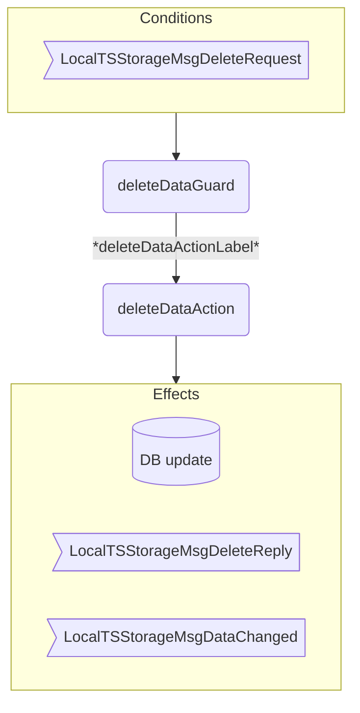

??? code "Juvix imports"

    ```juvix
    module arch.node.engines.local_time_series_storage_behaviour;

    import arch.node.engines.local_time_series_storage_messages open;
    import arch.node.engines.local_time_series_storage_config open;
    import arch.node.engines.local_time_series_storage_environment open;

    import prelude open;
    import arch.node.types.basics open;
    import arch.node.types.identities open;
    import arch.node.types.messages open;
    import arch.node.types.engine open;
    import arch.node.types.anoma as Anoma open;
    ```

# Local Time Series Storage Behaviour

## Overview

A time series storage engine acts as a database that can store, retrieve, and delete time series data.

## Action arguments

### `LocalTSStorageActionArgument`

<!-- --8<-- [start:LocalTSStorageActionArgument] -->
```juvix
type LocalTSStorageActionArgument := Unit;
```
<!-- --8<-- [end:LocalTSStorageActionArgument] -->

### `LocalTSStorageActionArguments`

<!-- --8<-- [start:LocalTSStorageActionArguments] -->
```juvix
LocalTSStorageActionArguments : Type := List LocalTSStorageActionArgument;
```
<!-- --8<-- [end:LocalTSStorageActionArguments] -->

## Actions

??? code "Auxiliary Juvix code"

    ### `LocalTSStorageAction`

    <!-- --8<-- [start:LocalTSStorageAction] -->
    ```juvix
    LocalTSStorageAction : Type :=
      Action
        LocalTSStorageLocalCfg
        LocalTSStorageLocalState
        LocalTSStorageMailboxState
        LocalTSStorageTimerHandle
        LocalTSStorageActionArguments
        Anoma.Msg
        Anoma.Cfg
        Anoma.Env;
    ```
    <!-- --8<-- [end:LocalTSStorageAction] -->

    ### `LocalTSStorageActionInput`

    <!-- --8<-- [start:LocalTSStorageActionInput] -->
    ```juvix
    LocalTSStorageActionInput : Type :=
      ActionInput
        LocalTSStorageLocalCfg
        LocalTSStorageLocalState
        LocalTSStorageMailboxState
        LocalTSStorageTimerHandle
        LocalTSStorageActionArguments
        Anoma.Msg;
    ```
    <!-- --8<-- [end:LocalTSStorageActionInput] -->

    ### `LocalTSStorageActionEffect`

    <!-- --8<-- [start:LocalTSStorageActionEffect] -->
    ```juvix
    LocalTSStorageActionEffect : Type :=
      ActionEffect
        LocalTSStorageLocalState
        LocalTSStorageMailboxState
        LocalTSStorageTimerHandle
        Anoma.Msg
        Anoma.Cfg
        Anoma.Env;
    ```
    <!-- --8<-- [end:LocalTSStorageActionEffect] -->

    ### `LocalTSStorageActionExec`

    <!-- --8<-- [start:LocalTSStorageActionExec] -->
    ```juvix
    LocalTSStorageActionExec : Type :=
      ActionExec
        LocalTSStorageLocalCfg
        LocalTSStorageLocalState
        LocalTSStorageMailboxState
        LocalTSStorageTimerHandle
        LocalTSStorageActionArguments
        Anoma.Msg
        Anoma.Cfg
        Anoma.Env;
    ```
    <!-- --8<-- [end:LocalTSStorageActionExec] -->

### `getDataAction`

Get data from the time series database.

State update
: The state remains unchanged.

Messages to be sent
: A `GetDataTSStorageDBReply` message with the requested data.

Engines to be spawned
: No engine is created by this action.

Timer updates
: No timers are set or cancelled.

<!-- --8<-- [start:getDataAction] -->
```juvix
getDataAction
  (input : LocalTSStorageActionInput)
  : Option LocalTSStorageActionEffect :=
  let
    env := ActionInput.env input;
    trigger := ActionInput.trigger input;
    cfg := ActionInput.cfg input;
    local := EngineEnv.localState env;
  in case getEngineMsgFromTimestampedTrigger trigger of {
    | some EngineMsg.mk@{
        msg := Anoma.Msg.MsgLocalTSStorage (LocalTSStorageMsg.GetRequest request);
        sender := sender;
      } :=
      let result := queryDB (LocalTSStorageLocalState.db local) (GetDataTSStorageDBRequest.query request);
      in case result of {
        | some data := some ActionEffect.mk@{
            env := env;
            msgs := [EngineMsg.mk@{
              sender := getEngineIDFromEngineCfg cfg;
              target := sender;
              mailbox := some 0;
              msg := Anoma.Msg.MsgLocalTSStorage (LocalTSStorageMsg.GetReply
                GetDataTSStorageDBReply.mkGetDataTSStorageDBReply@{
                  query := GetDataTSStorageDBRequest.query request;
                  data := data;
                })
            }];
            timers := [];
            engines := [];
          }
        | none := none
      }
    | _ := none
  };
```
<!-- --8<-- [end:getDataAction] -->

### `recordDataAction`

Record new data in the time series database.

State update
: Updates the database with new time series data, if successful.

Messages to be sent
: A `RecordDataTSStorageDBReply` message indicating success/failure.
: Several `DataChangedTSStorageDB` messages to those interested engines, if successful.

Engines to be spawned
: No engine is created by this action.

Timer updates
: No timers are set or cancelled.

<!-- --8<-- [start:recordDataAction] -->
```juvix
recordDataAction
  (input : LocalTSStorageActionInput)
  : Option LocalTSStorageActionEffect :=
  let
    env := ActionInput.env input;
    trigger := ActionInput.trigger input;
    cfg := ActionInput.cfg input;
    local := EngineEnv.localState env;
    newTime := advanceTime (LocalTSStorageLocalState.localClock local)
  in case getEngineMsgFromTimestampedTrigger trigger of {
    | some EngineMsg.mk@{
        msg := Anoma.Msg.MsgLocalTSStorage (LocalTSStorageMsg.RecordRequest request);
        sender := sender;
      } :=
      let query := RecordDataTSStorageDBRequest.query request;
          db := LocalTSStorageLocalState.db local;
          data := queryDB db query;
      in case data of {
        | some value :=
          let newDb := updateDB db query value;
              newEnv := env@EngineEnv{
                localState := LocalTSStorageLocalState.mk@{
                  db := newDb;
                  localClock := newTime
                }
              };
            responseMsg := EngineMsg.mk@{
                  sender := getEngineIDFromEngineCfg cfg;
                  target := sender;
                  mailbox := some 0;
                  msg := Anoma.Msg.MsgLocalTSStorage (LocalTSStorageMsg.DeleteReply
                    DeleteDataTSStorageDBReply.mkDeleteDataTSStorageDBReply@{
                      query := query;
                      success := true;
                    })
                };
            notificationMsg := \{target := EngineMsg.mk@{
              sender := getEngineIDFromEngineCfg cfg;
              target := target;
              mailbox := some 0;
              msg := Anoma.Msg.MsgLocalTSStorage (LocalTSStorageMsg.DataChanged
                (DataChangedTSStorageDB.mkDataChangedTSStorageDB@{
                  query := query;
                  data := value;
                  timestamp := newTime
                }))
            }};
            notificationMsgs := map notificationMsg (getNotificationTargets query);
          in some ActionEffect.mk@{
              env := newEnv;
              msgs := responseMsg :: notificationMsgs;
              timers := [];
              engines := [];
            }
        | none := some ActionEffect.mk@{
            env := env;
            msgs := [EngineMsg.mk@{
              sender := getEngineIDFromEngineCfg cfg;
              target := sender;
              mailbox := some 0;
              msg := Anoma.Msg.MsgLocalTSStorage (LocalTSStorageMsg.RecordReply
                RecordDataTSStorageDBReply.mkRecordDataTSStorageDBReply@{
                  query := query;
                  success := false;
                })
            }];
            timers := [];
            engines := [];
          }
      }
    | _ := none
  };
```
<!-- --8<-- [end:recordDataAction] -->

### `deleteDataAction`

Delete data from the time series database.

State update
: Updates the database by removing specified time series data, if successful.

Messages to be sent
: A `DeleteDataTSStorageDBReply` message indicating success/failure.
: Several `DataChangedTSStorageDB` messages to those interested engines, if successful.

Engines to be spawned
: No engine is created by this action.

Timer updates
: No timers are set or cancelled.

<!-- --8<-- [start:deleteDataAction] -->
```juvix
deleteDataAction
  (input : LocalTSStorageActionInput)
  : Option LocalTSStorageActionEffect :=
  let
    env := ActionInput.env input;
    trigger := ActionInput.trigger input;
    cfg := ActionInput.cfg input;
    local := EngineEnv.localState env;
    newTime := advanceTime (LocalTSStorageLocalState.localClock local)
  in case getEngineMsgFromTimestampedTrigger trigger of {
    | some EngineMsg.mk@{
        msg := Anoma.Msg.MsgLocalTSStorage (LocalTSStorageMsg.DeleteRequest request);
        sender := sender;
      } :=
      let query := DeleteDataTSStorageDBRequest.query request;
          db := LocalTSStorageLocalState.db local;
          data := queryDB db query;
      in case data of {
        | some value :=
          let newDb := updateDB db query "";
              newEnv := env@EngineEnv{
                localState := LocalTSStorageLocalState.mk@{
                  db := newDb;
                  localClock := newTime
                }
              };
            responseMsg := EngineMsg.mk@{
                  sender := getEngineIDFromEngineCfg cfg;
                  target := sender;
                  mailbox := some 0;
                  msg := Anoma.Msg.MsgLocalTSStorage (LocalTSStorageMsg.DeleteReply
                    DeleteDataTSStorageDBReply.mkDeleteDataTSStorageDBReply@{
                      query := query;
                      success := true;
                    })
                };
            notificationMsg := \{target := EngineMsg.mk@{
              sender := getEngineIDFromEngineCfg cfg;
              target := target;
              mailbox := some 0;
              msg := Anoma.Msg.MsgLocalTSStorage (LocalTSStorageMsg.DataChanged
                (DataChangedTSStorageDB.mkDataChangedTSStorageDB@{
                  query := query;
                  data := value;
                  timestamp := newTime
                }))
            }};
            notificationMsgs := map notificationMsg (getNotificationTargets query);
          in some ActionEffect.mk@{
              env := newEnv;
              msgs := responseMsg :: notificationMsgs;
              timers := [];
              engines := [];
            }
        | none := some ActionEffect.mk@{
            env := env;
            msgs := [EngineMsg.mk@{
              sender := getEngineIDFromEngineCfg cfg;
              target := sender;
              mailbox := some 0;
              msg := Anoma.Msg.MsgLocalTSStorage (LocalTSStorageMsg.DeleteReply
                DeleteDataTSStorageDBReply.mkDeleteDataTSStorageDBReply@{
                  query := query;
                  success := false;
                })
            }];
            timers := [];
            engines := [];
          }
      }
    | _ := none
  };
```
<!-- --8<-- [end:deleteDataAction] -->

## Action Labels

### `getDataActionLabel`

```juvix
getDataActionLabel : LocalTSStorageActionExec := ActionExec.Seq [ getDataAction ];
```

### `recordDataActionLabel`

```juvix
recordDataActionLabel : LocalTSStorageActionExec := ActionExec.Seq [ recordDataAction ];
```

### `deleteDataActionLabel`

```juvix
deleteDataActionLabel : LocalTSStorageActionExec := ActionExec.Seq [ deleteDataAction ];
```

## Guards

??? code "Auxiliary Juvix code"

    ### `LocalTSStorageGuard`

    <!-- --8<-- [start:LocalTSStorageGuard] -->
    ```juvix
    LocalTSStorageGuard : Type :=
      Guard
        LocalTSStorageLocalCfg
        LocalTSStorageLocalState
        LocalTSStorageMailboxState
        LocalTSStorageTimerHandle
        LocalTSStorageActionArguments
        Anoma.Msg
        Anoma.Cfg
        Anoma.Env;
    ```
    <!-- --8<-- [end:LocalTSStorageGuard] -->

    ### `LocalTSStorageGuardOutput`

    <!-- --8<-- [start:LocalTSStorageGuardOutput] -->
    ```juvix
    LocalTSStorageGuardOutput : Type :=
      GuardOutput
        LocalTSStorageLocalCfg
        LocalTSStorageLocalState
        LocalTSStorageMailboxState
        LocalTSStorageTimerHandle
        LocalTSStorageActionArguments
        Anoma.Msg
        Anoma.Cfg
        Anoma.Env;
    ```
    <!-- --8<-- [end:LocalTSStorageGuardOutput] -->

    ### `LocalTSStorageGuardEval`

    <!-- --8<-- [start:LocalTSStorageGuardEval] -->
    ```juvix
    LocalTSStorageGuardEval : Type :=
      GuardEval
        LocalTSStorageLocalCfg
        LocalTSStorageLocalState
        LocalTSStorageMailboxState
        LocalTSStorageTimerHandle
        LocalTSStorageActionArguments
        Anoma.Msg
        Anoma.Cfg
        Anoma.Env;
    ```
    <!-- --8<-- [end:LocalTSStorageGuardEval] -->

### `getDataGuard`

Condition
: Message type is `LocalTSStorageMsgGetRequest`.

<!-- --8<-- [start:getDataGuard] -->
```juvix
getDataGuard
  (trigger : LocalTSStorageTimestampedTrigger)
  (cfg : LocalTSStorageCfg)
  (env : LocalTSStorageEnv)
  : Option LocalTSStorageGuardOutput :=
  case getEngineMsgFromTimestampedTrigger trigger of {
    | some EngineMsg.mk@{
        msg := Anoma.Msg.MsgLocalTSStorage (LocalTSStorageMsg.GetRequest _);
      } := some GuardOutput.mk@{
        action := getDataActionLabel;
        args := [];
      }
    | _ := none
  };
```
<!-- --8<-- [end:getDataGuard] -->

### `recordDataGuard`

Condition
: Message type is `LocalTSStorageMsgRecordRequest`.

<!-- --8<-- [start:recordDataGuard] -->
```juvix
recordDataGuard
  (trigger : LocalTSStorageTimestampedTrigger)
  (cfg : LocalTSStorageCfg)
  (env : LocalTSStorageEnv)
  : Option LocalTSStorageGuardOutput :=
  case getEngineMsgFromTimestampedTrigger trigger of {
    | some EngineMsg.mk@{
        msg := Anoma.Msg.MsgLocalTSStorage (LocalTSStorageMsg.RecordRequest _);
      } := some GuardOutput.mk@{
        action := recordDataActionLabel;
        args := [];
      }
    | _ := none
  };
```
<!-- --8<-- [end:recordDataGuard] -->

### `deleteDataGuard`

Condition
: Message type is `LocalTSStorageMsgDeleteRequest`.

<!-- --8<-- [start:deleteDataGuard] -->
```juvix
deleteDataGuard
  (trigger : LocalTSStorageTimestampedTrigger)
  (cfg : LocalTSStorageCfg)
  (env : LocalTSStorageEnv)
  : Option LocalTSStorageGuardOutput :=
  case getEngineMsgFromTimestampedTrigger trigger of {
    | some EngineMsg.mk@{
        msg := Anoma.Msg.MsgLocalTSStorage (LocalTSStorageMsg.DeleteRequest _);
      } := some GuardOutput.mk@{
        action := deleteDataActionLabel;
        args := [];
      }
    | _ := none
  };
```
<!-- --8<-- [end:deleteDataGuard] -->

## The Local Time Series Storage Behaviour

### `LocalTSStorageBehaviour`

<!-- --8<-- [start:LocalTSStorageBehaviour] -->
```juvix
LocalTSStorageBehaviour : Type :=
  EngineBehaviour
    LocalTSStorageLocalCfg
    LocalTSStorageLocalState
    LocalTSStorageMailboxState
    LocalTSStorageTimerHandle
    LocalTSStorageActionArguments
    Anoma.Msg
    Anoma.Cfg
    Anoma.Env;
```
<!-- --8<-- [end:LocalTSStorageBehaviour] -->

#### Instantiation

<!-- --8<-- [start:localTSStorageBehaviour] -->
```juvix
localTSStorageBehaviour : LocalTSStorageBehaviour :=
  EngineBehaviour.mk@{
    guards := GuardEval.First [
      getDataGuard;
      recordDataGuard;
      deleteDataGuard
    ];
  };
```
<!-- --8<-- [end:localTSStorageBehaviour] -->

## Local Time Series Storage Action Flowcharts

### `getData` Flowchart

<figure markdown>


<figcaption markdown="span">

`getData` flowchart

</figcaption>
</figure>

### `recordData` Flowchart

<figure markdown>


<figcaption markdown="span">

`recordData` flowchart

</figcaption>
</figure>

### `deleteData` Flowchart

<figure markdown>



<figcaption markdown="span">

`deleteData` flowchart

</figcaption>
</figure>
