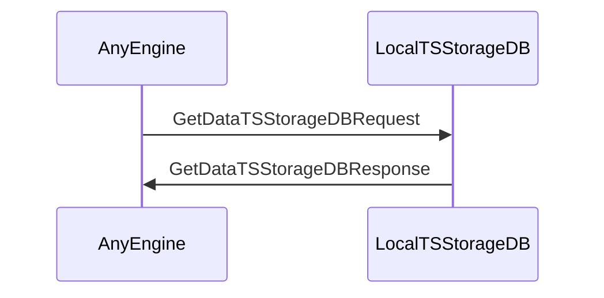
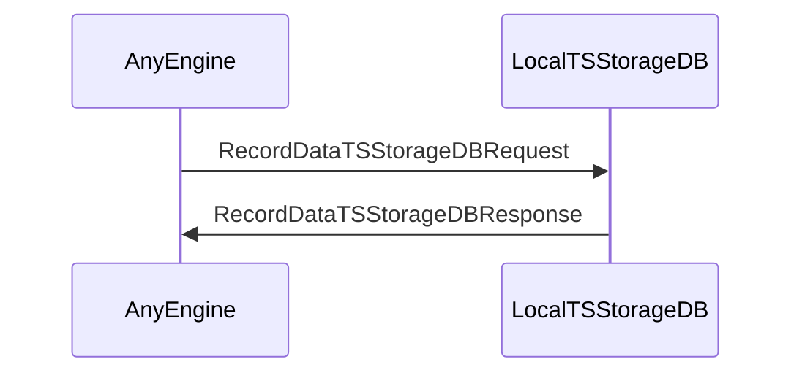
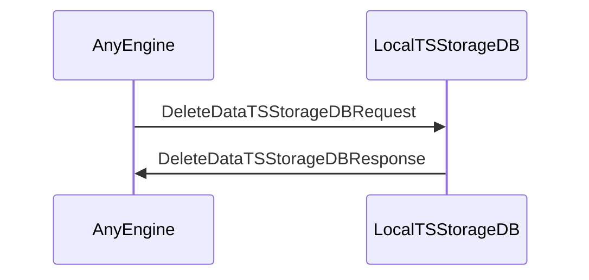

??? quote "Juvix imports"

    ```juvix
    module arch.node.engines.local_time_series_storage_messages;
    import prelude open;
    ```

# Local Time Series Storage Messages

These are the messages that the Local Time Series Storage engine can receive/respond to.

## Message interface

--8<-- "./local_time_series_storage_messages.juvix:LocalTSStorageMsg"

## Message sequence diagrams

### `GetDataTSStorageDBRequest` and `GetDataTSStorageDBResponse`

<!-- --8<-- [start:message-sequence-diagram-Get] -->
<figure markdown="span">



<figcaption markdown="span">
Sequence diagram: Get data flow
</figcaption>
</figure>
<!-- --8<-- [end:message-sequence-diagram-Get] -->

### `RecordDataTSStorageDBRequest` and `RecordDataTSStorageDBResponse`

<!-- --8<-- [start:message-sequence-diagram-Record] -->
<figure markdown="span">



<figcaption markdown="span">
Sequence diagram: Record data flow
</figcaption>
</figure>
<!-- --8<-- [end:message-sequence-diagram-Record] -->

### `DeleteDataTSStorageDBRequest` and `DeleteDataTSStorageDBResponse`

<!-- --8<-- [start:message-sequence-diagram-Delete] -->
<figure markdown="span">



<figcaption markdown="span">
Sequence diagram: Delete data flow
</figcaption>
</figure>
<!-- --8<-- [end:message-sequence-diagram-Delete] -->

## Message types

??? quote "Auxiliary Juvix code"

    ```juvix
    syntax alias TSStorageDBQuery := String;
    syntax alias TSStorageDBData := String;
    syntax alias EpochTimestamp := Nat;
    ```

### `GetDataTSStorageDBRequest`

<!-- --8<-- [start:GetDataTSStorageDBRequest] -->
```juvix
type GetDataTSStorageDBRequest := mkGetDataTSStorageDBRequest {
  query : TSStorageDBQuery
};
```
<!-- --8<-- [end:GetDataTSStorageDBRequest] -->

???+ quote "Arguments"

    `query`
    : The query to find the requested time series data in the DB.

### `GetDataTSStorageDBResponse`

<!-- --8<-- [start:GetDataTSStorageDBResponse] -->
```juvix
type GetDataTSStorageDBResponse := mkGetDataTSStorageDBResponse {
  query : TSStorageDBQuery;
  data : TSStorageDBData
};
```
<!-- --8<-- [end:GetDataTSStorageDBResponse] -->

???+ quote "Arguments"

    `query`
    : The query to find the requested time series data in the DB.

    `data`
    : The requested time series data.

### `RecordDataTSStorageDBRequest`

<!-- --8<-- [start:RecordDataTSStorageDBRequest] -->
```juvix
type RecordDataTSStorageDBRequest := mkRecordDataTSStorageDBRequest {
  query : TSStorageDBQuery
};
```
<!-- --8<-- [end:RecordDataTSStorageDBRequest] -->

???+ quote "Arguments"

    `query`

    : The query that expresses the addition of the time series data into the DB.

### `RecordDataTSStorageDBResponse`

<!-- --8<-- [start:RecordDataTSStorageDBResponse] -->
```juvix
type RecordDataTSStorageDBResponse := mkRecordDataTSStorageDBResponse {
  query : TSStorageDBQuery;
  success : Bool
};
```
<!-- --8<-- [end:RecordDataTSStorageDBResponse] -->

???+ quote "Arguments"

    `query`
    : The query that expresses the recording of the time series data into the DB.

    `success`
    : The success of the operation, indicating if the data was stored successfully or not.

### `DeleteDataTSStorageDBRequest`

<!-- --8<-- [start:DeleteDataTSStorageDBRequest] -->
```juvix
type DeleteDataTSStorageDBRequest := mkDeleteDataTSStorageDBRequest {
  query : TSStorageDBQuery
};
```
<!-- --8<-- [end:DeleteDataTSStorageDBRequest] -->

???+ quote "Arguments"

    `query`
    : The query that expresses the deletion of the time series data from the DB.

### `DeleteDataTSStorageDBResponse`

<!-- --8<-- [start:DeleteDataTSStorageDBResponse] -->
```juvix
type DeleteDataTSStorageDBResponse := mkDeleteDataTSStorageDBResponse {
  query : TSStorageDBQuery;
  success : Bool
};
```
<!-- --8<-- [end:DeleteDataTSStorageDBResponse] -->

???+ quote "Arguments"

    `query`
    : The query that expresses the deletion of the time series data from the DB.

    `success`
    : The success of the operation, indicating if the data was deleted successfully or not.

### `DataChangedTSStorageDB`

<!-- --8<-- [start:DataChangedTSStorageDB] -->
```juvix
type DataChangedTSStorageDB := mkDataChangedTSStorageDB {
  query : TSStorageDBQuery;
  data : TSStorageDBData;
  timestamp : EpochTimestamp
};
```
<!-- --8<-- [end:DataChangedTSStorageDB] -->

???+ quote "Arguments"

    `query`
    : The query that expresses the change of the time series DB.

    `data`
    : The changed time series data.

    `timestamp`
    : The wall clock time of the moment the data was changed.

### `LocalTSStorageMsg`

<!-- --8<-- [start:LocalTSStorageMsg] -->
```juvix
type LocalTSStorageMsg :=
  | LocalTSStorageMsgGetRequest GetDataTSStorageDBRequest
  | LocalTSStorageMsgGetResponse GetDataTSStorageDBResponse
  | LocalTSStorageMsgRecordRequest RecordDataTSStorageDBRequest
  | LocalTSStorageMsgRecordResponse RecordDataTSStorageDBResponse
  | LocalTSStorageMsgDeleteRequest DeleteDataTSStorageDBRequest
  | LocalTSStorageMsgDeleteResponse DeleteDataTSStorageDBResponse
  | LocalTSStorageMsgDataChanged DataChangedTSStorageDB
  ;
```
<!-- --8<-- [end:LocalTSStorageMsg] -->

## Engine Components

- [[Local Time Series Storage Configuration]]
- [[Local Time Series Storage Environment]]
- [[Local Time Series Storage Behaviour]]
