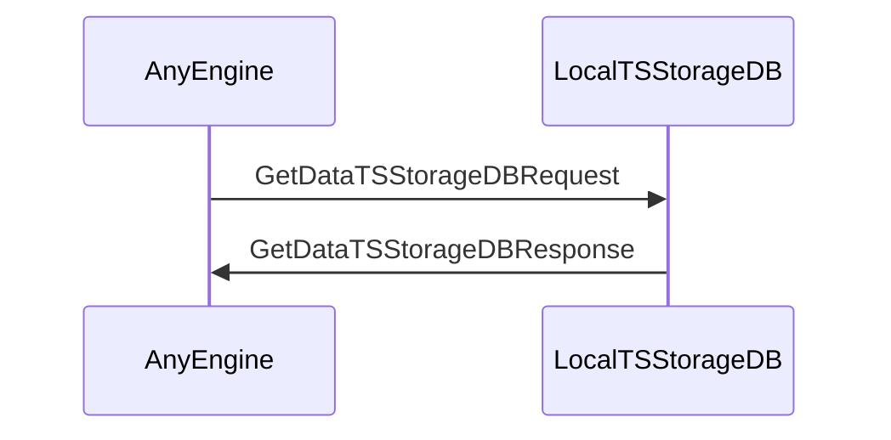
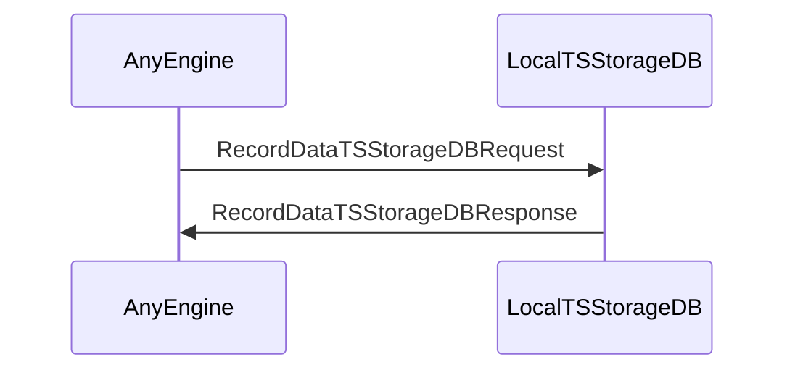
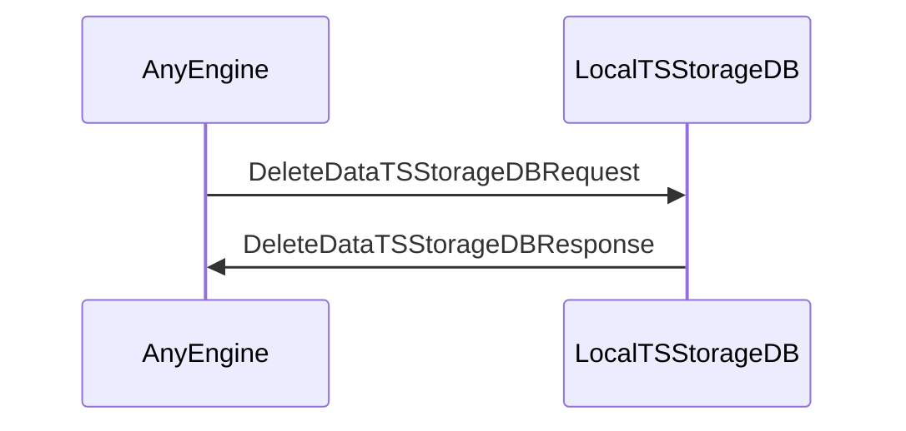

??? quote "Juvix imports"

    ```juvix
    module arch.node.engines.local_time_series_storage_messages;
    import prelude open;
    ```

# Local Time Series Messages

These are the messages that the Local Time Series Storage engine can receive/respond to.

## Message interface

??? quote "Auxiliary Juvix code"

    ```juvix
    syntax alias TSStorageDBQuery := String;
    syntax alias TSStorageDBData := String;
    syntax alias EpochTimestamp := Nat;
    ```

### `GetDataTSStorageDBRequestV1`

<!-- --8<-- [start:GetDataTSStorageDBRequestV1] -->
```juvix
type GetDataTSStorageDBRequestV1 := mkGetDataTSStorageDBRequestV1 {
  query : TSStorageDBQuery
};
```
<!-- --8<-- [end:GetDataTSStorageDBRequestV1] -->

???+ quote "Arguments"

    `query`
    : The query that finds the requested time series data in the DB.

### `GetDataTSStorageDBResponseV1`

<!-- --8<-- [start:GetDataTSStorageDBResponseV1] -->
```juvix
type GetDataTSStorageDBResponseV1 := mkGetDataTSStorageDBResponseV1 {
  query : TSStorageDBQuery;
  data : TSStorageDBData
};
```
<!-- --8<-- [end:GetDataTSStorageDBResponseV1] -->

???+ quote "Arguments"

    `query`
    : The query that finds the requested time series data in the DB.

    `data`
    : The requested time series data.

### `RecordDataTSStorageDBRequestV1`

<!-- --8<-- [start:RecordDataTSStorageDBRequestV1] -->
```juvix
type RecordDataTSStorageDBRequestV1 := mkRecordDataTSStorageDBRequestV1 {
  query : TSStorageDBQuery
};
```
<!-- --8<-- [end:RecordDataTSStorageDBRequestV1] -->

???+ quote "Arguments"

    `query`
    : The query that expresses the addition of the time series data into the DB.

### `RecordDataTSStorageDBResponseV1`

<!-- --8<-- [start:RecordDataTSStorageDBResponseV1] -->
```juvix
type RecordDataTSStorageDBResponseV1 := mkRecordDataTSStorageDBResponseV1 {
  query : TSStorageDBQuery;
  success : Bool
};
```
<!-- --8<-- [end:RecordDataTSStorageDBResponseV1] -->

???+ quote "Arguments"

    `query`
    : The query that expresses the recording of the time series data into the DB.

    `success`
    : The success of the operation, indicating that the data was stored successfully or not.

### `DeleteDataTSStorageDBRequestV1`

<!-- --8<-- [start:DeleteDataTSStorageDBRequestV1] -->
```juvix
type DeleteDataTSStorageDBRequestV1 := mkDeleteDataTSStorageDBRequestV1 {
  query : TSStorageDBQuery
};
```
<!-- --8<-- [end:DeleteDataTSStorageDBRequestV1] -->

???+ quote "Arguments"

    `query`
    : The query that expresses the deletion of the time series data from the DB.

### `DeleteDataTSStorageDBResponseV1`

<!-- --8<-- [start:DeleteDataTSStorageDBResponseV1] -->
```juvix
type DeleteDataTSStorageDBResponseV1 := mkDeleteDataTSStorageDBResponseV1 {
  query : TSStorageDBQuery;
  success : Bool
};
```
<!-- --8<-- [end:DeleteDataTSStorageDBResponseV1] -->

???+ quote "Arguments"

    `query`
    : The query that expresses the deletion of the time series data from the DB.

    `success`
    : The success of the operation, indicating that the data was deleted successfully or not.

### `DataChangedTSStorageDBV1`

<!-- --8<-- [start:DataChangedTSStorageDBV1] -->
```juvix
type DataChangedTSStorageDBV1 := mkDataChangedTSStorageDBV1 {
  query : TSStorageDBQuery;
  data : TSStorageDBData;
  timestamp : EpochTimestamp
};
```
<!-- --8<-- [end:DataChangedTSStorageDBV1] -->

???+ quote "Arguments"

    `query`
    : The query that expresses the change of the time series DB.

    `data`
    : The changed time series data.

    `timestamp`
    : The wall clock time of the moment the data was changed.

### `LocalTSStorageMsg`

<!-- --8<-- [start:LocalTSStorageMsg] -->
```juvix
type LocalTSStorageMsg :=
  | LocalTSStorageMsgGetRequest GetDataTSStorageDBRequestV1
  | LocalTSStorageMsgGetResponse GetDataTSStorageDBResponseV1
  | LocalTSStorageMsgRecordRequest RecordDataTSStorageDBRequestV1
  | LocalTSStorageMsgRecordResponse RecordDataTSStorageDBResponseV1
  | LocalTSStorageMsgDeleteRequest DeleteDataTSStorageDBRequestV1
  | LocalTSStorageMsgDeleteResponse DeleteDataTSStorageDBResponseV1
  | LocalTSStorageMsgDataChanged DataChangedTSStorageDBV1
  ;
```
<!-- --8<-- [end:LocalTSStorageMsg] -->

## Sequence Diagrams

### `GetDataTSStorageDBRequest` & `GetDataTSStorageDBResponse`

<!-- --8<-- [start:message-sequence-diagram-Get] -->
<figure markdown="span">



<figcaption markdown="span">
Sequence Diagram: Get Data Flow
</figcaption>
</figure>
<!-- --8<-- [end:message-sequence-diagram-Get] -->

### `RecordDataTSStorageDBRequest` & `RecordDataTSStorageDBResponse`

<!-- --8<-- [start:message-sequence-diagram-Record] -->
<figure markdown="span">



<figcaption markdown="span">
Sequence Diagram: Record Data Flow
</figcaption>
</figure>
<!-- --8<-- [end:message-sequence-diagram-Record] -->

### `DeleteDataTSStorageDBRequest` & `DeleteDataTSStorageDBResponse`

<!-- --8<-- [start:message-sequence-diagram-Delete] -->
<figure markdown="span">



<figcaption markdown="span">
Sequence Diagram: Delete Data Flow
</figcaption>
</figure>
<!-- --8<-- [end:message-sequence-diagram-Delete] -->
