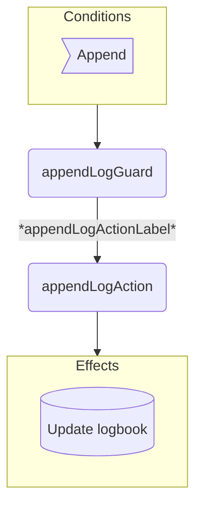

??? code "Juvix imports"

    ```juvix
    module arch.node.engines.logging_behaviour;

    import arch.node.engines.logging_messages open;
    import arch.node.engines.logging_config open;
    import arch.node.engines.logging_environment open;

    import prelude open;
    import arch.node.types.basics open;
    import arch.node.types.identities open;
    import arch.node.types.messages open;
    import arch.node.types.engine open;
    import arch.node.types.anoma as Anoma open;
    ```

# Logging Behaviour

## Overview

A logging engine maintains a logbook of entries and provides the capability to append new entries.

## Action arguments

### `LoggingActionArgument`

<!-- --8<-- [start:LoggingActionArgument] -->
```juvix
type LoggingActionArgument := Unit;
```
<!-- --8<-- [end:LoggingActionArgument] -->

### `LoggingActionArguments`

<!-- --8<-- [start:LoggingActionArguments] -->
```juvix
LoggingActionArguments : Type := List LoggingActionArgument;
```
<!-- --8<-- [end:LoggingActionArguments] -->

## Actions

??? code "Auxiliary Juvix code"

    ### `LoggingAction`

    <!-- --8<-- [start:LoggingAction] -->
    ```juvix
    LoggingAction : Type :=
      Action
        LoggingLocalCfg
        LoggingLocalState
        LoggingMailboxState
        LoggingTimerHandle
        LoggingActionArguments
        Anoma.Msg
        Anoma.Cfg
        Anoma.Env;
    ```
    <!-- --8<-- [end:LoggingAction] -->

    ### `LoggingActionInput`

    <!-- --8<-- [start:LoggingActionInput] -->
    ```juvix
    LoggingActionInput : Type :=
      ActionInput
        LoggingLocalCfg
        LoggingLocalState
        LoggingMailboxState
        LoggingTimerHandle
        LoggingActionArguments
        Anoma.Msg;
    ```
    <!-- --8<-- [end:LoggingActionInput] -->

    ### `LoggingActionEffect`

    <!-- --8<-- [start:LoggingActionEffect] -->
    ```juvix
    LoggingActionEffect : Type :=
      ActionEffect
        LoggingLocalState
        LoggingMailboxState
        LoggingTimerHandle
        Anoma.Msg
        Anoma.Cfg
        Anoma.Env;
    ```
    <!-- --8<-- [end:LoggingActionEffect] -->

    ### `LoggingActionExec`

    <!-- --8<-- [start:LoggingActionExec] -->
    ```juvix
    LoggingActionExec : Type :=
      ActionExec
        LoggingLocalCfg
        LoggingLocalState
        LoggingMailboxState
        LoggingTimerHandle
        LoggingActionArguments
        Anoma.Msg
        Anoma.Cfg
        Anoma.Env;
    ```
    <!-- --8<-- [end:LoggingActionExec] -->

### `appendLogAction`

Append new log entry to the logbook.

State update
: Add the new log entry to the logbook.

Messages to be sent
: No messages are sent by this action.

Engines to be spawned
: No engine is created by this action.

Timer updates
: No timers are set or cancelled.

<!-- --8<-- [start:appendLogAction] -->
```juvix
appendLogAction
  (input : LoggingActionInput)
  : Option LoggingActionEffect :=
  let
    env := ActionInput.env input;
    trigger := ActionInput.trigger input;
  in case getEngineMsgFromTimestampedTrigger trigger of {
    | some EngineMsg.mk@{
        msg := Anoma.Msg.MsgLogging (LoggingMsg.Append (AppendValue.mk@{value := value}));
      } :=
      let
        currentLogbook := LoggingLocalState.logbook (EngineEnv.localState env);
        newLogbook := value :: currentLogbook;
      in some ActionEffect.mk@{
        env := env@EngineEnv{
          localState := LoggingLocalState.mk@{
            logbook := newLogbook
          }
        };
        msgs := [];
        timers := [];
        engines := [];
      }
    | _ := none
  };
```
<!-- --8<-- [end:appendLogAction] -->

## Action Labels

### `appendLogActionLabel`

```juvix
appendLogActionLabel : LoggingActionExec := ActionExec.Seq [ appendLogAction ];
```

## Guards

??? code "Auxiliary Juvix code"

    ```juvix
    LoggingGuard : Type :=
      Guard
        LoggingLocalCfg
        LoggingLocalState
        LoggingMailboxState
        LoggingTimerHandle
        LoggingActionArguments
        Anoma.Msg
        Anoma.Cfg
        Anoma.Env;

    LoggingGuardOutput : Type :=
      GuardOutput
        LoggingLocalCfg
        LoggingLocalState
        LoggingMailboxState
        LoggingTimerHandle
        LoggingActionArguments
        Anoma.Msg
        Anoma.Cfg
        Anoma.Env;

    LoggingGuardEval : Type :=
      GuardEval
        LoggingLocalCfg
        LoggingLocalState
        LoggingMailboxState
        LoggingTimerHandle
        LoggingActionArguments
        Anoma.Msg
        Anoma.Cfg
        Anoma.Env;
    ```

### `appendLogGuard`

Guard for append log action.

Condition
: Message type is `Append`.

<!-- --8<-- [start:appendLogGuard] -->
```juvix
appendLogGuard
  (trigger : LoggingTimestampedTrigger)
  (cfg : LoggingCfg)
  (env : LoggingEnv)
  : Option LoggingGuardOutput :=
  case getEngineMsgFromTimestampedTrigger trigger of {
    | some EngineMsg.mk@{
        msg := Anoma.Msg.MsgLogging (LoggingMsg.Append _);
      } := some GuardOutput.mk@{
        action := appendLogActionLabel;
        args := [];
      }
    | _ := none
  };
```
<!-- --8<-- [end:appendLogGuard] -->

## The Logging behaviour

### `LoggingBehaviour`

<!-- --8<-- [start:LoggingBehaviour] -->
```juvix
LoggingBehaviour : Type :=
  EngineBehaviour
    LoggingLocalCfg
    LoggingLocalState
    LoggingMailboxState
    LoggingTimerHandle
    LoggingActionArguments
    Anoma.Msg
    Anoma.Cfg
    Anoma.Env;
```
<!-- --8<-- [end:LoggingBehaviour] -->

#### Instantiation

<!-- --8<-- [start:loggingBehaviour] -->
```juvix
loggingBehaviour : LoggingBehaviour :=
  EngineBehaviour.mk@{
    guards := GuardEval.First [ appendLogGuard ];
  };
```
<!-- --8<-- [end:loggingBehaviour] -->

## Logging Action Flowchart

### `appendLog` Flowchart

<figure markdown>



<figcaption markdown="span">
`appendLog` flowchart
</figcaption>
</figure>
