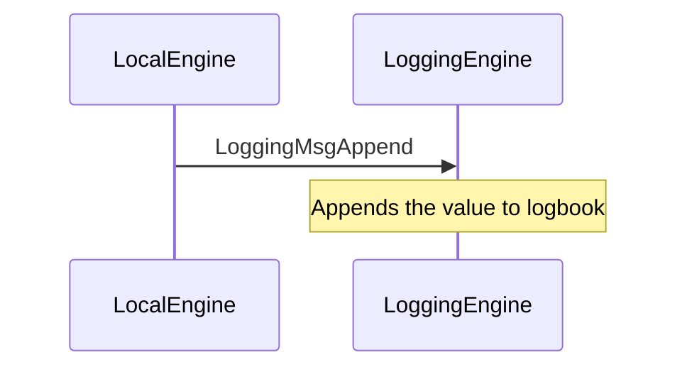

??? quote "Juvix imports"

    ```juvix
    module arch.node.engines.logging_messages;
    import prelude open;
    ```

# Logging Messages

These are the messages that the Logging engine can receive/respond to.

## Message interface

### `LoggingMsgAppendValue AppendValue`

<!-- --8<-- [start:AppendValue] -->
```juvix
type AppendValue := mkAppendValue {
  value : String
};
```
<!-- --8<-- [end:AppendValue] -->

???+ quote "Arguments"

    `value`:
    : The value in string format to be added to the logbook.

### `LoggingMsg`

<!-- --8<-- [start:LoggingMsg] -->
```juvix
type LoggingMsg :=
  | LoggingMsgAppend AppendValue;
```
<!-- --8<-- [end:LoggingMsg] -->

## Message sequence diagrams

### Appending a log entry

<!-- --8<-- [start:message-sequence-diagram] -->
<figure markdown="span">



<figcaption markdown="span">
A local engine sends a log entry to be appended to the logbook
</figcaption>
</figure>
<!-- --8<-- [end:message-sequence-diagram] -->
