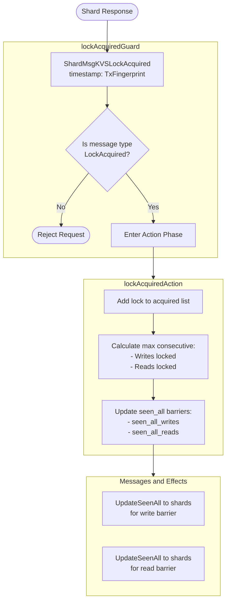
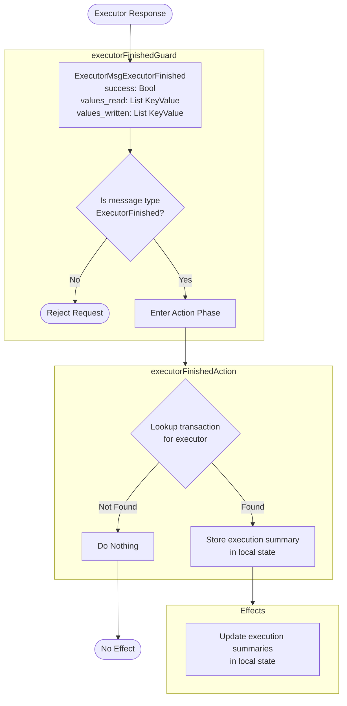

??? quote "Juvix imports"

    ```juvix
    module arch.node.engines.mempool_worker_behaviour;

    import arch.node.engines.mempool_worker_messages open;
    import arch.node.engines.mempool_worker_config open;
    import arch.node.engines.mempool_worker_environment open;
    import arch.node.engines.shard_messages open;
    import arch.node.engines.executor_messages open;
    import arch.node.engines.executor_config open;
    import arch.node.engines.executor_environment open;

    import prelude open;
    import Stdlib.Data.Nat open;
    import Stdlib.Data.List as List;
    import arch.node.types.basics open;
    import arch.node.types.identities open;
    import arch.node.types.messages open;
    import arch.node.types.engine open;
    import arch.node.types.anoma as Anoma open;
    ```

# Mempool Worker Behaviour

## Overview

A mempool worker acts as a transaction coordinator, receiving transaction requests, managing their execution lifecycle, and coordinating with shards and executors.

??? quote "Auxiliary Juvix code"

    ```juvix
    axiom sign : TxFingerprint -> TransactionCandidate -> Signature;
    axiom hash : TxFingerprint -> TransactionCandidate -> Hash;
    ```

## Mempool Worker Action Flowcharts

### `transactionRequestAction` flowchart

<figure markdown>

```mermaidflowchart TD
    Start([Client Request]) --> MsgReq[MempoolWorkerMsgTransactionRequest<br/>tx: TransactionCandidate]

    subgraph Guard["transactionRequestGuard"]
        MsgReq --> ValidType{Is message type<br/>TransactionRequest?}
        ValidType -->|No| Reject([Reject Request])
        ValidType -->|Yes| ActionEntry[Enter Action Phase]
    end

    ActionEntry --> Action

    subgraph Action["transactionRequestAction"]
        direction TB
        GenFP[Generate new fingerprint<br/>from gensym]
        GenFP --> SpawnEx[Create Executor Config<br/>with access rights]
        SpawnEx --> UpdateState[Update local state:<br/>- Increment gensym<br/>- Add to transactions map<br/>- Add to engine map]
        UpdateState --> PrepLocks[Prepare lock requests<br/>for each shard]
    end

    PrepLocks --> Msgs

    subgraph Msgs[Messages and Effects]
        MsgAck[TransactionAck to client<br/>with fingerprint & signature]
        MsgLock[KVSAcquireLock to shards<br/>with read/write keys]
        SpawnEng[Spawn Executor Engine]
    end

    style Guard fill:#f0f7ff,stroke:#333,stroke-width:2px
    style Action fill:#fff7f0,stroke:#333,stroke-width:2px
    style Msgs fill:#f7fff0,stroke:#333,stroke-width:2px
```

<figcaption markdown="span">
`transactionRequestAction` flowchart
</figcaption>
</figure>

#### Explanation

1. **Initial Request**
   - A client sends a `MempoolWorkerMsgTransactionRequest` containing:
     - `tx`: The transaction candidate to be ordered and executed.
     - `resubmission`: Optional reference to a previous occurrence (currently unused).
   - The transaction candidate includes its program code and access patterns (what it will read/write).

2. **Guard Phase** (`transactionRequestGuard`)
   - Verifies message type is `MempoolWorkerMsgTransactionRequest`.
   - If validation fails, request is rejected.
   - On success, passes control to `transactionRequestActionLabel`.

3. **Action Phase** (`transactionRequestAction`)
   - Generates new fingerprint by incrementing gensym counter.
   - Creates Executor configuration with:
     - Timestamp set to new fingerprint.
     - Executable code from transaction.
     - Access rights from transaction label.
     - References to worker and transaction issuer.
   - Updates local state:
     - Increments gensym counter.
     - Adds transaction to transactions map.
     - Records executor ID to fingerprint mapping.
   - Prepares lock requests for each affected shard by:
     - Grouping keys by shard.
     - Creating appropriate lock request messages.

4. **Response Generation**
   - **Messages sent**:
     - To client: `MempoolWorkerMsgTransactionAck` containing:
       - `tx_hash`: Hash of the transaction
       - `batch_number`: Current batch number
       - `worker_id`: This worker's ID
       - `signature`: Worker's signature over above fields
     - To shards: `KVSAcquireLock` messages for each affected shard containing:
       - `lazy_read_keys`: Keys that might be read
       - `eager_read_keys`: Keys that will definitely be read
       - `will_write_keys`: Keys that will definitely be written
       - `may_write_keys`: Keys that might be written
       - `worker`: This worker's ID
       - `executor`: ID of spawned executor
       - `timestamp`: Generated fingerprint

5. **Responses and Effects**
   - **Response Delivery**
     - All messages are sent with mailbox 0 (default response mailbox).
     - Transaction acknowledgment is sent back to original requester.
     - Lock requests are sent to all relevant shards.
   - **Engines spawned**:
     - Creates new Executor engine with generated configuration.

#### Important Notes:

- The fingerprint generation via a gensym is a simple version of what could be a more complex process

### `lockAcquiredAction` flowchart

<figure markdown>



<figcaption markdown="span">
`lockAcquiredAction` flowchart
</figcaption>
</figure>

#### Explanation

1. **Initial Message**
   - A Mempool Worker receives a `ShardMsgKVSLockAcquired` message from a Shard engine.
   - The message contains:
     - `timestamp`: The TxFingerprint identifying which transaction's locks were acquired.
     - (Implicit) The sender of the message identifies which shard has confirmed the locks.

2. **Guard Phase** (`lockAcquiredGuard`)
   - Verifies message type is `ShardMsgKVSLockAcquired`.
   - If validation fails, request is rejected.
   - On success, passes control to `lockAcquiredActionLabel`.

3. **Action Phase** (`lockAcquiredAction`)
   - Adds the new lock to the `locks_acquired` list in state.
   - Calculates new maximum consecutive sequence points by analyzing the lock history:
     - For writes: Finds highest fingerprint where all prior write locks are confirmed.
     - For reads: Finds highest fingerprint where all prior read locks are confirmed.
   - Updates internal barriers (`seen_all_writes` and `seen_all_reads`) based on calculations.
   - Constructs appropriate update messages for all shards.

4. **Response Generation**
   - Constructs `ShardMsgUpdateSeenAll` messages for every shard, containing:
     - For write barrier updates:
       - `timestamp`: New `seen_all_writes` value.
       - `write`: true.
     - For read barrier updates:
       - `timestamp`: New `seen_all_reads` value.
       - `write`: false.

5. **Message Delivery**
   - Update messages are broadcast to all shards in the system.
   - Uses mailbox 0 (the standard mailbox for responses).

### `executorFinishedAction` flowchart

<figure markdown>



<figcaption markdown="span">
`executorFinishedAction` flowchart
</figcaption>
</figure>

#### Explanation

1. **Initial Request**
   - An executor sends a `MsgExecutorFinished` containing:
     - `success`: Boolean indicating if execution completed successfully.
     - `values_read`: List of all key-value pairs that were read during execution.
     - `values_written`: List of all key-value pairs that were written during execution.
   - This message represents the completion of a transaction's execution lifecycle.

2. **Guard Phase** (`executorFinishedGuard`)
   - Verifies message type is `ExecutorMsgExecutorFinished`.
   - If validation fails, request is rejected immediately.
   - On success, passes control to `executorFinishedLabel`.

3. **Action Phase** (`executorFinishedAction`)
   - Processes valid executor completion notifications through these steps:
     - Looks up the transaction associated with the sending executor in the `transactionEngines` map.
     - If no transaction is found, the notification is ignored (this shouldn't happen in normal operation).
     - If transaction is found, stores the execution summary in the `execution_summaries` map.
     - The summary is indexed by the transaction's fingerprint for later reference.

4. **Response Generation**
   - **Successful Case**
     - Updates local state with the new execution summary.
     - No response messages are generated.
   - **Error Case**
     - If executor not found in mapping, quietly fails.
     - No error responses are sent

5. **State Update**
   - Updates the worker's local state:
     - Adds new entry to `execution_summaries` map.
     - Maps transaction fingerprint to its execution results.
   - No messages are sent.

## Action arguments

### `MempoolWorkerActionArgument`

<!-- --8<-- [start:MempoolWorkerActionArgument] -->
```juvix
syntax alias MempoolWorkerActionArgument := Unit;
```
<!-- --8<-- [end:MempoolWorkerActionArgument] -->

### `MempoolWorkerActionArguments`

<!-- --8<-- [start:MempoolWorkerActionArguments] -->
```juvix
MempoolWorkerActionArguments : Type := List MempoolWorkerActionArgument;
```
<!-- --8<-- [end:MempoolWorkerActionArguments] -->

## Actions

??? quote "Auxiliary Juvix code"

    ```juvix
    MempoolWorkerAction : Type :=
      Action
        MempoolWorkerCfg
        MempoolWorkerLocalState
        MempoolWorkerMailboxState
        MempoolWorkerTimerHandle
        MempoolWorkerActionArguments
        Anoma.Msg
        Anoma.Cfg
        Anoma.Env;

    MempoolWorkerActionInput : Type :=
      ActionInput
        MempoolWorkerCfg
        MempoolWorkerLocalState
        MempoolWorkerMailboxState
        MempoolWorkerTimerHandle
        MempoolWorkerActionArguments
        Anoma.Msg;

    MempoolWorkerActionEffect : Type :=
      ActionEffect
        MempoolWorkerLocalState
        MempoolWorkerMailboxState
        MempoolWorkerTimerHandle
        Anoma.Msg
        Anoma.Cfg
        Anoma.Env;

    MempoolWorkerActionExec : Type :=
      ActionExec
        MempoolWorkerCfg
        MempoolWorkerLocalState
        MempoolWorkerMailboxState
        MempoolWorkerTimerHandle
        MempoolWorkerActionArguments
        Anoma.Msg
        Anoma.Cfg
        Anoma.Env;
    ```

### `transactionRequestAction`

Action processing a new transaction request.

State update
: - Increments gensym counter
  - Adds transaction to transactions maps with new fingerprint

Messages to be sent
: - `TransactionAck` to requester
  - `KVSAcquireLock` messages to relevant shards

Engines to be spawned
: - Creates new [[Executor Engine]] for the transaction

Timer updates
: No timers are set or cancelled.

<!-- --8<-- [start:transactionRequestAction] -->
```juvix
transactionRequestAction
  (input : MempoolWorkerActionInput)
  : Option MempoolWorkerActionEffect :=
  let
    env := ActionInput.env input;
    cfg := ActionInput.cfg input;
    local := EngineEnv.localState env;
    trigger := ActionInput.trigger input;
  in case getEngineMsgFromTimestampedTrigger trigger of {
    | some emsg := case emsg of {
      | mkEngineMsg@{msg := Anoma.MsgMempoolWorker (MempoolWorkerMsgTransactionRequest request); sender := sender} :=
          let fingerprint := MempoolWorkerLocalState.gensym local + 1;
              worker_id := getEngineIDFromEngineCfg cfg;
              candidate := TransactionRequest.tx request;
              executor_name := nameGen "executor" (snd worker_id) worker_id;
              executor_id := mkPair none executor_name;
              executorCfg := Anoma.CfgExecutor mkExecutorCfg@{
                  timestamp := fingerprint;
                  executable := TransactionCandidate.executable candidate;
                  lazy_read_keys := Set.empty;
                  eager_read_keys := Set.fromList (TransactionLabel.read (TransactionCandidate.label candidate));
                  will_write_keys := Set.fromList (TransactionLabel.write (TransactionCandidate.label candidate));
                  may_write_keys := Set.empty;
                  worker := worker_id;
                  issuer := sender
                };
              executorEnv := Anoma.EnvExecutor mkEngineEnv@{
                localState := mkExecutorLocalState@{
                  program_state := mkProgramState@{
                    data := "";
                    halted := false
                  };
                  completed_reads := Map.empty;
                  completed_writes := Map.empty
                };
                mailboxCluster := Map.empty;
                acquaintances := Set.empty;
                timers := []
              };
              newState := local@MempoolWorkerLocalState{
                gensym := fingerprint;
                transactions := Map.insert fingerprint candidate (MempoolWorkerLocalState.transactions local);
                transactionEngines := Map.insert executor_id fingerprint (MempoolWorkerLocalState.transactionEngines local)
              };
              newEnv := env@EngineEnv{localState := newState};
              read_keys := Set.fromList (TransactionLabel.read (TransactionCandidate.label candidate));
              write_keys := Set.fromList (TransactionLabel.write (TransactionCandidate.label candidate));
              shards := Set.toList (Set.map keyToShard (Set.union read_keys write_keys));
              shardMsgs := map
                \{shard :=
                  let shard_read_keys := Set.filter (\{key := snd (keyToShard key) == snd shard}) read_keys;
                      shard_write_keys := Set.filter (\{key := snd (keyToShard key) == snd shard}) write_keys;
                      lockRequest := mkKVSAcquireLockMsg@{
                        lazy_read_keys := Set.empty;
                        eager_read_keys := shard_read_keys;
                        will_write_keys := shard_write_keys;
                        may_write_keys := Set.empty;
                        worker := worker_id;
                        executor := executor_id;
                        timestamp := fingerprint
                      };
                  in mkEngineMsg@{
                    sender := worker_id;
                    target := shard;
                    mailbox := some 0;
                    msg := Anoma.MsgShard (ShardMsgKVSAcquireLock lockRequest)
                  }}
                shards;
              ackMsg := mkEngineMsg@{
                sender := worker_id;
                target := sender;
                mailbox := some 0;
                msg := Anoma.MsgMempoolWorker (MempoolWorkerMsgTransactionAck
                  (mkTransactionAck@{
                    tx_hash := hash fingerprint candidate;
                    batch_number := MempoolWorkerLocalState.batch_number local;
                    batch_start := 0;
                    worker_id := worker_id;
                    signature := sign fingerprint candidate
                  }))
              };
          in some mkActionEffect@{
            env := newEnv;
            msgs := ackMsg :: shardMsgs;
            timers := [];
            engines := [mkPair executorCfg executorEnv]
          }
      | _ := none
    }
    | _ := none
  };
```
<!-- --8<-- [end:transactionRequestAction] -->

### `lockAcquiredAction`

Action processing lock acquisition confirmation from shards.

State update
: - Adds lock to locks_acquired list
  - Updates seen_all_writes/reads counters if applicable

Messages to be sent
: - UpdateSeenAll messages to shards when counters advance

Engines to be spawned
: None

Timer updates
: No timers are set or cancelled.

<!-- --8<-- [start:allLocksAcquired] -->
```juvix
allLocksAcquired
  (isWrite : Bool)
  (tx : TransactionCandidate)
  (txNum : TxFingerprint)
  (locks : List (Pair EngineID KVSLockAcquiredMsg)) : Bool :=
  let keys := case isWrite of {
        | true := TransactionLabel.write (TransactionCandidate.label tx)
        | false := TransactionLabel.read (TransactionCandidate.label tx)
      };
      neededShards := Set.fromList (map keyToShard keys);
      lockingShards := Set.fromList (map fst (List.filter \{lock := KVSLockAcquiredMsg.timestamp (snd lock) == txNum} locks));
  in Set.isSubset neededShards lockingShards;
```
<!-- --8<-- [end:allLocksAcquired] -->

<!-- --8<-- [start:findMaxConsecutiveLocked] -->
```juvix
--- Finds the highest transaction fingerprint N such that all transactions with fingerprints 1..N
--- have acquired all their necessary locks of the specified type (read or write). This represents
--- the "safe point" up to which shards can process transactions without worrying about missing locks.
terminating
findMaxConsecutiveLocked
  (isWrite : Bool)
  (transactions : Map TxFingerprint TransactionCandidate)
  (locks : List (Pair EngineID KVSLockAcquiredMsg))
  (current : TxFingerprint)
  (prev : TxFingerprint) : TxFingerprint :=
  case Map.lookup current transactions of {
    | none := prev
    | some tx := case allLocksAcquired isWrite tx current locks of {
      | true := findMaxConsecutiveLocked isWrite transactions locks (current + 1) current
      | false := prev
    }
  };
```
<!-- --8<-- [end:findMaxConsecutiveLocked] -->

<!-- --8<-- [start:getAllShards] -->
```juvix
getAllShards (transactions : Map TxFingerprint TransactionCandidate) : Set EngineID :=
  let getAllKeysFromLabel (label : TransactionLabel) : List KVSKey :=
        TransactionLabel.read label ++ TransactionLabel.write label;
      allKeys := List.concatMap
        \{tx := getAllKeysFromLabel (TransactionCandidate.label tx)}
        (Map.values transactions);
  in Set.fromList (map keyToShard allKeys);
```
<!-- --8<-- [end:getAllShards] -->

<!-- --8<-- [start:lockAcquiredAction] -->
```juvix
lockAcquiredAction
  (input : MempoolWorkerActionInput)
  : Option MempoolWorkerActionEffect :=
  let
    env := ActionInput.env input;
    local := EngineEnv.localState env;
    trigger := ActionInput.trigger input;
  in case getEngineMsgFromTimestampedTrigger trigger of {
    | some emsg := case emsg of {
      | mkEngineMsg@{msg := Anoma.MsgShard (ShardMsgKVSLockAcquired lockMsg); sender := sender} :=
        let timestamp := KVSLockAcquiredMsg.timestamp lockMsg;
            newLocks := (mkPair sender lockMsg) :: MempoolWorkerLocalState.locks_acquired local;
            maxConsecutiveWrite := findMaxConsecutiveLocked true (MempoolWorkerLocalState.transactions local) newLocks 1 0;
            maxConsecutiveRead := findMaxConsecutiveLocked false (MempoolWorkerLocalState.transactions local) newLocks 1 0;
            newState := local@MempoolWorkerLocalState{
              locks_acquired := newLocks;
              seen_all_writes := maxConsecutiveWrite;
              seen_all_reads := maxConsecutiveRead
            };
            newEnv := env@EngineEnv{localState := newState};
            allShards := getAllShards (MempoolWorkerLocalState.transactions local);
            makeUpdateMsg (target : EngineID) (isWrite : Bool) (timestamp : TxFingerprint) : EngineMsg Anoma.Msg :=
              mkEngineMsg@{
                sender := getEngineIDFromEngineCfg (ActionInput.cfg input);
                target := target;
                mailbox := some 0;
                msg := Anoma.MsgShard (ShardMsgUpdateSeenAll
                  (mkUpdateSeenAllMsg@{
                    timestamp := timestamp;
                    write := isWrite
                  }))
              };
            writeMessages := map \{shard := makeUpdateMsg shard true maxConsecutiveWrite} (Set.toList allShards);
            readMessages := map \{shard := makeUpdateMsg shard false maxConsecutiveRead} (Set.toList allShards);
        in some mkActionEffect@{
          env := newEnv;
          msgs := writeMessages ++ readMessages;
          timers := [];
          engines := []
        }
      | _ := none
    }
    | _ := none
  };
```
<!-- --8<-- [end:lockAcquiredAction] -->

### `executorFinishedAction`

Action processing execution completion notification from executor.

State update
: Adds execution summary to execution_summaries map

Messages to be sent
: None

Engines to be spawned
: None

Timer updates
: No timers are set or cancelled.

<!-- --8<-- [start:executorFinishedAction] -->
```juvix
executorFinishedAction
  (input : MempoolWorkerActionInput)
  : Option MempoolWorkerActionEffect :=
  let
    env := ActionInput.env input;
    local := EngineEnv.localState env;
    trigger := ActionInput.trigger input;
  in case getEngineMsgFromTimestampedTrigger trigger of {
    | some emsg := case emsg of {
      | mkEngineMsg@{msg := Anoma.MsgExecutor (ExecutorMsgExecutorFinished summary); sender := sender} :=
          case Map.lookup sender (MempoolWorkerLocalState.transactionEngines local) of {
            | some tr :=
              let newState := local@MempoolWorkerLocalState{
                    execution_summaries := Map.insert tr summary (MempoolWorkerLocalState.execution_summaries local)
                  };
                  newEnv := env@EngineEnv{localState := newState};
              in some mkActionEffect@{
                env := newEnv;
                msgs := [];
                timers := [];
                engines := []
              }
            | _ := none
          }
      | _ := none
    }
    | _ := none
  };
```
<!-- --8<-- [end:executorFinishedAction] -->

### Action Labels

```juvix
transactionRequestActionLabel : MempoolWorkerActionExec :=
  Seq [ transactionRequestAction ];

lockAcquiredActionLabel : MempoolWorkerActionExec :=
  Seq [ lockAcquiredAction ];

executorFinishedActionLabel : MempoolWorkerActionExec :=
  Seq [ executorFinishedAction ];
```

## Guards

??? quote "Auxiliary Juvix code"

    ```juvix
    MempoolWorkerGuard : Type :=
      Guard
        MempoolWorkerCfg
        MempoolWorkerLocalState
        MempoolWorkerMailboxState
        MempoolWorkerTimerHandle
        MempoolWorkerActionArguments
        Anoma.Msg
        Anoma.Cfg
        Anoma.Env;

    MempoolWorkerGuardOutput : Type :=
      GuardOutput
        MempoolWorkerCfg
        MempoolWorkerLocalState
        MempoolWorkerMailboxState
        MempoolWorkerTimerHandle
        MempoolWorkerActionArguments
        Anoma.Msg
        Anoma.Cfg
        Anoma.Env;

    MempoolWorkerGuardEval : Type :=
      GuardEval
        MempoolWorkerCfg
        MempoolWorkerLocalState
        MempoolWorkerMailboxState
        MempoolWorkerTimerHandle
        MempoolWorkerActionArguments
        Anoma.Msg
        Anoma.Cfg
        Anoma.Env;
    ```

### `transactionRequestGuard`

Condition
: Message type is MempoolWorkerMsgTransactionRequest

<!-- --8<-- [start:transactionRequestGuard] -->
```juvix
transactionRequestGuard
  (trigger : TimestampedTrigger MempoolWorkerTimerHandle Anoma.Msg)
  (cfg : EngineCfg MempoolWorkerCfg)
  (env : MempoolWorkerEnv)
  : Option MempoolWorkerGuardOutput :=
  case getEngineMsgFromTimestampedTrigger trigger of {
    | some mkEngineMsg@{msg := Anoma.MsgMempoolWorker (MempoolWorkerMsgTransactionRequest _)} :=
      some mkGuardOutput@{
        action := transactionRequestActionLabel;
        args := []
      }
    | _ := none
  };
```
<!-- --8<-- [end:transactionRequestGuard] -->

### `lockAcquiredGuard`

Condition
: Message type is ShardMsgKVSLockAc

### `lockAcquiredGuard`

Condition
: Message type is ShardMsgKVSLockAcquired

<!-- --8<-- [start:lockAcquiredGuard] -->
```juvix
lockAcquiredGuard
  (trigger : TimestampedTrigger MempoolWorkerTimerHandle Anoma.Msg)
  (cfg : EngineCfg MempoolWorkerCfg)
  (env : MempoolWorkerEnv)
  : Option MempoolWorkerGuardOutput :=
  case getEngineMsgFromTimestampedTrigger trigger of {
    | some mkEngineMsg@{msg := Anoma.MsgShard (ShardMsgKVSLockAcquired _)} :=
      some mkGuardOutput@{
        action := lockAcquiredActionLabel;
        args := []
      }
    | _ := none
  };
```
<!-- --8<-- [end:lockAcquiredGuard] -->

### `executorFinishedGuard`

Condition
: Message type is ExecutorMsgExecutorFinished

<!-- --8<-- [start:executorFinishedGuard] -->
```juvix
executorFinishedGuard
  (trigger : TimestampedTrigger MempoolWorkerTimerHandle Anoma.Msg)
  (cfg : EngineCfg MempoolWorkerCfg)
  (env : MempoolWorkerEnv)
  : Option MempoolWorkerGuardOutput :=
  case getEngineMsgFromTimestampedTrigger trigger of {
    | some mkEngineMsg@{msg := Anoma.MsgExecutor (ExecutorMsgExecutorFinished _)} :=
      some mkGuardOutput@{
        action := executorFinishedActionLabel;
        args := []
      }
    | _ := none
  };
```
<!-- --8<-- [end:executorFinishedGuard] -->

## The Mempool Worker Behaviour

### `MempoolWorkerBehaviour`

<!-- --8<-- [start:MempoolWorkerBehaviour] -->
```juvix
MempoolWorkerBehaviour : Type :=
  EngineBehaviour
    MempoolWorkerCfg
    MempoolWorkerLocalState
    MempoolWorkerMailboxState
    MempoolWorkerTimerHandle
    MempoolWorkerActionArguments
    Anoma.Msg
    Anoma.Cfg
    Anoma.Env;
```
<!-- --8<-- [end:MempoolWorkerBehaviour] -->

### Instantiation

<!-- --8<-- [start:mempoolWorkerBehaviour] -->
```juvix
mempoolWorkerBehaviour : MempoolWorkerBehaviour :=
  mkEngineBehaviour@{
    guards := First [
      transactionRequestGuard;
      lockAcquiredGuard;
      executorFinishedGuard
    ]
  };
```
<!-- --8<-- [end:mempoolWorkerBehaviour] -->

