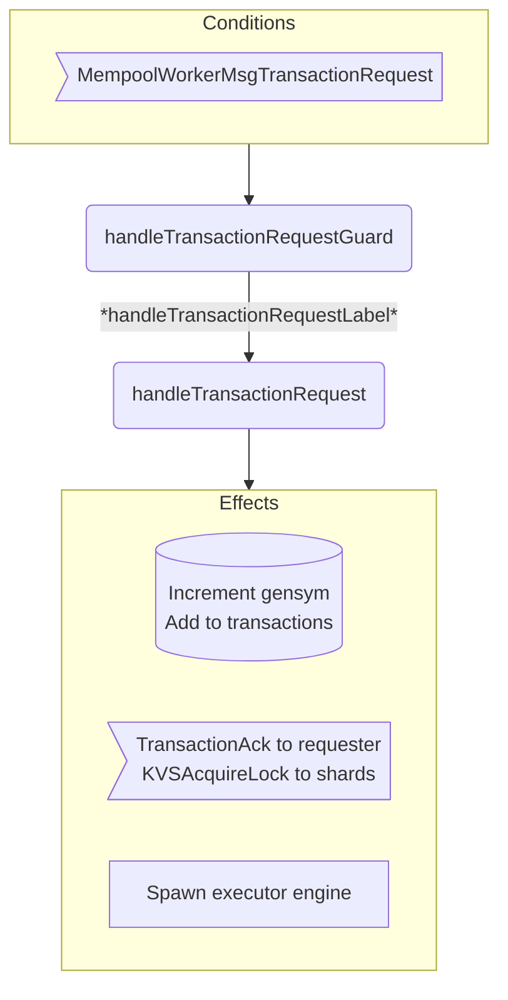

??? quote "Juvix imports"

    ```juvix
    module arch.node.engines.mempool_worker_behaviour;

    import arch.node.engines.mempool_worker_messages open;
    import arch.node.engines.mempool_worker_config open;
    import arch.node.engines.mempool_worker_environment open;
    import arch.node.engines.executor_messages open;
    import arch.node.engines.shard_messages open;
    import arch.node.engines.executor_config open;
    import arch.node.engines.executor_environment open;

    import prelude open;
    import Stdlib.Data.Nat open;
    import arch.node.types.basics open;
    import arch.node.types.identities open;
    import arch.node.types.messages open;
    import arch.node.types.engine open;
    import arch.node.types.anoma as Anoma open;
    ```

# Mempool Worker Behaviour

## Overview

A mempool worker acts as a transaction coordinator, receiving transaction requests, managing their execution lifecycle, and coordinating with shards and executors.

??? quote "Auxiliary Juvix code"

    ```juvix
    axiom sign : Signature;
    axiom hash : Hash;
    ```

## Action arguments

### `MempoolWorkerActionArgument`

<!-- --8<-- [start:MempoolWorkerActionArgument] -->
```juvix
type MempoolWorkerActionArgument :=
  | NoArgument
  ;
```
<!-- --8<-- [end:MempoolWorkerActionArgument] -->

### `MempoolWorkerActionArguments`

<!-- --8<-- [start:MempoolWorkerActionArguments] -->
```juvix
MempoolWorkerActionArguments : Type := List MempoolWorkerActionArgument;
```
<!-- --8<-- [end:MempoolWorkerActionArguments] -->

## Actions

??? quote "Auxiliary Juvix code"

    ```juvix
    MempoolWorkerAction : Type :=
      Action
        MempoolWorkerCfg
        MempoolWorkerLocalState
        MempoolWorkerMailboxState
        MempoolWorkerTimerHandle
        MempoolWorkerActionArguments
        Anoma.Msg
        Anoma.Cfg
        Anoma.Env;

    MempoolWorkerActionInput : Type :=
      ActionInput
        MempoolWorkerCfg
        MempoolWorkerLocalState
        MempoolWorkerMailboxState
        MempoolWorkerTimerHandle
        MempoolWorkerActionArguments
        Anoma.Msg;

    MempoolWorkerActionEffect : Type :=
      ActionEffect
        MempoolWorkerLocalState
        MempoolWorkerMailboxState
        MempoolWorkerTimerHandle
        Anoma.Msg
        Anoma.Cfg
        Anoma.Env;

    MempoolWorkerActionExec : Type :=
      ActionExec
        MempoolWorkerCfg
        MempoolWorkerLocalState
        MempoolWorkerMailboxState
        MempoolWorkerTimerHandle
        MempoolWorkerActionArguments
        Anoma.Msg
        Anoma.Cfg
        Anoma.Env;
    ```

### Helper functions

```juvix
notifyShards
  (sender : EngineID)
  (label : TransactionLabel)
  (timestamp : TxFingerprint)
  (worker : EngineID)
  (executor : EngineID)
  : List (EngineMsg Anoma.Msg) :=
    let eager_keys := Set.fromList (TransactionLabel.read label);
        write_keys := Set.fromList (TransactionLabel.write label);
        lockRequest := mkKVSAcquireLockMsg@{
          lazy_read_keys := Set.empty;
          eager_read_keys := eager_keys;
          will_write_keys := write_keys;
          may_write_keys := Set.empty;
          curator := worker;
          executor := executor;
          timestamp := timestamp
        };
        shards := Set.toList (Set.map keyToShard (Set.union eager_keys write_keys));
    in map
      \{shard :=
        mkEngineMsg@{
          sender := sender;
          target := shard;
          mailbox := some 0;
          msg := Anoma.MsgShard (ShardMsgKVSAcquireLock lockRequest)
        }} shards;

incrementGensym (state : MempoolWorkerLocalState) : MempoolWorkerLocalState :=
  state@MempoolWorkerLocalState{
    gensym := MempoolWorkerLocalState.gensym state + 1
  };
```

### `handleTransactionRequest`

Action processing a new transaction request.

State update
: - Increments gensym counter
  - Adds transaction to transactions map with new fingerprint

Messages to be sent
: - TransactionAck to requester
  - KVSAcquireLock messages to relevant shards

Engines to be spawned
: - Creates new executor engine for the transaction

<!-- --8<-- [start:handleTransactionRequest] -->
TODO: Generate environment!
```juvix
handleTransactionRequest
  (input : MempoolWorkerActionInput)
  : Option MempoolWorkerActionEffect :=
  let
    env := ActionInput.env input;
    cfg := ActionInput.cfg input;
    local := EngineEnv.localState env;
    trigger := ActionInput.trigger input;
  in case getEngineMsgFromTimestampedTrigger trigger of {
    | some emsg := case emsg of {
      | mkEngineMsg@{msg := Anoma.MsgMempoolWorker (MempoolWorkerMsgTransactionRequest request); sender := sender} :=
          let newGensym := MempoolWorkerLocalState.gensym local + 1;
              worker_id := getEngineIDFromEngineCfg cfg;
              node_id := EngineCfg.node cfg;
              tx := TransactionRequest.tx request;
              executor_name := nameGen "executor" (snd worker_id) worker_id;
              executor_id := mkPair none executor_name;
              executorCfg := CfgExecutor mkExecutorCfg@{
                  timestamp := newGensym;
                  executable := TransactionCandidate.executable tx;
                  lazy_read_keys := Set.empty;
                  eager_read_keys := Set.fromList (TransactionLabel.read (TransactionCandidate.label tx));
                  will_write_keys := Set.fromList (TransactionLabel.write (TransactionCandidate.label tx));
                  may_write_keys := Set.empty;
                  worker := worker_id;
                  issuer := sender
                };
              executorEnv := (Anoma.EnvExecutor undef);
              newState := local@MempoolWorkerLocalState{
                gensym := newGensym;
                transactions := Map.insert newGensym tx (MempoolWorkerLocalState.transactions local);
                transactionEngines := Map.insert executor_id newGensym (MempoolWorkerLocalState.transactionEngines local)
              };
              newEnv := env@EngineEnv{localState := newState};
              shardMsgs := notifyShards worker_id (TransactionCandidate.label tx) newGensym worker_id executor_id;
              ackMsg := mkEngineMsg@{
                sender := worker_id;
                target := sender;
                mailbox := some 0;
                msg := Anoma.MsgMempoolWorker (MempoolWorkerMsgTransactionAck
                  (mkTransactionAck@{
                    tx_hash := hash;
                    batch_number := MempoolWorkerLocalState.batch_number local;
                    batch_start := 0; -- TODO: actual time
                    worker_id := worker_id;
                    signature := sign
                  }))
              };
          in some mkActionEffect@{
            env := newEnv;
            msgs := ackMsg :: shardMsgs;
            timers := [];
            engines := [mkPair executorCfg executorEnv]
          }
      | _ := none
    }
    | _ := none
  };
```
<!-- --8<-- [end:handleTransactionRequest] -->

### `handleLockAcquired`

Action processing lock acquisition confirmation from shards.

State update
: - Adds lock to locks_acquired list
  - Updates seen_all_writes/reads counters if applicable

Messages to be sent
: - UpdateSeenAll messages to shards when counters advance

Engines to be spawned
: None

<!-- --8<-- [start:handleLockAcquired] -->
TODO: Correct logic. This should onl update the seen_all_writes if the timestamp is the largest AND all previous are aquired.
      what it should do is simply calculate the largest consecutive aquired timestamp.
```juvix
handleLockAcquired
  (input : MempoolWorkerActionInput)
  : Option MempoolWorkerActionEffect :=
  let
    env := ActionInput.env input;
    local := EngineEnv.localState env;
    trigger := ActionInput.trigger input;
  in case getEngineMsgFromTimestampedTrigger trigger of {
    | some emsg := case emsg of {
      | mkEngineMsg@{msg := Anoma.MsgShard (ShardMsgKVSLockAcquired lockMsg); sender := sender} :=
          let timestamp := KVSLockAcquiredMsg.timestamp lockMsg;
              newLocks := lockMsg :: MempoolWorkerLocalState.locks_acquired local;
              newState := local@MempoolWorkerLocalState{
                locks_acquired := newLocks;
                seen_all_writes :=
                  case MempoolWorkerLocalState.seen_all_writes local < timestamp of {
                    | true := timestamp
                    | false := MempoolWorkerLocalState.seen_all_writes local
                  }
              };
              newEnv := env@EngineEnv{localState := newState};
              updateMsg := mkEngineMsg@{
                sender := getEngineIDFromEngineCfg (ActionInput.cfg input);
                target := sender;
                mailbox := some 0;
                msg := Anoma.MsgShard (ShardMsgUpdateSeenAll
                  (mkUpdateSeenAllMsg@{
                    timestamp := timestamp;
                    write := true
                  }))
              };
          in some mkActionEffect@{
            env := newEnv;
            msgs := [updateMsg];
            timers := [];
            engines := []
          }
      | _ := none
    }
    | _ := none
  };
```
<!-- --8<-- [end:handleLockAcquired] -->

### `handleExecutorFinished`

Action processing execution completion notification from executor.

State update
: Adds execution summary to execution_summaries map

Messages to be sent
: None

Engines to be spawned
: None

<!-- --8<-- [start:handleExecutorFinished] -->
```juvix
handleExecutorFinished
  (input : MempoolWorkerActionInput)
  : Option MempoolWorkerActionEffect :=
  let
    env := ActionInput.env input;
    local := EngineEnv.localState env;
    trigger := ActionInput.trigger input;
  in case getEngineMsgFromTimestampedTrigger trigger of {
    | some emsg := case emsg of {
      | mkEngineMsg@{msg := Anoma.MsgExecutor (ExecutorMsgExecutorFinished summary); sender := sender} :=
          case Map.lookup sender (MempoolWorkerLocalState.transactionEngines local) of {
            | some tr :=
              let newState := local@MempoolWorkerLocalState{
                    execution_summaries := Map.insert tr summary (MempoolWorkerLocalState.execution_summaries local)
                  };
                  newEnv := env@EngineEnv{localState := newState};
              in some mkActionEffect@{
                env := newEnv;
                msgs := [];
                timers := [];
                engines := []
              }
            | _ := none
          }
      | _ := none
    }
    | _ := none
  };
```
<!-- --8<-- [end:handleExecutorFinished] -->

### Action Labels

```juvix
handleTransactionRequestLabel : MempoolWorkerActionExec :=
  Seq [ handleTransactionRequest ];

handleLockAcquiredLabel : MempoolWorkerActionExec :=
  Seq [ handleLockAcquired ];

handleExecutorFinishedLabel : MempoolWorkerActionExec :=
  Seq [ handleExecutorFinished ];
```

## Guards

??? quote "Auxiliary Juvix code"

    ```juvix
    MempoolWorkerGuard : Type :=
      Guard
        MempoolWorkerCfg
        MempoolWorkerLocalState
        MempoolWorkerMailboxState
        MempoolWorkerTimerHandle
        MempoolWorkerActionArguments
        Anoma.Msg
        Anoma.Cfg
        Anoma.Env;

    MempoolWorkerGuardOutput : Type :=
      GuardOutput
        MempoolWorkerCfg
        MempoolWorkerLocalState
        MempoolWorkerMailboxState
        MempoolWorkerTimerHandle
        MempoolWorkerActionArguments
        Anoma.Msg
        Anoma.Cfg
        Anoma.Env;

    MempoolWorkerGuardEval : Type :=
      GuardEval
        MempoolWorkerCfg
        MempoolWorkerLocalState
        MempoolWorkerMailboxState
        MempoolWorkerTimerHandle
        MempoolWorkerActionArguments
        Anoma.Msg
        Anoma.Cfg
        Anoma.Env;
    ```

### `handleTransactionRequestGuard`

Condition
: Message type is MempoolWorkerMsgTransactionRequest

<!-- --8<-- [start:handleTransactionRequestGuard] -->
```juvix
handleTransactionRequestGuard
  (trigger : TimestampedTrigger MempoolWorkerTimerHandle Anoma.Msg)
  (cfg : EngineCfg MempoolWorkerCfg)
  (env : MempoolWorkerEnv)
  : Option MempoolWorkerGuardOutput :=
  case getEngineMsgFromTimestampedTrigger trigger of {
    | some mkEngineMsg@{msg := Anoma.MsgMempoolWorker (MempoolWorkerMsgTransactionRequest _)} :=
      some mkGuardOutput@{
        action := handleTransactionRequestLabel;
        args := [NoArgument]
      }
    | _ := none
  };
```
<!-- --8<-- [end:handleTransactionRequestGuard] -->

### `handleLockAcquiredGuard`

Condition
: Message type is ShardMsgKVSLockAc

### `handleLockAcquiredGuard`

Condition
: Message type is ShardMsgKVSLockAcquired

<!-- --8<-- [start:handleLockAcquiredGuard] -->
```juvix
handleLockAcquiredGuard
  (trigger : TimestampedTrigger MempoolWorkerTimerHandle Anoma.Msg)
  (cfg : EngineCfg MempoolWorkerCfg)
  (env : MempoolWorkerEnv)
  : Option MempoolWorkerGuardOutput :=
  case getEngineMsgFromTimestampedTrigger trigger of {
    | some mkEngineMsg@{msg := Anoma.MsgShard (ShardMsgKVSLockAcquired _)} :=
      some mkGuardOutput@{
        action := handleLockAcquiredLabel;
        args := [NoArgument]
      }
    | _ := none
  };
```
<!-- --8<-- [end:handleLockAcquiredGuard] -->

### `handleExecutorFinishedGuard`

Condition
: Message type is ExecutorMsgExecutorFinished

<!-- --8<-- [start:handleExecutorFinishedGuard] -->
```juvix
handleExecutorFinishedGuard
  (trigger : TimestampedTrigger MempoolWorkerTimerHandle Anoma.Msg)
  (cfg : EngineCfg MempoolWorkerCfg)
  (env : MempoolWorkerEnv)
  : Option MempoolWorkerGuardOutput :=
  case getEngineMsgFromTimestampedTrigger trigger of {
    | some mkEngineMsg@{msg := Anoma.MsgExecutor (ExecutorMsgExecutorFinished _)} :=
      some mkGuardOutput@{
        action := handleExecutorFinishedLabel;
        args := [NoArgument]
      }
    | _ := none
  };
```
<!-- --8<-- [end:handleExecutorFinishedGuard] -->

## The Mempool Worker Behaviour

### `MempoolWorkerBehaviour`

<!-- --8<-- [start:MempoolWorkerBehaviour] -->
```juvix
MempoolWorkerBehaviour : Type :=
  EngineBehaviour
    MempoolWorkerCfg
    MempoolWorkerLocalState
    MempoolWorkerMailboxState
    MempoolWorkerTimerHandle
    MempoolWorkerActionArguments
    Anoma.Msg
    Anoma.Cfg
    Anoma.Env;
```
<!-- --8<-- [end:MempoolWorkerBehaviour] -->

### Instantiation

<!-- --8<-- [start:mempoolWorkerBehaviour] -->
```juvix
mempoolWorkerBehaviour : MempoolWorkerBehaviour :=
  mkEngineBehaviour@{
    guards := First [
      handleTransactionRequestGuard;
      handleLockAcquiredGuard;
      handleExecutorFinishedGuard
    ]
  };
```
<!-- --8<-- [end:mempoolWorkerBehaviour] -->

## Mempool Worker Action Flowcharts

### Transaction Request Flow

<figure markdown>



<figcaption markdown="span">
Transaction request handling flow
</figcaption>
</figure>

### Lock Acquired Flow

<figure markdown>


<figcaption markdown="span">
Lock acquired handling flow
</figcaption>
</figure>

### Executor Finished Flow

<figure markdown>


<figcaption markdown="span">
Executor finished handling flow
</figcaption>
</figure>