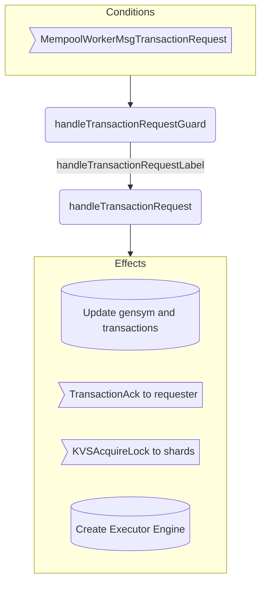
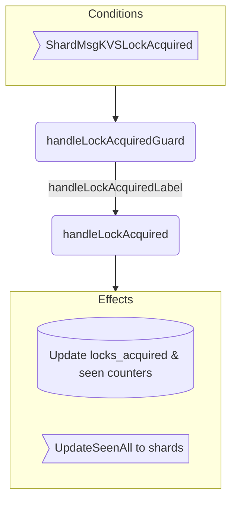
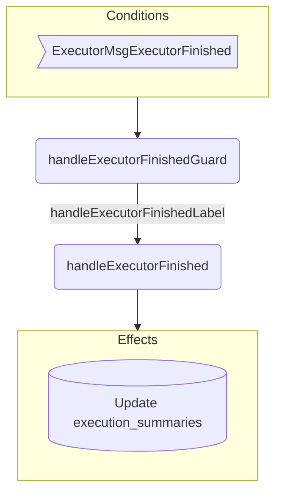

??? quote "Juvix imports"

    ```juvix
    module arch.node.engines.mempool_worker_behaviour;

    import arch.node.engines.mempool_worker_messages open;
    import arch.node.engines.mempool_worker_config open;
    import arch.node.engines.mempool_worker_environment open;
    import arch.node.engines.shard_messages open;
    import arch.node.engines.executor_messages open;
    import arch.node.engines.executor_config open;
    import arch.node.engines.executor_environment open;

    import prelude open;
    import Stdlib.Data.Nat open;
    import Stdlib.Data.List as List;
    import arch.node.types.basics open;
    import arch.node.types.identities open;
    import arch.node.types.messages open;
    import arch.node.types.engine open;
    import arch.node.types.anoma as Anoma open;
    ```

# Mempool Worker Behaviour

## Overview

A mempool worker acts as a transaction coordinator, receiving transaction requests, managing their execution lifecycle, and coordinating with shards and executors.

??? quote "Auxiliary Juvix code"

    ```juvix
    axiom sign : TxFingerprint -> TransactionCandidate -> Signature;
    axiom TChash : TxFingerprint -> TransactionCandidate -> Hash;
    ```

## Action arguments

### `MempoolWorkerActionArgument`

<!-- --8<-- [start:MempoolWorkerActionArgument] -->
```juvix
syntax alias MempoolWorkerActionArgument := Unit;
```
<!-- --8<-- [end:MempoolWorkerActionArgument] -->

### `MempoolWorkerActionArguments`

<!-- --8<-- [start:MempoolWorkerActionArguments] -->
```juvix
MempoolWorkerActionArguments : Type := List MempoolWorkerActionArgument;
```
<!-- --8<-- [end:MempoolWorkerActionArguments] -->

## Actions

??? quote "Auxiliary Juvix code"

    ```juvix
    MempoolWorkerAction : Type :=
      Action
        MempoolWorkerCfg
        MempoolWorkerLocalState
        MempoolWorkerMailboxState
        MempoolWorkerTimerHandle
        MempoolWorkerActionArguments
        Anoma.Msg
        Anoma.Cfg
        Anoma.Env;

    MempoolWorkerActionInput : Type :=
      ActionInput
        MempoolWorkerCfg
        MempoolWorkerLocalState
        MempoolWorkerMailboxState
        MempoolWorkerTimerHandle
        MempoolWorkerActionArguments
        Anoma.Msg;

    MempoolWorkerActionEffect : Type :=
      ActionEffect
        MempoolWorkerLocalState
        MempoolWorkerMailboxState
        MempoolWorkerTimerHandle
        Anoma.Msg
        Anoma.Cfg
        Anoma.Env;

    MempoolWorkerActionExec : Type :=
      ActionExec
        MempoolWorkerCfg
        MempoolWorkerLocalState
        MempoolWorkerMailboxState
        MempoolWorkerTimerHandle
        MempoolWorkerActionArguments
        Anoma.Msg
        Anoma.Cfg
        Anoma.Env;
    ```

### `handleTransactionRequest`

Action processing a new transaction request.

State update
: - Increments gensym counter
  - Adds transaction to transactions maps with new fingerprint

Messages to be sent
: - `TransactionAck` to requester
  - `KVSAcquireLock` messages to relevant shards

Engines to be spawned
: - Creates new [[Executor Engine]] for the transaction

Timer updates
: No timers are set or cancelled.

<!-- --8<-- [start:handleTransactionRequest] -->
```juvix
handleTransactionRequest
  (input : MempoolWorkerActionInput)
  : Option MempoolWorkerActionEffect :=
  let
    env := ActionInput.env input;
    cfg := ActionInput.cfg input;
    local := EngineEnv.localState env;
    trigger := ActionInput.trigger input;
  in case getEngineMsgFromTimestampedTrigger trigger of {
    | some emsg := case emsg of {
      | mkEngineMsg@{msg := Anoma.MsgMempoolWorker (MempoolWorkerMsgTransactionRequest request); sender := sender} :=
          let fingerprint := MempoolWorkerLocalState.gensym local + 1;
              worker_id := getEngineIDFromEngineCfg cfg;
              candidate := TransactionRequest.tx request;
              executor_name := nameGen "executor" (snd worker_id) worker_id;
              executor_id := mkPair none executor_name;
              executorCfg := Anoma.CfgExecutor mkExecutorCfg@{
                  timestamp := fingerprint;
                  executable := TransactionCandidate.executable candidate;
                  lazy_read_keys := Set.empty;
                  eager_read_keys := Set.fromList (TransactionLabel.read (TransactionCandidate.label candidate));
                  will_write_keys := Set.fromList (TransactionLabel.write (TransactionCandidate.label candidate));
                  may_write_keys := Set.empty;
                  worker := worker_id;
                  issuer := sender
                };
              executorEnv := Anoma.EnvExecutor mkEngineEnv@{
                localState := mkExecutorLocalState@{
                  program_state := mkProgramState@{
                    data := "";
                    halted := false
                  };
                  completed_reads := Map.empty;
                  completed_writes := Map.empty
                };
                mailboxCluster := Map.empty;
                acquaintances := Set.empty;
                timers := []
              };
              newState := local@MempoolWorkerLocalState{
                gensym := fingerprint;
                transactions := Map.insert fingerprint candidate (MempoolWorkerLocalState.transactions local);
                transactionEngines := Map.insert executor_id fingerprint (MempoolWorkerLocalState.transactionEngines local)
              };
              newEnv := env@EngineEnv{localState := newState};
              read_keys := Set.fromList (TransactionLabel.read (TransactionCandidate.label candidate));
              write_keys := Set.fromList (TransactionLabel.write (TransactionCandidate.label candidate));
              shards := Set.toList (Set.map keyToShard (Set.union read_keys write_keys));
              shardMsgs := map
                \{shard :=
                  let shard_read_keys := Set.filter (\{key := snd (keyToShard key) == snd shard}) read_keys;
                      shard_write_keys := Set.filter (\{key := snd (keyToShard key) == snd shard}) write_keys;
                      lockRequest := mkKVSAcquireLockMsg@{
                        lazy_read_keys := Set.empty;
                        eager_read_keys := shard_read_keys;
                        will_write_keys := shard_write_keys;
                        may_write_keys := Set.empty;
                        worker := worker_id;
                        executor := executor_id;
                        timestamp := fingerprint
                      };
                  in mkEngineMsg@{
                    sender := worker_id;
                    target := shard;
                    mailbox := some 0;
                    msg := Anoma.MsgShard (ShardMsgKVSAcquireLock lockRequest)
                  }}
                shards;
              ackMsg := mkEngineMsg@{
                sender := worker_id;
                target := sender;
                mailbox := some 0;
                msg := Anoma.MsgMempoolWorker (MempoolWorkerMsgTransactionAck
                  (mkTransactionAck@{
                    tx_hash := TChash fingerprint candidate;
                    batch_number := MempoolWorkerLocalState.batch_number local;
                    batch_start := 0;
                    worker_id := worker_id;
                    signature := sign fingerprint candidate
                  }))
              };
          in some mkActionEffect@{
            env := newEnv;
            msgs := ackMsg :: shardMsgs;
            timers := [];
            engines := [mkPair executorCfg executorEnv]
          }
      | _ := none
    }
    | _ := none
  };
```
<!-- --8<-- [end:handleTransactionRequest] -->

### `handleLockAcquired`

Action processing lock acquisition confirmation from shards.

State update
: - Adds lock to locks_acquired list
  - Updates seen_all_writes/reads counters if applicable

Messages to be sent
: - UpdateSeenAll messages to shards when counters advance

Engines to be spawned
: None

Timer updates
: No timers are set or cancelled.

<!-- --8<-- [start:handleLockAcquired] -->
```juvix
allLocksAcquired
  (isWrite : Bool)
  (tx : TransactionCandidate)
  (txNum : TxFingerprint)
  (locks : List (Pair EngineID KVSLockAcquiredMsg)) : Bool :=
  let keys := case isWrite of {
        | true := TransactionLabel.write (TransactionCandidate.label tx)
        | false := TransactionLabel.read (TransactionCandidate.label tx)
      };
      neededShards := Set.fromList (map keyToShard keys);
      lockingShards := Set.fromList (map fst (List.filter \{lock := KVSLockAcquiredMsg.timestamp (snd lock) == txNum} locks));
  in Set.isSubset neededShards lockingShards;

terminating
findMaxConsecutiveLocked
  (isWrite : Bool)
  (transactions : Map TxFingerprint TransactionCandidate)
  (locks : List (Pair EngineID KVSLockAcquiredMsg))
  (current : TxFingerprint)
  (prev : TxFingerprint) : TxFingerprint :=
  case Map.lookup current transactions of {
    | none := prev
    | some tx := case allLocksAcquired isWrite tx current locks of {
      | true := findMaxConsecutiveLocked isWrite transactions locks (current + 1) current
      | false := prev
    }
  };

getAllShards (transactions : Map TxFingerprint TransactionCandidate) : Set EngineID :=
  let getAllKeysFromLabel (label : TransactionLabel) : List KVSKey :=
        TransactionLabel.read label ++ TransactionLabel.write label;
      allKeys := List.concatMap
        \{tx := getAllKeysFromLabel (TransactionCandidate.label tx)}
        (Map.values transactions);
  in Set.fromList (map keyToShard allKeys);

handleLockAcquired
  (input : MempoolWorkerActionInput)
  : Option MempoolWorkerActionEffect :=
  let
    env := ActionInput.env input;
    local := EngineEnv.localState env;
    trigger := ActionInput.trigger input;
  in case getEngineMsgFromTimestampedTrigger trigger of {
    | some emsg := case emsg of {
      | mkEngineMsg@{msg := Anoma.MsgShard (ShardMsgKVSLockAcquired lockMsg); sender := sender} :=
        let timestamp := KVSLockAcquiredMsg.timestamp lockMsg;
            newLocks := (mkPair sender lockMsg) :: MempoolWorkerLocalState.locks_acquired local;
            maxConsecutiveWrite := findMaxConsecutiveLocked true (MempoolWorkerLocalState.transactions local) newLocks 1 0;
            maxConsecutiveRead := findMaxConsecutiveLocked false (MempoolWorkerLocalState.transactions local) newLocks 1 0;
            newState := local@MempoolWorkerLocalState{
              locks_acquired := newLocks;
              seen_all_writes := maxConsecutiveWrite;
              seen_all_reads := maxConsecutiveRead
            };
            newEnv := env@EngineEnv{localState := newState};
            allShards := getAllShards (MempoolWorkerLocalState.transactions local);
            makeUpdateMsg (target : EngineID) (isWrite : Bool) (timestamp : TxFingerprint) : EngineMsg Anoma.Msg :=
              mkEngineMsg@{
                sender := getEngineIDFromEngineCfg (ActionInput.cfg input);
                target := target;
                mailbox := some 0;
                msg := Anoma.MsgShard (ShardMsgUpdateSeenAll
                  (mkUpdateSeenAllMsg@{
                    timestamp := timestamp;
                    write := isWrite
                  }))
              };
            writeMessages := map \{shard := makeUpdateMsg shard true maxConsecutiveWrite} (Set.toList allShards);
            readMessages := map \{shard := makeUpdateMsg shard false maxConsecutiveRead} (Set.toList allShards);
        in some mkActionEffect@{
          env := newEnv;
          msgs := writeMessages ++ readMessages;
          timers := [];
          engines := []
        }
      | _ := none
    }
    | _ := none
  };
```
<!-- --8<-- [end:handleLockAcquired] -->

### `handleExecutorFinished`

Action processing execution completion notification from executor.

State update
: Adds execution summary to execution_summaries map

Messages to be sent
: None

Engines to be spawned
: None

Timer updates
: No timers are set or cancelled.

<!-- --8<-- [start:handleExecutorFinished] -->
```juvix
handleExecutorFinished
  (input : MempoolWorkerActionInput)
  : Option MempoolWorkerActionEffect :=
  let
    env := ActionInput.env input;
    local := EngineEnv.localState env;
    trigger := ActionInput.trigger input;
  in case getEngineMsgFromTimestampedTrigger trigger of {
    | some emsg := case emsg of {
      | mkEngineMsg@{msg := Anoma.MsgExecutor (ExecutorMsgExecutorFinished summary); sender := sender} :=
          case Map.lookup sender (MempoolWorkerLocalState.transactionEngines local) of {
            | some tr :=
              let newState := local@MempoolWorkerLocalState{
                    execution_summaries := Map.insert tr summary (MempoolWorkerLocalState.execution_summaries local)
                  };
                  newEnv := env@EngineEnv{localState := newState};
              in some mkActionEffect@{
                env := newEnv;
                msgs := [];
                timers := [];
                engines := []
              }
            | _ := none
          }
      | _ := none
    }
    | _ := none
  };
```
<!-- --8<-- [end:handleExecutorFinished] -->

### Action Labels

```juvix
handleTransactionRequestLabel : MempoolWorkerActionExec :=
  Seq [ handleTransactionRequest ];

handleLockAcquiredLabel : MempoolWorkerActionExec :=
  Seq [ handleLockAcquired ];

handleExecutorFinishedLabel : MempoolWorkerActionExec :=
  Seq [ handleExecutorFinished ];
```

## Guards

??? quote "Auxiliary Juvix code"

    ```juvix
    MempoolWorkerGuard : Type :=
      Guard
        MempoolWorkerCfg
        MempoolWorkerLocalState
        MempoolWorkerMailboxState
        MempoolWorkerTimerHandle
        MempoolWorkerActionArguments
        Anoma.Msg
        Anoma.Cfg
        Anoma.Env;

    MempoolWorkerGuardOutput : Type :=
      GuardOutput
        MempoolWorkerCfg
        MempoolWorkerLocalState
        MempoolWorkerMailboxState
        MempoolWorkerTimerHandle
        MempoolWorkerActionArguments
        Anoma.Msg
        Anoma.Cfg
        Anoma.Env;

    MempoolWorkerGuardEval : Type :=
      GuardEval
        MempoolWorkerCfg
        MempoolWorkerLocalState
        MempoolWorkerMailboxState
        MempoolWorkerTimerHandle
        MempoolWorkerActionArguments
        Anoma.Msg
        Anoma.Cfg
        Anoma.Env;
    ```

### `handleTransactionRequestGuard`

Condition
: Message type is MempoolWorkerMsgTransactionRequest

<!-- --8<-- [start:handleTransactionRequestGuard] -->
```juvix
handleTransactionRequestGuard
  (trigger : TimestampedTrigger MempoolWorkerTimerHandle Anoma.Msg)
  (cfg : EngineCfg MempoolWorkerCfg)
  (env : MempoolWorkerEnv)
  : Option MempoolWorkerGuardOutput :=
  case getEngineMsgFromTimestampedTrigger trigger of {
    | some mkEngineMsg@{msg := Anoma.MsgMempoolWorker (MempoolWorkerMsgTransactionRequest _)} :=
      some mkGuardOutput@{
        action := handleTransactionRequestLabel;
        args := []
      }
    | _ := none
  };
```
<!-- --8<-- [end:handleTransactionRequestGuard] -->

### `handleLockAcquiredGuard`

Condition
: Message type is ShardMsgKVSLockAc

### `handleLockAcquiredGuard`

Condition
: Message type is ShardMsgKVSLockAcquired

<!-- --8<-- [start:handleLockAcquiredGuard] -->
```juvix
handleLockAcquiredGuard
  (trigger : TimestampedTrigger MempoolWorkerTimerHandle Anoma.Msg)
  (cfg : EngineCfg MempoolWorkerCfg)
  (env : MempoolWorkerEnv)
  : Option MempoolWorkerGuardOutput :=
  case getEngineMsgFromTimestampedTrigger trigger of {
    | some mkEngineMsg@{msg := Anoma.MsgShard (ShardMsgKVSLockAcquired _)} :=
      some mkGuardOutput@{
        action := handleLockAcquiredLabel;
        args := []
      }
    | _ := none
  };
```
<!-- --8<-- [end:handleLockAcquiredGuard] -->

### `handleExecutorFinishedGuard`

Condition
: Message type is ExecutorMsgExecutorFinished

<!-- --8<-- [start:handleExecutorFinishedGuard] -->
```juvix
handleExecutorFinishedGuard
  (trigger : TimestampedTrigger MempoolWorkerTimerHandle Anoma.Msg)
  (cfg : EngineCfg MempoolWorkerCfg)
  (env : MempoolWorkerEnv)
  : Option MempoolWorkerGuardOutput :=
  case getEngineMsgFromTimestampedTrigger trigger of {
    | some mkEngineMsg@{msg := Anoma.MsgExecutor (ExecutorMsgExecutorFinished _)} :=
      some mkGuardOutput@{
        action := handleExecutorFinishedLabel;
        args := []
      }
    | _ := none
  };
```
<!-- --8<-- [end:handleExecutorFinishedGuard] -->

## The Mempool Worker Behaviour

### `MempoolWorkerBehaviour`

<!-- --8<-- [start:MempoolWorkerBehaviour] -->
```juvix
MempoolWorkerBehaviour : Type :=
  EngineBehaviour
    MempoolWorkerCfg
    MempoolWorkerLocalState
    MempoolWorkerMailboxState
    MempoolWorkerTimerHandle
    MempoolWorkerActionArguments
    Anoma.Msg
    Anoma.Cfg
    Anoma.Env;
```
<!-- --8<-- [end:MempoolWorkerBehaviour] -->

### Instantiation

<!-- --8<-- [start:mempoolWorkerBehaviour] -->
```juvix
mempoolWorkerBehaviour : MempoolWorkerBehaviour :=
  mkEngineBehaviour@{
    guards := First [
      handleTransactionRequestGuard;
      handleLockAcquiredGuard;
      handleExecutorFinishedGuard
    ]
  };
```
<!-- --8<-- [end:mempoolWorkerBehaviour] -->

# Mempool Worker Action Flowcharts

## `handleTransactionRequest` flowchart

<figure markdown>



<figcaption markdown="span">
`handleTransactionRequest` flowchart
</figcaption>
</figure>

## `handleLockAcquired` flowchart

<figure markdown>



<figcaption markdown="span">
`handleLockAcquired` flowchart
</figcaption>
</figure>

## `handleExecutorFinished` flowchart

<figure markdown>



<figcaption markdown="span">
`handleExecutorFinished` flowchart
</figcaption>
</figure>
