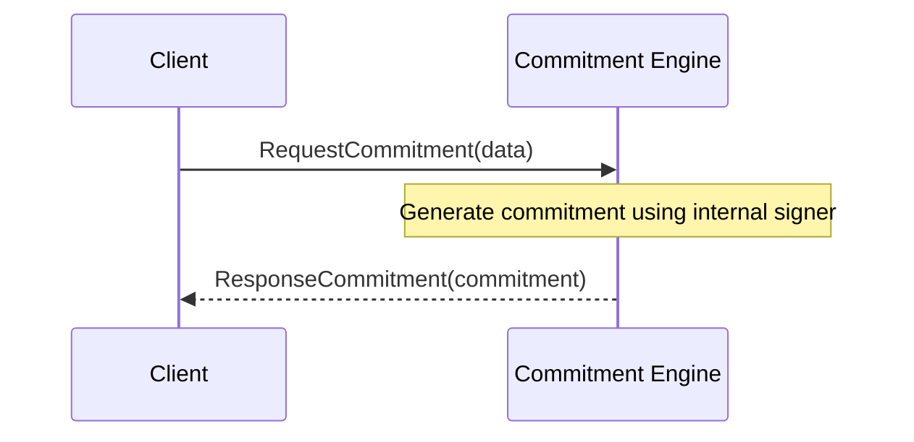

??? quote "Juvix imports"

    ```juvix
    module arch.node.engines.mempool_worker_messages;
    import prelude open;
    ```

# Mempool Worker Messages

## Message interface

### `ExecutorFinished`

```juvix
type ExecutorFinished := mkExecutorFinished {
  fingerprint : TxFingerprint;
  log_key : LocalStorageKey;
};
```
!!! todo
    make this type check properly (may require introduing TxFingerprint and LocalStorageKey types somewhere)

Informs the mempool about execution of a transaction.
This message is a pre-requisite for enabling garbage collection in the mempool.
The log_key can be used by the user to request data about the transaction.
In V0.2.0 and below, this is kept as long as the instance is running.

???+ quote "Arguments"

    `fingerprint`:
    : a descriptor for executed transaction.

    `log_key`:
    : handle to the transaction log of the transaction execution.


Sent _from_ [[Executor]]

#### Effects

This message is a pre-requisite for enabling garbage collection in the mempool.
The log_key can be used by the user to request data about the transaction.
In V0.2.0 and earlier, this is kept as long as the instance is running.

### `KVSLockAcquired`
```juvix
type KVSLockAcquired := mkKVSLockAcquired {
  fingerprint : TxFingerprint; -- the fingerprint of the [[TransactionCandidate|TransactionCandidate]] for which some locks have been recorded
  key : KVSKey; -- the key in the key value store that will be accessed
  write : bool; -- `true` for write, `false` for read
  optional : bool; -- `true` for may_write or may_read, `false` for will_write or will_read
}
```
!!! todo
    make this type check properly (may require introduing TxFingerprint and whatnot types somewhere)

This message informs the [[Worker Engine]] that the sending [[Shard]]
 has recorded upcoming read or write requests to a key specified in an
 earlier [[KVSAcquireLock]] from the [[Worker Engine]].
It is an asynchronous response.

???+ quote "Arguments"
    `fingerprint`:
    : the fingerprint of the [[TransactionCandidate|TransactionCandidate]] for which some locks have been recorded

    `key`:
    : the key in the key value store that will be accessed

    `write`:
    : `true` for write, `false` for read

    `optional`:
    : `true` for may_write or may_read, `false` for will_write or will_read

Sent _from_ [[Shard]]s


#### Effects

- The [[Worker Engine]] adds this lock to a store of lock acquisitions
   that have been recorded by the shards such that it may be able to
   send  [[UpdateSeenAll]] messages with greater [[TxFingerprint]]s
   than the last one sent.
  - Once an [[UpdateSeenAll]] message is sent, all information the
     [[Worker Engine]] stores concerning [[KVSLockAcquired]]-message
     for earlier transactions can be freed.

#### Triggers

- to [[Shard]]s: [[UpdateSeenAll]]
  `if`  we can now be certain that there is some new [[TxFingerprint]] `T`,
  after (the last one) of the previously sent [[UpdateSeenAll]],
  such that no more [[KVSAcquireLock]]-messages featuring timestamps
  at or before `T` will be sent by the same [[Worker Engine]]:
  `then`  send [[UpdateSeenAll]] with `T` to all [[Shard]]s.


#### Note

Otherwise, a Shard might hear about a
 [[KVSAcquireLock]] only after
 it has heard [[UpdateSeenAll]] with a later [[TxFingerprint]],
 causing it to execute the "later" transaction before it learned of
 the "earlier" one, which could allow the "later" transaction to read
 the wrong value from state.
Therefore, it is important to let [[Worker Engine]]s know which
 [[KVSAcquireLock]]s the shard has received.

### `RequestLogs`
```juvix
type RequestLogs := mkRequestLogs {
  fingerprint : TxFingerprint; -- the fingerprint of the [[TransactionCandidate|TransactionCandidate]] for logs are requested
  log_key : LocalStorageKey; -- the key for retrieving the log
}
```
!!! todo
    make this type check properly (may require introduing TxFingerprint and whatnot types somewhere)

Request the log of a finished execution.

???+ quote "Arguments"

    `fingerprint`:
    : the fingerprint of the [[TransactionCandidate|TransactionCandidate]] for logs are requested

    `log_key`:
    : the key for retrieving the log

Sent _from_ [[User|User]], [[Solver|Solver]]

#### Effects

none

#### Triggers

- to [[User|User]], [[Solver|Solver]]: [[SendLog]]
  Answer the request with the data requested.

### `TransactionRequest`
```juvix
type TransactionRequest = mkTransactionRequest {
  tx : TransactionCandidate; -- the actual transaction to be ordered
  resubmission : Maybe TxFingerprint; -- reference to the previous occurrence
}
```
!!! todo
    make this type check properly (may require introduing TxFingerprint and whatnot types somewhere)

A [[User#user|user]] or [[Solver#solver|solver]] requests that
a [[TransactionCandidate#transactioncandidate|transaction candidate]]
be ordered and executed.

???+ quote "Arguments"

    `tx`:
    : the actual transaction to be ordered

    `resubmission`:
    : reference to the previous occurrence

The resubmission indicates if there was a previous occurrence of
the very same transaction candidate which either has failed or
a needs to be executed again, e.g., because it is a recurring payment.

This is the "bare-bone" version for V0.2.0.
Additional user preferences can be supplied in future versions concerning
- how the response will be given
- how long duplicate checks are to be performed
- etc.


#### Effects
- The receiving worker is obliged to store the new transaction
  (until after execution)
  _unless it is out of storage_.
  (Suitable fee mechanisms may be introduced to ensure that
    the probability of sufficient storage is relatively high,
    which involves a trade-off against cheap fees.)
- The received transaction request might complete the current batch.  <!--
  (which then is followed up with the creation of a new worker hash in versions after 0.2.0).-->
- The worker assigns
  a [[Batch Number|batch number]]
  (the number of the current batch)
  and a [[Transaction Number|transaction number]]
  (before the closing of the batch)
  such that this transaction candidate can be referenced
  via the corresponding [[TxFingerprint]]—_unless
  the worker already has received a request
  for the same transaction candidate_ after the `resubmission` time stamp.
  If the exact same transaction candidate has already been ordered,
  the request is disregarded;
  optional messages may be sent to the sender of the request.
  <!--BE ALERT: consecutive transaction numbers, but arbitrary order-->

#### Triggers

<!-- new ! -->
- [[KVSAcquireLock]]→[[Shard]], [[SpawnExecutor]] → [[Execution Supervisor]]
  `if` the worker has not seen this [[TransactionRequest]]
  before (or "recently")
  `and` a [[TxFingerprint]] is assigned to the transaction candidate
  `then`
  - send [[KVSAcquireLock]]-messages to the relevant [[Shard]]s
  - Spawn a new [[Executor]]
- to [[Executor]]: [[ExecuteTransaction]]
    `if` the worker has not seen this [[TransactionCandidate]]
    before (or "recently") after resubmission [^1]
    `and` a [[TxFingerprint]] is assigned to the transaction candidate
    `and` (as an optional pre-condition)
        the worker has seen a [[KVSLockAcquired]] message for this transaction
    `then` spawn a new executor process and send it
        an [[ExecuteTransaction]] message


## Message sequence diagrams

### Mempool Worker TransactionRequest Sequence
!!! todo
    Using the template from commitment messages, make a mermaid diagram with a typical transactionRequest sequence.

<!-- --8<-- [start:message-sequence-diagram] -->
<figure markdown="span">



<figcaption markdown="span">
Sequence diagram for commitment generation.
</figcaption>
</figure>
<!-- --8<-- [end:message-sequence-diagram] -->

## Engine Components

- [[Worker Environment]]
- [[Worker Behaviour]]
