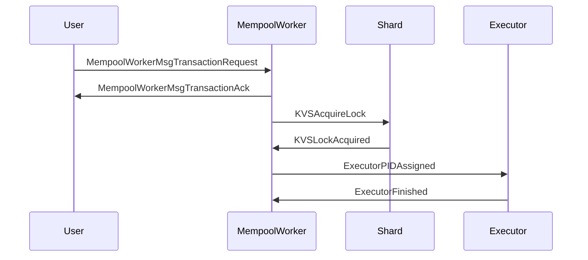

??? quote "Juvix imports"

    ```juvix
    module arch.node.engines.mempool_worker_messages;
    import prelude open;
    import arch.node.types.basics open;
    import arch.node.types.identities open;
    ```

# Mempool Worker Messages

These are the specific messages that the Mempool Worker engine can receive/respond to.

## Message interface

--8<-- "./mempool_worker_messages.juvix.md:MempoolWorkerMsg"

## Message sequence diagrams

---

### Transaction request flow

<!-- --8<-- [start:message-sequence-diagram-transaction-request] -->
<figure markdown="span">



<figcaption markdown="span">
Sequence Diagram: Transaction Request Flow
</figcaption>
</figure>
<!-- --8<-- [end:message-sequence-diagram-transaction-request] -->

---

## Message types

---

### `TransactionRequest`

A request from a user or solver to order and execute a transaction candidate.

<!-- --8<-- [start:TransactionRequest] -->
```juvix
type TransactionRequest (KVSKey Executable : Type) : Type :=
  mkTransactionRequest {
    tx : TransactionCandidate KVSKey KVSKey Executable;
    resubmission : Option TxFingerprint
  }
```
<!-- --8<-- [end:TransactionRequest] -->

???+ quote "Arguments"

    `tx`
    : The transaction candidate to be ordered and executed.

    `resubmission`
    : Optional reference to a previous occurrence of the same transaction
    candidate (currently unused).

---

### `TransactionAck`

Acknowledgment sent to the user or solver that a transaction request has been
accepted.

<!-- --8<-- [start:TransactionAck] -->
```juvix
type TransactionAck : Type :=
  mkTransactionAck {
    tx_hash : Hash;
    batch_number : BatchNumber;
    batch_start : WallClockTime;
    worker_id : EngineID;
    signature : Signature
  }
```
<!-- --8<-- [end:TransactionAck] -->

???+ quote "Arguments"

    `tx_hash`
    : The hash of the acknowledged transaction candidate (Currently unused).

    `batch_number`
    : The batch number assigned to the transaction (Currently unused).

    `batch_start`
    : The wall clock time when the batch was opened (Currently unused).

    `worker_id`
    : The external identity of the worker engine that processed the transaction.

    `signature`
    : The signature of the worker engine over the above fields (Currently unused).

---

### `MempoolWorkerMsg`

<!-- --8<-- [start:MempoolWorkerMsg] -->
```juvix
type MempoolWorkerMsg (KVSKey Executable : Type) :=
  | MempoolWorkerMsgTransactionRequest (TransactionRequest KVSKey Executable)
  | MempoolWorkerMsgTransactionAck TransactionAck
  ;
```
<!-- --8<-- [end:MempoolWorkerMsg] -->

---

## Engine components

- [[Mempool Worker Configuration]]
- [[Mempool Worker Environment]]
- [[Mempool Worker Behaviour]]