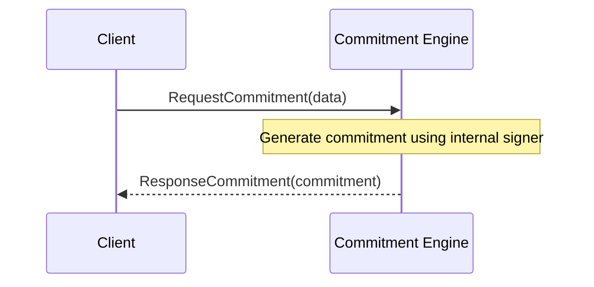

??? quote "Juvix imports"

    ```juvix
    module arch.node.engines.mempool_worker_messages;
    import prelude open;
    ```

# Commitment Messages

## Message interface

### `ExecutorFinished`

```juvix
type ExecutorFinished := mkExecutorFinished {
  fingerprint : TxFingerprint;
  log_key : LocalStorageKey;
};
```
!!! todo
    make this type check properly (may require introduing TxFingerprint and LocalStorageKey types somewhere)

Informs the mempool about execution of a transaction.
This message is a pre-requisite for enabling garbage collection in the mempool.
The log_key can be used by the user to request data about the transaction.
In V0.2.0 and below, this is kept as long as the instance is running.

???+ quote "Arguments"

    `fingerprint`:
    : a descriptor for executed transaction.

    `log_key`:
    : handle to the transaction log of the transaction execution.


Sent _from_ [[Executor]]

!!! todo
    Remaining message types

## Message sequence diagrams

### Mempool Worker TransactionRequest Sequence
!!! todo
    Using the template from commitment messages, make a mermaid diagram with a typical transactionRequest sequence.

<!-- --8<-- [start:message-sequence-diagram] -->
<figure markdown="span">



<figcaption markdown="span">
Sequence diagram for commitment generation.
</figcaption>
</figure>
<!-- --8<-- [end:message-sequence-diagram] -->

## Engine Components

- [[Worker Environment]]
- [[Worker Behaviour]]
