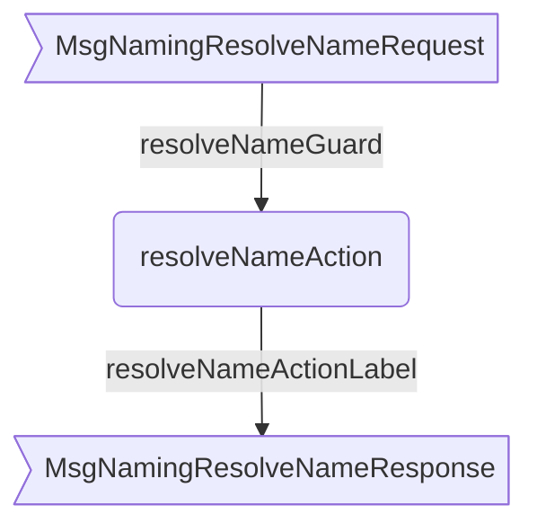
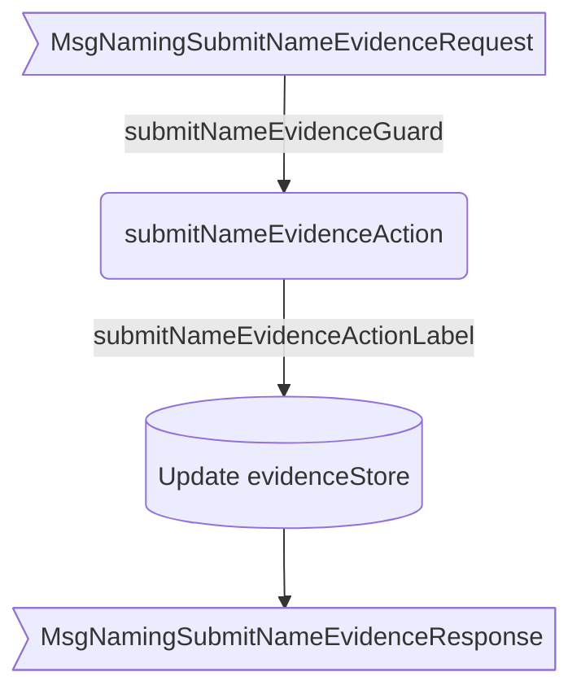

??? quote "Juvix imports"

    ```juvix
    module arch.node.engines.naming_behaviour;

    import arch.node.engines.naming_messages open;
    import arch.node.engines.naming_config open;
    import arch.node.engines.naming_environment open;

    import prelude open;
    import arch.node.types.messages open;
    import arch.node.types.engine open;
    import arch.node.types.identities open;
    import arch.node.types.anoma as Anoma open;
    ```

# Naming Behaviour

## Overview

The behavior of the Naming Engine defines how it processes incoming messages and
updates its state accordingly.

## Action arguments

### `NamingActionArgumentReplyTo ReplyTo`

```juvix
type ReplyTo := mkReplyTo {
  whoAsked : Option EngineID;
  mailbox : Option MailboxID
};
```

This action argument contains the address and mailbox ID of where the
response message should be sent.

`whoAsked`:
: is the address of the engine that sent the message.

`mailbox`:
: is the mailbox ID where the response message should be sent.

### `NamingActionArgument`

```juvix
type NamingActionArgument :=
  | NamingActionArgumentReplyTo ReplyTo
  ;
```

### `NamingActionArguments`

```juvix
NamingActionArguments : Type := List NamingActionArgument;
```

## Actions

??? quote "Auxiliary Juvix code"

    ```juvix
    NamingAction : Type :=
      Action
        NamingCfg
        NamingLocalState
        NamingMailboxState
        NamingTimerHandle
        NamingActionArguments
        Anoma.Msg
        Anoma.Cfg
        Anoma.Env;

    NamingActionInput : Type :=
      ActionInput
        NamingCfg
        NamingLocalState
        NamingMailboxState
        NamingTimerHandle
        NamingActionArguments
        Anoma.Msg;

    NamingActionEffect : Type :=
      ActionEffect
        NamingLocalState
        NamingMailboxState
        NamingTimerHandle
        Anoma.Msg
        Anoma.Cfg
        Anoma.Env;

    NamingActionExec : Type :=
      ActionExec
        NamingCfg
        NamingLocalState
        NamingMailboxState
        NamingTimerHandle
        NamingActionArguments
        Anoma.Msg
        Anoma.Cfg
        Anoma.Env;
    ```

### `resolveNameAction`

Resolve a name to associated external identities.

State update
: No change to the local state.

Messages to be sent
: A `ResponseResolveName` message is sent to the requester, containing matching external identities.

Engines to be spawned
: No engines are spawned by this action.

Timer updates
: No timers are set or cancelled.

```juvix
resolveNameAction
  (input : NamingActionInput)
  : Option NamingActionEffect :=
  let
    env := ActionInput.env input;
    cfg := ActionInput.cfg input;
    tt := ActionInput.trigger input;
    localState := EngineEnv.localState env;
  in case getEngineMsgFromTimestampedTrigger tt of {
    | some emsg :=
      case EngineMsg.msg emsg of {
        | (Anoma.MsgNaming (MsgNamingResolveNameRequest (mkRequestResolveName identityName))) :=
          let
            matchingEvidence := AVLTree.filter \{evidence :=
              isEqual (Ord.cmp (IdentityNameEvidence.identityName evidence) identityName)
            } (NamingLocalState.evidenceStore localState);
            identities := Set.fromList (map \{evidence :=
              IdentityNameEvidence.externalIdentity evidence
            } (Set.toList matchingEvidence));
            responseMsg := mkResponseResolveName@{
              externalIdentities := identities;
              err := none
            };
          in some mkActionEffect@{
            env := env;
            msgs := [
              mkEngineMsg@{
                sender := getEngineIDFromEngineCfg cfg;
                target := EngineMsg.sender emsg;
                mailbox := some 0;
                msg := Anoma.MsgNaming (MsgNamingResolveNameResponse responseMsg)
              }
            ];
            timers := [];
            engines := []
          }
        | _ := none
      }
    | _ := none
  };
```

### `submitNameEvidenceAction`

Submit new name evidence.

State update
: If the evidence doesn't already exist and is valid, it's added to the `evidenceStore` in the local state.

Messages to be sent
: A `ResponseSubmitNameEvidence` message is sent to the requester, confirming the submission or indicating an error.

Engines to be spawned
: No engines are spawned by this action.

Timer updates
: No timers are set or cancelled.

```juvix
submitNameEvidenceAction
  (input : NamingActionInput)
  : Option NamingActionEffect :=
  let
    env := ActionInput.env input;
    cfg := ActionInput.cfg input;
    tt := ActionInput.trigger input;
    localState := EngineEnv.localState env;
  in case getEngineMsgFromTimestampedTrigger tt of {
    | some emsg :=
      case EngineMsg.msg emsg of {
        | Anoma.MsgNaming (MsgNamingSubmitNameEvidenceRequest (mkRequestSubmitNameEvidence evidence)) :=
          let
            isValid := NamingLocalState.verifyEvidence localState evidence;
          in case isValid of {
            | false :=
              let
                responseMsg := mkResponseSubmitNameEvidence@{
                  err := some "Invalid evidence"
                };
              in some mkActionEffect@{
                env := env;
                msgs := [
                  mkEngineMsg@{
                    sender := getEngineIDFromEngineCfg cfg;
                    target := EngineMsg.sender emsg;
                    mailbox := some 0;
                    msg := Anoma.MsgNaming (MsgNamingSubmitNameEvidenceResponse responseMsg)
                  }
                ];
                timers := [];
                engines := []
              }
            | true :=
              let
                alreadyExists := isElement \{a b := a && b} true (map \{e :=
                  isEqual (Ord.cmp e evidence)
                } (Set.toList (NamingLocalState.evidenceStore localState)));
                newLocalState := case alreadyExists of {
                  | true := localState
                  | false :=
                    let
                      newEvidenceStore := Set.insert evidence (NamingLocalState.evidenceStore localState);
                    in localState@NamingLocalState{
                      evidenceStore := newEvidenceStore
                    }
                };
                newEnv := env@EngineEnv{
                  localState := newLocalState
                };
                responseMsg := mkResponseSubmitNameEvidence@{
                  err := case alreadyExists of {
                    | true := some "Evidence already exists"
                    | false := none
                  }
                };
              in some mkActionEffect@{
                env := newEnv;
                msgs := [
                  mkEngineMsg@{
                    sender := getEngineIDFromEngineCfg cfg;
                    target := EngineMsg.sender emsg;
                    mailbox := some 0;
                    msg := Anoma.MsgNaming (MsgNamingSubmitNameEvidenceResponse responseMsg)
                  }
                ];
                timers := [];
                engines := []
              }
          }
        | _ := none
      }
    | _ := none
  };
```

### `queryNameEvidenceAction`

Query name evidence for a specific external identity.

State update
: No change to the local state.

Messages to be sent
: A `ResponseQueryNameEvidence` message is sent to the requester, containing relevant evidence.

Engines to be spawned
: No engines are spawned by this action.

Timer updates
: No timers are set or cancelled.

```juvix
queryNameEvidenceAction
  (input : NamingActionInput)
  : Option NamingActionEffect :=
  let
    env := ActionInput.env input;
    cfg := ActionInput.cfg input;
    tt := ActionInput.trigger input;
    localState := EngineEnv.localState env;
  in case getEngineMsgFromTimestampedTrigger tt of {
    | some emsg :=
      case EngineMsg.msg emsg of {
        | Anoma.MsgNaming (MsgNamingQueryNameEvidenceRequest (mkRequestQueryNameEvidence externalIdentity)) :=
          let
            relevantEvidence := AVLTree.filter \{evidence :=
              isEqual (Ord.cmp (IdentityNameEvidence.externalIdentity evidence) externalIdentity)
            } (NamingLocalState.evidenceStore localState);
            responseMsg := mkResponseQueryNameEvidence@{
              externalIdentity := externalIdentity;
              evidence := relevantEvidence;
              err := none
            };
          in some mkActionEffect@{
            env := env;
            msgs := [
              mkEngineMsg@{
                sender := getEngineIDFromEngineCfg cfg;
                target := EngineMsg.sender emsg;
                mailbox := some 0;
                msg := Anoma.MsgNaming (MsgNamingQueryNameEvidenceResponse responseMsg)
              }
            ];
            timers := [];
            engines := []
          }
        | _ := none
      }
    | _ := none
  };
```

## Action Labels

### `resolveNameActionLabel`

```juvix
resolveNameActionLabel : NamingActionExec := Seq [ resolveNameAction ];
```

### `submitNameEvidenceActionLabel`

```juvix
submitNameEvidenceActionLabel : NamingActionExec := Seq [ submitNameEvidenceAction ];
```

### `queryNameEvidenceActionLabel`

```juvix
queryNameEvidenceActionLabel : NamingActionExec := Seq [ queryNameEvidenceAction ];
```

## Guards

??? quote "Auxiliary Juvix code"

    ```juvix
    NamingGuard : Type :=
      Guard
        NamingCfg
        NamingLocalState
        NamingMailboxState
        NamingTimerHandle
        NamingActionArguments
        Anoma.Msg
        Anoma.Cfg
        Anoma.Env;

    NamingGuardOutput : Type :=
      GuardOutput
        NamingCfg
        NamingLocalState
        NamingMailboxState
        NamingTimerHandle
        NamingActionArguments
        Anoma.Msg
        Anoma.Cfg
        Anoma.Env;

    NamingGuardEval : Type :=
      GuardEval
        NamingCfg
        NamingLocalState
        NamingMailboxState
        NamingTimerHandle
        NamingActionArguments
        Anoma.Msg
        Anoma.Cfg
        Anoma.Env;
    ```

### `resolveNameGuard`

Condition
: Message type is `MsgNamingResolveNameRequest`.

```juvix
resolveNameGuard
  (tt : TimestampedTrigger NamingTimerHandle Anoma.Msg)
  (cfg : EngineCfg NamingCfg)
  (env : NamingEnvironment)
  : Option NamingGuardOutput :=
  case getEngineMsgFromTimestampedTrigger tt of {
    | some mkEngineMsg@{
        msg := Anoma.MsgNaming (MsgNamingResolveNameRequest _);
      } := some mkGuardOutput@{
        action := resolveNameActionLabel;
        args := []
      }
    | _ := none
  };
```

### `submitNameEvidenceGuard`

Condition
: Message type is `MsgNamingSubmitNameEvidenceRequest`.

```juvix
submitNameEvidenceGuard
  (tt : TimestampedTrigger NamingTimerHandle Anoma.Msg)
  (cfg : EngineCfg NamingCfg)
  (env : NamingEnvironment)
  : Option NamingGuardOutput :=
  case getEngineMsgFromTimestampedTrigger tt of {
    | some mkEngineMsg@{
        msg := Anoma.MsgNaming (MsgNamingSubmitNameEvidenceRequest _);
      } := some mkGuardOutput@{
        action := submitNameEvidenceActionLabel;
        args := []
      }
    | _ := none
  };
```

### `queryNameEvidenceGuard`

Condition
: Message type is `MsgNamingQueryNameEvidenceRequest`.

```juvix
queryNameEvidenceGuard
  (tt : TimestampedTrigger NamingTimerHandle Anoma.Msg)
  (cfg : EngineCfg NamingCfg)
  (env : NamingEnvironment)
  : Option NamingGuardOutput :=
  case getEngineMsgFromTimestampedTrigger tt of {
    | some mkEngineMsg@{
        msg := Anoma.MsgNaming (MsgNamingQueryNameEvidenceRequest _);
      } := some mkGuardOutput@{
        action := queryNameEvidenceActionLabel;
        args := []
      }
    | _ := none
  };
```

## The Naming behaviour

### `NamingBehaviour`

```juvix
NamingBehaviour : Type :=
  EngineBehaviour
    NamingCfg
    NamingLocalState
    NamingMailboxState
    NamingTimerHandle
    NamingActionArguments
    Anoma.Msg
    Anoma.Cfg
    Anoma.Env;
```

### Instantiation

```juvix
namingBehaviour : NamingBehaviour :=
  mkEngineBehaviour@{
    guards :=
      First [
        resolveNameGuard;
        submitNameEvidenceGuard;
        queryNameEvidenceGuard
      ];
  };
```

## Naming Action Flowchart

### `resolveNameAction` flowchart

<figure markdown>

<figcaption>resolveNameAction flowchart</figcaption>
</figure>

### `submitNameEvidenceAction` flowchart

<figure markdown>

<figcaption>submitNameEvidenceAction flowchart