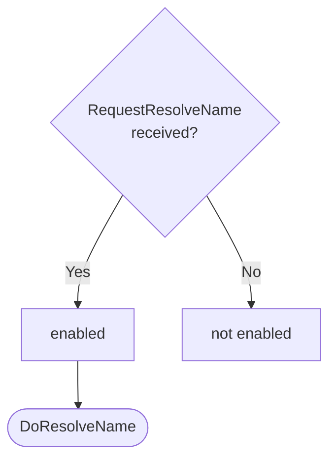
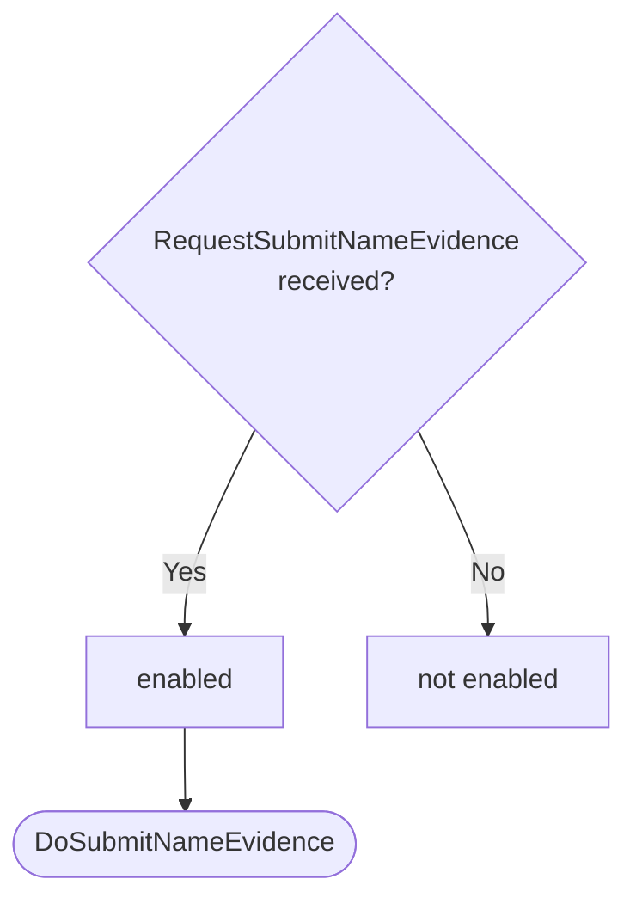
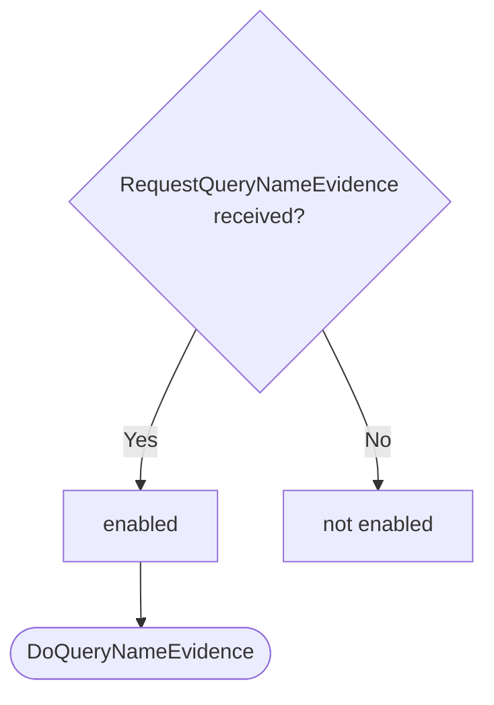

??? quote "Juvix imports"

    ```juvix
    module arch.node.engines.naming_behaviour;

    import prelude open;
    import arch.node.types.messages open;
    import arch.node.types.engine_behaviour open;
    import arch.node.types.engine_environment open;
    import arch.node.types.identities open;
    import arch.node.engines.naming_messages open;
    import arch.node.engines.naming_environment open;
    import arch.node.types.anoma_message open;
    ```

# Naming Behaviour

## Overview

The behavior of the Naming Engine defines how it processes incoming messages and
updates its state accordingly.

## Action labels

### `NamingActionLabelDoResolveName DoResolveName`

```juvix
type DoResolveName := mkDoResolveName {
  identityName : IdentityName
};
```

This action label corresponds to resolving a name to associated external identities.

???+ quote "Arguments"

    `identityName`:
    : The identity name to resolve.

???+ quote "`DoResolveName` action effect"

    This action does the following:

    | Aspect | Description |
    |--------|-------------|
    | State update          | No change to the local state. |
    | Messages to be sent   | A `ResponseResolveName` message is sent to the requester, containing matching external identities. |
    | Engines to be spawned | No engines are spawned by this action. |
    | Timer updates         | No timers are set or cancelled. |

### `NamingActionLabelDoSubmitNameEvidence DoSubmitNameEvidence`

```juvix
type DoSubmitNameEvidence := mkDoSubmitNameEvidence {
  evidence : IdentityNameEvidence
};
```

This action label corresponds to submitting new name evidence.

???+ quote "Arguments"

    `evidence`:
    : The name evidence to submit.

???+ quote "`DoSubmitNameEvidence` action effect"

    This action does the following:

    | Aspect | Description |
    |--------|-------------|
    | State update          | If the evidence doesn't already exist and is valid, it's added to the `evidenceStore` in the local state. |
    | Messages to be sent   | A `ResponseSubmitNameEvidence` message is sent to the requester, confirming the submission or indicating an error if the evidence already exists. |
    | Engines to be spawned | No engines are spawned by this action. |
    | Timer updates         | No timers are set or cancelled. |

### `NamingActionLabelDoQueryNameEvidence DoQueryNameEvidence`

```juvix
type DoQueryNameEvidence := mkDoQueryNameEvidence {
  externalIdentity : ExternalIdentity
};
```

This action label corresponds to querying name evidence for a specific external identity.

???+ quote "Arguments"

    `externalIdentity`:
    : The external identity to query evidence for.

???+ quote "`DoQueryNameEvidence` action effect"

    This action does the following:

    | Aspect | Description |
    |--------|-------------|
    | State update          | No change to the local state. |
    | Messages to be sent   | A `ResponseQueryNameEvidence` message is sent to the requester, containing relevant evidence for the specified external identity. |
    | Engines to be spawned | No engines are spawned by this action. |
    | Timer updates         | No timers are set or cancelled. |

### `NamingActionLabel`

```juvix
type NamingActionLabel :=
  | NamingActionLabelDoResolveName DoResolveName
  | NamingActionLabelDoSubmitNameEvidence DoSubmitNameEvidence
  | NamingActionLabelDoQueryNameEvidence DoQueryNameEvidence
;
```

## Matchable arguments

### `NamingMatchableArgument ReplyTo`

```juvix
type ReplyTo := mkReplyTo {
  whoAsked : Option EngineID;
  mailbox : Option MailboxID
};
```

???+ quote "Arguments"

    `whoAsked`:
    : The engine ID of the requester.

    `mailbox`:
    : The mailbox ID where the response should be sent.

### `NamingMatchableArgument`

```juvix
type NamingMatchableArgument :=
  | NamingMatchableArgumentReplyTo ReplyTo
;
```

## Precomputation results

The Naming Engine does not require any non-trivial pre-computations.

```juvix
syntax alias NamingPrecomputation := Unit;
```

## Guards

??? quote "Auxiliary Juvix code"

    Type alias for the guard.

    ```juvix
    NamingGuard : Type :=
      Guard
        NamingLocalState
        NamingMailboxState
        NamingTimerHandle
        NamingMatchableArgument
        NamingActionLabel
        NamingPrecomputation;

    NamingGuardOutput : Type :=
      GuardOutput NamingMatchableArgument NamingActionLabel NamingPrecomputation;
    ```

### `resolveNameGuard`

<figure markdown>

<figcaption>resolveNameGuard flowchart</figcaption>
</figure>

<!-- --8<-- [start:resolveNameGuard] -->
```juvix
resolveNameGuard
  (t : TimestampedTrigger NamingTimerHandle)
  (env : NamingEnvironment) : Option NamingGuardOutput
  := case getMessageFromTimestampedTrigger t of {
      | some (MsgNaming (MsgNamingResolveNameRequest (mkRequestResolveName x))) := do {
        sender <- getSenderFromTimestampedTrigger t;
        pure (mkGuardOutput@{
          matchedArgs := [NamingMatchableArgumentReplyTo (mkReplyTo (some sender) none)] ;
          actionLabel := NamingActionLabelDoResolveName (mkDoResolveName x);
          precomputationTasks := unit
        });}
      | _ := none
  };
```
<!-- --8<-- [end:resolveNameGuard] -->

### `submitNameEvidenceGuard`

<figure markdown>

<figcaption>submitNameEvidenceGuard flowchart</figcaption>
</figure>

<!-- --8<-- [start:submitNameEvidenceGuard] -->
```juvix
submitNameEvidenceGuard
  (t : TimestampedTrigger NamingTimerHandle)
  (env : NamingEnvironment) : Option NamingGuardOutput
  := case getMessageFromTimestampedTrigger t of {
      | some (MsgNaming (MsgNamingSubmitNameEvidenceRequest (mkRequestSubmitNameEvidence x))) := do {
        sender <- getSenderFromTimestampedTrigger t;
        pure (mkGuardOutput@{
          matchedArgs := [NamingMatchableArgumentReplyTo (mkReplyTo (some sender) none)] ;
          actionLabel := NamingActionLabelDoSubmitNameEvidence (mkDoSubmitNameEvidence x);
          precomputationTasks := unit
        });}
      | _ := none
  };
```
<!-- --8<-- [end:submitNameEvidenceGuard] -->

### `queryNameEvidenceGuard`

<figure markdown>

<figcaption>queryNameEvidenceGuard flowchart</figcaption>
</figure>

<!-- --8<-- [start:queryNameEvidenceGuard] -->
```juvix
queryNameEvidenceGuard
  (t : TimestampedTrigger NamingTimerHandle)
  (env : NamingEnvironment) : Option NamingGuardOutput
  := case getMessageFromTimestampedTrigger t of {
      | some (MsgNaming (MsgNamingQueryNameEvidenceRequest (mkRequestQueryNameEvidence x))) := do {
        sender <- getSenderFromTimestampedTrigger t;
        pure (mkGuardOutput@{
                matchedArgs := [NamingMatchableArgumentReplyTo (mkReplyTo (some sender) none)] ;
                actionLabel := NamingActionLabelDoQueryNameEvidence (mkDoQueryNameEvidence x);
                precomputationTasks := unit
                });
        }
      | _ := none
  };
```
<!-- --8<-- [end:queryNameEvidenceGuard] -->

## Action function

??? quote "Auxiliary Juvix code"

    Type alias for the action function.

    ```juvix
    NamingActionInput : Type :=
      ActionInput
        NamingLocalState
        NamingMailboxState
        NamingTimerHandle
        NamingMatchableArgument
        NamingActionLabel
        NamingPrecomputation;

    NamingActionEffect : Type :=
      ActionEffect
        NamingLocalState
        NamingMailboxState
        NamingTimerHandle
        NamingMatchableArgument
        NamingActionLabel
        NamingPrecomputation;
    ```

<!-- --8<-- [start:namingAction] -->
```juvix
namingAction (input : NamingActionInput) : NamingActionEffect :=
  let env := ActionInput.env input;
      out := ActionInput.guardOutput input;
      localState := EngineEnvironment.localState env;
  in
  case GuardOutput.actionLabel out of {
    | NamingActionLabelDoResolveName (mkDoResolveName identityName) :=
      case GuardOutput.matchedArgs out of {
        | (NamingMatchableArgumentReplyTo (mkReplyTo (some whoAsked) _)) :: _ := let
            matchingEvidence := AVLTree.filter \{evidence :=
              isEqual (Ord.cmp (IdentityNameEvidence.identityName evidence) identityName)
             } (NamingLocalState.evidenceStore localState);
            identities := Set.fromList (map \{evidence :=
              IdentityNameEvidence.externalIdentity evidence
             } (Set.toList matchingEvidence));
            responseMsg := mkResponseResolveName@{
              externalIdentities := identities;
              err := none
            };
          in mkActionEffect@{
            newEnv := env; -- No state change
            producedMessages := [mkEngineMsg@{
              sender := mkPair none (some (EngineEnvironment.name env));
              target := whoAsked;
              mailbox := some 0;
              msg := MsgNaming (MsgNamingResolveNameResponse responseMsg)
            }];
            timers := [];
            spawnedEngines := []
          }
        | _ := mkActionEffect@{newEnv := env; producedMessages := []; timers := []; spawnedEngines := []}
      }
    | NamingActionLabelDoSubmitNameEvidence (mkDoSubmitNameEvidence evidence') :=
      case GuardOutput.matchedArgs out of {
        | (NamingMatchableArgumentReplyTo (mkReplyTo (some whoAsked) _)) :: _ :=
            let evidence := evidence';
                isValid := NamingLocalState.verifyEvidence localState evidence;
            in
            case isValid of {
              | false :=
                  let responseMsg := mkResponseSubmitNameEvidence@{
                        err := some "Invalid evidence"
                      };
                  in mkActionEffect@{
                    newEnv := env;
                    producedMessages := [mkEngineMsg@{
                      sender := mkPair none (some (EngineEnvironment.name env));
                      target := whoAsked;
                      mailbox := some 0;
                      msg := MsgNaming (MsgNamingSubmitNameEvidenceResponse responseMsg)
                    }];
                    timers := [];
                    spawnedEngines := []
                  }
              | true :=
                  let alreadyExists := isElement \{a b := a && b} true (map \{e :=
                        isEqual (Ord.cmp e evidence)
                      } (Set.toList (NamingLocalState.evidenceStore localState)));
                      newLocalState := case alreadyExists of {
                        | true := localState
                        | false :=
                            let newEvidenceStore := Set.insert evidence (NamingLocalState.evidenceStore localState);
                            in localState@NamingLocalState{
                              evidenceStore := newEvidenceStore
                            }
                      };
                      newEnv' := env@EngineEnvironment{
                        localState := newLocalState
                      };
                      responseMsg := mkResponseSubmitNameEvidence@{
                        err := case alreadyExists of {
                          | true := some "Evidence already exists"
                          | false := none
                      }};
                  in mkActionEffect@{
                    newEnv := newEnv';
                    producedMessages := [mkEngineMsg@{
                      sender := mkPair none (some (EngineEnvironment.name env));
                      target := whoAsked;
                      mailbox := some 0;
                      msg := MsgNaming (MsgNamingSubmitNameEvidenceResponse responseMsg)
                    }];
                    timers := [];
                    spawnedEngines := []
                  }
            }
        | _ := mkActionEffect@{
            newEnv := env;
            producedMessages := [];
            timers := [];
            spawnedEngines := []
          }
      }
    | NamingActionLabelDoQueryNameEvidence (mkDoQueryNameEvidence externalIdentity') :=
      case GuardOutput.matchedArgs out of {
        | (NamingMatchableArgumentReplyTo (mkReplyTo (some whoAsked) _)) :: _ := let
            relevantEvidence := AVLTree.filter \{evidence :=
              isEqual (Ord.cmp (IdentityNameEvidence.externalIdentity evidence) externalIdentity')
             } (NamingLocalState.evidenceStore localState);
            responseMsg := mkResponseQueryNameEvidence@{
              externalIdentity := externalIdentity';
              evidence := relevantEvidence;
              err := none
            };
          in mkActionEffect@{
            newEnv := env; -- No state change
            producedMessages := [mkEngineMsg@{
              sender := mkPair none (some (EngineEnvironment.name env));
              target := whoAsked;
              mailbox := some 0;
              msg := MsgNaming (MsgNamingQueryNameEvidenceResponse responseMsg)
            }];
            timers := [];
            spawnedEngines := []
          }
        | _ := mkActionEffect@{newEnv := env; producedMessages := []; timers := []; spawnedEngines := []}
      }
  };
```
<!-- --8<-- [end:namingAction] -->

## Conflict solver

### `namingConflictSolver`

```juvix
namingConflictSolver : Set NamingMatchableArgument -> List (Set NamingMatchableArgument)
  | _ := [];
```

## The Naming Behaviour

### `NamingBehaviour`

<!-- --8<-- [start:NamingBehaviour] -->
```juvix
NamingBehaviour : Type :=
  EngineBehaviour
    NamingLocalState
    NamingMailboxState
    NamingTimerHandle
    NamingMatchableArgument
    NamingActionLabel
    NamingPrecomputation;
```
<!-- --8<-- [end:NamingBehaviour] -->

### Instantiation

<!-- --8<-- [start:namingBehaviour] -->
```juvix
namingBehaviour : NamingBehaviour :=
  mkEngineBehaviour@{
    guards := [resolveNameGuard; submitNameEvidenceGuard; queryNameEvidenceGuard];
    action := namingAction;
    conflictSolver := namingConflictSolver;
  };
```
<!-- --8<-- [end:namingBehaviour] -->
