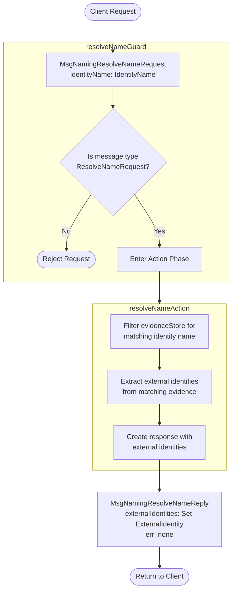
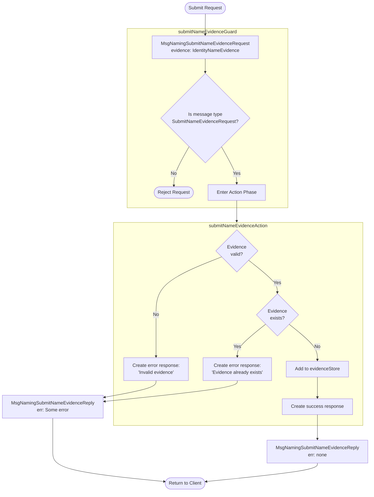
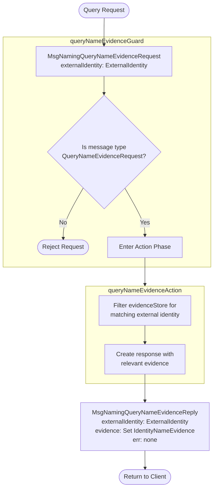

??? code "Juvix imports"

    ```juvix
    module arch.node.engines.naming_behaviour;

    import prelude open;
    import arch.node.utils open;
    import arch.node.types.messages open;
    import arch.node.types.engine open;
    import arch.node.types.identities open;
    import arch.node.engines.naming_messages open;
    import arch.node.engines.naming_config open;
    import arch.node.engines.naming_environment open;
    import arch.node.types.anoma as Anoma open;
    ```

# Naming Behaviour

## Overview

The behavior of the Naming Engine defines how it processes incoming messages and
updates its state accordingly.

## Naming Action Flowcharts

### `resolveNameAction` flowchart

<figure markdown>



<figcaption markdown="span">
`resolveNameAction` flowchart
</figcaption>
</figure>

#### Explanation

1. **Initial Request**
   - A client sends a `MsgNamingResolveNameRequest` containing an identity name (`IdentityName`)
   - The identity name is typically a human-readable identifier that the client wants to resolve to cryptographic identities

2. **Guard Phase** (`resolveNameGuard`)
   - Validates that the incoming message is a proper name resolution request
   - Checks occur in the following order:
     - Verifies message type is `MsgNamingResolveNameRequest`
     - If validation fails, request is rejected without entering the action phase
     - On success, passes control to `resolveNameActionLabel`

3. **Action Phase** (`resolveNameAction`)
   - Processes valid name resolution requests through these steps:
     - Retrieves the identity name from the request
     - Scans the evidence store (`evidenceStore`) for any evidence matching this name
     - Extracts all external identities from matching evidence records
     - Constructs an appropriate response message

4. **Response Generation**
   - **Successful Case**
     - Creates `MsgNamingResolveNameReply` with:
       - `externalIdentities`: Set of all external identities associated with the name
       - `err`: None
   - **Empty Result Case**
     - Still returns `MsgNamingResolveNameReply` with:
       - `externalIdentities`: Empty set
       - `err`: None
     - Note: An empty result is not considered an error - it simply means no evidence exists for this name

5. **Response Delivery**
   - Response is sent back to the original requester
   - Response is sent to mailbox 0.

!!! warning "Important Notes"

    - The resolution process is read-only - it never modifies the evidence store
    - Multiple external identities may be associated with a single name

### `submitNameEvidenceAction` flowchart

<figure markdown>



<figcaption markdown="span">
`submitNameEvidenceAction` flowchart
</figcaption>
</figure>

#### Explanation

1. **Initial Request**
   - A client sends a `MsgNamingSubmitNameEvidenceRequest` containing:
     - `evidence`: An `IdentityNameEvidence` that proves the connection between an `IdentityName` and an `ExternalIdentity`
     - An `IdentityNameEvidence` contains:
       - `identityName`: The human-readable name being associated with an identity
       - `externalIdentity`: The cryptographic identity being associated with the name
       - `evidence`: The cryptographic evidence supporting this association
     - The evidence must be in a format that can be cryptographically verified

2. **Guard Phase** (`submitNameEvidenceGuard`)
   - Validates that the incoming message is a proper evidence submission request
   - Checks occur in the following order:
     - Verifies message type is `MsgNamingSubmitNameEvidenceRequest`
     - If validation fails, request is rejected without entering the action phase
     - On success, passes control to `submitNameEvidenceActionLabel`

3. **Action Phase** (`submitNameEvidenceAction`)
   - Processes valid evidence submissions through these steps:
     - Validates the cryptographic evidence using `verifyEvidence`
     - Checks for duplicate evidence in the store
     - Updates the evidence store if appropriate
     - Constructs an appropriate response message

4. **Response Generation**
   - **Successful Case**
     - Evidence is valid and new:
       - Adds evidence to the `evidenceStore`
       - Creates `MsgNamingSubmitNameEvidenceReply` with:
         - `err`: None
   - **Error Cases**
     - Invalid evidence:
       - Returns error "Invalid evidence"
     - Duplicate evidence:
       - Returns error "Evidence already exists"
     - In all error cases, returns `MsgNamingSubmitNameEvidenceReply` with:
       - `err`: Some(error message)

5. **Response Delivery**
   - Response is sent back to the original requester
   - Response is sent to mailbox 0.

!!! warning "Important Notes"

    - The engine maintains an append-only evidence store, never removing or modifying existing evidence. The evidence store is the only mutable state in this flow and all state changes are performed only after complete validation.
    - Evidence uniqueness is checked using exact matching

### `queryNameEvidenceAction` flowchart

<figure markdown>



<figcaption markdown="span">
`queryNameEvidenceAction` flowchart
</figcaption>
</figure>

#### Explanation

1. **Initial Request**
   - A client sends a `MsgNamingQueryNameEvidenceRequest` containing an external identity (`ExternalIdentity`)
   - The external identity refers to the cryptographic identity for which all associated naming evidence should be retrieved

2. **Guard Phase** (`queryNameEvidenceGuard`)
   - Validates that the incoming message is a proper query request
   - Checks occur in the following order:
     - Verifies message type is `MsgNamingQueryNameEvidenceRequest`
     - If validation fails, request is rejected without entering the action phase
     - On success, passes control to `queryNameEvidenceActionLabel`

3. **Action Phase** (`queryNameEvidenceAction`)
   - Processes valid query requests through these steps:
     - Extracts the external identity from the request
     - Filters the evidence store to find all evidence entries matching this identity
     - Constructs an appropriate response message with the collected evidence

4. **Response Generation**
   - **Successful Case**
     - Creates `MsgNamingQueryNameEvidenceReply` with:
       - `externalIdentity`: The originally queried identity
       - `evidence`: Set of all matching `IdentityNameEvidence`
       - `err`: None
   - There are currently no implemented error cases.

5. **Response Delivery**
   - Response is sent back to the original requester
   - Uses mailbox ID 0

!!! warning "Important Notes"

    - The query operation is read-only - it doesn't modify the evidence store
    - Multiple pieces of evidence may exist for the same external identity

## Action arguments

### `NamingActionArgumentReplyTo ReplyTo`

```juvix
type ReplyTo := mkReplyTo {
  whoAsked : Option EngineID;
  mailbox : Option MailboxID
};
```

This action argument contains the address and mailbox ID of where the
response message should be sent.

`whoAsked`:
: is the address of the engine that sent the message.

`mailbox`:
: is the mailbox ID where the response message should be sent.

### `NamingActionArgument`

<!-- --8<-- [start:NamingActionArgument] -->
```juvix
type NamingActionArgument :=
  | NamingActionArgumentReplyTo ReplyTo
;
```
<!-- --8<-- [end:NamingActionArgument] -->

### `NamingActionArguments`

<!-- --8<-- [start:naming-action-arguments] -->
```juvix
NamingActionArguments : Type := List NamingActionArgument;
```
<!-- --8<-- [end:naming-action-arguments] -->

## Actions

??? code "Auxiliary Juvix code"

    ### NamingAction

    ```juvix
    NamingAction : Type :=
      Action
        NamingCfg
        NamingLocalState
        NamingMailboxState
        NamingTimerHandle
        NamingActionArguments
        Anoma.Msg
        Anoma.Cfg
        Anoma.Env;
    ```

    ### NamingActionInput

    ```juvix
    NamingActionInput : Type :=
      ActionInput
        NamingCfg
        NamingLocalState
        NamingMailboxState
        NamingTimerHandle
        NamingActionArguments
        Anoma.Msg;
    ```

    ### NamingActionEffect

    ```juvix
    NamingActionEffect : Type :=
      ActionEffect
        NamingLocalState
        NamingMailboxState
        NamingTimerHandle
        Anoma.Msg
        Anoma.Cfg
        Anoma.Env;
    ```

    ### NamingActionExec

    ```juvix
    NamingActionExec : Type :=
      ActionExec
        NamingCfg
        NamingLocalState
        NamingMailboxState
        NamingTimerHandle
        NamingActionArguments
        Anoma.Msg
        Anoma.Cfg
        Anoma.Env;
    ```

### `resolveNameAction`

Resolve a name to associated external identities.

State update
: No change to the local state.

Messages to be sent
: A `ReplyResolveName` message is sent to the requester, containing matching external identities.

Engines to be spawned
: No engines are spawned by this action.

Timer updates
: No timers are set or cancelled.

```juvix
resolveNameAction
  (input : NamingActionInput)
  : Option NamingActionEffect :=
  let
    env := ActionInput.env input;
    cfg := ActionInput.cfg input;
    tt := ActionInput.trigger input;
    localState := EngineEnv.localState env;
    identityName := case getEngineMsgFromTimestampedTrigger tt of {
      | some mkEngineMsg@{msg := Anoma.MsgNaming (MsgNamingResolveNameRequest req)} :=
          some (RequestResolveName.identityName req)
      | _ := none
    }
  in case identityName of {
    | some name := let
        matchingEvidence := AVLTree.filter \{evidence :=
          isEqual (Ord.cmp (IdentityNameEvidence.identityName evidence) name)
        } (NamingLocalState.evidenceStore localState);
        identities := Set.fromList (map \{evidence :=
          IdentityNameEvidence.externalIdentity evidence
        } (Set.toList matchingEvidence));
        responseMsg := Anoma.MsgNaming (MsgNamingResolveNameReply mkReplyResolveName@{
          externalIdentities := identities;
          err := none
        })
      in case getEngineMsgFromTimestampedTrigger tt of {
        | some emsg := some (defaultReplyActionEffect env cfg (EngineMsg.sender emsg) responseMsg)
        | _ := none
      }
    | _ := none
  };
```

### `submitNameEvidenceAction`

Submit new name evidence.

State update
: If the evidence doesn't already exist and is valid, it's added to the `evidenceStore`.

Messages to be sent
: A response message is sent to the requester, confirming submission or indicating an error.

Engines to be spawned
: No engines are spawned by this action.

Timer updates
: No timers are set or cancelled.

```juvix
submitNameEvidenceAction
  (input : NamingActionInput)
  : Option NamingActionEffect :=
  let
    env := ActionInput.env input;
    cfg := ActionInput.cfg input;
    tt := ActionInput.trigger input;
    localState := EngineEnv.localState env;
    evidence := case getEngineMsgFromTimestampedTrigger tt of {
      | some mkEngineMsg@{msg := Anoma.MsgNaming (MsgNamingSubmitNameEvidenceRequest req)} :=
          some (RequestSubmitNameEvidence.evidence req)
      | _ := none
    }
  in case evidence of {
    | some ev := let
        isValid := verifyEvidence ev;
        alreadyExists := case isValid of {
          | true := isElement \{a b := a && b} true (map \{e :=
              isEqual (Ord.cmp e ev)
            } (Set.toList (NamingLocalState.evidenceStore localState)))
          | false := false
        };
        newEnv := case isValid && (not alreadyExists) of {
          | true := env@EngineEnv{
              localState := localState@NamingLocalState{
                evidenceStore := Set.insert ev (NamingLocalState.evidenceStore localState)
              }
            }
          | false := env
        };
        responseMsg := Anoma.MsgNaming (MsgNamingSubmitNameEvidenceReply mkReplySubmitNameEvidence@{
          err := case isValid of {
            | false := some "Invalid evidence"
            | true := case alreadyExists of {
                | true := some "Evidence already exists"
                | false := none
              }
          }
        })
      in case getEngineMsgFromTimestampedTrigger tt of {
        | some emsg := some (defaultReplyActionEffect newEnv cfg (EngineMsg.sender emsg) responseMsg)
        | _ := none
      }
    | _ := none
  };
```

### `queryNameEvidenceAction`

Query name evidence for a specific external identity.

State update
: No change to the local state.

Messages to be sent
: A `ReplyQueryNameEvidence` message is sent to the requester, containing relevant evidence.

Engines to be spawned
: No engines are spawned by this action.

Timer updates
: No timers are set or cancelled.

```juvix
queryNameEvidenceAction
  (input : NamingActionInput)
  : Option NamingActionEffect :=
  let
    env := ActionInput.env input;
    cfg := ActionInput.cfg input;
    tt := ActionInput.trigger input;
    localState := EngineEnv.localState env;
    externalIdentity := case getEngineMsgFromTimestampedTrigger tt of {
      | some mkEngineMsg@{msg := Anoma.MsgNaming (MsgNamingQueryNameEvidenceRequest req)} :=
          some (RequestQueryNameEvidence.externalIdentity req)
      | _ := none
    }
  in case externalIdentity of {
    | some extId := let
        relevantEvidence := AVLTree.filter \{evidence :=
          isEqual (Ord.cmp (IdentityNameEvidence.externalIdentity evidence) extId)
        } (NamingLocalState.evidenceStore localState);
        responseMsg := Anoma.MsgNaming (MsgNamingQueryNameEvidenceReply mkReplyQueryNameEvidence@{
          externalIdentity := extId;
          evidence := relevantEvidence;
          err := none
        })
      in case getEngineMsgFromTimestampedTrigger tt of {
        | some emsg := some (defaultReplyActionEffect env cfg (EngineMsg.sender emsg) responseMsg)
        | _ := none
      }
    | _ := none
  };
```

## Action Labels

### `resolveNameActionLabel`

```juvix
resolveNameActionLabel : NamingActionExec := Seq [ resolveNameAction ];
```

### `submitNameEvidenceActionLabel`

```juvix
submitNameEvidenceActionLabel : NamingActionExec := Seq [ submitNameEvidenceAction ];
```

### `queryNameEvidenceActionLabel`

```juvix
queryNameEvidenceActionLabel : NamingActionExec := Seq [ queryNameEvidenceAction ];
```

## Guards

??? code "Auxiliary Juvix code"

    ### `NamingGuard`

    <!-- --8<-- [start:NamingGuard] -->
    ```juvix
    NamingGuard : Type :=
      Guard
        NamingCfg
        NamingLocalState
        NamingMailboxState
        NamingTimerHandle
        NamingActionArguments
        Anoma.Msg
        Anoma.Cfg
        Anoma.Env;
    ```
    <!-- --8<-- [end:NamingGuard] -->

    ### `NamingGuardOutput`

    <!-- --8<-- [start:NamingGuardOutput] -->
    ```juvix
    NamingGuardOutput : Type :=
      GuardOutput
        NamingCfg
        NamingLocalState
        NamingMailboxState
        NamingTimerHandle
        NamingActionArguments
        Anoma.Msg
        Anoma.Cfg
        Anoma.Env;
    ```
    <!-- --8<-- [end:NamingGuardOutput] -->

    ### `NamingGuardEval`

    <!-- --8<-- [start:NamingGuardEval] -->
    ```juvix
    NamingGuardEval : Type :=
      GuardEval
        NamingCfg
        NamingLocalState
        NamingMailboxState
        NamingTimerHandle
        NamingActionArguments
        Anoma.Msg
        Anoma.Cfg
        Anoma.Env;
    ```
    <!-- --8<-- [end:NamingGuardEval] -->

### `resolveNameGuard`

Condition
: Message type is `MsgNamingResolveNameRequest`.

<!-- --8<-- [start:resolveNameGuard] -->
```juvix
resolveNameGuard
  (tt : TimestampedTrigger NamingTimerHandle Anoma.Msg)
  (cfg : EngineCfg NamingCfg)
  (env : NamingEnv)
  : Option NamingGuardOutput :=
  case getEngineMsgFromTimestampedTrigger tt of {
    | some mkEngineMsg@{
        msg := Anoma.MsgNaming (MsgNamingResolveNameRequest _)
      } := some mkGuardOutput@{
        action := resolveNameActionLabel;
        args := []
      }
    | _ := none
  };
```
<!-- --8<-- [end:resolveNameGuard] -->

### `submitNameEvidenceGuard`

Condition
: Message type is `MsgNamingSubmitNameEvidenceRequest`.

<!-- --8<-- [start:submitNameEvidenceGuard] -->
```juvix
submitNameEvidenceGuard
  (tt : TimestampedTrigger NamingTimerHandle Anoma.Msg)
  (cfg : EngineCfg NamingCfg)
  (env : NamingEnv)
  : Option NamingGuardOutput :=
  case getEngineMsgFromTimestampedTrigger tt of {
    | some mkEngineMsg@{
        msg := Anoma.MsgNaming (MsgNamingSubmitNameEvidenceRequest _)
      } := some mkGuardOutput@{
        action := submitNameEvidenceActionLabel;
        args := []
      }
    | _ := none
  };
```
<!-- --8<-- [end:submitNameEvidenceGuard] -->

### `queryNameEvidenceGuard`

Condition
: Message type is `MsgNamingQueryNameEvidenceRequest`.

<!-- --8<-- [start:queryNameEvidenceGuard] -->
```juvix
queryNameEvidenceGuard
  (tt : TimestampedTrigger NamingTimerHandle Anoma.Msg)
  (cfg : EngineCfg NamingCfg)
  (env : NamingEnv)
  : Option NamingGuardOutput :=
  case getEngineMsgFromTimestampedTrigger tt of {
    | some mkEngineMsg@{
        msg := Anoma.MsgNaming (MsgNamingQueryNameEvidenceRequest _)
      } := some mkGuardOutput@{
        action := queryNameEvidenceActionLabel;
        args := []
      }
    | _ := none
  };
```
<!-- --8<-- [end:queryNameEvidenceGuard] -->

## The Naming Behaviour

### `NamingBehaviour`

<!-- --8<-- [start:NamingBehaviour] -->
```juvix
NamingBehaviour : Type :=
  EngineBehaviour
    NamingCfg
    NamingLocalState
    NamingMailboxState
    NamingTimerHandle
    NamingActionArguments
    Anoma.Msg
    Anoma.Cfg
    Anoma.Env;
```
<!-- --8<-- [end:NamingBehaviour] -->

### Instantiation

<!-- --8<-- [start:namingBehaviour] -->
```juvix
namingBehaviour : NamingBehaviour :=
  mkEngineBehaviour@{
    guards :=
      First [
        resolveNameGuard;
        submitNameEvidenceGuard;
        queryNameEvidenceGuard
      ];
  };
```
<!-- --8<-- [end:namingBehaviour] -->
