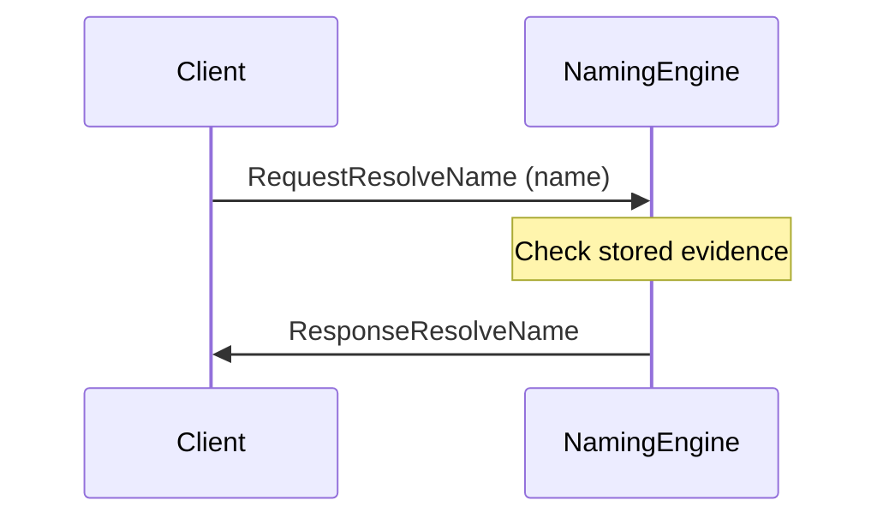
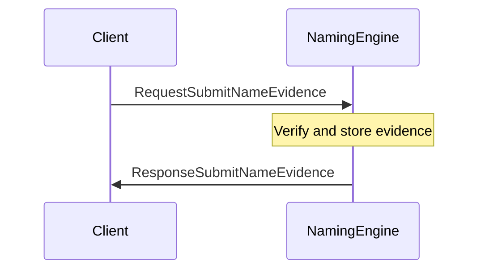
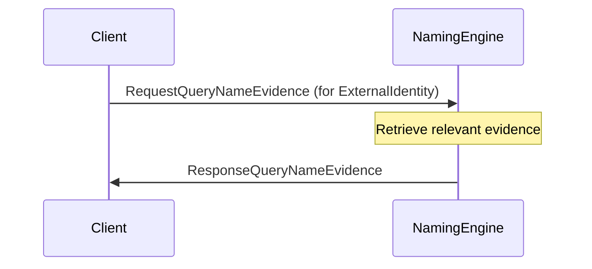

??? quote "Juvix imports"

    ```juvix
    module arch.node.engines.naming_messages;
    import prelude open;
    import arch.node.types.identities open;
    ```

# Naming Messages

## Message interface

--8<-- "./naming_messages.juvix.md:NamingMsg"

## Message sequence diagrams

### Resolving a name

<!-- --8<-- [start:message-sequence-diagram-name-resolution] -->
<figure markdown="span">



<figcaption markdown="span">
Resolving a name
</figcaption>
</figure>
<!-- --8<-- [end:message-sequence-diagram-name-resolution] -->

### Submitting name evidence

<!-- --8<-- [start:message-sequence-diagram-submit] -->
<figure markdown="span">



<figcaption markdown="span">
Submitting name evidence
</figcaption>
</figure>
<!-- --8<-- [end:message-sequence-diagram-submit] -->

### Querying name evidence

<!-- --8<-- [start:message-sequence-diagram-query] -->
<figure markdown="span">



<figcaption markdown="span">
Querying name evidence for an identity.
</figcaption>
</figure>
<!-- --8<-- [end:message-sequence-diagram-query] -->

## Message types

### `RequestResolveName`

```juvix
type RequestResolveName := mkRequestResolveName {
  identityName : IdentityName
};
```

A `RequestResolveName` asks the Naming Engine which `ExternalIdentity`s are
associated with a given `IdentityName`.

???+ quote "Arguments"
    `identityName`:
    : The name to resolve.

### `ResponseResolveName`

```juvix
type ResponseResolveName := mkResponseResolveName {
  externalIdentities : Set ExternalIdentity;
  err : Option String
};
```

A `ResponseResolveName` is returned in response to a `RequestResolveName`.

???+ quote "Arguments"

    `externalIdentities`:
    : A set of ExternalIdentitys associated with the IdentityName.

    `err`:
    : An error message if the resolution failed.

### `RequestSubmitNameEvidence`

```juvix
type RequestSubmitNameEvidence := mkRequestSubmitNameEvidence {
  evidence : IdentityNameEvidence
};
```

A `RequestSubmitNameEvidence` instructs the Naming Engine to store a new piece
of IdentityNameEvidence.

???+ quote "Arguments"

    `evidence`:
    : The evidence supporting the association between an IdentityName and an ExternalIdentity.

### `ResponseSubmitNameEvidence`

```juvix
type ResponseSubmitNameEvidence := mkResponseSubmitNameEvidence {
  err : Option String
};
```

A `ResponseSubmitNameEvidence` is sent in response to a `RequestSubmitNameEvidence`.

???+ quote "Arguments"
    `err`:
    : An error message if the submission failed.

### `RequestQueryNameEvidence`

```juvix
type RequestQueryNameEvidence := mkRequestQueryNameEvidence {
  externalIdentity : ExternalIdentity
};
```

A `RequestQueryNameEvidence` instructs the Naming Engine to return any known
`IdentityName`s and `IdentityNameEvidence` associated with a specific
`ExternalIdentity`.

???+ quote "Arguments"
    `externalIdentity`:
    : The identity for which to retrieve evidence.

### `ResponseQueryNameEvidence`

```juvix
type ResponseQueryNameEvidence := mkResponseQueryNameEvidence {
  externalIdentity : ExternalIdentity;
  evidence : Set IdentityNameEvidence;
  err : Option String
};
```

A `ResponseQueryNameEvidence` provides the requested evidence.

???+ quote "Arguments"
    `externalIdentity`:
    : The `ExternalIdentity` associated with the returned evidence.

    `evidence`:
    : A set of `IdentityNameEvidence` related to the identity.

    `err`:
    : An error message if the query failed.

### `NamingMsg`

<!-- --8<-- [start:NamingMsg] -->
```juvix
type NamingMsg :=
  | MsgNamingResolveNameRequest RequestResolveName
  | MsgNamingResolveNameResponse ResponseResolveName
  | MsgNamingSubmitNameEvidenceRequest RequestSubmitNameEvidence
  | MsgNamingSubmitNameEvidenceResponse ResponseSubmitNameEvidence
  | MsgNamingQueryNameEvidenceRequest RequestQueryNameEvidence
  | MsgNamingQueryNameEvidenceResponse ResponseQueryNameEvidence
  ;
```
<!-- --8<-- [end:NamingMsg] -->

## Engine Components

- [[Naming Configuration]]
- [[Naming Environment]]
- [[Naming Behaviour]]