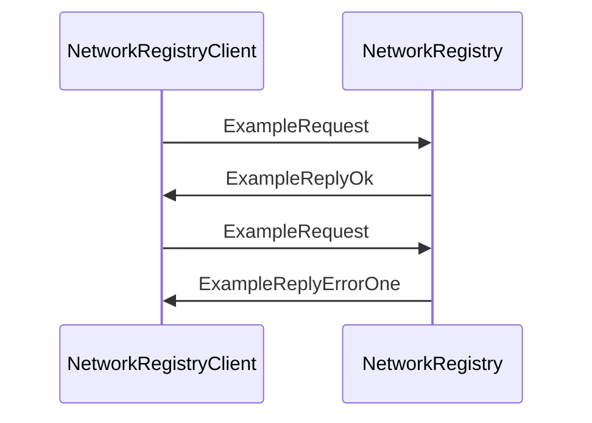

??? quote "Juvix imports"

    ```juvix
    module arch.node.engines.net_registry_messages;

    import arch.node.types.transport open;

    import arch.node.types.basics open;
    import arch.node.types.identities open;
    ```

# Network Registry Messages

These are the messages that the *Network Registry* engine can receive/respond
to.

## Message interface

--8<-- "./net_registry_messages.juvix.md:NetworkRegistryMsg"

## Message sequence diagrams

---


### `ExampleRequest` & `ExampleReply`

Lorem ipsum dolor sit amet, consectetur adipiscing elit.
Sed ut purus eget sapien. Nulla facilisi.

<!-- --8<-- [start:message-sequence-diagram-ExampleRequest] -->
<figure markdown="span">



<figcaption markdown="span">
Sequence Diagram: `ExampleRequest` & `ExampleReply`
</figcaption>
</figure>
<!-- --8<-- [end:message-sequence-diagram-ExampleRequest] -->

---

## Message types

---

### `NetworkRegistryMsgNodeAdvert`

A `NodeAdvert` update from another node.

---

## `NodeAdvert`

A self-signed *node advertisement* contains the node's
cryptographic identity and transport addresses.

```juvix
type NodeAdvert :=
  mkNodeAdvert {
    id : NodeID;
    addrs : List TransportAddress;
    version : Nat;
    created : AbsTime;
    sig : Commitment;
  };
```

`id`
: Node identity.

`addrs`
: Transport addresses with preferences expressed as weights.

`version`
: Version number (incremented at every change).

`created`
: Time of creation.

`sig`
: Signature by `id`.

---

### `NetworkRegistryMsgTopicAdvert`

## `TopicAdvert`

A *topic advertisement* is signed by the topic creator,
and contains the topic's cryptographic identity
and the `NodeID` of a set of relay nodes
that can be used to subscribe to the topic.
These may be publishers, subscribers, or dedicated relay nodes for the topic.

```juvix
type TopicAdvert :=
  mkTopicAdvert {
    id : TopicID;
    relays : List NodeID;
    tags : List String;
    version : Nat;
    created : AbsTime;
    sig : Commitment;
  };
```

---

### `NetworkRegistryMsgGetNodeAdvertRequest`

Get `NodeAdvert` for the given `NodeID`.

Sender: any local engine.

---

### `NetworkRegistryMsgExampleReply`

Reply to a `GetNodeAdvertRequest`.

#### `GetNodeAdvertReplyOk`

Reply with locally available `NodeAdvert`.

```juvix
GetNodeAdvertReplyOk : Type := NodeAdvert;
```

#### `GetNodeAdvertReplyError`

Error getting `NodeAdvert`.

<!-- --8<-- [start:GetNodeAdvertReplyError] -->
```juvix
type GetNodeAdvertReplyError : Type :=
  | GetNodeAdvertReplyErrorNotFound
  ;
```
<!-- --8<-- [end:GetNodeAdvertReplyError] -->

#### `GetNodeAdvertReply`

<!-- --8<-- [start:GetNodeAdvertReply] -->
```juvix
GetNodeAdvertReply : Type := Result GetNodeAdvertReplyError GetNodeAdvertReplyOk;
```
<!-- --8<-- [end:GetNodeAdvertReply] -->

### `NetworkRegistryMsgGetTopicAdvertRequest`

Get `TopicAdvert` for the given `TopicID`.

Sender: any local engine.

---

### `NetworkRegistryMsgExampleReply ExampleReply`

Reply to a `GetTopicAdvertRequest`.

#### `GetTopicAdvertReplyOk`

Reply with locally available `TopicAdvert`.

```juvix
GetTopicAdvertReplyOk : Type := TopicAdvert;
```

#### `GetTopicAdvertReplyError`

Error getting `TopicAdvert`.

<!-- --8<-- [start:GetTopicAdvertReplyError] -->
```juvix
type GetTopicAdvertReplyError : Type :=
  | GetTopicAdvertReplyErrorNotFound
  ;
```
<!-- --8<-- [end:GetTopicAdvertReplyError] -->

#### `GetTopicAdvertReply`

<!-- --8<-- [start:GetTopicAdvertReply] -->
```juvix
GetTopicAdvertReply : Type := Result GetTopicAdvertReplyError GetTopicAdvertReplyOk;
```
<!-- --8<-- [end:GetTopicAdvertReply] -->

---

### `NetworkRegistryMsg`

<!-- --8<-- [start:NetworkRegistryMsg] -->
```juvix
type NetworkRegistryMsg :=
  | NetworkRegistryMsgNodeAdvert NodeAdvert
  | NetworkRegistryMsgTopicAdvert TopicAdvert
  | NetworkRegistryMsgGetNodeAdvertRequest NodeID
  | NetworkRegistryMsgGetNodeAdvertReply GetNodeAdvertReply
  | NetworkRegistryMsgGetTopicAdvertRequest TopicID
  | NetworkRegistryMsgGetTopicAdvertReply GetTopicAdvertReply
  ;
```
<!-- --8<-- [end:NetworkRegistryMsg] -->

## Engine components

- [[Network Registry Configuration]]
- [[Network Registry Environment]]
- [[Network Registry Behaviour]]
