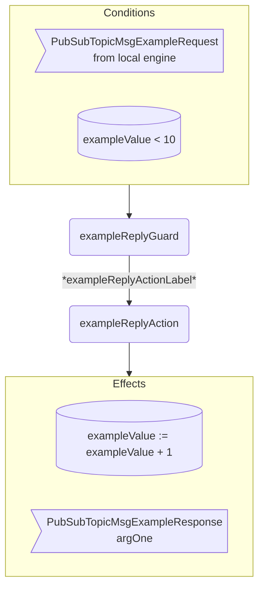

??? quote "Juvix imports"

    ```juvix
    module arch.node.engines.pub_sub_topic_behaviour;

    import arch.node.engines.pub_sub_topic_messages open;
    import arch.node.engines.pub_sub_topic_config open;
    import arch.node.engines.pub_sub_topic_environment open;

    import arch.node.types.basics open;
    import arch.node.types.identities open;
    import arch.node.types.messages open;
    import arch.node.types.engine open;
    import arch.node.types.anoma as Anoma open;
    ```

# Pub/Sub Topic Behaviour

## Overview

A *Pub/Sub Topic* engine acts in the ways described on this page.
The action labels correspond to the actions that can be performed by the engine.
Using the action labels, we describe the effects of the actions.

## Pub/Sub Topic Action Flowchart

### `exampleReply` Flowchart

<figure markdown>



<figcaption markdown="span">

`exampleReply` flowchart

</figcaption>
</figure>

## Action arguments

The action arguments are set by a guard
and passed to the action function as part of the `GuardOutput`.

### `PubSubTopicActionArguments`

<!-- --8<-- [start:PubSubTopicActionArguments] -->
```juvix
PubSubTopicActionArguments : Type := Unit;
```
<!-- --8<-- [end:PubSubTopicActionArguments] -->

## Actions

??? quote "Auxiliary Juvix code"

    ### `PubSubTopicAction`

    <!-- --8<-- [start:PubSubTopicAction] -->
    ```juvix
    PubSubTopicAction : Type :=
      Action
        PubSubTopicLocalCfg
        PubSubTopicLocalState
        PubSubTopicMailboxState
        PubSubTopicTimerHandle
        PubSubTopicActionArguments
        Anoma.Msg
        Anoma.Cfg
        Anoma.Env;
    ```
    <!-- --8<-- [end:PubSubTopicAction] -->

    ### `PubSubTopicActionInput`

    <!-- --8<-- [start:PubSubTopicActionInput] -->
    ```juvix
    PubSubTopicActionInput : Type :=
      ActionInput
        PubSubTopicLocalCfg
        PubSubTopicLocalState
        PubSubTopicMailboxState
        PubSubTopicTimerHandle
        PubSubTopicActionArguments
        Anoma.Msg;
    ```
    <!-- --8<-- [end:PubSubTopicActionInput] -->

    ### `PubSubTopicActionEffect`

    <!-- --8<-- [start:PubSubTopicActionEffect] -->
    ```juvix
    PubSubTopicActionEffect : Type :=
      ActionEffect
        PubSubTopicLocalState
        PubSubTopicMailboxState
        PubSubTopicTimerHandle
        Anoma.Msg
        Anoma.Cfg
        Anoma.Env;
    ```
    <!-- --8<-- [end:PubSubTopicActionEffect] -->

    ### `PubSubTopicActionExec`

    <!-- --8<-- [start:PubSubTopicActionExec] -->
    ```juvix
    PubSubTopicActionExec : Type :=
      ActionExec
        PubSubTopicLocalCfg
        PubSubTopicLocalState
        PubSubTopicMailboxState
        PubSubTopicTimerHandle
        PubSubTopicActionArguments
        Anoma.Msg
        Anoma.Cfg
        Anoma.Env;
    ```
    <!-- --8<-- [end:PubSubTopicActionExec] -->

#### `exampleReplyAction`

Respond with a `PubSubTopicMsgExampleReply`.
Respond with a `PubSubTopicMsgExampleReply`.

State update
: The state remains unchanged.

Messages to be sent
: A `PubSubTopicMsgExampleReply` message with the data set by `exampleReplyGuard`.

Engines to be spawned
: No engine is created by this action.

Timer updates
: No timers are set or cancelled.

<!-- --8<-- [start:exampleReplyAction] -->
```juvix
exampleReplyAction
  (input : PubSubTopicActionInput)
  : Option PubSubTopicActionEffect :=
  TODO {-
  let
    cfg := ActionInput.cfg input;
    env := ActionInput.env input;
    trigger := ActionInput.trigger input;
    args := ActionInput.args input;
  in
    case getEngineMsgFromTimestampedTrigger trigger of {
    | some mkEngineMsg@{
        msg := Anoma.MsgPubSubTopic (PubSubTopicMsgExampleRequest req);
        sender := sender;
        target := target;
        mailbox := mailbox;
      } :=
      some mkActionEffect@{
        env := env;
        msgs := [
          mkEngineMsg@{
            sender := getEngineIDFromEngineCfg cfg;
            target := sender;
            mailbox := some 0;
            msg :=
              Anoma.MsgPubSubTopic
                (PubSubTopicMsgExampleReply
                  (ok mkExampleReplyOk@{
                    argOne := ExampleRequest.argOne req;
                  }));
          }
        ];
        timers := [];
        engines := [];
      }
  | _ := none
  -};
```
<!-- --8<-- [end:exampleReplyAction] -->

## Action Labels

### `exampleReplyActionLabel`

```juvix
exampleReplyActionLabel : PubSubTopicActionExec := Seq [ exampleReplyAction ];
```

## Guards

??? quote "Auxiliary Juvix code"

    ### `PubSubTopicGuard`

    <!-- --8<-- [start:PubSubTopicGuard] -->
    ```juvix
    PubSubTopicGuard : Type :=
      Guard
        PubSubTopicLocalCfg
        PubSubTopicLocalState
        PubSubTopicMailboxState
        PubSubTopicTimerHandle
        PubSubTopicActionArguments
        Anoma.Msg
        Anoma.Cfg
        Anoma.Env;
    ```
    <!-- --8<-- [end:PubSubTopicGuard] -->

    ### `PubSubTopicGuardOutput`

    <!-- --8<-- [start:PubSubTopicGuardOutput] -->
    ```juvix
    PubSubTopicGuardOutput : Type :=
      GuardOutput
        PubSubTopicLocalCfg
        PubSubTopicLocalState
        PubSubTopicMailboxState
        PubSubTopicTimerHandle
        PubSubTopicActionArguments
        Anoma.Msg
        Anoma.Cfg
        Anoma.Env;
    ```
    <!-- --8<-- [end:PubSubTopicGuardOutput] -->

    ### `PubSubTopicGuardEval`

    <!-- --8<-- [start:PubSubTopicGuardEval] -->
    ```juvix
    PubSubTopicGuardEval : Type :=
      GuardEval
        PubSubTopicLocalCfg
        PubSubTopicLocalState
        PubSubTopicMailboxState
        PubSubTopicTimerHandle
        PubSubTopicActionArguments
        Anoma.Msg
        Anoma.Cfg
        Anoma.Env;
    ```
    <!-- --8<-- [end:PubSubTopicGuardEval] -->

### `exampleReplyGuard`

Guard description (optional).

Condition
: Message type is `PubSubTopicMsgExampleRequest`.

<!-- --8<-- [start:exampleReplyGuard] -->
```juvix
exampleReplyGuard
  (trigger : PubSubTopicTimestampedTrigger)
  (cfg : PubSubTopicCfg)
  (env : PubSubTopicEnv)
  : Option PubSubTopicGuardOutput :=
  TODO {-
  case getEngineMsgFromTimestampedTrigger trigger of {
    | some mkEngineMsg@{
        msg := Anoma.MsgPubSubTopic (PubSubTopicMsgExampleRequest req);
        sender := mkPair none _; -- from local engines only (NodeID is none)
      } := some mkGuardOutput@{
        action := exampleReplyActionLabel;
        args := [];
      }
    | _ := none
    -};
```
<!-- --8<-- [end:exampleReplyGuard] -->

## Engine behaviour

### `PubSubTopicBehaviour`

<!-- --8<-- [start:PubSubTopicBehaviour] -->
```juvix
PubSubTopicBehaviour : Type :=
  EngineBehaviour
    PubSubTopicLocalCfg
    PubSubTopicLocalState
    PubSubTopicMailboxState
    PubSubTopicTimerHandle
    PubSubTopicActionArguments
    Anoma.Msg
    Anoma.Cfg
    Anoma.Env;
```
<!-- --8<-- [end:PubSubTopicBehaviour] -->

#### Instantiation

<!-- --8<-- [start:exPubSubTopicBehaviour] -->
```juvix
module pub_sub_topic_behaviour_example;

exPubSubTopicBehaviour : PubSubTopicBehaviour :=
  mkEngineBehaviour@{
    guards :=
      First [
        exampleReplyGuard;
      ];
  };

end;
```
<!-- --8<-- [end:exPubSubTopicBehaviour] -->
