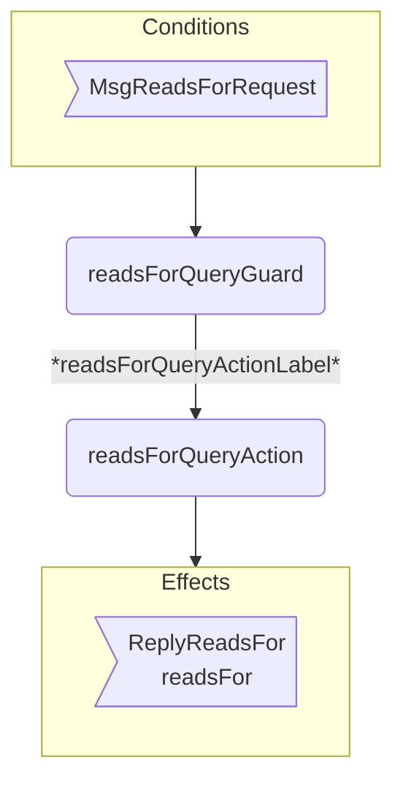
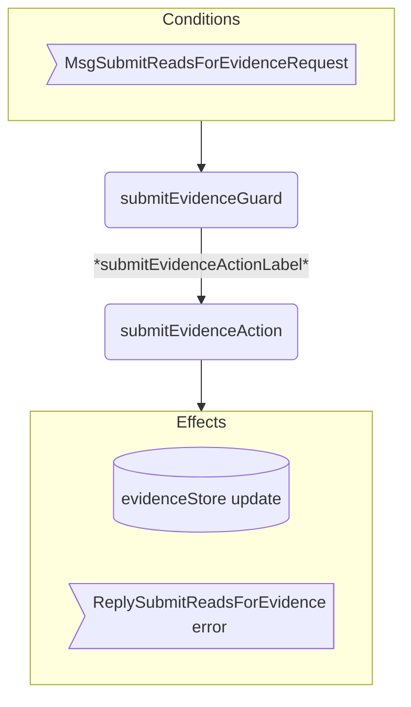
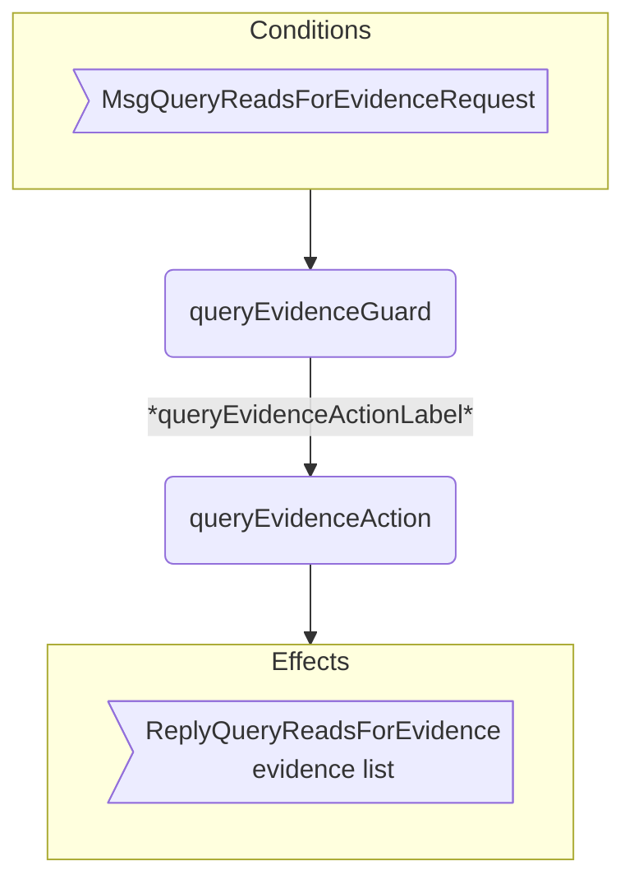

??? code "Juvix imports"

    ```juvix
    module arch.node.engines.reads_for_behaviour;

    import prelude open;
    import arch.node.types.messages open;
    import arch.node.types.engine open;
    import arch.node.types.identities open;
    import arch.node.engines.reads_for_messages open;
    import arch.node.engines.reads_for_config open;
    import arch.node.engines.reads_for_environment open;
    import arch.node.types.anoma as Anoma open;
    ```

# ReadFor Behaviour

## Overview

The behavior of the ReadFor Engine defines how it processes
incoming messages and updates its state accordingly.

## Action arguments

### `ReadsForActionArgumentReplyTo ReplyTo`

```juvix
type ReplyTo := mkReplyTo@{
  whoAsked : Option EngineID;
  mailbox : Option MailboxID
};
```

This action argument contains the address and mailbox ID of where the
response message should be sent.

???+ quote "Argument description  "

    `whoAsked`:
    : is the address of the engine that sent the message.

    `mailbox`:
    : is the mailbox ID where the response should be sent.

### `ReadsForActionArgument`

<!-- --8<-- [start:ReadsForActionArgument] -->
```juvix
type ReadsForActionArgument :=
  | ReadsForActionArgumentReplyTo ReplyTo
  ;
```
<!-- --8<-- [end:ReadsForActionArgument] -->

### `ReadsForActionArguments`

<!-- --8<-- [start:reads-for-action-arguments] -->
```juvix
ReadsForActionArguments : Type := List ReadsForActionArgument;
```
<!-- --8<-- [end:reads-for-action-arguments] -->

## Actions

??? quote "Auxiliary Juvix code"

    ### ReadsForAction

    ```juvix
    ReadsForAction : Type :=
      Action
        ReadsForCfg
        ReadsForLocalState
        ReadsForMailboxState
        ReadsForTimerHandle
        ReadsForActionArguments
        Anoma.Msg
        Anoma.Cfg
        Anoma.Env;
    ```

    ### ReadsForActionInput

    ```juvix
    ReadsForActionInput : Type :=
      ActionInput
        ReadsForCfg
        ReadsForLocalState
        ReadsForMailboxState
        ReadsForTimerHandle
        ReadsForActionArguments
        Anoma.Msg;
    ```

    ### ReadsForActionEffect

    ```juvix
    ReadsForActionEffect : Type :=
      ActionEffect
        ReadsForLocalState
        ReadsForMailboxState
        ReadsForTimerHandle
        Anoma.Msg
        Anoma.Cfg
        Anoma.Env;
    ```

    ### ReadsForActionExec

    ```juvix
    ReadsForActionExec : Type :=
      ActionExec
        ReadsForCfg
        ReadsForLocalState
        ReadsForMailboxState
        ReadsForTimerHandle
        ReadsForActionArguments
        Anoma.Msg
        Anoma.Cfg
        Anoma.Env;
    ```

### `readsForQueryAction`

Process a reads for query and respond with whether the relationship exists.

State update
: The state remains unchanged.

Messages to be sent
: A `ReplyReadsFor` message is sent back to the requester.

Engines to be spawned
: No engine is created by this action.

Timer updates
: No timers are set or cancelled.

```juvix
readsForQueryAction
  (input : ReadsForActionInput)
  : Option ReadsForActionEffect :=
  let
    env := ActionInput.env input;
    tt := ActionInput.trigger input;
    cfg := ActionInput.cfg input;
    localState := EngineEnv.localState env
  in
    case getEngineMsgFromTimestampedTrigger tt of {
    | some emsg :=
      case emsg of {
      | mkEngineMsg@{msg := Anoma.MsgReadsFor (MsgReadsForRequest (mkRequestReadsFor identityA identityB))} :=
        let
          hasEvidence := isElement \{a b := a && b} true (map \{ evidence :=
              isEqual (Ord.cmp (ReadsForEvidence.fromIdentity evidence) identityA) &&
              isEqual (Ord.cmp (ReadsForEvidence.toIdentity evidence) identityB)
            } (Set.toList (ReadsForLocalState.evidenceStore localState)));
          responseMsg := mkReplyReadsFor@{
            readsFor := hasEvidence;
            err := none
          }
        in some mkActionEffect@{
          env := env;
          msgs := [mkEngineMsg@{
            sender := getEngineIDFromEngineCfg cfg;
            target := EngineMsg.sender emsg;
            mailbox := some 0;
            msg := Anoma.MsgReadsFor (MsgReadsForReply responseMsg)
          }];
          timers := [];
          engines := []
        }
      | _ := none
      }
    | _ := none
    }
```

### `submitEvidenceAction`

Process submission of new reads for evidence.

State update
: If the evidence is valid and doesn't exist, it's added to the evidence store.

Messages to be sent
: A `ReplySubmitReadsForEvidence` message is sent back to the requester.

Engines to be spawned
: No engine is created by this action.

Timer updates
: No timers are set or cancelled.

```juvix
submitEvidenceAction
  (input : ReadsForActionInput)
  : Option ReadsForActionEffect :=
  let
    env := ActionInput.env input;
    tt := ActionInput.trigger input;
    cfg := ActionInput.cfg input;
    localState := EngineEnv.localState env
  in
    case getEngineMsgFromTimestampedTrigger tt of {
    | some emsg :=
      case emsg of {
      | mkEngineMsg@{msg := Anoma.MsgReadsFor (MsgSubmitReadsForEvidenceRequest (mkRequestSubmitReadsForEvidence evidence))} :=
        case verifyEvidence evidence of {
        | true :=
          case isElement \{a b := a && b} true (map \{e := isEqual (Ord.cmp e evidence)} (Set.toList (ReadsForLocalState.evidenceStore localState))) of {
          | true :=
            some mkActionEffect@{
              env := env;
              msgs := [mkEngineMsg@{
                sender := getEngineIDFromEngineCfg cfg;
                target := EngineMsg.sender emsg;
                mailbox := some 0;
                msg := Anoma.MsgReadsFor (MsgSubmitReadsForEvidenceReply (mkReplySubmitReadsForEvidence (some "Evidence already exists.")))
              }];
              timers := [];
              engines := []
            }
          | false :=
            let
              newEvidenceStore := Set.insert evidence (ReadsForLocalState.evidenceStore localState);
              updatedLocalState := localState@ReadsForLocalState{evidenceStore := newEvidenceStore};
              newEnv := env@EngineEnv{localState := updatedLocalState}
            in some mkActionEffect@{
              env := newEnv;
              msgs := [mkEngineMsg@{
                sender := getEngineIDFromEngineCfg cfg;
                target := EngineMsg.sender emsg;
                mailbox := some 0;
                msg := Anoma.MsgReadsFor (MsgSubmitReadsForEvidenceReply (mkReplySubmitReadsForEvidence none))
              }];
              timers := [];
              engines := []
            }
          }
        | false :=
          some mkActionEffect@{
            env := env;
            msgs := [mkEngineMsg@{
              sender := getEngineIDFromEngineCfg cfg;
              target := EngineMsg.sender emsg;
              mailbox := some 0;
              msg := Anoma.MsgReadsFor (MsgSubmitReadsForEvidenceReply (mkReplySubmitReadsForEvidence (some "Invalid evidence provided.")))
            }];
            timers := [];
            engines := []
          }
        }
      | _ := none
      }
    | _ := none
    }
```

### `queryEvidenceAction`

Query all evidence related to a specific identity.

State update
: The state remains unchanged.

Messages to be sent
: A `ReplyQueryReadsForEvidence` message is sent back to the requester.

Engines to be spawned
: No engine is created by this action.

Timer updates
: No timers are set or cancelled.

```juvix
queryEvidenceAction
  (input : ReadsForActionInput)
  : Option ReadsForActionEffect :=
  let
    env := ActionInput.env input;
    tt := ActionInput.trigger input;
    cfg := ActionInput.cfg input;
    localState := EngineEnv.localState env
  in
    case getEngineMsgFromTimestampedTrigger tt of {
    | some emsg :=
      case emsg of {
      | mkEngineMsg@{msg := Anoma.MsgReadsFor (MsgQueryReadsForEvidenceRequest (mkRequestQueryReadsForEvidence identity))} :=
        let
          relevantEvidence := AVLTree.filter \{evidence :=
              isEqual (Ord.cmp (ReadsForEvidence.fromIdentity evidence) identity) ||
              isEqual (Ord.cmp (ReadsForEvidence.toIdentity evidence) identity)
            } (ReadsForLocalState.evidenceStore localState);
          responseMsg := mkReplyQueryReadsForEvidence@{
              externalIdentity := identity;
              evidence := relevantEvidence;
              err := none
            }
        in some mkActionEffect@{
          env := env;
          msgs := [mkEngineMsg@{
            sender := getEngineIDFromEngineCfg cfg;
            target := EngineMsg.sender emsg;
            mailbox := some 0;
            msg := Anoma.MsgReadsFor (MsgQueryReadsForEvidenceReply responseMsg)
          }];
          timers := [];
          engines := []
        }
      | _ := none
      }
    | _ := none
    }
```

## Action Labels

### `readsForQueryActionLabel`

```juvix
readsForQueryActionLabel : ReadsForActionExec := Seq [ readsForQueryAction ];
```

### `submitEvidenceActionLabel`

```juvix
submitEvidenceActionLabel : ReadsForActionExec := Seq [ submitEvidenceAction ];
```

### `queryEvidenceActionLabel`

```juvix
queryEvidenceActionLabel : ReadsForActionExec := Seq [ queryEvidenceAction ];
```

## Guards

??? quote "Auxiliary Juvix code"

    ### `ReadsForGuard`

    <!-- --8<-- [start:ReadsForGuard] -->
    ```juvix
    ReadsForGuard : Type :=
      Guard
        ReadsForCfg
        ReadsForLocalState
        ReadsForMailboxState
        ReadsForTimerHandle
        ReadsForActionArguments
        Anoma.Msg
        Anoma.Cfg
        Anoma.Env;
    ```
    <!-- --8<-- [end:ReadsForGuard] -->

    ### `ReadsForGuardOutput`

    <!-- --8<-- [start:ReadsForGuardOutput] -->
    ```juvix
    ReadsForGuardOutput : Type :=
      GuardOutput
        ReadsForCfg
        ReadsForLocalState
        ReadsForMailboxState
        ReadsForTimerHandle
        ReadsForActionArguments
        Anoma.Msg
        Anoma.Cfg
        Anoma.Env;
    ```
    <!-- --8<-- [end:ReadsForGuardOutput] -->

    ### `ReadsForGuardEval`

    <!-- --8<-- [start:ReadsForGuardEval] -->
    ```juvix
    ReadsForGuardEval : Type :=
      GuardEval
        ReadsForCfg
        ReadsForLocalState
        ReadsForMailboxState
        ReadsForTimerHandle
        ReadsForActionArguments
        Anoma.Msg
        Anoma.Cfg
        Anoma.Env;
    ```
    <!-- --8<-- [end:ReadsForGuardEval] -->

### `readsForQueryGuard`

Condition
: Message type is `MsgReadsForRequest`.

<!-- --8<-- [start:readsForQueryGuard] -->
```juvix
readsForQueryGuard
  (tt : TimestampedTrigger ReadsForTimerHandle Anoma.Msg)
  (cfg : EngineCfg ReadsForCfg)
  (env : ReadsForEnv)
  : Option ReadsForGuardOutput :=
  case getEngineMsgFromTimestampedTrigger tt of {
    | some mkEngineMsg@{msg := Anoma.MsgReadsFor (MsgReadsForRequest _)} :=
      some mkGuardOutput@{
        action := readsForQueryActionLabel;
        args := []
      }
    | _ := none
  }
```
<!-- --8<-- [end:readsForQueryGuard] -->

### `submitEvidenceGuard`

Condition
: Message type is `MsgSubmitReadsForEvidenceRequest`.

<!-- --8<-- [start:submitEvidenceGuard] -->
```juvix
submitEvidenceGuard
  (tt : TimestampedTrigger ReadsForTimerHandle Anoma.Msg)
  (cfg : EngineCfg ReadsForCfg)
  (env : ReadsForEnv)
  : Option ReadsForGuardOutput :=
  case getEngineMsgFromTimestampedTrigger tt of {
    | some mkEngineMsg@{msg := Anoma.MsgReadsFor (MsgSubmitReadsForEvidenceRequest _)} :=
      some mkGuardOutput@{
        action := submitEvidenceActionLabel;
        args := []
      }
    | _ := none
  }
```
<!-- --8<-- [end:submitEvidenceGuard] -->

### `queryEvidenceGuard`

Condition
: Message type is `MsgQueryReadsForEvidenceRequest`.

<!-- --8<-- [start:queryEvidenceGuard] -->
```juvix
queryEvidenceGuard
  (tt : TimestampedTrigger ReadsForTimerHandle Anoma.Msg)
  (cfg : EngineCfg ReadsForCfg)
  (env : ReadsForEnv)
  : Option ReadsForGuardOutput :=
  case getEngineMsgFromTimestampedTrigger tt of {
    | some mkEngineMsg@{msg := Anoma.MsgReadsFor (MsgQueryReadsForEvidenceRequest _)} :=
      some mkGuardOutput@{
        action := queryEvidenceActionLabel;
        args := []
      }
    | _ := none
  }
```
<!-- --8<-- [end:queryEvidenceGuard] -->

## The ReadFor Behaviour

### `ReadsForBehaviour`

<!-- --8<-- [start:ReadsForBehaviour] -->
```juvix
ReadsForBehaviour : Type :=
  EngineBehaviour
    ReadsForCfg
    ReadsForLocalState
    ReadsForMailboxState
    ReadsForTimerHandle
    ReadsForActionArguments
    Anoma.Msg
    Anoma.Cfg
    Anoma.Env;
```
<!-- --8<-- [end:ReadsForBehaviour] -->

### Instantiation

<!-- --8<-- [start:readsForBehaviour] -->
```juvix
readsForBehaviour : ReadsForBehaviour :=
  mkEngineBehaviour@{
    guards :=
      First [
        readsForQueryGuard;
        submitEvidenceGuard;
        queryEvidenceGuard
      ];
  };
```
<!-- --8<-- [end:readsForBehaviour] -->

## ReadFor Action Flowcharts

### `readsForQueryAction` flowchart

<figure markdown>



<figcaption markdown="span">

`readsForQueryAction` flowchart

</figcaption>
</figure>


### `submitEvidenceAction` flowchart

<figure markdown>



<figcaption markdown="span">

`submitEvidenceAction` flowchart

</figcaption>
</figure>


### `queryEvidenceAction` flowchart

<figure markdown>



<figcaption markdown="span">

`queryEvidenceAction` flowchart

</figcaption>
</figure>