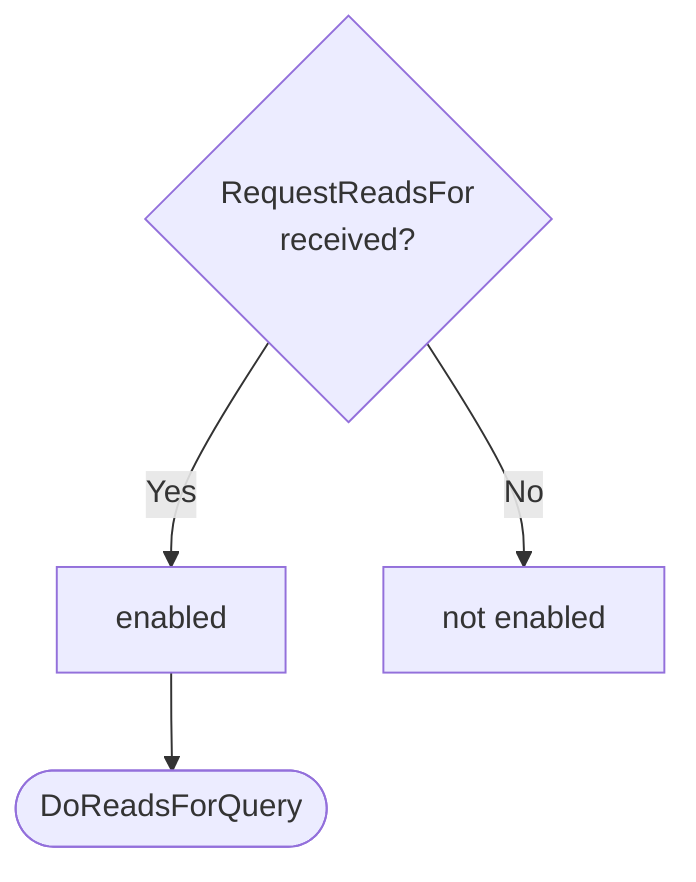
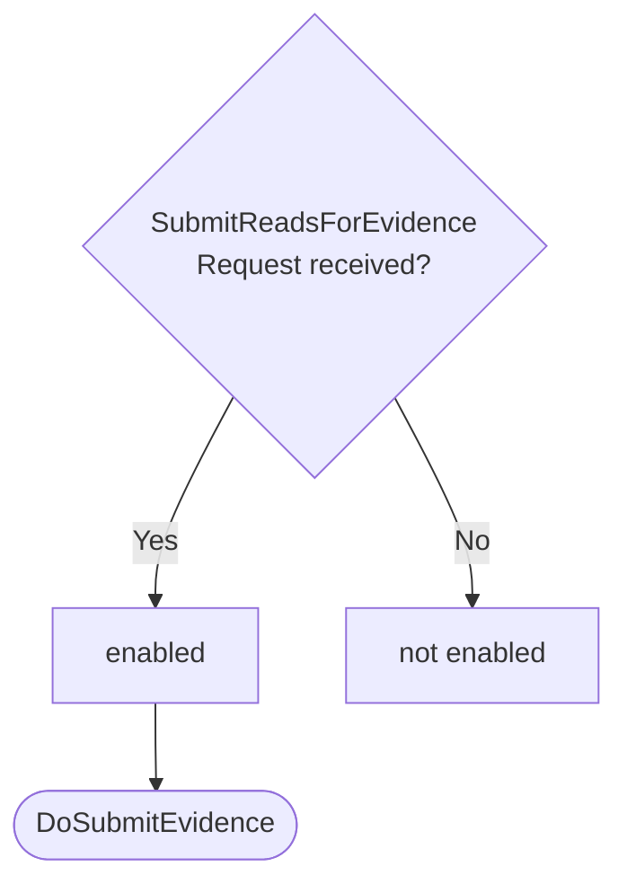
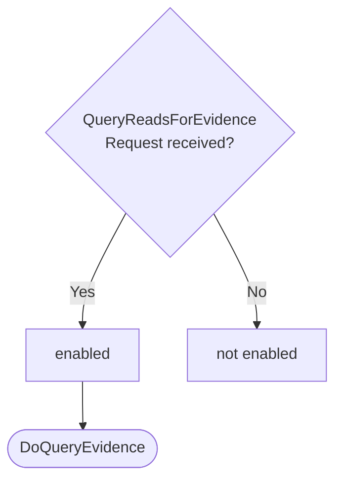

??? quote "Juvix imports"

    ```juvix
    module arch.node.engines.reads_for_behaviour;

    import prelude open;
    import arch.node.types.messages open;
    import arch.node.types.engine_behaviour open;
    import arch.node.types.engine_environment open;
    import arch.node.types.identities open;
    import arch.node.engines.reads_for_messages open;
    import arch.node.engines.reads_for_environment open;
    import arch.node.types.anoma_message open;
    ```

# Reads For Behaviour

## Overview

The behavior of the Reads For Engine defines how it processes
incoming messages and updates its state accordingly.

## Action labels

### `ReadsForActionLabelDoReadsForQuery DoReadsForQuery`

```juvix
type DoReadsForQuery := mkDoReadsForQuery {
  externalIdentityA : ExternalIdentity;
  externalIdentityB : ExternalIdentity
};
```

This action label corresponds to processing a reads for query.

???+ quote "Arguments"

    `externalIdentityA`:
    : The first external identity to check.

    `externalIdentityB`:
    : The second external identity to check.

???+ quote "`DoReadsForQuery` action effect"

    This action does the following:

    | Aspect | Description |
    |--------|-------------|
    | State update          | The state remains unchanged. |
    | Messages to be sent   | A `ResponseReadsFor` message is sent back to the requester. |
    | Engines to be spawned | No engine is created by this action. |
    | Timer updates         | No timers are set or cancelled. |

### `ReadsForActionLabelDoSubmitEvidence DoSubmitEvidence`

```juvix
type DoSubmitEvidence := mkDoSubmitEvidence {
  evidence : ReadsForEvidence
};
```

This action label corresponds to submitting new reads for evidence.

???+ quote "Arguments"

    `evidence`:
    : The reads for evidence to be submitted.

???+ quote "`DoSubmitEvidence` action effect"

    This action does the following:

    | Aspect | Description |
    |--------|-------------|
    | State update          | If the evidence doesn't already exist and is valid, it's added to the `evidenceStore` in the local state. |
    | Messages to be sent   | A `ResponseSubmitReadsForEvidence` message is sent back to the requester. |
    | Engines to be spawned | No engine is created by this action. |
    | Timer updates         | No timers are set or cancelled. |

### `ReadsForActionLabelDoQueryEvidence DoQueryEvidence`

```juvix
type DoQueryEvidence := mkDoQueryEvidence {
  externalIdentity : ExternalIdentity
};
```

This action label corresponds to querying reads for evidence for a specific identity.

???+ quote "Arguments"

    `externalIdentity`:
    : The external identity to query evidence for.

???+ quote "`DoQueryEvidence` action effect"

    This action does the following:

    | Aspect | Description |
    |--------|-------------|
    | State update          | The state remains unchanged. |
    | Messages to be sent   | A `ResponseQueryReadsForEvidence` message is sent back to the requester. |
    | Engines to be spawned | No engine is created by this action. |
    | Timer updates         | No timers are set or cancelled. |

### `ReadsForActionLabel`

```juvix
type ReadsForActionLabel :=
  | ReadsForActionLabelDoReadsForQuery DoReadsForQuery
  | ReadsForActionLabelDoSubmitEvidence DoSubmitEvidence
  | ReadsForActionLabelDoQueryEvidence DoQueryEvidence
;
```

## Matchable arguments

### `ReadsForMatchableArgumentReplyTo ReplyTo`

```juvix
type ReplyTo := mkReplyTo {
  whoAsked : Option EngineID;
  mailbox : Option MailboxID
};
```

???+ quote "Arguments"

    `whoAsked`:
    : The engine ID of the requester.

    `mailbox`:
    : The mailbox ID where the response should be sent.

### `ReadsForMatchableArgument`

```juvix
type ReadsForMatchableArgument :=
  | ReadsForMatchableArgumentReplyTo ReplyTo
;
```

## Precomputation results

The Reads For Engine does not require any non-trivial pre-computations.

```juvix
syntax alias ReadsForPrecomputation := Unit;
```

## Guards

??? quote "Auxiliary Juvix code"

    Type alias for the guard.

    ```juvix
    ReadsForGuard : Type :=
      Guard
        ReadsForLocalState
        ReadsForMailboxState
        ReadsForTimerHandle
        ReadsForMatchableArgument
        ReadsForActionLabel
        ReadsForPrecomputation;

    ReadsForGuardOutput : Type :=
      GuardOutput ReadsForMatchableArgument ReadsForActionLabel ReadsForPrecomputation;
    ```

### `readsForQueryGuard`

<figure markdown>

<figcaption>readsForQueryGuard flowchart</figcaption>
</figure>

<!-- --8<-- [start:readsForQueryGuard] -->
```juvix
readsForQueryGuard
  (t : TimestampedTrigger ReadsForTimerHandle)
  (env : ReadsForEnvironment) : Option ReadsForGuardOutput
  := case getMessageFromTimestampedTrigger t of {
      | some (MsgReadsFor (MsgReadsForRequest (mkRequestReadsFor x y))) := do {
        sender <- getSenderFromTimestampedTrigger t;
        pure (mkGuardOutput@{
          matchedArgs := [ReadsForMatchableArgumentReplyTo (mkReplyTo (some sender) none)] ;
          actionLabel := ReadsForActionLabelDoReadsForQuery (mkDoReadsForQuery x y);
          precomputationTasks := unit
        });}
      | _ := none
  };
```
<!-- --8<-- [end:readsForQueryGuard] -->

### `submitEvidenceGuard`

<figure markdown>

<figcaption>submitEvidenceGuard flowchart</figcaption>
</figure>

<!-- --8<-- [start:submitEvidenceGuard] -->
```juvix
submitEvidenceGuard
  (t : TimestampedTrigger ReadsForTimerHandle)
  (env : ReadsForEnvironment) : Option ReadsForGuardOutput
  := case getMessageFromTimestampedTrigger t of {
      | some (MsgReadsFor (MsgSubmitReadsForEvidenceRequest (mkRequestSubmitReadsForEvidence x))) := do {
        sender <- getSenderFromTimestampedTrigger t;
        pure (mkGuardOutput@{
                matchedArgs := [ReadsForMatchableArgumentReplyTo (mkReplyTo (some sender) none)] ;
                actionLabel := ReadsForActionLabelDoSubmitEvidence (mkDoSubmitEvidence x);
                precomputationTasks := unit
        });}
      | _ := none
  };
```
<!-- --8<-- [end:submitEvidenceGuard] -->

### `queryEvidenceGuard`

<figure markdown>

<figcaption>queryEvidenceGuard flowchart</figcaption>
</figure>

<!-- --8<-- [start:queryEvidenceGuard] -->
```juvix
queryEvidenceGuard
  (t : TimestampedTrigger ReadsForTimerHandle)
  (env : ReadsForEnvironment) : Option ReadsForGuardOutput
  := case getMessageFromTimestampedTrigger t of {
      | some (MsgReadsFor (MsgQueryReadsForEvidenceRequest (mkRequestQueryReadsForEvidence x))) := do {
        sender <- getSenderFromTimestampedTrigger t;
        pure (mkGuardOutput@{
                matchedArgs := [ReadsForMatchableArgumentReplyTo (mkReplyTo (some sender) none)] ;
                actionLabel := ReadsForActionLabelDoQueryEvidence (mkDoQueryEvidence x);
                precomputationTasks := unit
                });
        }
      | _ := none
  };
```
<!-- --8<-- [end:queryEvidenceGuard] -->

## Action function

??? quote "Auxiliary Juvix code"

    Type alias for the action function.

    ```juvix
    ReadsForActionInput : Type :=
      ActionInput
        ReadsForLocalState
        ReadsForMailboxState
        ReadsForTimerHandle
        ReadsForMatchableArgument
        ReadsForActionLabel
        ReadsForPrecomputation;

    ReadsForActionEffect : Type :=
      ActionEffect
        ReadsForLocalState
        ReadsForMailboxState
        ReadsForTimerHandle
        ReadsForMatchableArgument
        ReadsForActionLabel
        ReadsForPrecomputation;
    ```

<!-- --8<-- [start:readsForAction] -->
```juvix
readsForAction (input : ReadsForActionInput) : ReadsForActionEffect :=
  let env := ActionInput.env input;
      out := ActionInput.guardOutput input;
      localState := EngineEnvironment.localState env;
  in
  case GuardOutput.actionLabel out of {
    | ReadsForActionLabelDoReadsForQuery (mkDoReadsForQuery externalIdentityA externalIdentityB) :=
      case GuardOutput.matchedArgs out of {
        | (ReadsForMatchableArgumentReplyTo (mkReplyTo (some whoAsked) _)) :: _ := let
            hasEvidence := isElement \{a b := a && b} true (map \{ evidence :=
              isEqual (Ord.cmp (ReadsForEvidence.fromIdentity evidence) externalIdentityA) &&
              isEqual (Ord.cmp (ReadsForEvidence.toIdentity evidence) externalIdentityB)
            } (Set.toList (ReadsForLocalState.evidenceStore localState)));
            responseMsg := mkResponseReadsFor@{
              readsFor := hasEvidence;
              err := none
            };
          in mkActionEffect@{
            newEnv := env; -- No state change
            producedMessages := [mkEngineMsg@{
              sender := mkPair none (some (EngineEnvironment.name env));
              target := whoAsked;
              mailbox := some 0;
              msg := MsgReadsFor (MsgReadsForResponse responseMsg)
            }];
            timers := [];
            spawnedEngines := []
          }
        | _ := mkActionEffect@{newEnv := env; producedMessages := []; timers := []; spawnedEngines := []}
      }
    | ReadsForActionLabelDoSubmitEvidence (mkDoSubmitEvidence evidence) :=
      case GuardOutput.matchedArgs out of {
        | (ReadsForMatchableArgumentReplyTo (mkReplyTo (some whoAsked) _)) :: _ :=
            let isValid := ReadsForLocalState.verifyEvidence localState evidence;
            in
            case isValid of {
              | true :=
                  let alreadyExists :=
                    isElement \{a b := a && b} true (map \{e :=
                        isEqual (Ord.cmp e evidence)
                      } (Set.toList (ReadsForLocalState.evidenceStore localState)));
                  in
                  case alreadyExists of {
                    | true :=
                        let responseMsg := mkResponseSubmitReadsForEvidence@{
                              err := some "Evidence already exists."
                            };
                        in mkActionEffect@{
                          newEnv := env;
                          producedMessages := [mkEngineMsg@{
                            sender := mkPair none (some (EngineEnvironment.name env));
                            target := whoAsked;
                            mailbox := some 0;
                            msg := MsgReadsFor (MsgSubmitReadsForEvidenceResponse responseMsg)
                          }];
                          timers := [];
                          spawnedEngines := []
                        }
                    | false :=
                        let newEvidenceStore := Set.insert evidence (ReadsForLocalState.evidenceStore localState);
                            updatedLocalState := localState@ReadsForLocalState{
                              evidenceStore := newEvidenceStore
                            };
                            newEnv' := env@EngineEnvironment{
                              localState := updatedLocalState
                            };
                            responseMsg := mkResponseSubmitReadsForEvidence@{
                              err := none
                            };
                        in mkActionEffect@{
                          newEnv := newEnv';
                          producedMessages := [mkEngineMsg@{
                            sender := mkPair none (some (EngineEnvironment.name env));
                            target := whoAsked;
                            mailbox := some 0;
                            msg := MsgReadsFor (MsgSubmitReadsForEvidenceResponse responseMsg)
                          }];
                          timers := [];
                          spawnedEngines := []
                        }
                  }
              | false :=
                  let responseMsg := mkResponseSubmitReadsForEvidence@{
                        err := some "Invalid evidence provided."
                      };
                  in mkActionEffect@{
                    newEnv := env;
                    producedMessages := [mkEngineMsg@{
                      sender := mkPair none (some (EngineEnvironment.name env));
                      target := whoAsked;
                      mailbox := some 0;
                      msg := MsgReadsFor (MsgSubmitReadsForEvidenceResponse responseMsg)
                    }];
                    timers := [];
                    spawnedEngines := []
                  }
            }
        | _ := mkActionEffect@{
            newEnv := env;
            producedMessages := [];
            timers := [];
            spawnedEngines := []
          }
      }
    | ReadsForActionLabelDoQueryEvidence (mkDoQueryEvidence externalIdentity') :=
      case GuardOutput.matchedArgs out of {
        | (ReadsForMatchableArgumentReplyTo (mkReplyTo (some whoAsked) _)) :: _ := let
            relevantEvidence := AVLTree.filter \{evidence :=
              isEqual (Ord.cmp (ReadsForEvidence.fromIdentity evidence) externalIdentity') ||
              isEqual (Ord.cmp (ReadsForEvidence.toIdentity evidence) externalIdentity')
            } (ReadsForLocalState.evidenceStore localState);
            responseMsg := mkResponseQueryReadsForEvidence@{
              externalIdentity := externalIdentity';
              evidence := relevantEvidence;
              err := none
            };
          in mkActionEffect@{
            newEnv := env; -- No state change
            producedMessages := [mkEngineMsg@{
              sender := mkPair none (some (EngineEnvironment.name env));
              target := whoAsked;
mailbox := some 0;
              msg := MsgReadsFor (MsgQueryReadsForEvidenceResponse responseMsg)
            }];
            timers := [];
            spawnedEngines := []
          }
        | _ := mkActionEffect@{newEnv := env; producedMessages := []; timers := []; spawnedEngines := []}
      }
  };
```
<!-- --8<-- [end:readsForAction] -->

## Conflict solver

### `readsForConflictSolver`

```juvix
readsForConflictSolver : Set ReadsForMatchableArgument -> List (Set ReadsForMatchableArgument)
  | _ := [];
```

## The Reads For Behaviour

### `ReadsForBehaviour`

<!-- --8<-- [start:ReadsForBehaviour] -->
```juvix
ReadsForBehaviour : Type :=
  EngineBehaviour
    ReadsForLocalState
    ReadsForMailboxState
    ReadsForTimerHandle
    ReadsForMatchableArgument
    ReadsForActionLabel
    ReadsForPrecomputation;
```
<!-- --8<-- [end:ReadsForBehaviour] -->

### Instantiation

<!-- --8<-- [start:readsForBehaviour] -->
```juvix
readsForBehaviour : ReadsForBehaviour :=
  mkEngineBehaviour@{
    guards := [readsForQueryGuard; submitEvidenceGuard; queryEvidenceGuard];
    action := readsForAction;
    conflictSolver := readsForConflictSolver;
  };
```
<!-- --8<-- [end:readsForBehaviour] -->