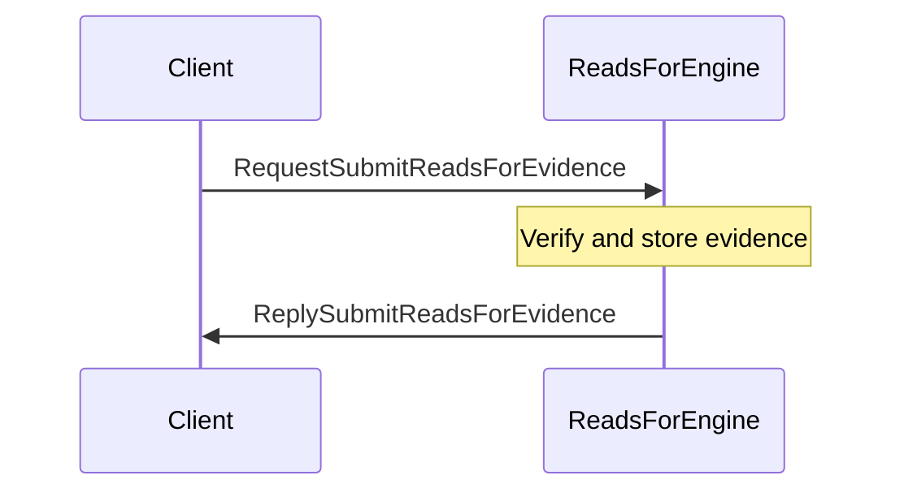
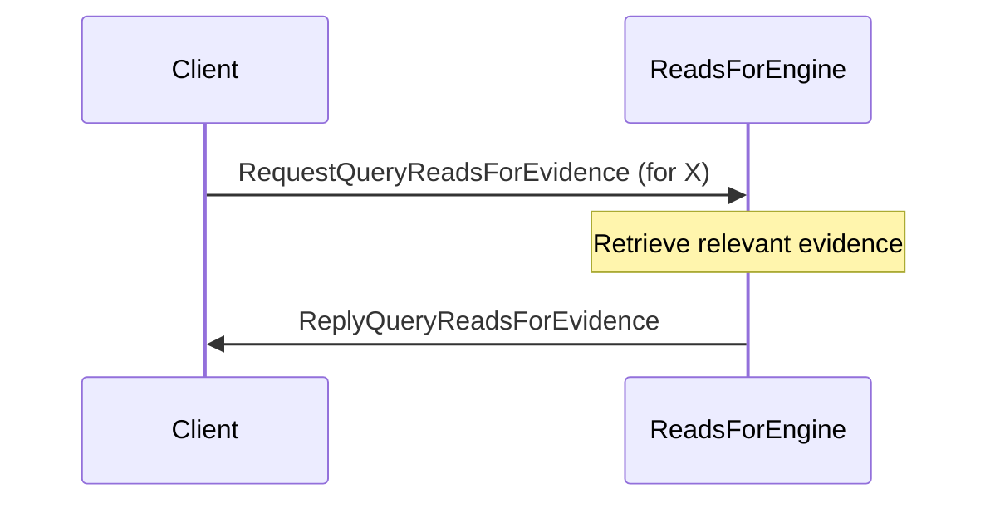

??? code "Juvix imports"

    ```juvix
    module arch.node.engines.reads_for_messages;
    import prelude open;
    import arch.node.types.identities open;
    ```

# ReadsFor Messages

## Message interface

--8<-- "./reads_for_messages.juvix.md:ReadsForMsg"

## Message sequence diagrams

### Submitting `reads_for` evidence

<!-- --8<-- [start:message-sequence-diagram-submit] -->
<figure markdown="span">



<figcaption markdown="span">
Submitting `reads_for` evidence
</figcaption>
</figure>
<!-- --8<-- [end:message-sequence-diagram-submit] -->

### Querying a `reads_for` relationship

<!-- --8<-- [start:message-sequence-diagram-query-relationship] -->
<figure markdown="span">


<figcaption markdown="span">
Querying a reads_for relationship
</figcaption>
</figure>
<!-- --8<-- [end:message-sequence-diagram-query-relationship] -->

### Querying `reads_for` evidence

<!-- --8<-- [start:message-sequence-diagram-query-evidence] -->
<figure markdown="span">



<figcaption markdown="span">
Querying reads_for evidence for an identity
</figcaption>
</figure>
<!-- --8<-- [end:message-sequence-diagram-query-evidence] -->

## Message types

### `RequestReadsFor`

```juvix
type RequestReadsFor := mkRequestReadsFor@{
  externalIdentityA : ExternalIdentity;
  externalIdentityB : ExternalIdentity
};
```

A request to query whether `externalIdentityA` can read data encrypted to
`externalIdentityB`.

???+ code "Arguments"

    `externalIdentityA`:
    : The identity doing the reading.

    `externalIdentityB`:
    : The identity being read for.

### `ReplyReadsFor`

```juvix
type ReplyReadsFor := mkReplyReadsFor@{
  readsFor : Bool;
  err : Option String
};
```

Reply indicating whether the `reads_for` relationship exists.

???+ code "Arguments"

    `readsFor`:
    : True if `externalIdentityA` can read for `externalIdentityB`, False otherwise.

    `err`:
    : An error message if the query failed.

### `RequestSubmitReadsForEvidence`

```juvix
type RequestSubmitReadsForEvidence := mkRequestSubmitReadsForEvidence@{
  evidence : ReadsForEvidence
};
```

Request to submit evidence of a `reads_for` relationship.

???+ code "Arguments"

    `evidence`:
    : The evidence supporting the `reads_for` relationship.

### `ReplySubmitReadsForEvidence`

```juvix
type ReplySubmitReadsForEvidence := mkReplySubmitReadsForEvidence@{
  err : Option String
};
```

Reply acknowledging the submission of evidence.

???+ code "Arguments"

    `err`:
    : An error message if the submission failed.

### `RequestQueryReadsForEvidence`

```juvix
type RequestQueryReadsForEvidence := mkRequestQueryReadsForEvidence@{
  externalIdentity : ExternalIdentity
};
```

Request to query all `reads_for` evidence related to an identity.

???+ code "Arguments"

    `externalIdentity`:
    : The identity for which to retrieve evidence.

### `ReplyQueryReadsForEvidence`

```juvix
type ReplyQueryReadsForEvidence := mkReplyQueryReadsForEvidence@{
  externalIdentity : ExternalIdentity;
  evidence : Set ReadsForEvidence;
  err : Option String
};
```

Reply providing the requested evidence.

???+ code "Arguments"

    `externalIdentity`:
    : The identity for which evidence was requested.

    `evidence`:
    : A set of `ReadsForEvidence` related to the identity.

    `err`:
    : An error message if the query failed.

### `ReadsForMsg`

<!-- --8<-- [start:ReadsForMsg] -->
```juvix
type ReadsForMsg :=
  | Request RequestReadsFor
  | Reply ReplyReadsFor
  | SubmitReadsForEvidenceRequest RequestSubmitReadsForEvidence
  | SubmitReadsForEvidenceReply ReplySubmitReadsForEvidence
  | QueryReadsForEvidenceRequest RequestQueryReadsForEvidence
  | QueryReadsForEvidenceReply ReplyQueryReadsForEvidence
  ;
```
<!-- --8<-- [end:ReadsForMsg] -->

## Engine components

- [[ReadsFor Configuration]]
- [[ReadsFor Environment]]
- [[ReadsFor Behaviour]]
